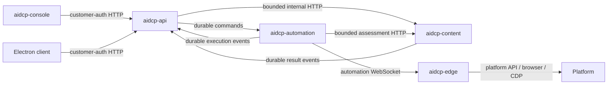

# Cloud 服务与 Git 仓库拆分方案

> 状态：目标方案，尚未实施
>
> 日期：2026-07-22
>
> 适用范围：`aidcp`、`aidcp-cloud`、`aidcp-edge`、`aidcp-console` 及计划新增的 Cloud 仓库
>
> 替代：2026-07-21 “单个 `aidcp-cloud` 仓库、三个运行单元”草案

## 1. 一页结论

建议把现有 Cloud 按三种稳定业务能力拆成三个独立 Git 仓库：

| 目标仓库 | 核心职责 | 主要通信 |
| --- | --- | --- |
| `aidcp-api` | 客户、环境、人设、审批、发布业务记录、客户端数据 API 和查询投影 | 对客户端提供 customer-auth HTTP；对内部服务使用 HTTP 和持久消息 |
| `aidcp-content` | 内容理解、价值评估、创作、候选版本、图片/视频/音频处理及资产管理 | 提供内部评估 API；消费创作任务并发布持久事件 |
| `aidcp-automation` | 自动化调度、Edge Gateway、任务状态机、策略、风控和平台执行编排 | 对 Edge 使用自动化 WebSocket；对 Cloud 服务使用 HTTP 和持久消息 |

同时保留：

- `aidcp`：跨仓架构、OpenSpec、协议和开发编排；
- `aidcp-edge`：自动化引擎和平台真实执行；
- `aidcp-console`：用户界面，只通过 `aidcp-api` 使用业务能力。

这个拆分的依据不是技术层级，也不是“代码看起来很多”，而是三种不同的业务所有权和运行模型：

1. 客户数据是请求式管理，应当像普通 Web 网站一样随时可用；
2. 内容能力是可复用、可版本化、计算特征独立的智能能力；
3. 自动化是长连接、任务状态机、风控和真实平台副作用的控制面。

浏览器、Edge、自动化 WebSocket 或浏览器槽位的状态，不得成为客户数据和内容管理的准入条件。

## 2. 先固定客户端与云端边界

### 2.1 客户端不是“自动化引擎的外壳”

客户端内部的角色应固定为：

| 组件 | 定义 | 是否依赖浏览器 |
| --- | --- | --- |
| Electron 客户端 | 身份、本地配置、界面和 HTTP 请求入口 | 否 |
| Edge 子进程 | 按需连接 Cloud 的自动化引擎 | 自动化时需要 |
| 浏览器/CDP | 页面自动化执行器 | 仅页面动作需要 |

首次获取并安全保存本地身份后，普通客户数据操作不应再次依赖浏览器环境。浏览器只服务于登录检查和需要页面执行的自动化动作。

### 2.2 两条数据链路必须分开

#### 普通客户数据链路

```text
Electron renderer
  → 窄 IPC
  → Electron main customer-auth HTTP adapter
  → aidcp-api
```

适用内容包括今日进展、历史统计、已发布内容、人设、配置、稿件、审批、环境管理和内容工作区。

这条链路不得检查：

- Edge 是否运行；
- 自动化 WebSocket 是否连接；
- 浏览器是否打开；
- CDP 是否连接；
- 浏览器槽位是否可用。

#### 自动化链路

```text
aidcp-automation
  → automation WebSocket
  → Edge 自动化引擎
  → 平台 API 或浏览器/CDP
```

只有需要真实平台副作用的自动化任务进入这条链路，例如浏览、点赞、评论、关注、发帖和平台结果校验。

用户级实时通知只能表示“数据已变化，请重新 HTTP 拉取”。通知不得携带普通业务写命令，也不得覆盖 `aidcp-api` 已确认的数据。

## 3. 当前问题为什么需要拆分

当前 `aidcp-cloud` 由一个组合根同时装配：

- customer-auth HTTP 和管理接口；
- Edge 自动化 WebSocket；
- 连接注册表、调度器、EventBus 和 RiskController；
- 内容评估、内容创作、图片生成、审批和发布执行角色；
- 客户、环境、内容、发布、风险等 Store。

这种结构在早期开发简单，但形成了四类耦合：

1. **运行时耦合**：HTTP 数据接口可以直接读取连接注册表或自动化进程内对象；
2. **代码耦合**：内容角色、自动化角色和业务 API 可以互相直接导入；
3. **数据耦合**：多个模块可能通过同一数据库连接修改彼此领域表；
4. **故障耦合**：媒体生成或自动化重启可能同时影响普通客户数据。

增加 TikTok、抖音、视频、音频解析和简化生成后，依赖、资源和发布节奏会进一步分化。继续只按目录或进程拆分，仍然无法形成明确的版本、测试、部署和回滚边界。

## 4. 目标仓库结构

```text
aidcp
aidcp-api
aidcp-content
aidcp-automation
aidcp-edge
aidcp-console
```



### 4.1 `aidcp`：控制仓

负责：

- 跨仓架构与行为合同；
- OpenSpec proposal、design、spec 和 tasks；
- Cloud/Edge 协议说明；
- 风控、部署和跨仓开发规范；
- 多仓工作树、集成和发布编排脚本。

不放业务运行代码，不成为共享代码包，也不直接部署为业务服务。

### 4.2 `aidcp-api`：客户业务数据面

负责：

- customer-auth HTTP；
- 客户身份、客户与环境归属；
- `envKey` 与平台账号的权威绑定；
- 人设、写作语言和运营配置；
- 发布审批、排期和业务台账；
- 客户端与管理后台的查询投影；
- 首页统计、最近发布和任务可见状态；
- 用户级数据失效通知。

不负责：

- 持有 Edge WebSocket；
- 读取自动化连接注册表或进程内调度对象；
- 执行平台动作；
- 决定最终点赞、评论或关注；
- 保存创作候选和媒体处理过程的权威状态。

`aidcp-console` 只调用 `aidcp-api`。需要实时自动化状态或控制时，由 `aidcp-api` 调用 `aidcp-automation` 的窄内部接口，不能让 Console 绕过业务入口直接访问内部服务。

### 4.3 `aidcp-content`：内容智能与创作

负责：

- 内容事实提取和受控标签；
- 内容价值、账号适配度和作者价值评估；
- 灵感、素材、创作项目和创作任务；
- 文本、图片、视频和音频候选版本；
- 视频探测、抽帧、音频抽取、ASR、字幕和转码；
- 简化脚本、封面、字幕、音频或模板视频生成；
- 质量、合规、来源、模型和供应商用量记录；
- 媒体资产元数据和对象存储访问。

一个仓库内可以有多个独立进程：

```text
content-api
analysis-worker
creation-worker
```

其中低延迟评估与长耗时创作、媒体处理可以独立扩容，但共享同一个内容领域模型和发布节奏。当前阶段不再拆 `aidcp-media`、`aidcp-generation` 或 `aidcp-evaluation` 仓库。

`aidcp-content` 返回事实、标签、分数和置信度，不返回“必须点赞”之类的最终平台动作。

### 4.4 `aidcp-automation`：自动化控制面

负责：

- Edge Gateway、握手、心跳、能力协商和连接路由；
- 自动化任务、尝试、租约、取消、重试和幂等；
- 平台能力准入和平台执行编排；
- InteractionPolicy；
- RiskController、配额、冷却和节奏；
- 发布与互动的执行状态；
- Edge 回执和真实结果接收；
- 自动化运行时状态和窄内部查询。

最终点赞、评论、关注或发布决策由 `aidcp-automation` 综合以下输入产生：

```text
内容评估
+ 账号人设
+ 平台能力
+ RiskController
+ 配额与冷却
+ 当前会话历史
= 最终动作决策
```

RiskController 仍是账号最终风险状态的唯一写入者。Edge 不根据标签自行决定动作，只执行明确指令并完成真实结果验证。

### 4.5 `aidcp-edge`：真实执行边界

负责：

- 页面与账号观测；
- 目标定位；
- 操作前身份、页面和目标复核；
- 平台 API、浏览器、DOM/CDP 操作；
- 操作后验证；
- 对缺目标、页面异常、能力不足和结果不确定作诚实回执。

Edge 不负责客户业务数据管理、内容价值策略、跨会话编排或最终风险状态。

## 5. 数据所有权

### 5.1 单一写入者

| 数据 | 权威仓库/服务 | 其他服务如何使用 |
| --- | --- | --- |
| 客户、环境归属和账号绑定 | `aidcp-api` | 授权 HTTP 或版本化快照 |
| 人设和运营配置 | `aidcp-api` | 任务创建时引用版本或快照 |
| 审批、排期和发布业务台账 | `aidcp-api` | 持久命令和结果事件 |
| 内容事实与评估 | `aidcp-content` | 内部 HTTP 或不可变结果引用 |
| 创作项目与候选版本 | `aidcp-content` | `candidateVersionId` |
| 媒体资产和处理尝试 | `aidcp-content` | `assetId` 和短期授权地址 |
| 自动化任务、尝试和租约 | `aidcp-automation` | 状态投影或窄查询接口 |
| Edge 在线连接 | `aidcp-automation` | 窄内部状态接口 |
| 最终风险状态 | `aidcp-automation` 的 RiskController | 只读投影 |

每张业务表只能有一个服务写入。可以在迁移期共用 PostgreSQL 实例，但必须使用独立 Schema、数据库账号和迁移目录；跨服务直接写表属于违规。

查询界面优先读取 `aidcp-api` 的本地投影，避免一个页面请求同步串联多个服务。确需实时性的自动化连接状态，才调用明确、可降级的内部查询接口。

### 5.2 候选版本和审批不能隐式漂移

审批必须引用不可变的 `candidateVersionId`。候选内容发生变化时创建新版本，旧版本的审批不能自动继承。

发布请求至少冻结：

- `candidateVersionId`；
- `envKey`；
- `executionTarget`；
- 账号和平台身份；
- 需要的能力版本。

自动化恢复执行时不得因为“同账号在另一个环境在线”而改投到新的 Edge。

### 5.3 媒体二进制不进入业务通道

原始和派生视频、音频、图片保存在对象存储。数据库、事件和自动化 WebSocket 只传：

- `assetId`；
- 内容哈希；
- MIME、尺寸、时长等元数据；
- 授权引用；
- 处理状态和失败原因。

## 6. 服务间通信方式

### 6.1 通信选择

| 场景 | 方式 | 原因 |
| --- | --- | --- |
| 客户端普通数据读写 | customer-auth HTTP → `aidcp-api` | 请求式、可鉴权、与自动化无关 |
| 自动化查询内容评估 | `aidcp-automation` → `aidcp-content` 内部 HTTP | 需要有界、即时结果 |
| API 查询自动化实时状态或控制自动化 | `aidcp-api` → `aidcp-automation` 内部 HTTP | 明确同步结果，故障可局部降级 |
| API 查询候选详情 | `aidcp-api` → `aidcp-content` 内部 HTTP 或本地投影 | 保持内容权威单写 |
| 创作、发布和长耗时媒体任务 | Outbox/Inbox 持久消息 | 跨重启、可重试、避免长同步链 |
| 内容服务内部 Worker 调度 | `aidcp-content` 自有队列 | 属于同一领域内部实现 |
| 自动化任务下发 | `aidcp-automation` → Edge WebSocket | 仅用于自动化 |
| 客户端实时更新 | 失效通知 + HTTP 重拉 | 不建立第二个业务事实源 |

内部 HTTP 必须有超时、调用预算、熔断和诚实错误。内容评估超时或失败时，自动化应跳过本次互动，不能用乐观默认值继续执行。

### 6.2 持久工作流

建议的跨服务命令和事件包括：

```text
aidcp-api      → aidcp-content     CreationRequested
aidcp-content  → aidcp-api         CandidateReady | CreationFailed

aidcp-api      → aidcp-automation  PublishRequested
aidcp-automation → aidcp-api       ExecutionDispatched
                                      | ExecutionSucceeded
                                      | ExecutionFailed
                                      | ExecutionUnknown
```

命令表达“请求某个服务做事”，事件表达“已经发生的事实”，两者不得混用。

`ContentAssessed`、`InteractionDecided`、`InteractionDispatched`、`InteractionOccurred` 和 `InteractionFailed` 是不同阶段。请求已接收、任务已派发或 Edge 回执已返回，都不能冒充平台动作已经发生。

持久消息采用：

- 本地事务写业务数据和 Outbox；
- 至少一次投递；
- 消费方 Inbox 去重；
- 业务副作用幂等；
- 按聚合版本处理乱序；
- 死信、重放和人工检查能力。

禁止建立“客户端等待 API，API 等内容，内容等自动化，自动化再等 Edge 最终结果”的长同步调用链。

### 6.3 消息信封

跨服务消息至少包含：

```json
{
  "messageId": "uuid",
  "messageType": "PublishRequested",
  "messageVersion": 1,
  "aggregateType": "publish_request",
  "aggregateId": "pub_123",
  "aggregateVersion": 3,
  "tenantId": "customer_123",
  "envKey": "env_123",
  "executionTarget": "dev",
  "correlationId": "uuid",
  "causationId": "uuid",
  "occurredAt": "2026-07-22T10:00:00Z",
  "payload": {}
}
```

不是所有内容事件都需要 `envKey`，但任何可能产生环境自动化副作用的命令或事件都必须具备可信环境归属。

### 6.4 禁止的通信方式

跨服务后禁止：

- 直接导入另一个业务仓库的源码；
- 直接读写另一个服务的业务表；
- 用进程内 EventBus 充当跨服务消息总线；
- 用自动化 WebSocket 传普通客户数据命令；
- 让用户级推送直接修改业务数据；
- 把 Git submodule 或文件路径依赖当成合同分发；
- 共享包含业务逻辑的“公共包”以绕开服务边界。

进程内 EventBus 可以保留在单个服务内部，但不能承诺跨进程可靠性。

## 7. 内容评估与动作决策

### 7.1 评估输出

内容评估建议拆成三个稳定对象：

1. `ContentFacts`：主题、格式、语言、显式风险、内容类型等客观事实；
2. `AccountFitAssessment`：相对某个人设和账号目标的匹配度；
3. `AuthorAssessment`：作者长期质量、相关度和风险特征。

输出应包含：

- 受控标签，不仅是自由文本；
- 分数与置信度；
- `modelVersion`；
- `contentHash`；
- `personaVersion`；
- 生成时间和有效期；
- 缺失证据和降级原因。

### 7.2 分层调用

自动化可以按成本分层：

| 层级 | 内容 | 默认落点 |
| --- | --- | --- |
| L0 | 平台能力、硬规则、重复和风险预筛 | `aidcp-automation` |
| L1 | 卡片级事实和轻量评估 | `aidcp-content` analysis API |
| L2 | 详情、正文、转录和深度评估 | `aidcp-content` analysis API/worker |
| L3 | 作者长期评估 | `aidcp-content` 持久评估 |

只有可复用、可版本化、可审计的内容资产和评估进入 `aidcp-content`。强实时且只服务某个自动化步骤的临时微判断，可以先留在 `aidcp-automation`，待合同稳定后再迁移。

## 8. 环境和执行目标隔离

`envKey` 与 `executionTarget` 不是同一概念：

- `envKey`：客户浏览器环境身份；
- `executionTarget`：Cloud 部署目标，只能是 `dev` 或 `ol`。

所有会被后台扫描、领取、重试或恢复的持久异步任务必须：

1. 由服务端当前部署配置注入 `executionTarget`；
2. 禁止从客户端请求、自然语言、Edge 上报或 `envKey` 推导；
3. 在创建、去重、领取、恢复、重试和终态写入时过滤本地 target；
4. 缺少或非法部署目标时禁用对应 Worker，保持 fail-closed；
5. 让幂等键在 target 范围内生效；
6. 对发布任务同时冻结 `envKey` 和 `executionTarget`。

共享客户配置和普通业务数据不需要人为按 target 分裂；上述隔离只针对可能被 dev/ol 后台消费者竞争的异步工作。

## 9. TikTok 与抖音扩展

TikTok 和抖音必须是两个平台标识：

```text
xiaohongshu
facebook
wechat_channels
tiktok
douyin
```

它们可以复用基础工具，但不能共享账号语义、页面假设、能力声明、风控参数或成功验证规则。

平台注册表必须显式声明：

- 内容类型和发布能力；
- 浏览、点赞、评论、回复和关注能力；
- API 执行或页面执行；
- 是否需要浏览器槽位；
- 所需 Edge 和协议版本；
- 平台节奏、风控参数和验证规则；
- 不支持能力的明确原因。

新增平台缺少声明或能力时必须返回 `capability_unsupported`，不能回落到其他平台。迁移时只对新增平台路径建立明确的 fail-closed 准入，不应未经专项验证就改变现有平台有意保留的兼容行为。

不按平台拆 Cloud 服务或仓库。平台差异通过 `aidcp-automation` 和 `aidcp-edge` 内的适配器解决。

## 10. 合同与版本管理

不新增中央 `aidcp-contracts` 仓库。合同由能力提供方拥有：

```text
aidcp-api/contracts/
aidcp-content/contracts/
aidcp-automation/contracts/
```

提供方发布：

- OpenAPI；
- JSON Schema 或事件 Schema；
- 版本化 TypeScript 客户端和类型；
- 兼容性测试夹具。

消费者固定合同版本，不通过 Git 路径直接引用提供方源码。合同兼容规则至少要求：

- 只新增可选字段可保持向后兼容；
- 删除、重命名、改语义或收窄枚举需要新版本；
- 生产者和消费者必须覆盖版本错配测试；
- 事件升级期允许新旧版本并行消费；
- 跨仓行为变化仍由 `aidcp` 中同一个 OpenSpec change 统一描述。

每个业务仓库独立拥有：

- `package.json` 和 lockfile；
- CI、测试和类型检查；
- 数据库迁移；
- 部署清单和健康检查；
- 版本、回滚和变更日志。

## 11. 故障与降级语义

| 故障 | 应保持可用 | 允许受影响 |
| --- | --- | --- |
| `aidcp-automation` 停止 | 客户数据、内容管理、创作和媒体处理 | 新自动化等待，实时在线状态降级 |
| `aidcp-api` 停止 | 已领取的内容和自动化任务按合同安全收敛 | 新客户请求和新业务任务 |
| `aidcp-content` 停止 | 客户历史数据和无需新评估的自动化 | 新评估、创作和媒体任务 |
| Edge 离线 | 客户数据和内容服务 | 对应环境自动化等待或明确失败 |
| 浏览器槽位满 | 客户数据、内容服务和不需页面的动作 | 页面自动化排队 |
| 对象存储不可用 | 非媒体客户数据和无需媒体的自动化 | 媒体处理和相关发布 |
| 内部评估超时 | 客户数据和其他账号任务 | 本次互动跳过，不乐观执行 |

任何服务故障都不得把请求已接收、任务已创建、消息已投递、任务已派发或结果未知显示为业务成功。

## 12. Git 仓库迁移顺序

不要在同一次改动中拆服务、迁数据并把 `aidcp-cloud` 改名。建议按以下顺序迁移。

### 阶段 0：OpenSpec 和清单

- 在 `aidcp` 创建一个跨仓 OpenSpec change；
- 盘点 `src/server.ts` 的组合根、角色注册和直接导入；
- 盘点进程内状态、EventBus 事件、Store 和每张表；
- 建立当前调用图、数据所有权表和回滚计划；
- 定义合同版本、故障语义和验收夹具。

### 阶段 1：先在 `aidcp-cloud` 内建立边界

- 建立 API、Content、Automation 的模块边界；
- 禁止跨领域直接写表；
- 把跨领域调用收口到明确接口；
- 即使暂时使用进程内适配器，也采用未来 HTTP/消息的合同形状；
- 将跨重启工作从进程内 EventBus 迁到 Outbox/Inbox；
- 增加模块导入和数据所有权检查。

这一阶段的目标是先消除源码和状态耦合，不是假装已经完成微服务化。

### 阶段 2：拆独立进程和迁移所有权

- 为三个边界建立独立入口、配置和健康检查；
- 为 Schema、数据库账号和迁移建立唯一所有者；
- 验证各进程独立停止、重启和回滚；
- 验证重复、乱序和延迟消息；
- 建立服务版本与合同版本可观测性。

### 阶段 3：先提取 `aidcp-content`

内容服务优先提取，因为：

- AI、FFmpeg、ASR、Python 或 GPU 依赖与自动化明显不同；
- 创作和评估拥有清晰输入输出；
- 高负载最容易影响 WebSocket 心跳；
- 后续能力增长速度和部署节奏更独立。

提取后先保持 `aidcp-cloud` 内现有 API 和 Automation，不急于改名。

### 阶段 4：提取 `aidcp-api`

- 迁移 customer-auth HTTP 和业务表所有权；
- 建立面向 Console/客户端的稳定 API；
- 建立自动化结果和内容结果的本地投影；
- 删除对连接注册表、RiskController 和内容 Store 的直接读取；
- 验证浏览器、Edge 或 Automation 离线时数据面仍可用。

### 阶段 5：收敛 Automation

当 Content 和 API 提取完成后，`aidcp-cloud` 剩余部分即 Automation。稳定运行一段时间后，再单独评估是否将仓库和部署名称改为 `aidcp-automation`。

改名必须独立处理：

- Git 远端和 CI；
- systemd 服务；
- 部署脚本；
- 环境变量；
- 监控、告警和日志；
- 文档和运维手册。

在此之前，`aidcp-cloud` 是迁移来源，不创建一个重复实现的 `aidcp-automation` 仓库。

### 阶段 6：扩展 TikTok 和抖音

平台扩展放在能力合同、精确环境绑定和 fail-closed 准入稳定之后。每次只交付一个平台的一组可真实验收能力。

## 13. 多仓开发规范

跨仓行为变更采用：

1. `aidcp` 中一个命名明确的 OpenSpec change；
2. 每个受影响仓库使用相同 change name 的 `codex/<change-name>` 分支和独立 worktree；
3. 提供方先发布兼容合同；
4. 消费方再升级并通过合同测试；
5. 各仓独立提交、推送和验证；
6. 集成与部署串行进行；
7. 旧合同和兼容适配器只在所有消费者升级后删除。

不得使用 Git submodule 把多个仓库重新绑成一个原子提交。跨仓一致性由 OpenSpec、合同版本、CI 和分阶段发布保证。

## 14. 验收红线

目标架构完成后至少满足：

1. Automation、Edge、浏览器和槽位都不可用时，普通客户数据 HTTP 仍可用。
2. 内容或媒体高负载不影响 Edge WebSocket 心跳。
3. 任意服务重启后，已确认业务任务不丢失且业务副作用最多发生一次。
4. 重复或乱序事件不会造成重复发布、重复互动或状态倒退。
5. 三个 Cloud 仓库可以独立构建、测试、部署、健康检查和回滚。
6. 不存在跨服务业务源码导入和跨服务业务表写入。
7. 内容评估失败时不执行依赖该评估的互动。
8. 最终动作同时经过平台能力、策略、RiskController、配额和冷却判断。
9. 账号最终风险状态仍由 RiskController 单写。
10. 发布审批绑定不可变 `candidateVersionId`。
11. 自动发布绑定可信 `envKey + executionTarget`，恢复时不得换环境或串 target。
12. `executionTarget` 由服务端注入，缺失或非法时相关 Worker fail-closed。
13. 视频和音频二进制不进入 PostgreSQL、业务事件或自动化 WebSocket。
14. 内容或媒体处理成功不等于审批成功或平台发布成功。
15. 新平台未知能力返回 `capability_unsupported`。
16. 服务和合同版本错配有自动化测试与清晰告警。
17. 客户端实时事件只触发 HTTP 重拉，不覆盖 Cloud 权威数据。
18. 请求已接收、任务已派发和执行结果未知都有独立、诚实的用户状态。

## 15. 当前阶段明确不拆的内容

当前不新增：

- `aidcp-contracts`；
- `aidcp-media`；
- `aidcp-risk`；
- `aidcp-tiktok`；
- `aidcp-douyin`；
- 每个 Worker 一个 Git 仓库；
- Kafka、服务网格或分布式事务。

只有出现独立团队、独立发布节奏、明确扩容瓶颈或隔离要求时，才继续拆分。优先通过同一领域仓库内的独立 Worker 解决计算扩容问题。

## 16. 最终建议

批准以下方向作为后续 OpenSpec 和实施依据：

> 客户业务、内容智能和自动化控制面拆为 `aidcp-api`、`aidcp-content`、`aidcp-automation` 三个独立 Git 仓库；Cloud 服务之间以版本化 HTTP 合同和持久消息通信，普通客户端数据始终走 customer-auth HTTP，只有自动化任务通过 Edge WebSocket 下发。迁移先在 `aidcp-cloud` 内建立可独立运行的边界，依次提取 Content、API，最后再决定是否把剩余仓库改名为 Automation。

本文件描述目标方案，不代表当前运行系统已经完成拆分。进入实现前必须创建 OpenSpec change，并同步更新 [架构说明](architecture.md)、[边云协议](protocol.md)、[风控说明](risk-control.md) 和相关部署文档。
