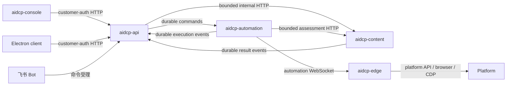

# Cloud 服务与 Git 仓库拆分方案

> 状态：拆分方向已批准（2026-07-22），实施未开始
>
> 日期：2026-07-22
>
> 适用范围：`aidcp`、`aidcp-cloud`、`aidcp-edge`、`aidcp-console` 及已确定新增的 Cloud 仓库
>
> 替代：2026-07-21 “单个 `aidcp-cloud` 仓库、三个运行单元”草案
>
> 编号纪律：顶层编号 §1–§17 冻结。新增内容一律以子节承载，MUST NOT 重排顶层编号。
>
> 相对 2026-07-22 裁决书的偏离登记（两处，均不与既有条款冲突，本文档保留之）：(a) 裁决书冻结的是 §1–§16；本文档在**尾部追加** §17「未认领项登记」，不移动任何既有编号，全文 § 引用零悬空。(b) 新增 §4.8 `aidcp-console`，裁决书未涉及，为补全「六仓各自职责」而加，与 §4.0 第 2 条、§11.3 同向。

## 1. 一页结论

现有 Cloud 按三种稳定业务能力拆为三个独立 Git 仓库（已批准，2026-07-22）：

| 目标仓库 | 核心职责 | 主要通信 |
| --- | --- | --- |
| `aidcp-api` | 客户、环境、人设、审批、发布业务记录、客户端数据 API 和查询投影 | 对客户端提供 customer-auth HTTP；对内部服务使用 HTTP 和持久消息 |
| `aidcp-content` | 内容理解、价值评估、创作、候选版本、图片/视频/音频处理及资产管理 | 提供内部评估 API；消费创作任务并发布持久事件 |
| `aidcp-automation` | 自动化调度、Edge Gateway、任务状态机、策略、风控和平台执行编排 | 对 Edge 使用自动化 WebSocket；对 Cloud 服务使用 HTTP 和持久消息 |

同时保留：

- `aidcp`：跨仓架构、OpenSpec、协议和开发编排；
- `aidcp-edge`：自动化引擎和平台真实执行；
- `aidcp-console`：用户界面，只通过 `aidcp-api` 使用业务能力。

这个拆分的依据不是技术层级，也不是“代码看起来很多”，而是三种不同的业务所有权和运行模型：

1. 客户数据是请求式管理，MUST 像普通 Web 网站一样随时可用；
2. 内容能力是可复用、可版本化、计算特征独立的智能能力；
3. 自动化是长连接、任务状态机、风控和真实平台副作用的控制面。

浏览器、Edge、自动化 WebSocket 或浏览器槽位的状态，MUST NOT 成为客户数据和内容管理的准入条件（作用域限定与唯一具名例外见 §2.2）。

## 2. 先固定客户端与云端边界

### 2.1 客户端不是“自动化引擎的外壳”

客户端内部的角色应固定为：

| 组件 | 定义 | 是否依赖浏览器 |
| --- | --- | --- |
| Electron 客户端 | 身份、本地配置、界面和 HTTP 请求入口 | 否 |
| Edge 子进程 | 按需连接 Cloud 的自动化引擎 | 自动化时需要 |
| 浏览器/CDP | 页面自动化执行器 | 仅页面动作需要 |

首次获取并安全保存本地身份后，普通客户数据操作不应再次依赖浏览器环境。浏览器只服务于登录检查和需要页面执行的自动化动作。

### 2.2 两条数据链路必须分开

#### 普通客户数据链路

```text
Electron renderer
  → 窄 IPC
  → Electron main customer-auth HTTP adapter
  → aidcp-api
```

适用内容包括今日进展、历史统计、已发布内容、人设、配置、稿件、审批、环境管理和内容工作区。

**这条链路 MUST NOT 检查：**

- Edge 是否运行；
- 自动化 WebSocket 是否连接；
- 浏览器是否打开；
- CDP 是否连接；
- 浏览器槽位是否可用。

**作用域限定（本条五项禁令的适用边界）：** 上述禁令只作用于**不产生平台副作用的客户数据请求**（读查询、配置写、稿件编辑、审批意见记录）。已合并 spec `client-customer-auth` 区分「本质性在线前置」与「附带性在线前置」，本节与该判据同向：把在线态当作读数据的门槛是附带性在线前置，MUST 消除；用活会话佐证一次不可逆写的绑定事实是本质性在线前置，MUST 保留。该 spec 的这条判据比本节五条禁令更精确，MUST NOT 被本方案拆掉。

**具名例外（唯一一条，MUST 逐字保留）：** 创建会产生真实平台副作用的不可逆写（当前实例：委托任务创建）时，服务端 MUST 由活体绑定佐证确认「该环境此刻登录的就是这个账号」，确认不了 MUST 以具名原因 `binding_unverified` 诚实拒绝。实现见 `aidcp-cloud/src/client-auth/client-auth-server.ts:432`（`attestLiveBinding` 定义）与 `:1766-1768`（唯一调用点与 409 `binding_unverified` 应答）。这条闸是**有意保留的 fail-closed**，MUST NOT 被 §14 红线 1 的验收方式（「客户数据 HTTP 用例全绿」）测成缺陷：该红线的用例集 MUST 排除产生平台副作用的写路径，或对该路径断言「拒绝且原因为 `binding_unverified`」而非断言成功。

拆分后，这条例外的落点 MUST 迁移（三条迁移约束是唯一规范位置，见 **§5.2**，本处 MUST NOT 复述）。

#### 自动化链路

```text
aidcp-automation
  → automation WebSocket
  → Edge 自动化引擎
  → 平台 API 或浏览器/CDP
```

只有需要真实平台副作用的自动化任务进入这条链路，例如浏览、点赞、评论、关注、发帖和平台结果校验。

用户级实时通知 MUST 只表示「数据已变化，请重新 HTTP 拉取」。通知 MUST NOT 携带普通业务写命令，MUST NOT 覆盖 `aidcp-api` 已确认的数据。

## 3. 当前问题为什么需要拆分

当前 `aidcp-cloud` 由一个组合根同时装配：

- customer-auth HTTP 和管理接口；
- Edge 自动化 WebSocket；
- 连接注册表、调度器、EventBus 和 RiskController；
- 内容评估、内容创作、图片生成、审批和发布执行角色；
- 客户、环境、内容、发布、风险等 Store。

这种结构在早期开发简单，但形成了四类耦合：

1. **运行时耦合**：HTTP 数据接口可以直接读取连接注册表或自动化进程内对象；
2. **代码耦合**：内容角色、自动化角色和业务 API 可以互相直接导入；
3. **数据耦合**：多个模块可能通过同一数据库连接修改彼此领域表；
4. **故障耦合**：媒体生成或自动化重启可能同时影响普通客户数据。

增加 TikTok、抖音、视频、音频解析和简化生成后，依赖、资源和发布节奏会进一步分化。继续只按目录或进程拆分，仍然无法形成明确的版本、测试、部署和回滚边界。

**因果方向限定（避免把顺序读反）：** 数据耦合的收敛——单写者归位、Schema 与数据库账号归属——发生在拆仓**之前**的阶段 1–2。拆仓本身不产生单写，它只提供强制单写的机械边界（独立仓的导入检查、独立数据库角色的 GRANT）。因此 MUST NOT 把「等拆完仓数据自然就单写了」当作计划；也 MUST NOT 因为「数据还没单写」而推迟拆分——两件事的正确顺序已由 §12 的阶段划分固定。

## 4. 目标仓库结构

```text
aidcp
aidcp-api
aidcp-content
aidcp-automation
aidcp-edge
aidcp-console
```



### 4.0 归属总则

以下四条是 §4.1–§4.8 的判定依据，冲突时以本节为准。

1. **全覆盖单一归属**：`aidcp-cloud/src` 下每个 `.ts` 文件 MUST 恰好有一个目标归属，MUST NOT 存在「共有」「待定」「按需划分」三类状态。分类法为五层：`kernel`（无业务语义的基础设施）/ `api` / `content` / `automation` / `composition`（组合根，无继承者）。权威清单见 §4.7；新增或删除源文件时 MUST 同步更新该清单，未归属文件数 MUST 恒为 0。
2. **统一操作入口**：所有人机操作入口（`aidcp-console`、Electron 客户端、飞书 Bot 及后续任何 Bot）MUST 共用同一套业务入口与鉴权面（`aidcp-api`）。任何入口 MUST NOT 绕过业务入口直连 `aidcp-content` 或 `aidcp-automation` 的内部接口。
3. **运营控制指令的双段归属**：会改变自动化运行时状态或产生平台真实副作用的写操作，其**受理与鉴权** MUST 在 `aidcp-api`，其**实现与执行** MUST 在 `aidcp-automation`。`aidcp-api` MUST NOT 在进程内持有或调用自动化运行时对象（连接注册表、`RoleDispatcher`、`RiskController`、验证码协助会话）。
4. **后台任务随表主人走**：同一个后台扫描/清理任务 MUST 只由拥有其扫描目标表的服务承载。一个定时任务 MUST NOT 跨归属边界读写或删除数据。

### 4.1 `aidcp`：控制仓

负责：

- 跨仓架构与行为合同；
- OpenSpec proposal、design、spec 和 tasks；
- Cloud/Edge 协议说明，以及协议改动的跨仓同步登记；
- 风控、部署和跨仓开发规范；
- 多仓工作树、集成和发布编排脚本；
- §4.7 归属总表的维护，以及归属变更的评审入口。

不放业务运行代码，不成为共享代码包，也不直接部署为业务服务。

### 4.2 `aidcp-api`：客户业务数据面

负责：

- customer-auth HTTP，以及管理后台 HTTP（`/api`）的唯一对外入口；
- 客户身份、客户与环境归属；
- `envKey` 与平台账号的权威绑定；
- 人设、写作语言和运营配置（四类限频配置除外，见 §4.6.8）；
- 发布审批、排期和业务台账；
- 客户端与管理后台的查询投影，含微信视频号收件箱与回复配置的客户查询与管理查询；
- 首页统计、最近发布和任务可见状态；
- 用户级数据失效通知（推送通道的形态见 §6.1 表第 8 行）；
- **运营侧通知与人审通道**：飞书 Bot 的出站卡片（发布审批、评论审批、命令结果、委托任务、告警）与入站命令受理；
- **运营控制指令的鉴权入口**：实现由 `aidcp-automation` 拥有，`aidcp-api` 只做鉴权、转发与诚实降级；
- **客户端安装包清单与版本分发的暴露面**。

不负责：

- 持有 Edge WebSocket；
- 读取或调用自动化连接注册表、调度器、`RiskController`、验证码协助会话等进程内运行时对象；
- 执行平台动作；
- 决定最终点赞、评论或关注；
- 保存创作候选和媒体处理过程的权威状态；
- 模型与供应商用量、成本快照的权威存储。

`aidcp-console` 只调用 `aidcp-api`。需要实时自动化状态或控制时，由 `aidcp-api` 调用 `aidcp-automation` 的窄内部接口。按 §4.0 第 2 条，这条规矩对飞书 Bot 与后续任何 Bot 同样成立。

### 4.3 `aidcp-content`：内容智能与创作

负责：

- 内容事实提取和受控标签；
- 内容价值、账号适配度和作者价值评估；
- 灵感、素材、创作项目和创作任务；
- 文本、图片、视频和音频候选版本；
- 视频探测、抽帧、音频抽取、ASR、字幕和转码；
- 简化脚本、封面、字幕、音频或模板视频生成；
- **对话与评论回复的意图分类、风险复核与润色**（微信视频号回复链路的 AI 段）；
- 质量、合规、来源、模型和供应商用量记录，以及成本价格快照的权威存储；
- 媒体资产元数据和对象存储访问。

媒体职责的行为归属声明，非当前交付项：截至 2026-07-22 实测，`aidcp-cloud` 运行时依赖只有 6 个包（`@larksuiteoapi/node-sdk`、`@resvg/resvg-js`、`ali-oss`、`pg`、`satori`、`ws`），全 `src` 无 `child_process`、无 ffmpeg、无 ASR、无 GPU 调用。该行的落地需要单独评估计算节点，MUST NOT 被读成已有实装。

一个仓库内可以有多个独立进程：

```text
content-api
analysis-worker
creation-worker
```

其中低延迟评估与长耗时创作、媒体处理可以独立扩容，但共享同一个内容领域模型和发布节奏。当前阶段不再拆 `aidcp-media`、`aidcp-generation` 或 `aidcp-evaluation` 仓库。

`aidcp-content` 返回事实、标签、分数和置信度，MUST NOT 返回「必须点赞」之类的最终平台动作。进入 `aidcp-content` 的能力对会话聚合 MUST 是纯读：任何写回会话状态、或其输出直接决定下一条边缘命令的逻辑，一律留在 `aidcp-automation`（判据与首批迁移范围见 §7.2）。

### 4.4 `aidcp-automation`：自动化控制面

负责：

- Edge Gateway、握手、心跳、能力协商和连接路由；
- 自动化任务、尝试、租约、取消、重试和幂等；
- 平台能力准入和平台执行编排（平台注册表单写，见 §9）；
- InteractionPolicy；
- `RiskController`、配额、冷却和节奏，以及四类限频配置的存储（§4.6.8）；
- 发布与互动的执行状态，含微信视频号私信/评论回复的发送尝试、幂等与 Edge 回执；
- Edge 回执和真实结果接收（含模型辅助的回执与页面状态解释）；
- **运营控制指令的实现**：调度启停、账号暂停与恢复的运行时段、风控状态与配额档写入、验证码协助会话、委托任务控制、群资源回收；
- 浏览闭环产生的执行事实（点赞/收藏标记、互动账本、优质评论语料的执行侧字段）；
- 自动化运行时状态和窄内部查询。

最终点赞、评论、关注或发布决策由 `aidcp-automation` 综合以下输入产生：

```text
内容评估
+ 账号人设
+ 平台能力
+ RiskController
+ 配额与冷却
+ 当前会话历史
= 最终动作决策
```

`RiskController` 仍是账号最终风险状态的唯一写入者。Edge 不根据标签自行决定动作，只执行明确指令并完成真实结果验证。

### 4.5 `aidcp-edge`：真实执行边界

负责：

- 页面与账号观测；
- 目标定位；
- 操作前身份、页面和目标复核；
- 平台 API、浏览器、DOM/CDP 操作；
- 操作后验证；
- 对缺目标、页面异常、能力不足和结果不确定作诚实回执。

Edge 不负责客户业务数据管理、内容价值策略、跨会话编排或最终风险状态。

### 4.6 跨域子系统的切法

以下八块在 §4.2–§4.4 的三条职责清单里无法二值归属，逐块给出切法。所有 `文件:行` 为 2026-07-22 实测。

#### 4.6.1 微信视频号互动域 `src/interactions/`

21 个文件 7023 行、20 张表（`interaction_*`、`reply_*`、`account_reply_profiles`），是本仓最大的未点名块，且内部本身横跨三边。切法按「配置与查询 / AI 回复 / 发送执行」三段：

| 段 | 文件 | 归属 |
| --- | --- | --- |
| 配置存储与查询面 | `interaction-customer-api.ts`、`interaction-internal-api.ts`、`interaction-scope-internal-api.ts`、`interaction-panel-permissions.ts`、`reply-config-store.ts`、`reply-config-scope-store.ts`、`reply-config.ts`、`reply-config-resolver.ts`（8 文件 2835 行） | `aidcp-api` |
| AI 回复段 | `reply-ai.ts`（1 文件 248 行，唯一引 `LlmClient` 的文件，`aidcp-cloud/src/interactions/reply-ai.ts:1`） | `aidcp-content` |
| 收件箱、回复工作流、发送与回执、离场 saga | `interaction-store.ts`、`reply-workflow.ts`、`send-orchestrator.ts`、`reply-auto-send.ts`、`interaction-inbox-service.ts`、`offboarding-service.ts`、`runtime-controls-provider.ts`、`contract.ts`、`types.ts`、`schema-capability.ts`、`metrics.ts`、`index.ts`（12 文件 3940 行） | `aidcp-automation` |

对应的硬要求：

- 该域的运行模型是 API-only（浏览器只作一次性登录旁车），`send-orchestrator.ts:1-5` 经 `makeEnvelope` + `EdgePusher` 下发。它 MUST 按 §4.4 的自动化链路处理，MUST NOT 因为「不需要浏览器槽位」被划进 §2.2 的普通客户数据链路。
- `purgeDueOffboards` 是跨 11 张 `interaction_*` / `reply_*` 表的单事务清理（`aidcp-cloud/src/interactions/interaction-store.ts:1635-1678`），其中 `reply_templates` / `reply_rules` / `account_reply_profiles` / `interaction_reply_config*` 归 `aidcp-api`。阶段 1 MUST 把该单事务改成由 `aidcp-automation` 发起、`aidcp-api` 消费的离场 saga，或把这几张表的清理下放为各 owner 的本地 purge；MUST NOT 保留跨 owner 单事务删除。
- 离场链共用 PostgreSQL advisory lock `interaction-env:<envKey>`（`interaction-store.ts:339` 与 `client-auth/client-user-store.ts:619`、`:1468`、`:2001`、`:2128`）。该锁是库级对象：在「共用实例 + 独立 Schema」下仍然有效，只有拆成独立数据库才失效。拆库前 MUST 先把它换成显式的 saga 状态或按 owner 的行级锁（详见 §5.4.5）。
- `aidcp-api` 侧的 `client-user-store.ts` 今天直写 4 张 interaction 表（`:463`、`:480`、`:538`、`:554`），违反 §5.1 单写。阶段 1 MUST 收口为经窄接口或持久命令。
- 该域全域没有 `execution_target` 列（`grep execution_target src/interactions/` 零命中），而它的恢复队列与离场重试都是后台扫描认领型任务。按 §8，MUST 补 target 列并在创建、查询、认领、恢复、重试与终态写入时过滤。

#### 4.6.2 飞书 Bot `src/feishu/`

15 个文件 2686 行。它既是出站通知面（发布审批卡、评论审批卡、命令结果卡、委托任务卡、告警），又是入站运营控制入口：8 类原子命令（`aidcp-cloud/src/feishu/commands.ts:24`），单条消息可分号批量最多 8 条（`commands.ts:27`）。

**裁决：`src/feishu/` 整体归 `aidcp-api`。**

理由与硬要求：

- 飞书是一个人机操作入口，与 Console、Electron 客户端同类。按 §4.0 第 2 条，它 MUST 与其它入口共用同一业务入口与鉴权面。今天飞书命令直达自动化运行时（`src/server.ts` 的 `CommandActions`：pause / resume 直写 `accounts.status` 并调 `resumeEdgesForAccount`、delegate 直进 `delegatedTaskService`），这与 §4.2 对 Console 立的「不得绕过业务入口直接访问内部服务」是同一类通道。拆分后这条捷径 MUST 消失：飞书命令 MUST 经 `aidcp-api` 的同一套命令受理与鉴权，再由 `aidcp-api` 按 §4.0 第 3 条转给 `aidcp-automation` 实现。
- 飞书用官方 SDK 长连接主动外连、不占 HTTP 端口。该长连接 MUST 声明唯一宿主服务（`aidcp-api`）与单实例约束；三个服务 MUST NOT 各建一条长连接——飞书事件对已建立的长连接是广播的，多宿主等于同一条运营指令被多个进程各受理一次，这是重复发布与重复评论的直接路径。
- **告警出站的例外（MUST 与上一条一并读）**：飞书**入站**长连接与卡片回调的唯一宿主是 `aidcp-api`；**基础设施告警的出站**允许由不属于任何服务的外部探针直发（见 §11.8.6）。两者凭据 MUST 分离：探针 MUST 使用一份独立的、只有发消息权限的飞书出站凭据，与 `aidcp-api` 的 Bot 应用凭据是不同实体（分配见 §6.5.7）。MUST NOT 让探针经由 `aidcp-api` 转发告警——那会让告警链路与被监控对象同生共死。
- `aidcp-content` 与 `aidcp-automation` MUST NOT 直接 import 飞书模块。现存反向依赖 MUST 在阶段 1 切断，已知三处：`src/publish-agent/roles/publish-executor.ts:15-17`（引 `feishu/cards`、`feishu/types`、`feishu/ws-receiver`）、`src/comm/captcha-coordinator.ts`、`src/alerts/alert-store.ts`（引 `feishu/types` 的 `AlertSeverity`）。切法是 `aidcp-api` 提供通知与审批的版本化合同，另两仓只发事件、不构造卡片。
- 审批授权信号今天是本机文件 `/tmp/aidcp-publish-approve-<requestId>.json`。写方归 `aidcp-api`、读方归 `aidcp-automation`，两者一旦不同主机该契约当场断，且失败形态是 fail-closed 的静默停滞。拆到不同主机之前 MUST 先把授权事实换成 `aidcp-api` 拥有的持久授权记录，`aidcp-automation` 经 `PublishApproved` 持久事件获知（详见 §6.4）。

#### 4.6.3 发布管线 `src/publish-agent/`

67 个文件 15131 行，MUST 按「生成候选 / 下发执行 / 台账与审批」三分。划分依据是可机械核对的 import 指纹：引 `../comm/`（边缘协议与租约）即为下发段，引 `../llm/` 或图片供应商客户端即为生成段，直接写 `publish_log` 或授权记录即为台账与审批段。

| 段 | 归属 | 文件 / 行 | 文件清单 |
| --- | --- | --- | --- |
| 生成候选 | `aidcp-content` | 54 / 10723 | `publish-orchestrator.ts`、`pipeline-context.ts`、`prompts.ts`、`prompts-preview.ts`、`types.ts`、`roles/` 下除 `publish-executor.ts`、`approval-gatekeeper.ts` 外全部，以及 `visual-reference-*.ts`、`visual-fidelity-auditor.ts`、`text-card-*.ts`、`cover-form-sensor.ts`、`post-image-form-profile.ts`、`content-visual-brief.ts`、`reference-image-guidance.ts`、`image-provider*.ts`、`wanxiang-client.ts`、`seedream-client.ts`、`post-processor.ts`、`title-clamp.ts`、`json-repair.ts`、`curated-gate.ts`、`facebook-publish-media-store.ts`、`retry-strategy.ts` |
| 下发执行 | `aidcp-automation` | 6 / 2308 | `publish-dispatcher.ts`、`command-sequencer.ts`、`platform-profile.ts`、`fill-budget.ts`、`scheduled-publish-reconciler.ts`、`roles/publish-executor.ts` |
| 台账与审批 | `aidcp-api` | 7 / 2100 | `publish-log-store.ts`、`publish-pipeline-log-store.ts`、`publish-scheduler.ts`、`client-publish-approval.ts`、`draft-image-remove.ts`、`schedule-policy.ts`、`roles/approval-gatekeeper.ts` |

对应的硬要求：

- 该目录已有现成接缝：`aidcp-cloud/src/publish-agent/publish-dispatcher.ts:1-16` 明确「下发段是唯一碰边缘、唯一让位浏览的阶段」，生成与下发已由 change `decouple-publish-generation-from-dispatch` 切开。三分 MUST 沿这条既有接缝落地，MUST NOT 重新设计发布链。
- `publish_log` 一张表的七态 status 同时装着 `aidcp-api` 的审批态与 `aidcp-automation` 的执行态（`src/publish-agent/publish-log-store.ts`）。按 §5.1 单写，MUST 把它拆成两张表：`aidcp-api` 拥有发布请求与审批台账，`aidcp-automation` 拥有下发与执行态，两者以 `recordId` 关联并经持久事件同步。**门槛口径**：拆表是**阶段 2 的退出判据**，MUST NOT 被写成阶段 1 的完成前置。授权事实由新建的 `publish_approval_decision`（`aidcp-api` 单写）承担，**不等待拆表**——`publish_log.status` 的取值集合里今天没有 `approved` 态，「已批准」这一位从不落库，api 侧本来就不存在可迁移的审批台账。`publish_log` 的审批态与执行态分离，MUST 与 §6.3.3 的生命周期顺序底座在同一批 change 内交付。
- `roles/publish-executor.ts:15-17` 对飞书审批卡的直接 import MUST 在阶段 1 切断（见 §4.6.2）。
- `publish-scheduler.ts` 是排期扳机，归 `aidcp-api`。它今天同时依赖 `RiskController` 与自动化在线注册表，MUST 解耦为「排期到点即发 `CreationRequested` 持久命令」，否则 §11.2 首行「`aidcp-automation` 停止时创作仍可用」不成立。

#### 4.6.4 面板服务 `src/panel/`

12 个文件 5699 行，其中 `panel-server.ts` 单文件 2806 行。实测路由分布：47 个 GET 分支、50 个写分支（POST 21 / PUT 24 / PATCH 3 / DELETE 2）。写分支里 38 条是业务数据写（配置、人设、分组、审批策略、通知路由等），归 `aidcp-api`；另 12 条不是数据写，而是带真实副作用的指令，按 §4.0 第 3 条处理：

| 端点 | file:line（语义） | 触发的运行时 | 实现归属 |
| --- | --- | --- | --- |
| `POST /api/captcha-assist/:id/capture` | `panel-server.ts:293`（路由分支） | 验证码协助截屏下发 | `aidcp-automation` |
| `POST /api/captcha-assist/:id/click` | `panel-server.ts:303`（路由分支） | 验证码协助点击/键入下发 | `aidcp-automation` |
| `POST /api/delegated-tasks/:id/{confirm,pause,resume,cancel}` | `panel-server.ts:519`（路由分支） | 委托任务 worker 控制 | `aidcp-automation` |
| `POST /api/facebook/groups/reclaim-stale` | `panel-server.ts:940`（路由分支） | 群资源租约回收 | `aidcp-automation` |
| `POST /api/accounts/:id/command` | `panel-server.ts:1382`（路由分支） | `accounts.status` + `resumeEdgesForAccount` | 复合，见下 |
| `POST /api/accounts/:id/risk/status` | `panel-server.ts:1606`（路由分支） | `riskRegistry.getController().applySignal` | `aidcp-automation` |
| `POST /api/accounts/:id/risk/quota` | `panel-server.ts:1638`（路由分支） | `controller.setQuotaLevel` | `aidcp-automation` |
| `POST /api/accounts/:id/dispatch` | `panel-server.ts:1661`（路由分支） | `commandActions.dispatch` → 启停该账号全部浏览会话 | `aidcp-automation` |
| `POST /api/curated/contents/:id/{create-post,comment}` | `panel-server.ts:2546`（路由分支） | 建稿与定向评论触发 | `aidcp-automation` |
| `POST /api/alerts/:id/resolve` | `panel-server.ts:2713`（路由分支） | `alerts.resolved_at` | `aidcp-automation` |
| `POST /api/llm-usage/prices/refresh` | `panel-server.ts:1181`（路由分支） | 厂商账单拉取 + 价格快照写入 | `aidcp-content` |
| `POST /api/publish/:id/approve` | 路由分支 `panel-server.ts:1246`；**授权写入点** `panel-server.ts:1302`（`writeApprovalSignal`） | 发布授权记录 | `aidcp-api` |

行号语义纪律：同一端点出现两个行号时 MUST 分别标注「路由分支」与「授权写入点 / 副作用点」，MUST NOT 只给一个裸行号。同法适用于 `src/feishu/ws-receiver.ts` 的三处：`:123`（审批信号路径构造 `getApprovalSignalPath`）、`:151`（O_EXCL first-writer-wins 写入实现 `writeApprovalSignal`）、`:321`（飞书卡片回调中的审批写入调用点）。归档前 MUST 逐条复核一次行号。

硬要求：

- `src/panel/` 全部 12 个文件归 `aidcp-api`（HTTP 表面、鉴权、JWT、吊销、版本、下载清单、发布阶段生命周期投影）。上表中**「实现归属」列标注为 `aidcp-automation` 的端点**（即除第 5 行「复合，见下」、第 11 行 `aidcp-content`、第 12 行 `aidcp-api` 之外的 9 条），其**路由与鉴权保留在 `aidcp-api`，业务实现 MUST 迁到 `aidcp-automation` 的窄内部接口**，`aidcp-api` 只做转发与诚实降级（自动化不可用时 MUST 返回明确错误，MUST NOT 返回乐观成功）。第 5 行由本节第 3 条单独承接，MUST NOT 按本条整条迁走。
- `POST /api/accounts/:id/risk/status` 与 `/risk/quota` 今天在面板进程内直接物化 `RiskController` 并写 `risk_state`。这两条 MUST 在阶段 4 前迁走，否则 §14 红线 9「`RiskController` 单写」在拆分后即刻不成立。
- `POST /api/accounts/:id/command` 的 resume 是唯一真正的跨域复合操作（先写 `accounts.status`，再触发 `resumeEdgesForAccount`）。MUST 按 §6.2 拆成「`aidcp-api` 本地事务写业务数据 + Outbox 命令」两段，MUST NOT 用一次同步调用横跨两个服务。
- `alerts` 表归 `aidcp-automation`（写入点是验证码协调器与节奏饱和告警器）。`aidcp-api` MUST NOT 直接 UPDATE 该表。
- 验证码协助的会话状态与下发在 `src/comm/captcha-assist.ts`（归 `aidcp-automation`），协助页面与令牌校验在 `panel-server.ts:207-235`（归 `aidcp-api`）。协助基址是以域名为值的跨环境指针，MUST 按 target 分别配置并指向签发该令牌的进程，MUST NOT 跨环境复用。

#### 4.6.5 后台常驻任务

实测 14 处 `setInterval` 常驻宿主，逐个定归属。任务分两类：**A 类＝认领型**（取走一条待办并可能产生平台副作用或不可重复的工作）；**B 类＝幂等型**（纯删除过期行或纯重算投影，重复执行无副作用）。

| # | 常驻任务 | 现宿主 | 扫描/写入目标 | 归属 | 类别 | `execution_target` 注入责任 |
| --- | --- | --- | --- | --- | --- | --- |
| 1 | 互动内容保留清理 | `src/server.ts` | `interactionStore.purgeExpiredContent()` | automation | B | 不适用 |
| 2 | 互动发送恢复队列 | `src/server.ts` | `interaction_send_attempts`（`interaction-store.ts:1456`） | automation | A | **缺**，MUST 补 |
| 3 | 离场重试下发 | `src/server.ts` | `interaction_offboards` + Edge 下发 | automation | A | **缺**，MUST 补 |
| 4 | 离场清理 | `src/server.ts` | 跨 11 表单事务（`interaction-store.ts:1635-1678`） | automation | B | 不适用，但须先按 §4.6.1 改 saga |
| 5 | 发布授权补偿扫描 | `src/server.ts` → `publish-dispatcher.ts` | `publish_log` 待审 id | automation | A | 已有 |
| 6 | 旧单账号自动发帖扳机 | `src/server.ts` | `publishScheduler.checkAndMaybeTrigger()` | api | A | 已被内容排期互斥关闭；迁移期 MUST 保持关闭 |
| 7 | MOCK 发布触发 | `src/server.ts` | 本机触发文件 | api | 诊断 | MUST 仅 `dev` 启用 |
| 8 | 模型用量批量落库 | `src/metrics/token-usage-store.ts:245` | `llm_token_usage`（`:94`） | content | B | 不适用（可交换累加） |
| 9 | 数据保留清理 | `src/panel/retention-sweeper.ts:125` | `risk_counters` / `interaction_feed` / `llm_token_usage`（`:69`、`:76`、`:83`） | **MUST 拆三份**：前两张 automation、第三张 content | B | 不适用 |
| 10 | 原生定时发布对账 | `src/publish-agent/scheduled-publish-reconciler.ts:40` | `publish_log` status='scheduled' + Edge 租约 | automation | A | **缺**（该查询无 target 过滤），MUST 补 |
| 11 | 委托任务 worker | `src/delegated-task/worker.ts:71` | `delegated_tasks`（启动回收 `store.ts:418`） | automation | A | 已有，**范式** |
| 12 | 内容排期调度器 | `src/orchestrator/content-scheduler.ts:307` | `content_schedule_*` + `content_schedule_hour_claims` | **api** | A | 已有 |
| 13 | Edge 心跳与超时 | `src/comm/ws-server.ts` | 连接注册表（内存） | automation | 非持久 | 不适用 |
| 14 | 会话时钟与看门狗 | `src/agents/session-monitor-role.ts` | 会话聚合（内存） | automation | 非持久 | 不适用 |

另有两处非定时器的常驻能力：节奏饱和告警器（`src/risk/pacing-saturation-alerter.ts:49` → `alerts` 表）与验证码协助会话（`src/comm/captcha-assist.ts`），均归 `aidcp-automation`。

硬要求：

- 每个 A 类任务的 `execution_target` MUST 由承载它的服务按本机部署配置注入，MUST NOT 从客户端请求、自然语言、Edge 上报或 `envKey` 推导；缺失或非法时 MUST 禁用该 worker（fail-closed）。
- 同一个后台任务 MUST NOT 在两个服务里各跑一份。上表的「归属」列是唯一承载者。
- 第 9 项 `retention-sweeper` 今天跨三个未来仓删数据，是既有的跨 owner 定时器。阶段 1 MUST 拆成各服务自调本地 purge（三个 store 的 purge 方法均已就位，接缝现成）。
- 第 12 项内容排期调度器今天从自动化在线注册表取账号（`onlineAccounts: () => runtimes?.onlineAccountIdentities()`），等于「自动化停 ⇒ 零创作被触发」。MUST 改为按排期表扫描，MUST NOT 以 Edge 在线为创作触发的前置条件。
- 第 2、3、10 项目前无 target 隔离而 dev/ol 共库，MUST 在拆分前补齐，否则拆分会把已存在的跨 target 竞争放大到三个服务。

#### 4.6.6 模型用量与成本

`llm_token_usage` 与 `llm_billing_price_snapshot` 两张表由 `src/metrics/token-usage-store.ts` 单模块门面写入（`:94`、`:107`），今天由 `aidcp-api`（面板 sweeper）清理、由三个未来仓的调用点共同产生。

- 两张表的所有权 MUST 归 `aidcp-content`（对应 §4.3「模型和供应商用量记录」）。
- 其它服务 MUST 经**用量上报接口**写入，MUST NOT 直接写这两张表。上报 MUST 是批量、可丢、幂等的，幂等键 = `bucket + account + role + provider + model`。该表是可交换累加计数器、不是业务事实源，因此 MUST NOT 按 Outbox 强一致实现。
- 上报接线点是三处 LLM 客户端出口 + 一处图片生成出口（`src/publish-agent/roles/image-generator.ts:623` 及 `src/server.ts` 的三处装配点），不是每个角色。
- 按 §7.2 留在 `aidcp-automation` 的模型调用，其用量同样 MUST 经上报路径回到 `aidcp-content`。
- 价格快照刷新（`POST /api/llm-usage/prices/refresh`，`panel-server.ts:1181` → `src/metrics/billing-price-refresh.ts`）MUST 由 `aidcp-content` 实现，`aidcp-api` 只做鉴权与转发。成本口径 MUST 由厂商账单反算，MUST NOT 由硬编码价目表推导。
- `llm_token_usage` 的保留清理 MUST 随表主人走（见 §4.6.5 第 9 项）。

#### 4.6.7 客户端安装包清单与版本分发

下载清单是**现扫本机 downloads 目录**得出的（`src/panel/downloads-manifest.ts:1-11`），扫不到即诚实返回空清单、绝不回落写死值；路由在 `src/panel/panel-server.ts:548`；包文件由同机 nginx alias 直接 serve。这是刻意设计：安装包版本是部署状态而非源码。

- 该清单接口归 `aidcp-api`。
- **部署不变量**：事实源为本机文件系统或本机 nginx 的端点（安装包清单、协助页基址、公开基址）MUST 与其 serve 主机同机部署。若拆分导致宿主迁移，MUST 一并迁移或改为显式配置；MUST NOT 出现一侧扫本机目录、另一侧由他机 serve——那会让下载页永久静默显示「暂无可用安装包」。
- **本条的作用域限定（MUST 与 §6.4 一起读）**：本条约束的是**单服务内部读取本机部署产物**的场景，读方与 serve 方属同一部署单元。它 MUST NOT 被援引为「在两个服务之间用文件传递授权、锁或业务事实」的例外——后者按 §6.4 一律禁止，零例外。
- 客户端的两个端点（customer-auth HTTP 指向 `aidcp-api`、自动化 WebSocket 指向 `aidcp-automation`）MUST 按环境成对配置、独立解析，MUST NOT 相互派生兜底。以域名或主机为值的配置项是跨环境指针，割接后 MUST 逐 target 复核。

#### 4.6.8 限频配置的归属修正（`src/config/` 不整体归 api）

`src/config/` 共 30 文件 6108 行，其中 **5 个文件 1039 行 MUST 归 `aidcp-automation`**，其余 25 文件 5069 行归 `aidcp-api`：

| 文件 | 行 | 承载的表 |
| --- | ---: | --- |
| `quota-config-store.ts` | 233 | `quota_config` |
| `pacing-config-store.ts` | 180 | `pacing_floor_config` |
| `pacing-config-facade.ts` | 70 | （门面，无独立表） |
| `session-config-store.ts` | 297 | `session_config_global` |
| `resume-config-store.ts` | 259 | `resume_config_global` |

判定依据是既成事实而非偏好，改归属零代码成本。**完整论证（消费点、依赖方向、收益）与连带要求是唯一规范位置，见 §11.4 要求一，本处 MUST NOT 复述。**

### 4.7 归属总表（`src/` 全量文件覆盖）

统计口径：**基线提交 sha = `aidcp-cloud@3d12d21`**（默认分支，2026-07-22），实测 `find src -name '*.ts'` 共 **321 个文件 / 85591 行**（该仓测试全在 `test/`，不在 `src/` 内）。评审期快照为 315 文件、章节草稿期为 318/85428、交叉检查期为 319/85523，差额均来自期间新增文件。

**口径纪律（MUST 按 sha 而非日期读）**：本表与 §11.8.1 的裸 `console.*` 计数 MUST 以基线 sha 标注，MUST NOT 以「定稿当日」这类日期口径标注——在本仓的提交速率下（§12「迁移期与日常开发并行」实测日均约 15 次），任何日期口径在提交那一刻就已过期，本表固化后到本文档提交之间即已漂移。归档本方案前 MUST 对 `git rev-parse HEAD` 的那个提交重跑分类脚本、更新基线 sha 与全部计数。维护义务见 §4.0 第 1 条。

| 目录 | 文件 | 行 | `aidcp-api` | `aidcp-content` | `aidcp-automation` | kernel | composition | 切分依据 |
| --- | ---: | ---: | --- | --- | --- | --- | --- | --- |
| `src/client-auth/` | 7 | 4538 | 7 / 4538 | — | — | — | — | 客户身份与环境归属权威 |
| `src/config/` | 30 | 6108 | 25 / 5069 | — | 5 / 1039 | — | — | §4.6.8（四类限频配置随消费方走） |
| `src/panel/` | 12 | 5699 | 12 / 5699 | — | — | — | — | §4.6.4（10 条控制指令实现迁 automation） |
| `src/feishu/` | 15 | 2686 | 15 / 2686 | — | — | — | — | §4.6.2 |
| `src/soul/` | 7 | 845 | 7 / 845 | — | — | — | — | 人设文档模型 |
| `src/agents/` | 50 | 7163 | 2 / 152 | 5 / 980 | 43 / 6031 | — | — | §7.2 判据三＝4 个资产型角色 + `persona-generator` |
| `src/publish-agent/` | 67 | 15131 | 7 / 2100 | 54 / 10723 | 6 / 2308 | — | — | §4.6.3 |
| `src/interactions/` | 21 | 7023 | 8 / 2835 | 1 / 248 | 12 / 3940 | — | — | §4.6.1 |
| `src/comm/` | 15 | 6122 | — | — | 15 / 6122 | — | — | Edge Gateway、协议、租约、验证码协助；`protocol.ts` 归属见 §10.9 |
| `src/comment-agent/` | 13 | 5314 | — | — | 13 / 5314 | — | — | 命令式评论与加群调度，撰写段经 content 内部 HTTP |
| `src/orchestrator/` | 4 | 4094 | 1 / 487 | — | 3 / 3607 | — | — | `content-scheduler.ts` 归 api，其余归 automation |
| `src/risk/` | 19 | 2478 | — | — | 19 / 2478 | — | — | `RiskController` 单写 |
| `src/delegated-task/` | 10 | 3072 | — | — | 10 / 3072 | — | — | 认领型 worker 范式 |
| `src/event-bus/` | 2 | 747 | — | — | 2 / 747 | — | — | 进程内总线，不跨服务 |
| `src/platform/` | 4 | 795 | — | — | 4 / 795 | — | — | 平台能力注册表（§9 单写） |
| `src/planner/` | 3 | 168 | — | — | 3 / 168 | — | — | v1 遗留路径 |
| `src/hot-lead/` | 2 | 259 | — | — | 2 / 259 | — | — | 浏览闭环内触发 |
| `src/alerts/` | 2 | 176 | — | — | 2 / 176 | — | — | `alerts` 表 owner |
| `src/cache/` | 11 | 2949 | 2 / 436 | 2 / 1709 | 6 / 777 | 1 / 27 | — | 见下方逐文件切分 |
| `src/metrics/` | 2 | 1307 | — | 2 / 1307 | — | — | — | §4.6.6 |
| `src/llm/` | 4 | 866 | — | 4 / 866 | — | — | — | 模型客户端；automation 保留自己的版本化客户端副本 |
| `src/render/` | 5 | 1777 | — | 5 / 1777 | — | — | — | 文字卡渲染 |
| `src/storage/` | 4 | 262 | — | 4 / 262 | — | — | — | 对象存储访问 |
| `src/onboarding/` | 2 | 256 | 1 / 151 | 1 / 105 | — | — | — | 状态表归 api，创作桥接归 content |
| `src/cli/` | 2 | 129 | 1 / 55 | — | 1 / 74 | — | — | 运维脚本随其调用面走 |
| `src/time/` | 2 | 214 | — | — | — | 2 / 214 | — | kernel：无业务语义 |
| `src/` 根文件 | 6 | 5413 | 3 / 626 | — | — | 1 / 10 | 2 / 4777 | `server.ts` + `index.ts` 为组合根；`deployment-target.ts` 为 kernel |
| **合计** | **321** | **85591** | **91 / 25679** | **78 / 17977** | **146 / 36907** | **4 / 251** | **2 / 4777** | 未归属 = 0 |

**基线 sha 之后的增量（MUST 随下次重跑分类脚本并入主表的逐格数字；本快照的 sha 固定值按上文「口径纪律」在归档本方案时对 `git rev-parse HEAD` 整表重算——因下列新文件的逐格行数尚未全部落定，本处以文件计数 + 已知行数登记，MUST NOT 只改文件列而留旧行数使某行自相矛盾）**：本基线 sha（`3d12d21`，321 文件）之后，五个并行 change（`risk-state-cross-process-integrity` / `config-mirror-cross-process-invalidation` / `publish-approval-signal-to-database` / `cloud-schema-migration-executor` / `cloud-service-boundary-gates`）已合入主干，实测于 `aidcp-cloud@89c286d`：`src/` 合计升至 **350 文件**，分层 **api 101 / content 80 / automation 163 / kernel 4 / composition 2**（kernel 与 composition 计数不变）。逐目录增量：

- `src/risk/` 19 → **24**（新增写者锁 / 归属 / 记账 / outbox / 对账 5 个文件，automation）；
- `src/publish-agent/` 67 → **73**（§4.6.3 计数相应为 **11 api / 56 content / 6 automation**）；
- `src/config/` 30 → **34**（§4.6.8 计数相应为 **29 api / 5 automation**）；
- **新增目录** `src/schema/`（**12 文件**，automation，见下方待裁决）与 `src/db/`（**1 文件** `environment-row-lock.ts` 56 行，api）；
- `src/` 根文件 +1（`config-mirror-freshness.ts` 95 行，api）。

**待定稿裁决（子仓已按最保守判据暂判并标注，`aidcp-cloud@89c286d`；归档本方案前 MUST 由本表 owner 复核并回写逐格数字）**：① `src/schema/` 整目录暂判 `aidcp-automation`、目录规则 `newFile: adjudicate`——它含 SQL 字面量（`schema-capability.ts` / `pg-catalog.ts`），`AC-BOUND-03` 的 kernel「无 SQL」准入当场不过，故 MUST NOT 判 kernel；消除路径见子仓 `boundaries/`（可选：从 `schema-capability.ts` 析出无 SQL 的纯判定段后判 kernel，一次消除其带来的 21 条 import 豁免）。② `src/config-mirror-freshness.ts`、`src/db/environment-row-lock.ts`、`src/config/mirror-stop-work.ts`、`src/publish-agent/pending-dispatch-watchdog.ts` 四个文件判据两可，已按最保守暂判 api、`basis` 标「待定稿裁决」。子仓侧用 `fileOverride` 而非目录默认层接住，故不会静默落入默认层。

**跨边界 import 与表写入基线（`AC-BOUND` 度量物，`aidcp-cloud@89c286d`）**：首批 seed 实测 **295 条**跨边界 import + **12 条**跨层表写入；`involvingContent` = **117**。方向分解：`api→automation` 101 / `automation→api` 77 / `api→content` 34 / `automation→content` 28 / `content→automation` 32 / `content→api` 23。复核命令（在 `aidcp-cloud` 内跑，只读）：`npm run boundaries:census`。

`src/cache/` 逐文件切分（该目录是唯一按文件而非按语义分组切开的目录）：

| 文件 | 行 | 归属 |
| --- | ---: | --- |
| `curated-content-store.ts` | 1521 | `aidcp-content` |
| `concept-store.ts` | 188 | `aidcp-content` |
| `notification-contact-store.ts` | 304 | `aidcp-api` |
| `bot-chat-store.ts` | 132 | `aidcp-api` |
| `pg-anchor-cache.ts` | 250 | `aidcp-automation` |
| `interaction-feed-store.ts` | 142 | `aidcp-automation` |
| `group-route-store.ts` | 139 | `aidcp-automation` |
| `valuable-comment-store.ts` | 135 | `aidcp-automation` |
| `liked-note-store.ts` | 99 | `aidcp-automation` |
| `index.ts` | 12 | `aidcp-automation` |
| `pg-config.ts` | 27 | kernel |

`src/cli/` 逐文件切分（该目录同样在总表里被拆开，此处点名以便门禁按文件判定）：

| 文件 | 行 | 归属 |
| --- | ---: | --- |
| `test-feishu.ts` | 55 | `aidcp-api`（调用面为飞书，见 §4.6.2） |
| `trigger-like.ts` | 74 | `aidcp-automation`（导入边云协议并下发互动命令） |

**目录级聚合行的还原义务（MUST 与 §4.0 第 1 条一起读）**：本表除 `src/cache/`、`src/cli/` 外均为目录级聚合。`AC-BOUND-*` 的输入是**文件级**清单，因此 §12 阶段 0 的可重跑脚本 MUST 产出文件级全量清单并与本表逐行对账；不一致时 MUST 回到本表重新裁决并回写，MUST NOT 由子仓单方面取脚本值。`src/agents/` 归 `aidcp-api` 的 2 个文件已点名（change `cloud-service-boundary-gates` 的文件级清单产出，2026-07-22）：`persona-auto-fill.ts`（136 行）与 `persona-format.ts`（16 行），合计恰为本表的 152 行；判据是 §5.1「人设、写作语言」归 `aidcp-api`。另 5 个 content 文件已由 §7.2 判据三逐个点名（行数合计 980），43 个 automation 文件为其补集。§17 第 7 项据此闭合。

kernel 与 composition 两栏的处置：

- **composition（2 文件 4777 行：`src/server.ts` 4764 行、`src/index.ts` 13 行）**：在目标结构中**没有继承者**。三个仓库 MUST 各建自己的入口与装配根；`server.ts` MUST 被拆解到各仓，MUST NOT 以任何形式作为共享编排壳保留。
- **kernel（本基线 sha 上恰好 4 文件 251 行，这是 kernel 的全量名单：`src/time/shanghai-day.ts` 13、`src/time/source-published-time.ts` 201、`src/deployment-target.ts` 10、`src/cache/pg-config.ts` 27）**：kernel 只收无业务语义、无 SQL、无 HTTP、无 LLM 调用、无进程内活状态的东西。各仓 MUST 各自持有副本或经版本化包消费，MUST NOT 建立跨仓源码共享；按 §6.4，共享包的例外仅限「不含业务逻辑」，本名单以外的任何模块 MUST NOT 援引该例外。**`protocol.ts` MUST NOT 进 kernel**（裁决见 §10.9）。
- **kernel 成员的新增（唯一通道，防两处各判一次）**：本名单是全文唯一的 kernel 花名册。新增成员 MUST 同时满足三条：① 满足上一条与 §10.9 的准入条件；② 因 §4.0 第 1 条是**文件级**单一归属、不承认「半个文件归 kernel」，任何「把某文件的纯类型 / 纯数据段放进 kernel」的做法 MUST 先把该段**析出为一个独立新文件**，再对新文件判 kernel；③ 析出后 MUST 在同一批改动里同步更新本表对应目录行、kernel 计数与合计行。
- **两处待裁决项已由 change `cloud-service-boundary-gates` 一次判定（2026-07-22），结论为「两者均不析出、整体维持 `aidcp-automation`」，kernel 花名册相应保持本基线 sha 上的 4 文件 251 行不变**：
  - `src/event-bus/types.ts`（`RoleName` 所在）**不析出**。三条理由：① `RoleName` 是角色编排的业务语义，不满足 kernel「只收无业务语义」的准入条件；② 它今天的防漂移价值来自单一源码树的类型穷举，而 kernel 拆仓后是版本化包，放进 kernel 保不住这条防线（§14 红线 16 注 1 已写明出仓后同源穷举失效），真正的替代物是 §10.6 的合同夹具；③ 析出需新建文件并改 179 个消费方 import，而该文件属热点单写者、MUST 串行独占。
  - `src/platform/registry.ts` 的纯数据声明段**不析出**。理由：平台能力声明按 §9 由 `aidcp-automation` 单写，把数据段放进 kernel 会让三边都可直接导入注册表数据，与「单写」同向相悖；且能力声明属业务语义。
  - **连带重算（已实测，MUST 采信）**：该 change 任务 5.1 / 5.2 的「一次性削掉 79 条里的 69 条」按本裁决重算为 **0 条**——三个搬迁目标里 `protocol.ts` 已由 §10.9 终局排除，另两者本裁决判为不析出。`content→automation` 的 27 条（按本表归属实测值，非原稿的 79）MUST 全部留豁免并各挂消除 change。`src/comm/protocol.ts` 不在待裁决之列——§10.9 已终局排除，MUST NOT 再提案。
- **明文口令兜底**：`DEFAULT_PG_CONFIG` 定义在 `aidcp-cloud/src/cache/pg-anchor-cache.ts:33-39`，口令字面量在 `:38`，被 **32 个源文件**引用为兜底默认值。§5.1 要求各服务独立数据库账号，该常量在拆分后 MUST 消失；MUST NOT 被复制成三份。本文档 MUST NOT 写出该口令内容（处置见 §6.5.6）。

两族机械门禁的验收用例 ID、族内编号与规范文字唯一保留在 §12「迁移期与日常开发并行」，本表只作指针：

- 导入方向门禁族 `AC-BOUND-*`：以本表（还原到文件级后）为输入。
- 表写入与建表归属门禁族 `AC-OWN-*`：以 §5.1 为输入。
- **两张运维表 `service_metrics` / `service_probe` 不在本表的源文件归属范围内**（它们是表、不是源文件），其归属与「设计内永久例外」形态见 §5.1，例外的记账方式见 §12「豁免清单的棘轮规则」。

### 4.8 `aidcp-console`：用户界面

负责：

- 管理后台的视图与交互；
- 只读投影的渲染与未知枚举的安全兜底（§10.4 消费者义务）。

MUST NOT：

- MUST NOT 直连 `aidcp-content` 或 `aidcp-automation`（含其内部 HTTP 与内部 WS）；
- MUST NOT 持有任何业务权威状态——本地只允许存放会话令牌与纯展示偏好；
- MUST NOT 直接访问 Edge 或任何浏览器运行时。

Console 的全部数据与指令经 `aidcp-api`。`aidcp-api` 不可用时，Console MUST 显式呈现「业务面不可用」，MUST NOT 用缓存值伪装可用（见 §11.3）。

## 5. 数据所有权

### 5.1 单一写入者

| 数据 | 权威仓库/服务 | 其他服务如何使用 |
| --- | --- | --- |
| 客户、环境归属和账号绑定（`client_users`、`client_env_scope`） | `aidcp-api` | 授权 HTTP 或版本化快照 |
| `client_environments`（环境花名册与绑定事实） | `aidcp-api` **单写** | 自动化握手 MUST 改为经 api 的窄内部接口回写，MUST NOT 直写该表 |
| 账号主数据（`accounts`，含 `execution_target` 归属列） | `aidcp-api` **单写** | 被 26 处外键指向的核心表（§5.4.5）。`aidcp-automation` 在握手路径上占位 / 改写归属 target MUST 经 api 的窄内部接口完成，MUST NOT 直写该表（形态与上一行 `client_environments` 相同）；风控侧只以 `accounts.execution_target` 为**只读**属主谓词。change `risk-state-cross-process-integrity` 的归属占位任务 MUST 按本行落地，或在 `AC-OWN-*` 的豁免清单里为该写入留一条具名条目并挂消除 change |
| 人设、写作语言（`persona_config`、`soul_*`） | `aidcp-api` | 判定路径 MUST 取本地只读副本（版本 + 失效通知 + 有界陈旧上限，见 §11.4 要求二与 §6.1 通信表末行）。**MUST NOT 用构造期快照**：浏览会话不是任务、没有创建时刻，而 controller 一旦建成永不驱逐（`aidcp-cloud/src/risk/types.ts:38-40`），构造期快照会让后台改动到重启前零生效且零日志。**MUST NOT 在判定路径上做跨服务同步请求**：该取值口的契约写死为「同步、零 IO、永不抛」（`src/risk/types.ts:21-40`），形态上就满足不了 |
| 四类限频配置（`quota_config`、`pacing_floor_config`、`session_config_global`、`resume_config_global`） | `aidcp-automation` | 后台编辑经 `aidcp-console → aidcp-api → aidcp-automation` 窄内部 HTTP 写；`aidcp-api` MUST NOT 直写。理由见 §11.4 要求一 |
| 配置镜像版本表（`config_mirror_version`，新建） | `aidcp-api` **单写** | 唯一 SQL 写入方 `src/config/mirror-version-store.ts`（§4.6.8 属 api）；四类限频配置 store 在自己的写事务里经 `bumpInTx` 递增版本，写点仍在本表属主一侧（§12 门禁定义第 3 条盲区，change config-mirror-cross-process-invalidation） |
| 配置镜像陈旧拒绝计数（`config_mirror_stale_refusal`，新建） | `aidcp-api` **单写** | 陈旧拒绝的按小时聚合表，唯一写入方 `src/config/mirror-refresher.ts`（change config-mirror-cross-process-invalidation） |
| 发布请求与审批台账（`publish_log` 拆分后的审批侧） | `aidcp-api` | 持久命令和结果事件 |
| 发布授权决定（`publish_approval_decision`，新建） | `aidcp-api` **单写** | `aidcp-automation` 经 `PublishApproved` 持久事件获知，MUST NOT 直读 |
| 审批授权出口（`publish_approval_outbox`，新建） | `aidcp-api` **单写** | 授权决定表的同事务 outbox（`PublishApproved` 出口），随授权表走（change publish-approval-signal-to-database） |
| 发布下发与执行态（`publish_log` 拆分后的执行侧） | `aidcp-automation` | 结果事件回流 api 投影 |
| 稿件精修作业队列（`publish_draft_refinement_jobs`，新建） | `aidcp-content` | 认领型 worker 的作业台账；写入方 `src/publish-agent/draft-refinement.ts` 按 §4.6.3 属生成候选段（change cloud-service-boundary-gates 回写 §5.1） |
| 排期（`content_schedule_*`） | `aidcp-api` | 到点发 `CreationRequested` 持久命令 |
| 内容事实与评估 | `aidcp-content` | 内部 HTTP 或不可变结果引用 |
| 创作项目与候选版本 | `aidcp-content` | `candidateVersionId` |
| 媒体资产和处理尝试 | `aidcp-content` | `assetId` 和短期授权地址 |
| 模型与供应商用量、成本快照（`llm_token_usage`、`llm_billing_price_snapshot`） | `aidcp-content` | 经批量、可丢、幂等的用量上报接口写入，MUST NOT 直写（§4.6.6） |
| 模型与对象存储厂商凭据（`provider_credentials`） | `aidcp-api` | 经 api 的秘钥取值接口按条获取，MUST NOT 直读该表（§6.5.5） |
| 互动域配置与查询面（`reply_templates`、`reply_rules`、`account_reply_profiles`、`interaction_reply_config*`） | `aidcp-api` | 窄接口或持久命令 |
| 互动域收件箱、发送尝试与离场（`interaction_inbox*`、`interaction_send_attempts`、`interaction_offboards` 等） | `aidcp-automation` | 状态投影 |
| 自动化任务、尝试和租约（`delegated_tasks` 等） | `aidcp-automation` | 状态投影或窄查询接口 |
| Edge 在线连接 | `aidcp-automation` | 窄内部状态接口 |
| 告警（`alerts`） | `aidcp-automation` | api 只读；`aidcp-api` MUST NOT UPDATE 该表 |
| 平台注册表与能力声明 | `aidcp-automation` | 版本化只读快照或内部 HTTP（§9） |
| 最终风险状态（`risk_state`、`risk_counters`） | `aidcp-automation` 的 `RiskController` | 只读投影。**写权按 `accounts.execution_target` 排他**：`risk_state` 的每次写 MUST 带属主谓词，非属主写的影响行数为 0 并 MUST 作为 `risk_state_not_owned` 显式失败上报（change risk-state-cross-process-integrity）。`risk_counters` 是 append-only 的既成事实账本，**MUST NOT 按 target 分裂**——同一账号的当日额度 MUST 只有一份，归属变更前后飞在半路的回执 MUST 记进同一本账。分裂的是写权限，不分裂的是事实 |
| 风控记账出口（`risk_counter_outbox`，新建） | `aidcp-automation` | 「最终风险状态」域的同事务记账 outbox，随 `risk_counters` 走、MUST NOT 按 target 分裂（change risk-state-cross-process-integrity） |
| 迁移账本（`schema_migrations`，新建） | 见 §5.4.7 子目标 B（迁移执行角色）**〔暂定，归档前待复核〕** | 部署期执行器 `scripts/migrate.ts` 单写；三服务运行时只读。拆库后随数据库角色划分定，不属任一业务数据域（change cloud-schema-migration-executor） |
| 客户端本地身份与本地配置（Electron 侧） | Electron 客户端 | 云端只读、MUST NOT 作为业务事实源 |

**前置说明（change `cloud-schema-migration-executor`）**：本节的「为 Schema、数据库账号和迁移建立唯一所有者」有一个**不依赖拆分、可立即执行**的前置：先让 DDL 只有一个所有者（迁移执行器）、让「库里现在是哪个版本」可查询可校验。该前置已由 change `cloud-schema-migration-executor` 交付（有序迁移执行器 + 账本 `schema_migrations` + 启动期版本闸 + 33 个存储取消自建表 + 只扩张纪律）。今天仍靠「大家连的是同一个数据库」才成立的机制已逐条登记在 `docs/database-scope-inventory.md`，并由 `AC-SCHEMA-DB-SCOPE` 机械守住——那份清单开篇即纠正一个高频误读：advisory lock 与外键都是**数据库级**，搬 schema 不失效，**拆库才失效，且静默**。

**总则**：每张业务表 MUST 恰好有一个服务写入；跨服务直接写表属于违规，由 `AC-OWN-*` 门禁族机械判定（跨层 DML 由 `AC-OWN-02` 判、跨层 DDL 由 `AC-OWN-03` 判；族内编号与规范文字见 §12）。

**本表按数据域给出属主，未逐张点名到表名（change `cloud-service-boundary-gates`）。** 全量表清单在 `aidcp-cloud/boundaries/table-ownership.json`，逐条写明所依据的本表行。**口径（MUST 按此核对，勿换算）**：条目 `basis` 里标「§5.1 未具名」的共 **26 张**——它们在本表里没有对应的具名行，属主按其所属数据域 + §4.7 写入方文件归属推出；另有 **2 张**的 `basis` 完全不引本表（`first_post_onboarding` 依 §4.7 判两侧同属 `aidcp-api`、`group_comment_attempts` 是 `migrations/0036` 已 `RENAME` 的历史表名，仅为覆盖 migrations 的建表全集而保留），故「无具名 §5.1 依据」合计 **28 张**（口径实测于 `aidcp-cloud@89c286d`；核对命令输出 `未具名 26 / 不引 §5.1 2 / 全量 89`，加上本批新登记的 `schema_migrations` 后表全集为 90）。本轮已在本表上方为 `config_mirror_version` / `config_mirror_stale_refusal` / `publish_approval_outbox` / `publish_draft_refinement_jobs` / `risk_counter_outbox` / `schema_migrations` 六张新表补了具名行；归档本方案前 MUST 对照 `table-ownership.json` 逐条复核余下未具名条目，并把有争议的补进本表。**该数字是 §5.1 表级缺口的度量，MUST NOT 与门禁的豁免条数混算。**

**两张运维表的具名例外**（属**设计内永久例外**，MUST 按 §12「豁免清单的棘轮规则」单列进「例外表清单」，MUST NOT 占用 `AC-OWN-02` / `AC-OWN-03` 豁免清单的条目、MUST NOT 参与棘轮计数）：

| 表 | owner | 例外形态 |
| --- | --- | --- |
| `service_metrics` | 无单一 owner（三服务共写） | 按 `svc` 分区的幂等 upsert 计数表，**不是业务事实源**。允许多写者，但每行的 `svc` MUST 等于写入方自身；MUST NOT 出现一个服务写另一个服务的 `svc` 行 |
| `service_probe` | 外部探针（不属三服务） | 三服务对该表 MUST 只读；探针 MUST NOT 被授予任何业务表的写权限 |

指针（本表不重复展开，避免两处漂移）：

- 源文件级的全量归属见 **§4.7**；
- 「独立 Schema、数据库账号、迁移目录」拆成两个可独立验收的子目标见 **§5.4.7**；
- 四类限频配置为何不归 api 的完整论证见 **§11.4 要求一**。

查询界面优先读取 `aidcp-api` 的本地投影，避免一个页面请求同步串联多个服务。确需实时性的自动化连接状态，才调用明确、可降级的内部查询接口。投影的陈旧性与「权威不可达时回落具名不可用态」的规则见 §11.7。

### 5.2 候选版本和审批 MUST NOT 隐式漂移

审批 MUST 引用不可变的 `candidateVersionId`。候选内容发生变化时 MUST 创建新版本，旧版本的审批 MUST NOT 自动继承。

发布请求至少冻结：

- `candidateVersionId`；
- `envKey`；
- `executionTarget`；
- 账号和平台身份；
- 所需能力标识与协议版本（口径见 §6.3.6，MUST NOT 另造一套版本号）。

自动化恢复执行时 MUST NOT 因为「同账号在另一个环境在线」而改投到新的 Edge。

审批授权本身 MUST 是 `aidcp-api` 单写的**持久记录**，至少含候选版本标识、决策人、决策时间、决策渠道、`envKey`、`executionTarget` 与决策本身；MUST NOT 以本机文件、本机内存或共享路径承载。first-writer-wins 的原子性 MUST 由数据库的活跃行唯一约束提供，MUST NOT 依赖文件系统的排他创建。作废 MUST 表达为记录内状态迁移 + 枚举原因，MUST NOT 删除记录行——「谁在何时批准、又因何被作废」MUST 可追溯。（change `publish-approval-signal-to-database`）

**§2.2 具名例外的迁移约束（F13 的另一半）：** §2.2 保留的活体绑定佐证今天由 `aidcp-api` 侧代码直接查自动化连接注册表实现（`attestLiveBinding`）。拆分后：

- 该判据 MUST 改为 `aidcp-api` → `aidcp-automation` 的窄内部 HTTP 调用，MUST NOT 保留跨进程读注册表对象；
- 内部调用超时、熔断或 `503` 时 MUST 返回与今天相同的具名拒绝 `binding_unverified`，MUST NOT 乐观放行、MUST NOT 改判为其它原因码；
- 该例外的适用面 MUST NOT 扩大：只覆盖会产生真实平台副作用的不可逆写，MUST NOT 被复制到读路由或纯配置写。

### 5.3 媒体二进制不进入业务通道

原始和派生视频、音频、图片保存在对象存储。数据库、事件和自动化 WebSocket 只传：

- `assetId`；
- 内容哈希；
- MIME、尺寸、时长等元数据；
- 授权引用；
- 处理状态和失败原因。

### 5.4 数据迁移执行、可逆性与回滚

本节约束的是**迁移过程本身**，不是目标态。§14 红线 5 的「每个运行单元可独立构建、测试、部署、健康检查与回滚」描述的是目标态达成后单个服务的回滚；迁移途中的可逆性是另一件事，MUST 单独定义。二者 MUST NOT 互相替代。

#### 5.4.1 迁移地基的实测现状

以下为 2026-07-22 在 `aidcp-cloud` 实测结果，是本节全部约束的事实基础。

- **没有迁移执行器，也没有迁移账本。** 唯一工具 `aidcp-cloud/scripts/run-migration.ts:20-47` 接收一个文件路径、建一次性连接、`client.query(sql)` 整文件跑一遍即退出：不记录已应用集合、不排序、不做依赖、不包裹事务、失败无回退。`aidcp-cloud/package.json` 的 `scripts` 里没有任何 migrate 条目。
- **迁移编号已经失序。** `aidcp-cloud/migrations/` 有 59 个文件、55 个序号：`0002`、`0030`、`0037`、`0038` 各两份（如 `0002_bot_chats.sql` 与 `0002_risk_control.sql`），`0012` 缺号。
- **真实 schema 主要由存储自建。** `aidcp-cloud/src/**` 的 `CREATE TABLE IF NOT EXISTS` **文本命中 76 处、去注释后生效约 58–60 条、分布在 34 个源文件**（三个数 MUST 同时给出，MUST NOT 只写 76）；另有 112 条幂等 `ALTER TABLE`、63 条 `CREATE INDEX`；组合根 `src/server.ts` 有 39 处 `.init()` 调用。全仓源码零 `DROP TABLE` / `DROP COLUMN`。（**此三数为 `3d12d21` 基线口径**；五个并行 change 合入后的 post-change 复核见 §17 第 8 项——`aidcp-cloud@89c286d` 实测 `CREATE TABLE` 文本 83 / 生效 64 / 37 文件、表全集 90 张，差额来自基线 sha 之后同批新增文件。本节约束仍以基线集为设计事实基础，实际收口范围以 post-change 口径为准。）
- **互动域是唯一的反例。** `src/interactions/interaction-store.ts:293` 注释写明「Migrations own the schema」，其 `init()` 只用 `to_regclass` 探测、探不到就整体降级，不自建。全仓 8 处硬编码 `'public.'` 的形状探测。
- **零 `CREATE SCHEMA`、零 `CREATE ROLE`。** 全仓唯一一条授权语句是 `migrations/0050_wechat_group_reply_config_privileges.sql:22-26`，其文件头注释写明它是 `0048` 被管理员角色执行后、运行时角色失去 DML 权限的事故补丁。
- **连接身份只有一个。** `src/cache/pg-anchor-cache.ts:33-39` 内置单一库名与单一角色作为默认值（口令字面量在 `:38`），全部存储共用同一个连接工厂。今天不存在「按服务分数据库账号」的接缝。
- **dev 与 ol 共用同一个数据库，不只是同一个实例。** `docs/deployment-environments.md:64` 记录两者读写同一个库、仅靠 `account_id` 隔离；同文件 `:66` 因此设了现行强制护栏：冻结破坏性 / 不兼容的 dev schema 迁移，先拆 ol 库。
- **CI 为 0。** `aidcp-cloud` 无 `.github/`，无任何流水线。

#### 5.4.2 前置地基：先修迁移执行链，且不依赖拆分

本小节全部条目 MUST 在任何表所有权迁移之前完成。本小节全部条目 MUST NOT 依赖拆仓——**迁移执行器、迁移账本、编号治理、取消存储自建表四项属拆分前置地基，可在阶段 1 之前或与阶段 1 首批并行落地**，退出方式是 revert 分支，数据成本为零。§12 阶段 2 只保留对它们的**校验语义**判据，MUST NOT 在 §12 重复描述本节的方案设计。

- MUST 交付一个带账本表的有序迁移执行器，账本至少记录版本号、文件名、内容校验和、应用时间、应用者。
- 执行器 MUST 按版本号全序执行；MUST 拒绝重复版本号；MUST 拒绝缺口不明的版本序列；MUST 单文件单事务；MUST 提供只列出待应用集合的 dry-run 模式。
- 当账本中某版本的校验和与磁盘文件不一致时，执行器 MUST 报错停止，MUST NOT 跳过、MUST NOT 重跑、MUST NOT 打印成功。
- MUST 先做一次基线导入：把当前 dev/ol 共用库中已存在的对象登记为「已应用」，MUST NOT 把历史迁移文件重命名后当新迁移重跑。
- MUST 消除 4 组编号碰撞与 `0012` 缺号，重编后的编号 MUST 与基线账本一致。
- MUST 取消存储自建表：把生效的 `CREATE TABLE IF NOT EXISTS`（基线 58–60 条；post-change 复核 64 条，见 §17 第 8 项）、112 条 `ALTER TABLE`、63 条 `CREATE INDEX` 全部收口进迁移目录。收口后各存储的 `init()` MUST 退化为「探测所需对象，缺失即 fail-closed 报错并给出缺失清单」，形态照 `src/interactions/interaction-store.ts:294-331` 的既有做法。
- 收口后 MUST NOT 在任何运行时代码路径中保留创建、修改业务表结构的语句。
- MUST 把 8 处硬编码 `'public.'` 的形状探测改为按配置解析 schema 名，MUST NOT 保留字面量。
- 验收信号一：在一个空库上只运行迁移执行器，即可拉起全部服务并通过 `npm run test:acceptance`。
- 验收信号二：在现网库上运行 dry-run，输出的待应用集合为空。
- 验收信号三：故意篡改一个已应用迁移文件的内容，执行器报错退出且退出码非 0。

#### 5.4.3 回滚的静默假成功陷阱

这是本节最硬的一条，因为违反红线的是**回滚动作本身**。

失效链条：存储在 `init()` 里自建表（39 处 `.init()`）→ 某张表已迁到新 schema / 新 owner → 回滚到旧版本代码 → 旧代码的 `CREATE TABLE IF NOT EXISTS` 在旧位置命中「不存在」→ **建出一张空表** → 旧代码开始写这张空表 → 与新位置的真数据分叉 → 全过程零报错，读到 0 行会被当作「本来就没有数据」。这直接违反第一红线「MUST NOT 静默假成功」。

堵法：

- 表所有权迁移 MUST 排在 §5.4.2 的「取消存储自建表」之后。这是顺序约束，不是先后建议。
- 每个服务启动时 MUST 校验迁移账本的 head 版本与本代码期望的 schema 版本兼容。不兼容时 MUST 拒绝启动，MUST 打印缺失或多余的对象清单；MUST NOT 自建缺失对象，MUST NOT 以降级模式空跑。
- 每张业务表 MUST 在数据库中有唯一 owner 记录（由迁移执行器维护的所有权台账表）。运行时连接 MUST NOT 对非本服务 owner 的表执行任何 DDL。
- 兼容期内旧位置的表名 MUST 以视图形式保留（见 §5.4.6 的 M6），MUST NOT 让旧名字直接消失——名字一消失，回滚就等于建空表。
- 回滚演练 MUST 包含「表已迁走后回滚到旧版本代码」这一条路径。该演练的**通过信号是旧版本拒绝启动并给出明确原因**；旧版本启动成功即演练失败。

#### 5.4.4 只扩张不收缩

- 迁移期 MUST 只做扩张式变更：新增 schema、表、列、索引、视图，双写，影子读比对。
- 收缩式变更 MUST 是独立提交、独立部署、可单独回滚的后续变更。收缩式变更包括：`DROP TABLE`、`DROP COLUMN`、`RENAME`、类型收窄、删除兼容视图、删除双写分支、删除影子读比对代码。
- 收缩 MUST NOT 与任何扩张、切读或服务提取放进同一次部署。
- 执行收缩前 MUST 同时满足三个前置：① 全部消费者已升级到不再引用旧对象的版本；② 观察期已满且影子读差异计数为 0；③ 旧对象在观察期内的读写计数为 0，且该计数 MUST 有可查询的运行时证据。MUST NOT 以「代码里 grep 不到引用」作为前置③的证据。
- 观察期 MUST NOT 短于 7 天，且 MUST 覆盖至少一次 ol 发布与至少一次服务重启。
- 本条是 `docs/deployment-environments.md:66`「冻结破坏性 / 不兼容 dev schema 迁移」在拆分期的延伸。只要 §5.1 允许迁移期共用 PostgreSQL 实例，该护栏的生效条件就仍然成立。在 ol 拆库完成之前，MUST NOT 向共用库提交任何收缩式迁移。

#### 5.4.5 共库约束的连带后果

外键与 advisory lock 都是**数据库级作用域**。拆 schema 不影响两者：同一数据库内跨 schema 的外键合法，advisory lock 空间同一。拆库则两者同时失效，且失效形态是「约束不再存在」而不是报错——正是红线禁止的静默形态。

**(1) 全部指向 `accounts` 的外键及其边界判定。** （`src/**` 7 条指向 `accounts`，`migrations/**` 19 条指向 `accounts`。下表 8 行中有 3 行两端同归 `aidcp-api`、**不跨界**，列出只为把判定结果登记清楚；下方「要求」只作用于「跨越的边界」列显示跨界的那几行，MUST NOT 给不跨界的三行强加替换工作。）

| 外键 | 位置 | 跨越的边界 |
| --- | --- | --- |
| `delegated_tasks.account_id → accounts` | `src/delegated-task/store.ts:30`、`migrations/0038_delegated_tasks.sql:6` | automation → api |
| `facebook_group_membership.account_id → accounts` | `src/comment-agent/facebook-group-store.ts:405` | automation → api |
| `account_facebook_publish_image_set.account_id → accounts` | `src/publish-agent/facebook-publish-media-store.ts:102` | content → api |
| `account_facebook_publish_image_set.used_by_publish_log_id → publish_log(id)` | `src/publish-agent/facebook-publish-media-store.ts:109`、`:131` | content → api |
| `first_post_onboarding.account_id → accounts` | `src/onboarding/first-post-onboarding-store.ts:27`、`migrations/0038_first_post_onboarding.sql:7` | api 内（状态表归 api，见 §4.7） |
| `persona_config.account_id → accounts` | `migrations/0011_persona_config.sql:12`、`src/config/persona-store.ts:41` | api 内，拆库后仍同库 |
| `account_comment_approval_policy.account_id → accounts` | `migrations/0056_scoped_approval_policy.sql:6`、`src/config/approval-policy-store.ts:22` | api 内，拆库后仍同库 |
| 互动域 15 条 `REFERENCES accounts(account_id)` | `migrations/0039_interaction_inbox.sql:9`、`:37`、`:66` 等 | 收件箱/发送侧（automation）→ api；配置侧留 api 内（分段见 §4.6.1） |

要求：

- 拆库前 MUST 对每一条跨边界外键给出替换物，二选一：① 把两端归为同一 owner；② 用读侧 fail-closed 校验替代。
- 采用②时，替换实现 MUST NOT 退化为「查不到就放行」。本仓已有该形态的成熟先例：`client_environments.account_id` 因初始化顺序刻意不写外键（`src/client-auth/client-user-store.ts:121-125` 有明确记录），完整性改由读侧每次 `JOIN accounts`、悬空绑定读时 fail-closed 承担（`:1669-1676` 的 `resolveBoundAccountForEnv`）。跨边界外键的替换 MUST 照此形态落地。
- MUST NOT 只删外键而不补校验。删外键与补校验 MUST 在同一次变更里交付。

**(2) advisory lock。** 当前站点（键空间与语义）：

| 锁键 | 位置 | 语义 |
| --- | --- | --- |
| `interaction-env:<envKey>` | `src/interactions/interaction-store.ts:339`、`src/client-auth/client-user-store.ts:619`、`:1468`、`:2001`、`:2128` | 首次授权与客户解绑对同一环境必须看到同一个串行顺序。这条锁今天横跨 api 与互动域两侧 |
| `<platform>\|<accountId>\|<batchId>` | `src/interactions/interaction-store.ts:409` | 同步批次幂等 |
| `interaction-send\|<accountId>` | `src/interactions/interaction-store.ts:989` | 单账号发送串行 |

要求：

- 上述三处 MUST 在拆库前替换为数据库内可见的互斥物：目标行 `SELECT … FOR UPDATE`、唯一约束加 CAS、或 §6.2 定义的持久命令加 Inbox 去重。
- 拆库后 MUST NOT 用 advisory lock 承担任何跨服务互斥。
- MUST 登记一条现状事实并在拆库时重新评估：dev 与 ol 共用同一个数据库期间，这些 advisory lock 同时串行化了 dev 与 ol 两侧进程。拆库会一并解除这层从未声明的耦合，相关代码路径的并发假设 MUST 重新验证。

**(3) 跨表单事务。** `purgeDueOffboards`（`src/interactions/interaction-store.ts:1635-1678`）在一个事务里删 11 张表、更新 1 张状态表、写 1 张审计表。任何把这些表分到两个数据库的切法 MUST 先把它改为可重入的分步清理加幂等终态标记；MUST NOT 保留「部分删除完成但无记录」的中间态。

#### 5.4.6 零停机表所有权迁移步骤模板

本模板 MUST 逐表执行。MUST NOT 批量搬多张表。MUST NOT 与服务提取（阶段 3、阶段 4）放进同一次部署。

**M0 前置。** §5.4.2 全部完成；目标表在所有权台账里已有条目；dev 主干与 ol 发布分支两套代码同时在线，且两套都能读旧位置。前置不满足 MUST NOT 进入 M1。

| 步骤 | 动作 | 验收信号 | 回退动作 | 可逆性 |
| --- | --- | --- | --- | --- |
| M1 扩张 | 在新 owner 的 schema 建目标表，结构等价、不含数据；旧位置原表不动 | 新表存在、行数为 0；全部现役服务健康且行为无变化 | 删除新表（无消费者） | 完全可逆 |
| M2 双写 | 新 owner 服务对该表的写同时落旧位置与新位置；旧位置为权威，写失败即整体失败；新位置写失败 MUST 记录并告警，MUST NOT 静默吞 | 双写错误计数、两侧写入计数差可见且差为 0 | 关闭双写开关 | 完全可逆 |
| M3 回填 | 按主键范围分批回填历史数据，可中断可续跑，MUST 持久化进度游标 | 游标到达末尾；两侧行数一致 | 截断新表后重来 | 完全可逆 |
| M4 影子读比对 | 读仍走旧位置；按采样比例同时读新位置比对，差异逐条落库（键、字段、两侧取值、时间） | 连续满足 §5.4.4 观察期天数、差异数为 0，且期间覆盖一次 ol 发布与一次服务重启 | 关闭比对 | 完全可逆 |
| M5 切读 | 读切到新位置，按开关灰度比例推进；写仍双写 | 业务指标无变化；旧位置读计数降到 0 并保持 | 读开关切回旧位置，秒级生效 | 完全可逆 |
| M6 停旧写 | 写入者只写新位置；旧表重命名保留为只读（如 `<表名>__legacy`），在原名上建视图指向新表 | 旧表写计数为 0 并持续一个观察期；同名视图可读且返回真数据 | 先把 M6 之后落在新位置的增量回填旧表，再恢复双写并把权威切回旧表 | 有条件可逆 |
| M7 收缩 | 删除兼容视图与旧表，删除双写与比对代码 | 无遗留引用；服务健康 | 无 | 不可逆 |

补充硬要求：

- M4 MUST NOT 以「差异数很小」通过。差异不为 0 即 MUST 停在 M4 并定位原因。
- M6 的回退 MUST NOT 直接切回旧表——停旧写之后落在新位置的写入不在旧表里，直接切回即丢数据。回填增量 MUST 先于切回。
- M6 期间旧表 MUST NOT 被删除或截断，否则 M6 之前的全部回退路径同时失效。
- M7 MUST 单独部署，MUST 在一次已验证可恢复的备份之后执行。
- 每一步 MUST 记录进入时间、验收信号取值与执行者，写入本次 OpenSpec change 的 tasks。

#### 5.4.7 §5.1 单一写入者拆成两个可独立验收的子目标

「独立 Schema、数据库账号和迁移目录」在当前地基上不是一个可一次验收的目标。MUST 拆成下面两个子目标，消除「迁移期硬性必须」的歧义。

本子目标的地基（迁移执行器、账本、编号治理、取消存储自建表）已由 change `cloud-schema-migration-executor` 落地，不依赖拆分；阶段 2 在此只保留**校验语义**判据。跨库级作用域机制的盘点见 `docs/database-scope-inventory.md`（advisory lock 6 处、源码外键 21 处、跨 11 表单事务清理 1 处、硬编码 schema 名 7 处），逐条标注了拆 schema / 拆库后是否成立与替代方案。

**子目标 A：迁移目录与所有权归属。** 阶段 2 即可完成，不依赖拆库。

- MUST：每张业务表在所有权台账里有且只有一个 owner 服务；没有未归属的表。
- MUST：三份迁移目录各自只包含本 owner 的表；跨 owner 的 DDL 一律拒绝合入。
- 验收：所有权检查器对全部表输出唯一 owner，且未归属表数为 0。

**子目标 B：Schema 与角色物理分离加授权屏障。** 依赖 ol 真正拆库，MUST 排在子目标 A 之后。

- MUST：每个服务一个 PostgreSQL schema、一个数据库角色。
- MUST：每个角色只对本 owner 的表持有 DML 权限；对他人表 MUST 无 `INSERT` / `UPDATE` / `DELETE` 权限。
- MUST：授权由迁移执行器统一发放。MUST NOT 手工 `GRANT`——`migrations/0050_wechat_group_reply_config_privileges.sql` 已经演示过手工发放的代价。
- MUST：移除 `src/cache/pg-anchor-cache.ts:33-39` 那样的单一内置默认连接身份，改为按服务注入，缺失即 fail-closed（并按 §6.5.6 先删口令兜底）。
- 排序依据：`docs/deployment-environments.md:66` 要求先拆 ol 库，再做破坏性 schema 变更。

**中间窗口（显式承认）。** 从子目标 A 完成到子目标 B 生效之间，存在一段「跨服务写表没有任何数据库层强制」的窗口。这段窗口内 §14 **红线 6 与红线 9**（两条都以数据库角色 GRANT 为最终验收手段，而窗口内不存在按服务分的数据库角色）MUST 由两件东西承担：① `AC-OWN-*` 表所有权检查器（定义与规范文字见 §12，本处 MUST NOT 复述）；② 代码评审——跨域存储与组合根按 CLAUDE.md §7 的热点文件规则处理：单写者、串行改动、不与他人并行。红线 9 另加一条窗口内的凭据侧承担：按 §6.5.4，能写风控最终状态的路由 MUST 只对 `aidcp-automation` 自身进程内可达，MUST NOT 向另两个服务签发任何可写风控状态的令牌。

窗口本身的约束：

- 该窗口 MUST 有明确的起止条件与最长时限，MUST 在本次 OpenSpec change 的 tasks 中登记。超时 MUST 上报，MUST NOT 默认延长。
- 前提：`aidcp-cloud` 当前无 CI。`AC-OWN-*` 全族 MUST 至少挂进控制仓集成闸 `scripts/land-change:38-42`（见 §12）；在它可执行之前，子目标 A MUST NOT 判定为完成。

#### 5.4.8 各阶段的回滚点

**本表描述的是各阶段的回滚可逆性与数据成本，MUST NOT 被引用为暂停、降级或终止三仓拆分的决策点；目标仓库结构由 §1 与 §16 确定。**

| 阶段 | 退出动作 | 回滚窗口 | 不可逆条件 |
| --- | --- | --- | --- |
| 阶段 0 | revert 文档与清单提交 | 无限期 | 无 |
| 阶段 1 仓内建边界 | revert 分支，重启单一 service | 直到阶段 2 第一次迁表 | 无。这是唯一的零数据成本退出点，MUST 在阶段 1 结束时显式记录该事实 |
| 阶段 2 拆进程与迁所有权 | 按 §5.4.6 反向：M5 切读回旧位置 → M2 关双写 → 保留新表；再回到单进程组合根 | 直到任一表进入 M7 | 任一表执行了 M7；或所有权台账已删除旧 owner 记录 |
| 阶段 3 提取 content | content 进程下线，内部 HTTP 调用切回阶段 1 保留的进程内适配器 | 直到 content 独占表进入 M7，且进程内适配器仍在 | content 侧表已 M7；或 content 引入了 `aidcp-cloud` 无法运行的依赖且旧路径已删 |
| 阶段 4 提取 api | 同阶段 3 | 直到 api 独占表进入 M7 | api 独占表已 M7；或审批授权凭证已从本机文件切为持久记录且旧文件路径已删 |
| 阶段 5 收敛 Automation 与改名 | 保留旧 Git 远端、旧 systemd 单元名、旧部署目录一个观察期，仅改指向 | 直到这三者中任一被删除 | 旧远端删除、旧 systemd 单元删除、或旧部署目录删除 |

统一要求：

- 任何阶段的退出 MUST NOT 依赖「回滚代码」单独完成。MUST 先切写入者与读路径，再按 §5.4.6 反向推进。
- 每个阶段 MUST 在进入之前写下本阶段的退出动作与不可逆条件。写不出即 MUST NOT 进入该阶段。
- 阶段 3 期间进程内适配器 MUST 保留到观察期结束，MUST NOT 与提取同批删除。
- 阶段 4 的审批授权凭证切换 MUST 单独成为一次可回滚变更，MUST NOT 与表所有权迁移合批。
- 阶段 5 的改名 MUST 与任何代码变更分离；MUST 在删除旧远端、旧单元、旧目录之前完成一次从新名字出发的完整部署加回滚演练。

**部署工件前置。** `scripts/deploy-target:41-44` 目前把部署目标建模成单一 `cloud_dir` 加单一 `service`，部署流程同样是「一次 rsync、重启一个服务、一次 healthcheck、失败整体回滚」。因此：

- 阶段 2 首次拆出独立进程之前，MUST 先把 `scripts/deploy-target` 扩成多服务模型（详见 §12 阶段 2 运维工件）。
- MUST 同步扩展控制仓 fleet 脚本的仓库白名单（`scripts/task-preflight`、`scripts/new-change`、`scripts/spawn-change`、`scripts/land-change`、`scripts/fleet-status`），使四仓模型扩到六仓。
- 上述两项 MUST 在阶段 3 首次出仓之前完成。在此之前，「回滚」这个动作在工具层不存在，阶段 2 的回滚窗口只是纸面承诺。

## 6. 服务间通信方式

### 6.1 通信选择

| 场景 | 方式 | 原因 |
| --- | --- | --- |
| 客户端普通数据读写 | customer-auth HTTP → `aidcp-api` | 请求式、可鉴权、与自动化无关 |
| 自动化查询内容评估 | `aidcp-automation` → `aidcp-content` 内部 HTTP | 需要有界、即时结果 |
| API 查询自动化实时状态或控制自动化 | `aidcp-api` → `aidcp-automation` 内部 HTTP | 明确同步结果，故障可局部降级 |
| API 查询候选详情 | `aidcp-api` → `aidcp-content` 内部 HTTP 或本地投影 | 保持内容权威单写 |
| 创作、发布和长耗时媒体任务 | Outbox/Inbox 持久消息 | 跨重启、可重试、避免长同步链 |
| 内容服务内部 Worker 调度 | `aidcp-content` 自有队列 | 属于同一领域内部实现 |
| 自动化任务下发 | `aidcp-automation` → Edge WebSocket | 仅用于自动化 |
| 客户端实时更新 | 失效通知 + HTTP 重拉。该通知 MUST 由 `aidcp-api` 自建推送通道承载（SSE 或 WS），与自动化 WebSocket **物理隔离**；未建成前 MUST 退化为客户端轮询（现状即如此），MUST NOT 借道自动化 WebSocket 下发 | 不建立第二个业务事实源 |
| 跨进程配置镜像失效 | 共享 PostgreSQL 版本表 + 消费侧有界轮询（`pg_notify` 仅作可选加速器，MUST NOT 成为唯一通道） | 无消息队列可用（§15 不引入 Kafka、运行时依赖只有 5 个包）；陈旧上限 ≤ 轮询周期 + 一次查询耗时，**可被直接证明**，与通知是否送达无关。`LISTEN/NOTIFY` 是 fire-and-forget：连接断开期间发出的通知永久丢失、无补偿、无痕迹，单独承重会原样复现「写方改了、读方永远看不到」 |

内部 HTTP MUST 有服务身份（§6.5.2）、超时、调用预算、熔断和诚实错误。内容评估超时或失败时，`aidcp-automation` MUST 跳过本次互动，MUST NOT 用乐观默认值继续执行（分类与阈值见 §6.1.5）。

配置镜像失效 MUST NOT 套用 §6.2 的 Outbox/Inbox。那套是为跨服务**业务命令**设计的，带投递账本、去重、死信与重放；配置失效通知无副作用、可丢可重、只需最终一致，套用只会新增一个死信运维面，换不来任何额外保证。（change `config-mirror-cross-process-invalidation`）

#### 6.1.0 内部 HTTP 请求头总表（唯一规范位置）

拆分前跨角色排障靠单进程 `journalctl` 的时间序；拆成三服务后该手段失效。全仓现状是零关联标识（`correlationId` / `traceId` 在 `aidcp-cloud/src` 均为 0 命中），因此这批头属**从零新建**，MUST 与拆分第一刀同批落地。

书写风格统一为**小写连字符** `x-aidcp-*`。§6.1.2、§6.5.2、§10.7、§11.8.2 四处 MUST 引用本表，MUST NOT 各列一半。

| 请求头 | 语义 | 必填 |
| --- | --- | --- |
| `x-aidcp-service` | 调用方服务名（`aidcp-api` / `aidcp-content` / `aidcp-automation` / `probe`） | 必填 |
| `x-aidcp-service-token` | 该有向链路的共享服务令牌，按 §6.5.2 定长时间安全比对 | 必填（`probe` 除外，见表下注） |
| `x-aidcp-consumer` | 消费者标识 `<service>@<serviceVersion>`，用于 §10.7 的消费者登记与旧合同下线判定 | 必填（内部调用） |
| `x-aidcp-contract` | 本次调用所用合同 `<name>@v<N>` | 必填（内部调用） |
| `x-aidcp-correlation-id` | 一次端到端业务流程标识，全链原样透传，MUST NOT 中途重新生成 | 必填 |
| `x-aidcp-causation-id` | 直接上游消息的 `messageId` 或上游内部请求 id；无上游时置空，MUST NOT 填自身 id | 可选 |
| `x-aidcp-trace-id` | W3C trace 标识（32 位小写 hex），与 `traceparent` 同源 | 必填 |
| `x-aidcp-execution-target` | 调用方的部署目标（`dev` / `ol`），**仅用于审计与失配检测，不构成执行授权** | 必填 |
| `x-aidcp-account-id` | 账号标识；语义与 §6.3 信封同名字段逐字一致 | 有账号归属时必填 |
| `x-aidcp-env-key` | 客户浏览器环境标识；语义与 §6.3 信封同名字段逐字一致 | 有环境归属时必填 |

**表下注——`probe` 取值的作用域（MUST 与 §6.5.2 / §6.5.7 一起读）**：外部探针只调 `/health` 与 `/ready` 两个探测端点，这两个端点是**免服务令牌**的（§6.5.2 只定义 `api→content`、`api→automation`、`automation→content` 三条有向链路的令牌，加 §6.5.4 的分级令牌与 §6.5.5 的秘钥取值令牌；§6.5.7 的 `.env` 分配表也只给探针分配了飞书出站凭据，不含任何服务令牌）。因此：探针 MUST 只用 `x-aidcp-service: probe` 标识自身、MUST NOT 携带 `x-aidcp-service-token`；`probe` 这个取值 MUST NOT 出现在除 `/health` / `/ready` 之外的任何内部路由上，出现即 MUST 按 `unknown_service` fail-closed 拒绝。这两个端点因此 MUST 只绑回环、MUST NOT 返回任何业务数据（返回体字段集见 §11.8.5）。

#### 6.1.1 内部 HTTP 的基本要求

- 每个内部 HTTP 端点 MUST 声明单次调用的墙钟超时上限、所属调用方的调用预算和熔断策略。
- 失败 MUST 返回诚实错误（具名原因 + 是否可重试），MUST NOT 返回乐观默认值、空结果或伪造的成功结构。
- 幂等端点允许有界重试，MUST NOT 无界重试；非幂等端点 MUST NOT 自动重试。

#### 6.1.2 关联标识透传

字段集见 §6.1.0，本节只定规则：

- 被调方 MUST 把 `correlationId`、`traceId` 与 `executionTarget` 写入它为本次调用产生的**每一条**日志行，以及本次调用落库的每一条持久记录与发出的每一条消息。
- 关联标识缺失时，被调方 MUST 生成新的 `correlationId` / `traceId`，MUST 通过同名响应头回填给调用方，并 MUST 按 `correlation_missing` 计数。MUST NOT 静默丢弃，MUST NOT 仅因缺失而拒绝请求（对迁移期旧调用方保留兼容窗口）。
- `x-aidcp-execution-target` MUST NOT 决定被调方的执行目标。被调方的 target 权威永远是本机部署配置（§8）。该头只用于审计与失配检测：与本机不符时 MUST 记 `target_mismatch` 并告警；若该调用会产生环境副作用（下发命令、写 target 化任务、写风控记账），MUST 拒绝并返回诚实错误。
- 关联标识 MUST NOT 参与任何业务判定：不做鉴权、不做去重键、不做幂等键。

#### 6.1.3 批量语义

按 §7.2，L1 卡片级评估落在 `aidcp-content`，而一屏 feed 含多张卡（`aidcp-edge/src/comm/protocol.ts` 的 `page.cards.cards` 数组无长度约束）。现役实现已经是「一屏一次调用」——把整屏候选卡拼进一个 prompt、一次判定、产出选中的一张（`aidcp-cloud/src/agents/content-evaluator.ts:111,114`）。跨进程后 MUST 保持这一形态：

- 卡片级评估 MUST 提供批量接口：一次请求携带该屏可见卡片的全集。MUST NOT 每卡一次请求。
- 单次请求的卡片数 MUST ≤ 50。超过时，调用方 MUST 按上报顺序切分为多批；被调方 MUST NOT 静默截断，MUST 对超限请求返回诚实错误。
- 响应 MUST 是与请求项一一对应的逐项结果数组，每项至少含 `index`（回指请求项）、卡片身份、`status: ok | skipped | failed`，`failed` 项 MUST 带具名 `reason`。MUST NOT 用「整批 200 + 空结果」表达部分失败。
- 单项失败 MUST NOT 拖垮整批。HTTP 状态码 MUST 为 200（整批已处理，含部分失败）或 5xx（整批未处理）。MUST NOT 用 4xx/5xx 表达「有几张卡没评上」。
- 整批未处理（超时、熔断 OPEN、被调方不可用）MUST 表达为整批失败并带统一具名原因，调用方按 §6.1.5 记为**故障类跳过**。MUST NOT 退化为「本屏没有值得看的卡」这类设计内克制语义。
- 批量评估 MUST 幂等：同一 `(accountId, listKind, 卡片身份集合)` 的重复请求 MUST 可安全重放，MUST NOT 产生额外副作用。
- 一批内所有项 MUST 共享同一个 `correlationId`。

#### 6.1.4 热路径往返预算

一次「完整互动」指：从一张卡被选中打开，到该帖的全部互动判定结算、返回列表。按最大化读法，该过程在目标架构下的跨服务同步往返上界为 9–11 次（今天的对应实现是 9 次串行模型判定 + 2 次异步评估，全部在同一进程内）；按 §7.2 逃生阀的合理读法，真正阻塞页面动作的只有 2–5 次。以下预算不依赖该数字的精确值：

- 单次完整互动中，**阻塞页面动作**的跨服务同步调用次数 MUST ≤ 5。超出部分的判定 MUST 改为 §6.2 的异步持久消息，或下沉为 `aidcp-automation` 本地 L0 规则。MUST NOT 靠加大超时来容纳更多同步往返。
- 单次内部 HTTP 调用的墙钟预算 MUST ≤ 20s（含被调方内部的模型调用时间）。被调方内部单次模型调用的 180s 天花板 MUST NOT 暴露给同步内部 HTTP；预期超过 20s 的判定 MUST 走异步路径。
- 单次完整互动的跨服务同步**总延迟预算** MUST ≤ 60s。调用方 MUST 维护该互动的剩余预算并随每次调用递减。
- 幂等评估调用允许至多 1 次有界重试，重试耗时 MUST 从剩余预算中扣除。
- 剩余预算不足以完成下一次调用时，调用方 MUST 立即降级：按 §6.1.5 记一次故障类跳过，并继续推进浏览循环。MUST NOT 排队等待，MUST NOT 追加重试，MUST NOT 延长预算。
- 因预算耗尽产生的降级 MUST 计入故障类跳过（reason token `budget_exhausted`，见 §6.1.5），MUST NOT 计入设计内克制。

#### 6.1.5 跳过的分类与降级：必须可计量，禁止无声空转

**本节是「跳过分类」语义与 reason token 全集的唯一规范位置。** §11.8 只定义指标名、标签与告警阈值并回指本节；§14 相关红线的措辞 MUST 与本节逐字一致。

「跳过本次互动」在单次调用维度是诚实的，在系统维度会退化成最难发现的一类故障：内容服务熔断 OPEN、滚动重启或部署窗口期间是 100% 跳过，且全车队所有账号同时发生。此时外观完全健康——Edge 在线、feed 在滚、动作回执照常上报——只是不再点赞、不再评论。现役唯一的自动检测器是会话 idle 看门狗，而跳过路径下动作回执持续上报，按构造永不触发。

**分类（二值，MUST NOT 合并统计）：**

| class | 含义 | reason token 全集（当前） |
| --- | --- | --- |
| `by_design` | 设计内克制，不告警、只看趋势 | `model_pass`、`no_budget`、`cooldown`、`quota_exceeded`、`duplicate`、`not_relevant` |
| `fault` | 故障吞动作，MUST 告警 | `llm_error`、`parse_failed`、`note_data_unavailable`、`timeout`、`circuit_open`、`assessment_unavailable`、`assessment_timeout`、`budget_exhausted`（§6.1.4 的往返预算耗尽） |

- **新增 reason token 未声明 class 时 MUST 默认归入 `fault`**（宁可误告警，不可漏）。
- 分类语义现役已具备但只落日志：`aidcp-cloud/src/agents/interaction-appraiser-role.ts:80-89` 已发出稳定 token，但全仓唯一订阅者是回列表角色，不落库、不聚合。本条要求的是给已有分类补一个持久 sink，不是新建指标体系。

**硬要求：**

- 内容评估超时、报错、输出不可解析、内部调用失败或熔断 OPEN 时，`aidcp-automation` MUST 跳过本次互动或本次选卡，MUST NOT 用乐观默认值继续执行。
- 两类计数 MUST 持久化，MUST 支持按 `(executionTarget, accountId, 平台, 原因 token, 小时)` 查询。MUST NOT 只写进程日志。
- 故障类跳过 MUST 触发告警，阈值统一见 §11.8.6（连续次数阈值默认 5；占比按 15 分钟滚动窗判定）。现役 `alerts` 表今天只收两类事件——验证码 / 阻断（`src/comm/captcha-coordinator.ts`）与节奏饱和（`src/risk/pacing-saturation-alerter.ts:49`），MUST 扩展到本类。
- 内容服务熔断状态跃迁 MUST 立即产生一条告警，MUST NOT 等待阈值累计——熔断是全车队同时生效的状态。
- 达到告警阈值后，该账号会话 MUST 进入具名的不可用态（如 `content_unavailable`）并停止发起新的互动判定。该状态 MUST 对运营可见，MUST NOT 表现为「会话正常、按时长到点结束」。
- 调用失败、超时或熔断时，调用方 MUST 在本地产出带具体原因的降级事件。MUST NOT 依赖 idle 看门狗的恢复 nudge 作为事实上的降级路径——看门狗给出的是通用会话结束原因，会把内容服务故障伪装成时长或空闲结束。
- **浏览会话的推进义务不受降级影响**：评估不可用时，`aidcp-automation` MUST 继续按既有 browse-loop-resilience 不变量推进（继续滚动或返回列表），或以具名原因诚实结束会话。MUST NOT 停在无命令可发的静默等待。

### 6.2 持久工作流

跨服务命令和事件 MUST 至少覆盖下列集合：

```text
aidcp-api      → aidcp-content     CreationRequested
aidcp-content  → aidcp-api         CandidateReady | CreationFailed

aidcp-api      → aidcp-automation  PublishRequested
aidcp-api      → aidcp-automation  PublishApproved
aidcp-automation → aidcp-api       ExecutionDispatched
                                      | ExecutionSucceeded
                                      | ExecutionFailed
                                      | ExecutionUnknown
```

命令表达「请求某个服务做事」，事件表达「已经发生的事实」，两者 MUST NOT 混用。据此，「已授权发布」这一位由**事件** `PublishApproved` 承载（它陈述的是一次已发生的授权事实，见 §6.4），MUST NOT 用字面为命令的 `PublishRequested` 表达；change `publish-approval-signal-to-database` 与本表 MUST 用同一个名字，MUST NOT 两侧各造一个 `messageType` 与 `schemaRef`。

`ContentAssessed`、`InteractionDecided`、`InteractionDispatched`、`InteractionOccurred` 和 `InteractionFailed` 是不同阶段。请求已接收、任务已派发或 Edge 回执已返回，MUST NOT 冒充平台动作已经发生。

持久消息采用：

- 本地事务写业务数据和 Outbox；
- 至少一次投递；
- 消费方 Inbox 去重（幂等键的构成、作用域与分配者见 **§6.3.2**）；
- 业务副作用幂等（落点约束见 **§6.3.2**）；
- 按聚合版本处理乱序（`aggregateVersion` 的分配与两种消费范式见 **§6.3.3**）；
- 死信、重放和人工检查能力（运维语义见 §11.6）。

四条硬要求：

1. **Outbox / Inbox 本身即 §8 定义的持久异步任务**：其表 MUST 带 `execution_target` 列，认领谓词 MUST 含该列。缺失或非法时 MUST 禁用对应 worker（fail-closed）。
2. **at-most-once 的落点**：业务副作用的唯一性 MUST 落在数据库唯一约束、条件 `UPDATE` 或 claim/lease 上，MUST NOT 以进程内集合作为唯一互斥来源。发布下发今天的进程内幂等闸（`inFlight` / `accountTail`）MUST 按 §12 阶段 1 的任务清单迁到 DB 级 claim。
3. **`InteractionOccurred` 的记账**：该事件表示边缘已确认的真实平台副作用，其记账 MUST 与之同事务，或经 Outbox 保证不丢并带幂等键。
4. **会话内编排事件的归属**：随 Edge 连接生灭的会话内编排事件（选卡、滚动、返回列表一类）恒留 `aidcp-automation` 进程内，MUST NOT 进 Outbox、MUST NOT 承诺跨重启。阶段 1「把跨重启工作从进程内 EventBus 迁到 Outbox/Inbox」MUST 按此限定读，MUST NOT 被读成要持久化整个浏览闭环。

**`ExecutionUnknown` 的特例（与「至少一次投递 + 自动重试」冲突时以本条为准）：** 执行结果未知 MUST NOT 触发自动重试，MUST NOT 计入熔断计数（对齐已合并 spec `edge-task-execution-coordination:206/:212/:216`）。按字面实施「至少一次 + 自动重试」会造成重复发帖与重复评论。结果未知的收敛 MUST 由显式对账或人工判定推进，且在收敛前 MUST 呈现为独立的第三态（见 §11.2 与 §14 红线 18）。

禁止建立「客户端等待 API，API 等内容，内容等自动化，自动化再等 Edge 最终结果」的长同步调用链。

### 6.3 消息信封

跨服务消息至少包含：

```json
{
  "messageId": "uuid",
  "messageType": "PublishRequested",
  "messageVersion": 1,
  "schemaRef": "aidcp-api/contracts/publish/PublishRequested@1",
  "source": "aidcp-api",
  "contractVersion": "2026-07-22.1",
  "aggregateType": "publish_request",
  "aggregateId": "pub_123",
  "aggregateVersion": 3,
  "idempotencyKey": "publish:pub_123:v7",
  "clientUserId": "cu_123",
  "accountId": "acc_123",
  "envKey": "env_123",
  "executionTarget": "dev",
  "correlationId": "uuid",
  "causationId": "uuid",
  "traceId": "4bf92f3577b34da6a3ce929d0e0e4736",
  "occurredAt": "2026-07-22T10:00:00Z",
  "payload": {}
}
```

#### 6.3.1 身份维度：客户、环境、账号、部署目标

系统的身份维度是三层加一个部署维度，四者不同构：

| 字段 | 含义 | 来源与校验 |
| --- | --- | --- |
| `clientUserId` | 客户身份，即 `client_users.user_id`（`aidcp-cloud/src/client-auth/client-user-store.ts:88-97`） | 由 customer-auth 鉴权注入，由 `aidcp-api` 校验 |
| `envKey` | 客户浏览器环境身份 | 客户端提供，MUST 按 `client_env_scope` 校验归属 |
| `accountId` | 平台账号，`accounts` 表主键 | 服务端由绑定派生，MUST NOT 由外部断言 |
| `executionTarget` | Cloud 部署目标（`dev` / `ol`） | 服务端配置注入，§8 fail-closed |

- 信封 MUST 使用 `clientUserId`，**MUST NOT 使用 `tenantId`**。理由：本仓既有 spec `multi-tenant-orchestration` 中的 "tenant" 指的是**账号**，沿用 `tenantId` 会被实装者按账号键控，凭空造出第四个身份维度。示例值同样 MUST 避免 `customer_123` 这类与账号混淆的写法。
- `accountId` 是风控单写、配额、冷却、发布台账和全部账号级外键的归属键。任何会产生账号级副作用的命令与事件（互动、发布、评论、配额记账、风控记账）MUST 携带 `accountId`；纯内容资产类事件（媒体处理完成、候选生成完成）MAY 省略。
- `accountId` MUST 由服务端按 `(clientUserId, envKey)` 的权威绑定派生，MUST NOT 由客户端请求、自然语言或 Edge 上报断言。发布类按 §5.2 冻结账号与平台身份，避免重绑定后归属漂移。
- `envKey`：不是所有内容事件都需要它，但任何可能产生环境自动化副作用的命令或事件 MUST 具备可信环境归属。
- `executionTarget` MUST 随消息落库，但它是**审计与失配检测字段，不构成执行授权**；执行方的 target 权威永远是本机部署配置（§8）。DEV/OL 共库形态下，对端 target 的行是常态而非异常，MUST 由认领谓词排除，MUST NOT 触发告警；仅在点对点推送投递时，收到与本机 target 不符的消息 MUST 硬拒收并告警。

#### 6.3.2 `idempotencyKey`（幂等键）

`messageId` 只能去重「同一条消息的重传」，防不住「同一业务意图被生产两次」。后者才是本系统的真实风险：`aidcp-api` 重启后重新扫描 pending 的发布台账、重发一条 `PublishRequested`，会生成新的 `messageId`，消费方 Inbox 去重完全失效。

- **构成**：由 `(聚合类型, 聚合标识, 业务意图, 该意图的判别版本)` 确定性推导出的字符串。生产者 MUST 能在任意重启后重算出同一个值。MUST NOT 使用随机值、时间戳或 `messageId`。示例：发布授权 `publish:<publishLogId>:v<contentVersion>`；单次互动 `interaction:<accountId>:<noteId>:<action>`。
- **作用域**：幂等键的唯一约束 MUST 包含 `execution_target` 维度，形如 `UNIQUE(execution_target, idempotency_key)`。现役范式可直接照抄：`aidcp-cloud/src/delegated-task/store.ts:86-88` 的 `idx_delegated_tasks_target_active_dedupe`。§8 第 5 条「幂等键在 target 范围内生效」即指本条形状。
- **反例登记**：`interaction_reply_jobs` / `interaction_reply_attempts` 的 `idempotency_key`（`src/interactions/types.ts:238,271,288`）目前**不含 target 维度**。它 MUST NOT 被当作本条的实现范式；迁移期 MUST 单独裁定它是否补 target 列。
- **分配者**：MUST 由发起该业务意图的服务（即信封 `source` 指向的服务）在写业务数据的**同一本地事务**内分配并写入 Outbox 行。下游服务 MUST NOT 重新生成或改写。
- **落点**：消费方 MUST 把幂等判定落在业务表或 Inbox 的唯一约束上，MUST NOT 只做进程内内存去重。
- `idempotencyKey` MUST NOT 被用来替代 Outbox：Outbox 行持久化的 `messageId` 仍是重传去重的第一道。

#### 6.3.3 `aggregateVersion`

- **分配者**：MUST 由该聚合的单一写入者（§5.1）在写业务数据的**同一本地事务**内单调自增。MUST NOT 由消费方、网关或消息中继分配。
- **语义**：随该聚合**任意字段**变更递增。
- **命名消歧（误用即假闸）**：信封字段固定为 `aggregateVersion`，数据库列固定为 `aggregate_version`。MUST NOT 复用任何内容级 CAS 计数器。具体点名：`publish_log.content_version`（`src/publish-agent/publish-log-store.ts:74,76`）是「待审草稿就地编辑」的内容版本，状态迁移、排期、图片集变更都不抬它；两者一旦焊死，§6.2「按聚合版本处理乱序」会静默失效。
- **作用域**：只保证单聚合内有序。MUST NOT 用于跨账号、跨环境、跨帖排序，MUST NOT 当作全局时钟。
- **消费方处理**：MUST 在合同中显式选定以下两种范式之一，二者均满足 §14 红线 4：
  - 投影类写入用单调闸 `WHERE stored_version < :incoming`，落后消息 MUST 丢弃并计数，MUST NOT 静默覆盖（现役先例：`src/delegated-task/store.ts:59`、`:476-481`）。
  - 权威生命周期写入用合法迁移谓词 `WHERE status IN (合法前驱)`（现役先例：`publish_log` 的 `rejectPendingApproval`）。
- **前置条件**：`publish_log.updateStatus` 目前是无谓词盲写（`src/publish-agent/publish-log-store.ts:332-334`），一条晚到的 `ExecutionDispatched` 会把 `published` 打回去。Outbox 上线前 MUST 先给 `publish_log` 补齐生命周期顺序底座（与 §4.6.3 的拆表在同一批 change 内交付）。
- **排除项**：`risk_state` MUST NOT 进入本机制。它没有版本列、写入是全列覆盖 upsert，按 §5.1 是只读投影 + 内部 HTTP 拉取，不进 §6.2 事件流。

#### 6.3.4 合同与 schema 引用

- `messageVersion`：该消息类型的 schema 版本，整数，MUST 按 §10 的兼容规则递增。
- `schemaRef`：指向合同仓内该消息 schema 的稳定引用，格式 `<owner-repo>/contracts/<domain>/<MessageType>@<messageVersion>`。MUST 与 `messageVersion` 一致；消费方 MUST 用它定位校验用 schema，MUST NOT 靠 `messageType` 猜。
- `source`：发出该消息的服务标识，MUST 与 §5.1 中该聚合的 owner 一致。
- `contractVersion`：该服务当前发布的合同版本，MUST 与其 `GET /version` 返回值同源。MUST NOT 写入构建号或部署态——消息会被持久化与重放，把部署态写进合同字段会让信封与部署耦合。
- 消费方收到未知 `messageVersion`、未知 `schemaRef`、未知枚举值或缺失必填字段时，MUST 走诚实降级并告警。MUST NOT 忽略未知字段后按旧语义继续处理。

#### 6.3.5 追踪标识

- `correlationId`：一次端到端业务流程的标识，由流程发起方生成，沿「命令 → 事件 → 内部 HTTP」全链 MUST 原样透传，MUST NOT 中途重新生成。
- `causationId`：直接导致本条消息的上游消息的 `messageId`。无上游（人工触发、定时器触发）时 MUST 置 `null`，MUST NOT 填自身 `messageId`。
- `traceId`：W3C trace 标识（32 位小写 hex），与内部 HTTP 的 `traceparent` / `x-aidcp-trace-id` 同源。缺失时 MUST 由第一个接触该消息的服务生成并回填。
- 消费方 MUST 把这三个标识写入其为处理本条消息产生的每一条日志行、每一条派生消息和每一条落库记录。

#### 6.3.6 版本字段口径

- **能力版本**：本方案统一表述为「所需能力标识与协议版本」。能力标识是现役 capability 字符串（内嵌 `_v1`，如 `client_core_browser_executor_v1`、`interaction_inbox_v1`）；协议版本是 `PROTOCOL_VERSION`（当前为 2）。§5.2 冻结清单中的该项 MUST 按此口径理解，MUST NOT 另造一套版本号。
- **`personaVersion`**：`persona_config` 表今天只有 `account_id` / `persona` / `updated_at` / `updated_by` 四列，没有版本列（`src/config/persona-store.ts:39-45`），该字段当前无载体。实现前 MUST 二选一并写进合同：
  - (a) 给 `persona_config` 增加单调版本列 `persona_version`，由人设写入方在同一事务内自增；或
  - (b) 改用人设内容哈希 `personaHash = sha256(规范化人设文本)`，照抄现役做法 `visualAnalysisCacheKey`（`src/publish-agent/visual-reference-analyzer.ts:85-94`）。
  - MUST NOT 用 `updated_at` 冒充版本。
- §7.1 评估输出中的 `personaVersion` MUST 采用与本条相同的口径。

### 6.4 禁止的通信方式

跨服务后禁止：

- 直接导入另一个业务仓库的源码；
- 直接读写另一个服务的业务表；
- 用进程内 EventBus 充当跨服务消息总线；
- 用自动化 WebSocket 传普通客户数据命令；
- 让用户级推送直接修改业务数据；
- 把 Git submodule 或文件路径依赖当成合同分发；
- 共享**包含业务逻辑**的「公共包」以绕开服务边界；
- **用共享文件系统、本机路径、本机临时目录或数据库 advisory lock 传递跨服务的授权、锁或业务事实。**

最后一条 MUST 单列，因为 §12 阶段 1 的两族机械检查（`AC-BOUND-*`、`AC-OWN-*`）与 §14 红线 6 对文件通道与 advisory lock 天然失明。这两类通道在同机多进程部署下**会继续正常工作**，因此能不被发现地穿过阶段 1–4；一旦跨主机、跨容器或跨库，它们**静默失效**，且失效形态是停滞而非报错。系统里现存两个实例：

**实例一：审批授权只活在一个本机临时文件上。** 「已授权发布」这一位今天的唯一载体是 `/tmp/aidcp-publish-approve-<requestId>.json`。写方是飞书卡片回调与面板审批（`src/feishu/ws-receiver.ts:123` 路径构造 / `:151` O_EXCL first-writer-wins 写入 / `:321` 卡片回调写入调用点；`src/panel/panel-server.ts:1246` 路由分支 / `:1302` 授权写入点），拆分后属 `aidcp-api` 域；读方与删方是发布下发器与评论审批闸（`src/publish-agent/publish-dispatcher.ts:454`），拆分后属 `aidcp-automation` 域。同一路径还是与 `aidcp-edge` 的两端契约（`aidcp-edge/src/publish/approval-gate.ts:56`）。两个服务一旦不共享文件系统，读方永远读不到 `approved=true`，而下发器读不到签名时只 `logger.warn` 后 return，草稿停在 `pending_approval`：AC-PUB-* 安全断言保持全绿（未授权确实没发），运营看到的却是「点了同意，稿子永远不发」。这正是铁律定义的静默假失败。此外写入点分属三个未来域，不是一条 api→automation 单边。

**实例二：环境级串行用的是库级 advisory lock。** 键 `interaction-env:<envKey>` 被两个模块共用。PostgreSQL advisory lock 的作用域是单个数据库：同库多进程仍然互斥（§5.1 允许的「共用实例 + 独立 Schema」不受影响），一旦任一服务被迁到独立数据库，互斥就消失且不报任何错。

由此产生的硬要求：

- 跨服务的授权、互斥与业务事实 MUST 落成数据库持久记录或 §6.2 的持久消息。MUST NOT 落成文件、本机路径、本机临时目录或 advisory lock。
- 授权改造的目标形态：授权事实 MUST 成为 `aidcp-api` 拥有的持久记录 `publish_approval_decision`，至少含 `candidateVersionId` 或 `contentVersion`、授权人、授权时间、目标 `envKey + executionTarget`、`approve | reject`；`aidcp-automation` MUST 经 §6.2 的 `PublishApproved` 持久事件获知授权；随后 MUST 删除文件通道。注意这是**新建权威记录**而非迁移表所有权（理由见 §4.6.3）。
- first-writer-wins 的原子性今天由 O_EXCL 提供，跨服务后 MUST 由数据库唯一约束或 CAS 提供。
- 「已授权但未下发」MUST 有独立、可观测的状态（对齐 §14 红线 18），MUST NOT 表现为无状态变化、无告警的静默停滞。
- 迁移期若必须暂时保留文件通道，MUST 把隐式同机约束写成显式部署约束并登记为阻塞项：相关服务 MUST 同主机、MUST 共享同一 `/tmp` 命名空间、各 systemd unit MUST NOT 启用 `PrivateTmp`；该约束 MUST 在任一服务被移到不同主机或容器**之前**解除。
- §12 阶段 0 的盘点范围 MUST 覆盖非表状态（六类分类法见该处）。
- 本条与 §4.6.7 的关系：§4.6.7 允许的是**单服务内部读取本机部署产物**（读方与 serve 方同属一个部署单元）；那条 MUST NOT 被援引为本条的例外。

进程内 EventBus 可以保留在单个服务内部，但 MUST NOT 承诺跨进程可靠性。

**§6.4 第 7 条（共享包含业务逻辑的公共包）的唯一例外是 `kernel` 层，MUST 与 §4.7 kernel 段一起读（change `cloud-service-boundary-gates`）。** `kernel` 承载被多边共同依赖、且**不含任何业务语义**的基础设施；准入条件逐条为：MUST NOT 含 SQL 字面量、MUST NOT 注册 HTTP 路由、MUST NOT 发起 LLM 或供应商 HTTP 调用、MUST NOT 持有进程内活状态（模块级可变单例、定时器、连接池）、MUST NOT 导入 `api` / `content` / `automation` / `composition` 任一层。花名册以 §4.7 为唯一权威，新增成员走 §4.7 的三条通道。**这条例外的原意由机械检查保证而不是由禁令保证**：`AC-BOUND-03` 对每个 `kernel` 成员逐条断言上述条件，`AC-BOUND-04` 对 `kernel → 业务层` 的方向不提供任何豁免通道。拆仓后 `kernel` MUST 由 `aidcp-automation` 单一拥有、以版本化包发布，`aidcp-api` 与 `aidcp-content` MUST 固定版本消费，MUST NOT 经 Git 路径引用源码。`protocol.ts` MUST NOT 援引本例外（§10.9）。

### 6.5 服务间身份、鉴权与秘钥分发

#### 6.5.1 事实前提

拆分前 MUST 先固定四条现状事实，禁止「沿用现有那一套」的默认假设。

- 云端今天并存四套认证，**全部是「外部主体 → 云端」模型，无一套是服务间模型**：面板登录 JWT（`src/panel/auth.ts:1-7`）、客户端登录 JWT（另一套密钥，启动硬断言必须非空且不等于面板密钥，`src/client-auth/client-auth-server.ts:1867-1875`）、验证码协助 scoped token（`src/panel/panel-server.ts:224-235`、`:415-418`）、互动配置内部 API 的 actor→grant RBAC（`src/interactions/interaction-internal-api.ts:12-23`、`:184-188`）。
- **今天服务之间的业务调用为 0 次**：全仓没有一处向兄弟云端服务发起 HTTP。拆分创造的是本系统从未存在过的信任类。
- 将要变成「内部接口」的能力包含高危控制面：一次调用启停全部已连接浏览会话（`runtimes.startAll()` / `runtimes.endAll('panel_dispatch_stop')`）、按账号恢复边缘、读取全量客户与账号数据。
- 这些能力今天即使只在回环上暴露，也仍受 JWT 加撤销黑名单保护（`src/panel/panel-server.ts:420-435`）。因此**任何把内部调用降级为「同机回环即可信」的设计都是安全基线的净倒退**，MUST NOT 采纳。

#### 6.5.2 服务身份机制（写死，不提供选项）

- 内部调用 MUST 使用**每条有向链路一枚共享服务令牌**：调用方按 §6.1.0 携带 `x-aidcp-service` 与 `x-aidcp-service-token`；被调方按「调用方名 + 令牌」做定长时间安全比对（复用 `src/panel/auth.ts` 已有的 HMAC + `timingSafeEqual` 范式），比对 MUST 前置于任何业务分支。
- 选此机制的理由（三条现实约束）：三服务同机、2 核，MUST NOT 为身份验证引入常驻代理进程；§15 已明令不引入服务网格，mTLS 所需的证书签发、分发与轮换在本项目没有承载者；共享令牌只需一次字符串比对，可在裸 node http 上直接实现。
- MUST NOT 在第一版引入 mTLS、SPIFFE、服务网格或任何证书基础设施。扩展缝的写法是：身份校验 MUST 收口为**每个服务一个**的单一中间件函数，其入参为请求头，出参为 `{ service, grants } | null`；将来换 mTLS 只替换该函数，MUST NOT 让令牌解析散落到各路由。
- 令牌 MUST 每条有向链路各自独立（`api→content`、`api→automation`、`automation→content` 三条，加 §6.5.4 定义的分级令牌），MUST NOT 复用任何对外密钥。服务启动时 MUST 断言各内部令牌两两互不相同、且不等于面板与客户 JWT 密钥，任一断言失败 MUST 拒启该服务并报出具体冲突项（照 `secret_collision` 范式）。
- 身份校验失败 MUST fail-closed 返回 `401` 并携带机器可判的原因码（`missing_service_identity` / `unknown_service` / `bad_token`），MUST NOT 降级为匿名放行、MUST NOT 因「同机来源」跳过校验。
- `401`（身份不合法）与 `503`（对端不可用、熔断打开、依赖未就绪）MUST 是两个可区分的结果，调用方 MUST NOT 重试 `401`，MUST NOT 把任一种当作「评估通过」的乐观默认值继续执行。
- 每次内部调用 MUST 记录调用方服务名、路由、结果码与 `correlationId`；MUST NOT 把令牌本身、其前缀或其哈希写入日志、事件信封或投影。

#### 6.5.3 监听边界

- 三个服务的内部监听器 MUST 默认绑定 `127.0.0.1`。绑定地址 MUST 由配置显式给出，且**配置缺省值 MUST 是回环地址**；MUST NOT 出现以 `0.0.0.0` 为缺省值的监听器。今天的两个 HTTP 服务已硬编码回环（`src/panel/panel-server.ts:2777`、`src/client-auth/client-auth-server.ts:1885`），拆分 MUST NOT 放宽这条。
- 反例 MUST 点名并禁止被援引为先例：边云 WebSocket 的默认绑定是 `0.0.0.0` 且握手不做鉴权（`src/comm/ws-server.ts:181`）。该缺口是既存问题、不由拆分产生，但新增的任何内部监听器 MUST NOT 照抄这一形态。
- 允许跨机的接口 MUST 在 §10 的合同里逐条声明一个 `exposure` 字段，取值 `loopback` 或 `cross-host`，缺省 MUST 为 `loopback`。未声明 `cross-host` 的接口 MUST NOT 被绑到非回环地址。
- 接口绑非回环地址时 MUST 同时满足三条，缺一 MUST NOT 上线：① 该链路的服务令牌已启用且校验前置；② 传输经 TLS 或受控隧道，MUST NOT 明文跨机；③ 主机层访问控制把来源限定到明确的对端地址白名单，MUST NOT 依赖「内网即安全」。
- §6.5.4 定义的**控制类接口 MUST 始终为 `loopback`**，MUST NOT 声明为 `cross-host`。若将来确需分机执行控制类调用，MUST 走独立 OpenSpec change 重新裁决，MUST NOT 在部署配置里就地放开。
- 部署形态 MUST 保证：内部端口不经 Nginx 暴露、不出现在任何对外 server 块中。

#### 6.5.4 凭据分级：控制类与只读投影类必须分离

- 内部接口 MUST 在合同中被标注为下列两类之一，未标注 MUST NOT 上线：
  - **只读投影类**：状态查询、内容评估查询、投影读取。无平台副作用、不改写任何权威状态。
  - **控制类**：任何能产生平台副作用或改写权威状态的调用，至少包括——浏览会话启停、账号暂停与恢复、边缘恢复、审批授权写入、风控最终状态写入、配额与冷却参数改写、发布下发。
- 两类 MUST 使用不同令牌，MUST NOT 共用一枚。只读令牌 MUST NOT 能调用任何控制类路由。
- 授权判定 MUST 是**补集式白名单**：路由只有在该令牌的授权集合内才放行，不在集合内即拒（照 `src/interactions/interaction-internal-api.ts:184-188` 的 grant 校验形态）。MUST NOT 使用「未列入禁止清单即放行」的黑名单判断；新增内部路由默认无授权，MUST 显式登记后方可被调用。
- 风控最终状态的写入路由 MUST 只对 `aidcp-automation` 自身进程内可达，MUST NOT 向 `aidcp-api` 或 `aidcp-content` 签发任何能写风控状态的令牌。这是 §14 红线 9 在服务化之后的落实手段：单写 MUST 由凭据保证，MUST NOT 只靠约定。
- `aidcp-content` MUST NOT 持有任何控制类令牌。内容服务被单独攻陷 MUST NOT 能直接驱动自动化的平台副作用。
- 同一台机器上并存第三方系统（dev 上另有 isales 多个服务、Redis 与 aiim）。设计 MUST 按「同机存在不可信进程」建模，MUST NOT 把同机共存当作信任关系。

#### 6.5.5 秘钥分发：裁决与轮换

**现状（先记事实）**

- 模型厂商密钥与对象存储凭据经 AES-256-GCM 加密后落 `provider_credentials` 表，主密钥来自 `AIDCP_CRED_KEY`（`src/config/credential-store.ts:1-13`、`:91`）。
- **写入面在面板（未来的 `aidcp-api`）**；**解密使用方在 content 与 automation**（文本厂商密钥逐 provider 解密、图片生成密钥、对象存储 AccessKey 与 Secret，装配点在 `src/server.ts` 的 662–709 段）。
- 该表已作为独立一行进入 §5.1，权威写入方 `aidcp-api`。§5.1 现有的两种复用方式对它都不成立——「授权 HTTP 或版本化快照」会把明文密钥变成可缓存的业务对象，「引用版本或快照」对秘钥无意义；而直读该表违反 §6.4。故必须在此裁决。

**裁决：采用方案 A —— `aidcp-api` 提供短期取值接口，`aidcp-content` 与 `aidcp-automation` MUST NOT 直读 `provider_credentials` 表。**

- `aidcp-api` MUST 提供内部接口，按 `provider + field` 返回单条明文，标注为**秘钥取值类**，使用第三枚独立令牌（既不是只读投影令牌，也不是控制类令牌）。
- 该接口 MUST 一次只返回一条凭据，MUST NOT 提供批量导出或全表列举；MUST NOT 返回密文、主密钥或其他 provider 的任何字段。
- 调用方 MUST 只在内存中持有明文，MUST NOT 落盘、MUST NOT 写日志、MUST NOT 进事件信封或投影、MUST NOT 回传前端。
- 选 A 不选 B 的理由，三条：
  1. **主密钥收敛为一份**。`AIDCP_CRED_KEY` MUST 只出现在 `aidcp-api` 的配置中。方案 B 要求使用方共享主密钥，会把它复制成三服务 × 两 target 共六份，任一服务被攻陷即全部厂商凭据失守。
  2. **§6.4 保持零例外**。§6.4「禁止直接读写另一个服务的业务表」是 `AC-OWN-*` 门禁族唯一可机械判定的二元条件。一旦为秘钥开一个例外，该检查就从「零跨服务读表」退化为「除白名单外零跨服务读表」，白名单会随时间增长且没有机械手段阻止。
  3. **轮换从此有唯一执行点**。写入、加密、失效通知都在 api 一侧，MUST NOT 出现「谁先重启谁先生效」的不确定态。
- 代价与其必须的兜底（MUST 全部满足）：api 不可用时使用方取不到凭据。此时使用方 MUST 保留上一次成功取得的凭据继续工作；从冷启动即取不到时，MUST 把受影响的出口标为不可用并返回诚实错误（如 `credential_unavailable`），MUST NOT 用空密钥构造客户端——空密钥会让模型调用以「配置错误」的形态失败，并被上层误当成内容评估失败（撞 §14 红线 7）。
- 迁移期允许保留现有的环境变量回退，但 MUST 在 `/ready` 与启动日志中标注每个 provider 的凭据来源为 `api` 或 `env`，MUST NOT 让回退静默发生。

**轮换的死结与应对**

- 现状 MUST 被记录：厂商密钥是**启动期一次性解密**（`src/server.ts:662-709`，注释写明「密钥变更重启生效」）。拆分后轮换将从「重启 1 个进程」变成「协调重启 N 个服务 × 2 个 executionTarget」，且中间存在新旧密钥并存的窗口。
- 因此：取值接口 MUST 支持运行时重取；使用方 MUST 通过可失效的凭据句柄访问密钥，MUST NOT 把明文固化进「只在启动时构造一次、之后不可替换」的客户端实例。
- `aidcp-api` 在写入成功后 MUST 发出 §6.2 形态的持久事件 `ProviderCredentialRotated`，payload MUST 只含 `provider`、`field`、`updatedAt`，MUST NOT 含明文或密文。使用方收到后 MUST 重取并重建对应出口客户端。
- 轮换 MUST 能在不重启任何服务的前提下完成。某服务当次重取失败时 MUST 继续使用上一次可用凭据并上报告警，MUST NOT 静默切换到空值或旧值而不上报。
- 主密钥 `AIDCP_CRED_KEY` 本身的轮换 MUST 由 api 单独执行（读旧密文、换新密钥重加密、原地更新），MUST NOT 要求其他服务参与。

#### 6.5.6 数据库口令：拆分的前置条件

**现状**：全仓唯一的默认连接配置内嵌明文口令常量（`src/cache/pg-anchor-cache.ts:33-39`，口令字面量在 `:38`）；`resolvePgConfig` 在 `DATABASE_URL` 与 `PGPASSWORD` 均缺失时回落到该常量。**32 个源文件**引用该常量，全仓 40 处 `new Pool(`。本文档 MUST NOT 写出口令内容。

- 在为拆分新增任何数据库角色之前（即 §5.4.7 子目标 B 与 §12 阶段 2 的 Schema 所有权动工之前），MUST 先完成下列四项：
  1. 删除 `src/cache/pg-anchor-cache.ts:38` 的明文口令兜底；数据库口令 MUST 只从配置读取。
  2. 配置缺失时 MUST fail-closed 拒启并报出缺失项名，MUST NOT 回落到任何内置常量、MUST NOT 以空口令尝试连接。
  3. 该口令字面量 MUST NOT 以任何形式留在仓库中，含测试夹具、部署脚本与文档示例。
  4. 40 处 `new Pool(` MUST 收敛为每服务一个共享池工厂；口令解析 MUST 只有一处实现。
- 这四项 MUST 是拆分的前置条件，MUST NOT 作为阶段 2 内的并行任务、MUST NOT 记为后续优化项。理由：今天是一份运行时凭据，拆分后是三服务 × 两 executionTarget 共六份；在源码兜底仍存在的前提下新增数据库角色，等于把一个明文常量复制成六套配置面，且任何一套配置错漏都会被兜底静默救活——服务连上的是旧的全权账号却显示正常，这正是明令禁止的静默假成功。
- 验收判据（可机械执行）：对仓库全文检索口令字面量 MUST 零命中；把 `PGPASSWORD` 与 `DATABASE_URL` 同时置空启动，服务 MUST 拒启，MUST NOT 连上数据库。

#### 6.5.7 配置分割

- §12 阶段 2 的「独立入口、配置和健康检查」MUST 产出一张 `.env` 分配表，覆盖现有 161 个 `AIDCP_*` 变量（实测口径：对 `aidcp-cloud/src` 提取 `AIDCP_[A-Z0-9_]+` 去重计数）。
- 表中每一项 MUST 标注归属，取值仅三种：
  - **三方必须一致**：跨服务令牌在两端的取值、PostgreSQL 连接、`executionTarget` 相关项。
  - **单一服务独占**：`AIDCP_CRED_KEY`、`AIDCP_PANEL_JWT_SECRET`、`AIDCP_PANEL_USERS`、`AIDCP_INTERACTION_PANEL_GRANTS`、`AIDCP_CLIENT_JWT_SECRET` MUST 只出现在 `aidcp-api` 的配置中。**飞书凭据加注**：`aidcp-api` 持有的是飞书 Bot 应用凭据（入站长连接 + 卡片回调 + 出站卡片）；外部探针另持**一份独立的、只有发消息权限的飞书出站凭据**，它不属于任何服务、MUST NOT 与 api 的 Bot 应用凭据同实体（理由见 §4.6.2 与 §11.8.6）。
  - **各自独立取值**：各服务监听端口、日志级别、各自的超时与熔断阈值。
- MUST NOT 用「把现有 `.env` 整份复制三遍」的方式起步。整份复制会把主加密密钥与两枚对外 JWT 密钥同时发到三个服务，使 §6.5.5 的收益当场归零。
- 服务启动时 MUST 断言「本服务不应持有的密钥项为空」，非空即拒启并报出项名，MUST NOT 只打印警告继续运行。

## 7. 内容评估与动作决策

### 7.1 评估输出

内容评估 MUST 拆成三个稳定对象：

1. `ContentFacts`：主题、格式、语言、显式风险、内容类型等客观事实；
2. `AccountFitAssessment`：相对某个人设和账号目标的匹配度；
3. `AuthorAssessment`：作者长期质量、相关度和风险特征。

输出 MUST 包含：

- 受控标签，不仅是自由文本；
- 分数与置信度；
- `modelVersion`；
- `contentHash`；
- `personaVersion`（口径见 §6.3.6）；
- 生成时间和有效期；
- 缺失证据和降级原因。

**载荷级诚实约束（消除伪精度）：**

- 分数与置信度 MUST 来自模型的真实输出，或来自一条可复算的确定性规则。
- 取不到时 MUST 置 `null` 并填写降级原因，**MUST NOT 填默认常量**。一个恒为 `0.7` 的置信度不是置信度，它让下游的阈值判断全部失去意义，且这类伪精度在跨服务后无法被消费方识别。
- 未被任何消费者解析的字段 MUST NOT 进入版本化合同——进了合同就要承担兼容义务，而它不产生任何信息。
- **阶段 3 迁 content 的前置清理项**：下列已坐实的三处伪精度 MUST 在迁移前逐个改为「真实值或 `null` + 降级原因」，或直接从合同中删除。**MUST NOT 以本处的条数为验收口径**——完整清单以阶段 3 开工时一条**可重跑扫描脚本**的产出为准（脚本按 §12 阶段 0 的同一纪律随 change 提交，扫描口径：评估类角色 `parseOutput` 中对 `score` / `confidence` 一类数值字段填写字面量常量、或对模型缺省值做 `??` / 三元兜底的每一处）。

  | # | 位置 | 实际形态 |
  | --- | --- | --- |
  | 1 | `src/agents/content-evaluator.ts:261` | `typeof o.confidence === 'number' ? o.confidence : 0.7` —— 模型未返回 confidence 时**兜底填 0.7**（不是无条件 0.7） |
  | 2 | `src/publish-agent/roles/content-scout.ts:84` | `confidence: Number(obj.confidence ?? 0.5)` —— 兜底填 0.5。**注意目录**：该文件在 `src/publish-agent/roles/`（§4.7 归 content 的 54 文件段），**不在** `src/agents/` |
  | 3 | `src/agents/author-evaluator.ts:185` **与** `:206-212` | 死字段：`:185` 的 prompt 模板向模型索要 `"confidence":0.8`，而 `:206-212` 的 `parseOutput` 只取 `verdict` / `reason`、**直接丢弃 confidence**。两个锚点 MUST 同时给出，只引 `:185` 无法坐实「死」 |

  清理结果 MUST 由 §14 红线 30 验收；验收对象是**脚本产出的全量清单已清零**，MUST NOT 是「上表三条已改完」。

### 7.2 分层调用

自动化可以按成本分层：

| 层级 | 内容 | 默认落点 |
| --- | --- | --- |
| L0 | 平台能力、硬规则、重复和风险预筛 | `aidcp-automation` |
| L1 | 卡片级事实和轻量评估 | `aidcp-content` analysis API |
| L2 | 详情、正文、转录和深度评估 | `aidcp-content` analysis API/worker |
| L3 | 作者长期评估 | `aidcp-content` 持久评估 |

只有可复用、可版本化、可审计的内容资产和评估进入 `aidcp-content`。判定用下面五条机械判据，MUST NOT 用「是否调用了模型」来推断归属。

**判据一（纯读）**：进入 `aidcp-content` 的能力对会话聚合 MUST 是纯读。任何写回会话状态、或其输出直接决定下一条边缘命令的逻辑，MUST 留在 `aidcp-automation`。会话历史 MUST 以只读快照随请求下传，响应 MUST NOT 回传任何会话状态变更。

**判据二（长期归属，非阶段性）**：凡输出为导航动作、平台执行结果解释、或最终平台动作的判断，其归属**长期**即为 `aidcp-automation`，MUST NOT 计入「待迁移」范畴。具体包括：

- 列表页选卡（从整屏候选中选定一张并下发 `open_note`）按 §4.3 属最终平台动作，恒留 `aidcp-automation`；可迁 `aidcp-content` 的是它消费的卡片级事实与适配度评分，不是选定动作本身；
- 加群结果判定等动作后置校验（`facebook_group_join_judge`），是「操作后必须验证业务结果真发生」的实现，恒留 `aidcp-automation`；
- 是否滚动评论区、是否发起搜索、搜哪个关键词一类的行程编排判断，恒留 `aidcp-automation`。这些角色内部合法的内容语义评估可按判据一切出，但切分粒度是**判断**而非**角色**。

**判据三（阶段 3 首批迁移范围）**：阶段 3 提取 `aidcp-content` 时，**首批范围就是下列名单**，MUST 显式枚举、MUST 由 `AC-BOUND-*` 门禁族机械守护（跨边界 import 由 `AC-BOUND-04` 判）。§12 阶段 3 只回指本表，MUST NOT 复制名单。

| 首批迁移对象 | 现位置 | 可切依据 |
| --- | --- | --- |
| `curated_note_evaluator` | `src/agents/curated-note-evaluator.ts`（310 行） | 订阅终态观察事件 `note.detail.arrived`，产物落精选库，不回灌动作链 |
| `curated_comment_evaluator` | `src/agents/curated-comment-evaluator.ts`（231 行） | 订阅 `comment_like.confirmed`，产物落精选库 |
| `concept_extractor` | `src/agents/concept-extractor-role.ts`（166 行） | 旁路写概念池，fire-and-forget，不阻塞浏览闭环 |
| `valuable_comment_archivist` | `src/agents/valuable-comment-archivist.ts`（68 行） | 只在确认点赞后归档语料，无动作输出 |
| `persona_generator` | `src/agents/persona-generator.ts`（205 行） | 命令式、非会话绑定，输入为关键词、输出为人设草稿 |
| 发布生成段 | `src/publish-agent/` 54 文件 10723 行（清单见 §4.6.3） | 生成与下发已由既有 change 切开，接缝现成（`publish-dispatcher.ts:1-16`） |
| 微信回复 AI 段 | `src/interactions/reply-ai.ts`（248 行） | 意图分类、风险复核与润色，输入输出闭合，非会话绑定 |

**判据四（本阶段不迁）**：浏览闭环的 L1/L2 实时判断本阶段 MUST NOT 迁出 `aidcp-automation`。原因是可核对的：这些角色的构造参数直接注入会话预算、当日配额、冷却、风控解释与会话上下文，两个还反向写会话状态。名单为 `interaction_appraiser`、`content_evaluator`、`comment_appraiser`、`comment_like_appraiser`、`follow_agent`、`content_curator`、`comment_reviewer`、`author_evaluator`、`search_evaluator` 共 9 个，加上判据二点名的 `facebook_group_join_judge`。它们的「评估段 / 预闸段」切分是一次独立的行为变更，MUST 由单独的 OpenSpec change 承载并真机对账，MUST NOT 作为仓库拆分的前置条件，也 MUST NOT 被当作搬文件处理。

**判据五（例外条款的连带义务）**：按本节留在 `aidcp-automation` 的模型调用，其用量 MUST 经上报路径回到 `aidcp-content`（见 §4.6.6），MUST NOT 直写用量表。

## 8. 环境和执行目标隔离

`envKey` 与 `executionTarget` 不是同一概念：

- `envKey`：客户浏览器环境身份；
- `executionTarget`：Cloud 部署目标，只能是 `dev` 或 `ol`。

所有会被后台扫描、领取、重试或恢复的持久异步任务 MUST：

1. 由服务端当前部署配置注入 `executionTarget`；
2. MUST NOT 从客户端请求、自然语言、Edge 上报或 `envKey` 推导；
3. 在创建、去重、领取、恢复、重试和终态写入时过滤本地 target；
4. 缺少或非法部署目标时禁用对应 Worker，保持 fail-closed；
5. 让幂等键在 target 范围内生效（唯一约束形状见 §6.3.2）；
6. 对发布任务同时冻结 `envKey` 和 `executionTarget`。

共享客户配置和普通业务数据不需要人为按 target 分裂；上述隔离只针对可能被 dev/ol 后台消费者竞争的异步工作。

**拆分后新增的第三类失配：target 合法但跨服务不一致。** 今天只有一个 Cloud 进程，「三个服务的 target 不一致」这件事在物理上不可能；拆分后它可能发生，且**表现为零行、零报错**——生产方按 `ol` 写任务，消费方按 `dev` 认领，认领谓词永远不命中，死信也永不触发。因此 MUST 补三件：

1. **同源与互核**：同一部署目标下的全部 Cloud 服务 MUST 由**同一份 target 配置来源**驱动；每个服务的健康检查 MUST 暴露自身 `executionTarget`（§11.8.5）；服务启动时 MUST 与同机对端互核，不一致即 MUST 拒绝启动。
2. **生产方侧滞留告警**：拉取型（DB claim）任务 MUST 在生产方侧监测「已创建但长时间无人认领」，超阈值 MUST 产出具名告警 `no_consumer_for_target`。MUST NOT 依赖死信机制发现这一类失配。
3. **红线口径**：§14 红线 12 覆盖三情形——`executionTarget` **缺失 / 非法 / 跨服务不一致**，任一情形 MUST fail-closed。

## 9. TikTok 与抖音扩展

TikTok 和抖音必须是两个平台标识：

```text
xiaohongshu
facebook
wechat_channels
tiktok
douyin
```

它们可以复用基础工具，但 MUST NOT 共享账号语义、页面假设、能力声明、风控参数或成功验证规则。

平台注册表必须显式声明：

- 内容类型和发布能力；
- 浏览、点赞、评论、回复和关注能力；
- API 执行或页面执行；
- 是否需要浏览器槽位；
- 所需 Edge 和协议版本；
- 平台节奏、风控参数和验证规则；
- 不支持能力的明确原因。

**平台注册表 MUST 由 `aidcp-automation` 单写**（表已登记进 §5.1）；`aidcp-api` 与 `aidcp-content` MUST NOT 写入，只读取版本化只读快照或经内部 HTTP 查询。没有单一写入者，§14 红线 15 就没有可验收的责任主体。

新增平台缺少声明或能力时 MUST 返回 `capability_unsupported`，MUST NOT 回落到其他平台。迁移时只对新增平台路径建立明确的 fail-closed 准入，不应未经专项验证就改变现有平台有意保留的兼容行为。

不按平台拆 Cloud 服务或仓库。平台差异通过 `aidcp-automation` 和 `aidcp-edge` 内的适配器解决。

## 10. 合同与版本管理

本节的目标不是「把合同写清楚」，而是让**实现偏离合同时有东西会红**。本项目已经两次因为「合同与实现不一致、而所有构建期检查全绿」付出代价，两次都不是版本号错配：

- 视频号客户草稿保存路由：冻结契约、契约文档、客户端三方都是五段路径，云端只实现四段，主路径 100% 返 404「接口不存在」，人工改稿链路整条不可达，而测试全绿。根因是手工维护的双份 HTTP 契约 + 零路径级契约测试；同一根因已中两次。位置式手写路由见 `aidcp-cloud/src/interactions/interaction-customer-api.ts:239-489`（`parts.length === N` 分支），段数写错类型检查一声不吭。
- 面板枚举扩宽：云端新增 `llmKind: 'vision'`，管理后台那份手抄类型没跟上，`Record<Union, …>` 索引落空在渲染期抛错，`/roles` 整页白屏，而两侧 `npm run typecheck` 全绿——因为报错处用的正是消费方自己那份过时类型。

因此本节的条款分两类：**构建期条款**（版本、夹具、生成物一致性）只在有人跑它时有效；**运行时条款**（版本端点自证、路径级契约测试、未知枚举兜底）才是防住上面两类事故的那部分。两类都 MUST 有明确的执行机构，否则等于没写。

### 10.1 合同的所有权与存放位置

不新增中央 `aidcp-contracts` 仓库。Cloud 三仓之间**新增的内部服务合同**由能力提供方拥有：

```text
aidcp-api/contracts/
aidcp-content/contracts/
aidcp-automation/contracts/
```

与控制仓既有契约的分工按下面这条判定线，MUST NOT 出现两套互斥的权威规则：

- **跨端合同留控制仓**。消费者不止一个 Cloud 服务（Edge / Console / Electron 客户端等）的冻结合同与协议说明 MUST 留在 `aidcp`：现有 `docs/contracts/wechat-channels-interaction/{v1,v2}` 与 `docs/protocol.md` 原地保留，其变更规则继续有效（行为以控制仓 OpenSpec change 为准，各仓不得发明字段别名、放宽枚举或改变状态语义）。
- **既跨端又有明确 Cloud 提供方的合同**（如视频号 customer-auth API schema）：行为权威与冻结口径 MUST 留控制仓；提供方仓 MUST 只发布「由该口径生成」的 OpenAPI、版本化客户端与兼容夹具，MUST NOT 让二者各自演进。生成物与控制仓冻结源不一致时，合同校验 MUST 失败（见 §10.3）。
- **`<repo>/contracts/` 只覆盖 Cloud 三仓之间的内部服务合同**（内部 HTTP + §6.2 的持久命令/事件）。

### 10.2 提供方必须发布的物料

每份合同 MUST 包含：

- OpenAPI（HTTP 合同）或事件 Schema（持久消息合同）；
- JSON Schema；
- 机器可读的路径清单 `route-inventory.json`（HTTP 合同必备，见 §10.6）；
- 受控枚举清单：该合同中所有被消费方当作映射键、分支键或状态判定依据的字符串联合，MUST 逐个列名；
- 接口分类标注：只读投影类 / 控制类 / 秘钥取值类（§6.5.4），以及 `exposure: loopback | cross-host`（§6.5.3）；
- 版本化 TypeScript 客户端与类型（生成物，见 §10.3）；
- 兼容性测试夹具：正常、降级、版本错配三类各至少一条；
- 跨服务共享的标识符派生规则的构造与解析函数及其夹具（见 §10.4 末条）。

术语约束：本节的「合同版本」指某份合同的对外版本号，由提供方递增；「服务版本」指进程构建标识。二者 MUST 分别暴露、MUST NOT 互相替代，也 MUST NOT 与 §6.3 信封的 `messageVersion`、`aggregateVersion` 或 §5.2 的 `candidateVersionId` 混用同一个字段名。

### 10.3 合同怎么分发（当前阶段：生成物签入，不引入 registry）

消费者固定合同版本，MUST NOT 通过 Git 路径直接引用提供方源码。当前阶段的分发形态 MUST 是「生成物签入」，理由是本项目今天没有任何可用的发包通道：四仓 `package.json` 全为 `"private": true` 且无 `publishConfig`，仅 `aidcp-edge` 有一个手动触发的打包 workflow；ECS 侧依赖变更跑的是公共镜像 `npm ci --registry=https://registry.npmmirror.com`，私有 scoped 包在那里必然 404 且无凭据。

具体规则：

1. 提供方仓 `contracts/<name>/v<N>/` 下的 Schema / OpenAPI 是唯一源；TypeScript 类型、客户端与夹具 MUST 由脚本从该源生成到 `contracts/<name>/v<N>/generated/`，MUST NOT 手写。
2. 提供方 MUST 随生成物产出 `manifest.json`，内含合同名、合同版本、每个生成文件的 sha256、以及生成时的提供方仓 commit。
3. 消费方 MUST 把整个 `generated/` 目录连同 `manifest.json` 签入自己仓的 `vendor/contracts/<provider>/<name>/v<N>/`。这既满足「消费者固定合同版本」，也不触碰 §6.4 禁止的 submodule 与文件路径依赖——签入的是产物副本，不是对另一个仓工作区的引用。
4. 消费方 MUST 提供 `npm run contracts:verify`：重算 vendored 文件的 sha256 并与 `manifest.json` 比对，不一致即失败。提供方 MUST 提供同名脚本，校验自己的生成物与 Schema 源一致。
5. 控制仓 `aidcp` MUST 维护一份 `contracts-registry.json`：合同名 → 当前版本 → manifest sha256 → 提供方仓 commit → 已知消费者列表。提供方发布新版本与消费方升级 MUST 在同一个 OpenSpec change 内更新该文件。
6. 凡跨仓存在同一份合同副本的情形，一致性 MUST 由 sha256 比对强制，MUST NOT 只靠「逐字一致」的书面纪律。**第一批纳管对象就是两份 `protocol.ts`**：实测今天这一对并非逐字一致（`InteractionErrorCode` 与 `InteractionAuthReasonCode` 中 `INTERACTION_BROWSER_PROFILE_IN_USE` 的成员顺序两侧不同，另有若干注释文字不同），只是恰好语义等价——书面纪律已经在漂。纳管前 MUST 先做一次格式归一化提交。
7. 依赖形态 MUST NOT 改变 ECS 取包路径：生成物签入不进 `dependencies`、不改 lockfile，因而不触发 ECS 上的全量 `npm ci`。
8. 引入私有 registry 是**触发式待办**，不是前置项。仅当出现独立团队、独立发布节奏或非本项目消费者时才评估；届时 MUST 同批改造三处凭据（本机 `.npmrc`、CI runner token、ECS `/opt/aidcp/*` 的 `.npmrc` 与部署脚本的 `npm ci` 参数），MUST NOT 只改其中一处就宣布切换完成。

### 10.4 兼容性规则

合同变更分类 MUST 按下表判定，MUST NOT 由改动者自行裁量：

| 变更 | 判定 |
| --- | --- |
| 新增可选字段，且不改既有字段语义、不扩宽任何受控枚举、不改错误码集合 | 向后兼容 |
| 新增受控枚举成员（含新增错误码、新增状态值、新增平台标识） | **破坏性，MUST 走新版本** |
| 收窄枚举、删除字段、重命名字段、改变字段语义 | 破坏性，MUST 走新版本 |
| 改变路径、方法、状态码语义 | 破坏性，MUST 走新版本 |
| 改变跨服务共享标识符的派生规则 | 破坏性，MUST 走新版本 |

「新增枚举成员是破坏性变更」这一条对**穷举型消费者**无条件成立：以枚举值为键的映射表索引、`switch` 穷举、exhaustive assert 都会在遇到新成员时落空。提供方 MUST 在 `/version` 的受控枚举清单里声明每个枚举（见 §10.5）；新增成员 MUST 递增该合同版本，且在消费者登记表确认无人锁定旧版之前 MUST 保留旧版（见 §10.7）。

生产者与消费者 MUST 各自覆盖版本错配夹具测试。事件升级期允许新旧版本并行消费。跨仓行为变化仍由 `aidcp` 中同一个 OpenSpec change 统一描述。

**消费者义务（无条件生效，与分发机制、版本机制、CI 是否存在都无关）**：

- 收到未知枚举值时，消费者 MUST 走渲染或逻辑兜底并告警；MUST NOT 裸索引映射表，MUST NOT 退化为白屏，MUST NOT 静默丢弃，MUST NOT 把未知值当成任一已知成员处理。
- 渲染侧：消费方 MUST 提供唯一安全取值入口（未知键回落为「原值 + 中性样式」），并 MUST 有一条源码扫描闸禁止绕过它。现成实现：`aidcp-console/src/types/aidcp-enums.ts:153` 的 `tagOf()`，与 `aidcp-console/src/enumTagSafety.test.ts:42-43` 的两条正则闸。三仓拆分后，每个有渲染面的消费方 MUST 各自具备等价闸。
- 逻辑侧：未知枚举值 MUST 收敛到显式的「不可判定」分支。凡该判定会产生真实平台副作用（发布、互动、准入、风控放行），MUST fail-closed，MUST NOT 回落到任一已知成员继续执行。
- 未知字段 MUST 可被安全忽略并原样透传，MUST NOT 因未知字段而拒绝整条消息；同时 MUST NOT 依据未知字段做任何业务判定。
- 跨服务共享的标识符派生规则（当前唯一实例：在线连接标识 `edgeId` 与环境标识 `envKey` 的拼接约定，见 `aidcp-cloud/src/client-auth/client-auth-server.ts:433-434`）：提供方 MUST 在合同包内导出构造与解析函数及夹具；消费方 MUST 经该函数构造与解析，MUST NOT 用字面量前缀拼接或裸字符串比较。今天两端都是裸 `string`，类型检查对前缀改动完全无感。（该表的所有权冲突已在 §5.1 裁决：`client_environments` 归 `aidcp-api` 单写。）

### 10.5 运行时自证：版本端点

构建期检查只能证明「我这一侧自洽」，证明不了「我发布的实现与我发布的合同一致」。因此：

- 每个服务 MUST 暴露版本端点：`aidcp-api` / `aidcp-content` / `aidcp-automation` 各一个 `GET /version`；面向 Console 的面板 API 沿用现有 `GET /api/version` 路径不改（`aidcp-cloud/src/panel/panel-server.ts:406-410`，公开、无需鉴权）。
- 返回体 MUST 至少包含：服务标识与服务版本；该服务发布的每份合同的名称、合同版本、`manifest.json` 的 sha256；全部受控枚举的运行时全集；关键 DTO 的字段清单；本服务的 `executionTarget`（§8）。
- 这些值的真值 MUST 取自该服务的唯一运行时源，MUST NOT 是为端点单独手抄的常量副本。数组与类型全集之间 MUST 有类型级双向断言锁死——漏成员或多成员均编译失败。
- 现成模板可直接照抄：`aidcp-cloud/src/panel/version.ts:23`（合同版本号）、`:29-48`（DTO 字段权威清单）、`:52-55`（`_AssertNever` 双向守卫）、`:66-83`（配置枚举的运行时全集 + 守卫）、`:115-134`（组装函数，枚举真值直接取自唯一运行时源）。
- 每个消费方 MUST 有一条对**活端点**的对拍测试：断言自己 vendored 的枚举全集、DTO 字段清单与合同版本，与提供方运行实例返回的一致。现成模板：`aidcp-console/src/types/aidcp-enums.test.ts:42-58`。
- **对拍测试 MUST 在部署闸内以非跳过方式执行**。今天这条测试是 `it.skipIf(!liveUrl)` 形态，端点变量未设即静默跳过，且四仓 CI 为零，等于没接线。规则写死：live 对拍 MUST 拆为独立脚本（如 `npm run test:contract:live`），未提供目标端点时 MUST 以失败退出而不是跳过；该脚本 MUST 挂进部署序列的健康检查步骤，失败即回滚。离线快照断言仍保留在常规测试里。
- 检出即告警：对拍失败或版本端点不可达 MUST 产生可路由告警，MUST NOT 只留在测试输出里。

### 10.6 路径级契约测试

合同不能只是 OpenAPI 文本。每份 HTTP 合同 MUST 有机器可读的路径清单 `route-inventory.json`（method + 路径模板 + 期望的存在性判据），并满足：

- 契约测试 MUST 由该清单驱动遍历，逐条**真拼 URL、对运行中的服务打真 HTTP**；MUST NOT 在路由匹配或 URL 组装层打桩绕开。
- 清单中任一路径在实现侧退化为「路由未命中 / 接口不存在」MUST 使测试套件失败。
- 反向同样成立：实现暴露了清单之外的路径 MUST 使测试套件失败。清单与实现路由表之间是双向等价关系，不是单向覆盖。
- 清单 MUST 与 OpenAPI 同源（由同一份 Schema 生成或互为生成物），MUST NOT 是第三份手工维护的路径副本。
- 冻结合同的清单以控制仓为权威源，提供方仓镜像。控制仓的**既定落点**是 `docs/contracts/wechat-channels-interaction/v1/route-inventory.json`（由 change `wechat-customer-api-contract` 任务 2.1 新建，**尚未落地**——该 v1 目录今天只有 `README.md`、`schemas/`、`fixtures/`、`evidence/`）。MUST NOT 被读成已有实装。
- 理由 MUST 写进合同文档而不是只留在评审记录里：本项目已实证「有真 HTTP 测试、但逐路径手挑覆盖」会让主路径 100% 坏而测试全绿，同一根因已中两次。

### 10.7 消费者登记与旧合同下线

「所有消费者升级后才删旧合同」不可执行，除非有人记录谁还在用。因此：

- 每次跨服务内部 HTTP 调用，消费方 MUST 带上 `x-aidcp-consumer` 与 `x-aidcp-contract`（字段定义见 §6.1.0，MUST NOT 在此另列一半）；每条跨服务持久消息 MUST 在 §6.3 信封中携带 `source` 与 `contractVersion`。
- 提供方 MUST 把 `(consumer, contract, version, executionTarget, lastSeenAt, callCount)` 落到**自己拥有的**表并按 §8 规则携带 `executionTarget`，并经只读端点 `GET /version/consumers` 暴露。
- 提供方收到缺少消费者标识的**内部**调用 MUST 拒绝并告警，MUST NOT 静默服务——否则登记表会撒谎说「零调用」，而下线判定完全建立在这张表上。该强制只作用于 Cloud 三仓之间的内部调用，不作用于面向 Console 与客户端的公开 API。
- 旧合同版本下线准入：MUST 同时满足 ① 登记表显示该版本在 dev 与 ol 两个 `executionTarget` 上连续 14 天零调用；② 控制仓 `contracts-registry.json` 中没有任何消费者仍锁定该版本；③ 下线 change 的 tasks.md 引用登记表快照。任一不满足 MUST NOT 删除旧合同或兼容适配器。
- MUST NOT 以「我们认为已经没人用了」或「grep 不到调用点」作为下线依据。

### 10.8 机械防线的真空期与过渡办法

必须先承认一个事实：**今天跨边界唯一有效的机械防线，是同源类型的编译期穷举**——两侧各有一份内容对应的 `protocol.ts`，配合各自仓内的穷举断言与消息总数断言（`aidcp-cloud/test/acceptance/protocol-contract.test.ts:44,92`、`aidcp-edge/test/acceptance/protocol-contract.test.ts:44,94`）。这道防线的真实边界比通常以为的窄：

- 它在**单仓编译期**成立：一侧改了 `protocol.ts` 却没同步本仓穷举，该仓 `npm run typecheck` 立即失败。
- 它对**跨仓一致性没有任何机械检查**：两份文件的一致靠人工纪律，实测已经出现字面差异（见 §10.3 第 6 条）。
- 它只护消息类型，不护载荷字段、不护动作名口径、不护主动命令路由白名单——这三处的漂移类型检查一律抓不到，本项目已各付过一次代价。

结论：真空期不是从拆仓那天开始的，它今天就存在；拆仓把漂移面从一对放大到四到五对。过渡办法按阶段写死：

- **阶段 1（仍在单仓内建立边界）**：三个模块之间的合同类型 MUST 在同一个 tsconfig 下声明一次、双方 import 同一处，MUST NOT 提前引入 vendored 副本或手抄镜像。此阶段编译期穷举原样有效，这是唯一「零成本仍然安全」的窗口，MUST 尽可能多地把边界形状在此期间定死。
- **阶段 2 的明确交付物**（三项，缺一不可，且 MUST 先在单仓 `aidcp-cloud` 内跑通）：
  1. 三个边界各自的 CI 跑通 `typecheck` + `test` + `test:acceptance` + `contracts:verify`；
  2. 清单驱动的路径级契约测试（§10.6）与部署闸内**非跳过**的 live 版本端点对拍（§10.5）；
  3. 合同夹具三类齐备（正常、降级、版本错配），且版本端点已暴露合同版本与受控枚举全集。
- **阶段 3 的准入条件**：上述三项 MUST 全部绿。任一项未落地 MUST NOT 开始提取 `aidcp-content`——因为提取当天编译期穷举就失效，而替代品尚不存在。（本条是**前置排序要求**：未落地 MUST NOT 开始提取，不等于可以不提取。）
- **CI 建成前的过渡桥**：今天唯一会自动跑测试的闸是控制仓的集成脚本（`aidcp/scripts/land-change:38-42`：`test:acceptance` → `test` → `typecheck`，任一失败即拒绝合并）。在各仓 CI 建成之前，`contracts:verify` 与路径级契约测试 MUST 挂进该脚本并在失败时中止合并；MUST NOT 以「CI 还没建」为由跳过任何一项合同校验。
- **禁止的过渡姿势**：MUST NOT 在提取新仓的同一批改动里同时引入手抄合同副本；MUST NOT 用「两边都通过了各自的 typecheck」论证跨仓一致；MUST NOT 把 live 对拍的执行责任留给「部署后人工确认」。

### 10.9 边云协议的归属裁决

- `protocol.ts` MUST 归 `aidcp-automation` 独占，**MUST NOT 放进 kernel 层**。拆分后协议副本仍**恰好两份**：`aidcp-edge` 与 `aidcp-automation`。kernel 只保留无业务语义、无 SQL、无 HTTP、无 LLM、无进程内活状态的东西（`src/time/`、`deployment-target.ts`、`cache/pg-config.ts`；**全量名单以 §4.7 为准**，本处不另列）。把 `protocol.ts` 放进 kernel 等于让三边都可导入，会把下面这 6 处违规就地合法化，与本节第 2 条当场互斥。
- `aidcp-api` 与 `aidcp-content` **MUST NOT 导入边云协议文件，包括仅类型导入**。
- 现状与此相反，**按 §4.7 / §4.6.8 的归属重算后**，属 api / content 侧的边云协议 type-only 依赖共 6 处，MUST 登记为 `AC-BOUND-04`（未豁免违规用例）的具名豁免条目，**每条各挂一个消除它的 change**，并在阶段 1 内改写：`aidcp-cloud/src/client-auth/client-auth-server.ts:29-36`（把发布审批、日用量、慢启动等边云协议载荷类型直接当客户 HTTP 响应形状用）、`src/panel/types.ts:50`、`src/panel/panel-server.ts:332`（内联 `import('../comm/protocol.js').CaptchaAssistTrajectoryPayload`）、`src/cache/notification-contact-store.ts:18`、`src/publish-agent/client-publish-approval.ts:4`、`src/publish-agent/draft-image-remove.ts:14`（后两个文件正是 §4.6.3「台账与审批」段点名归 `aidcp-api` 的 7 个文件中的两个）。这些形状 MUST 在 `aidcp-api` / `aidcp-content` 自己的 `contracts/` 内重新声明。
- **本清单 MUST 由可重跑脚本产出（§12 阶段 0 已要求跨边界 import 图脚本化），MUST NOT 手工枚举。** 三处曾被误列、按本文档自己的归属裁决**不构成违规**、MUST NOT 为其立消除 change：`src/config/pacing-config-store.ts:28` 与 `src/config/pacing-config-facade.ts:14`（§4.6.8 已判归 `aidcp-automation`，而 automation 正是 `protocol.ts` 的独占方）、`src/cache/pg-anchor-cache.ts:15`（§4.7 的 `src/cache/` 逐文件表已判归 `aidcp-automation`）。
- **收口登记（四个落点，MUST 逐条执行，MUST NOT 只写「任务 5.1 取消」）**：change `cloud-service-boundary-gates` 中 —— ① 任务 5.1 的三个搬迁目标里 **`src/comm/protocol.ts` 一项取消**（另两项 `event-bus/types.ts`、`platform/index.ts` 的处置随 §4.7 kernel 名单的待裁决项定案），其「一次性削掉 69 条」MUST 按定案重算；② 任务 2.1 的 kernel 名单 MUST 删除 `src/comm/protocol.ts`；③ 任务 2.6 的物理搬迁范围 MUST 排除该文件；④ `proposal.md` Impact 段与 `design.md` 中「`protocol.ts` 进 kernel」的对应表述 MUST 一并改写。只删 5.1 而不动 2.1 + 2.6，`protocol.ts` 仍会经这两步进 kernel，本节点名要消除的 6 处依赖会就地合法化。门禁 ID 的对齐方式见 §17 第 2 项。
- 边云协议中承载客户数据的消息（当前为界面快照与客户端内审批动作及其应答）：**载荷语义归 `aidcp-api`，传输仍归 `aidcp-automation`**。`aidcp-automation` MUST 把这类消息的载荷类型定义为对 `aidcp-api` 合同生成物的引用，MUST NOT 在协议文件内二次声明同名字段。
- **同步点数量 MUST NOT 增加**。拆分后，现行协议同步点清单（CLAUDE.md §2 所列五处）全部落在 `aidcp-edge` 与 `aidcp-automation` 两个仓内，不因拆分而新增。任何要求 `aidcp-api` 或 `aidcp-content`「也知道一点协议」的设计 MUST 被拒绝：它会把五处变六处，而新增的那一处没有任何机械检查。
- `docs/protocol.md` 与 `docs/contracts/` MUST 留在控制仓 `aidcp`；协议变更仍走控制仓 OpenSpec change，MUST NOT 由 `aidcp-automation` 单方面改写后再通知边缘。
- **串行提醒**：`protocol.ts` 同时被两件事触碰（§11.8.2 的 `cid` / `pid` 可选字段、change `publish-approval-signal-to-database` 的两个可选字段），MUST 串行排队。

### 10.10 每个业务仓库独立拥有

- `package.json` 和 lockfile；
- CI、测试和类型检查（阶段 2 交付物，见 §10.8）；
- `contracts/` 与其生成物、`contracts:verify` 与 `contracts:build` 脚本；
- 版本端点与消费者登记表；
- 数据库迁移；
- 部署清单和健康检查；
- 版本、回滚和变更日志。

## 11. 故障与降级语义

### 11.1 两类故障域

拆分只创造**局部故障域**，不创造隔离本身。本节先把两类分开，避免把共因故障算进拆分收益：

- **局部故障域**：`aidcp-api`、`aidcp-content`、`aidcp-automation`、Edge、浏览器槽位、对象存储。一处不可用时其余仍可提供有意义的服务，这是拆分带来的隔离收益。
- **共因故障域**：三个服务共用的那一个 PostgreSQL 实例（dev 与 ol 两套云端同时连它，见 `docs/deployment-environments.md:64-70`）。它不可用时，下表「MUST 保持可用」的每一格同时失效。拆应用层不改变这一点；按 §6.2 该实例还要兼任服务间消息总线，拆分后它的爆炸半径**变大**而不是变小（见 §11.5）。

任一行的降级 MUST 有一个可观测信号（状态字段、计数或告警），MUST NOT 只存在于进程日志。信号定义与阈值见 §11.8。

### 11.2 降级语义表

| 故障 | 类别 | MUST 保持可用 | MUST 呈现为受影响的诚实态 |
| --- | --- | --- | --- |
| `aidcp-automation` 停止 | 局部 | 客户数据、内容管理、创作和媒体处理 | 新自动化等待；实时在线状态、配额与风险状态 MUST 回落具名不可用态，MUST NOT 展示上次已知值；**含用户级失效通知**——该通道由 `aidcp-api` 自建（§6.1 表第 8 行），MUST NOT 随自动化停止而中断 |
| `aidcp-api` 停止 | 局部 | 已领取任务的执行与回执上报；Edge 连接与心跳（逐态定义见 §11.3） | 新客户请求与新业务任务不可用；管理后台**全部读写**不可用；已领取任务按下列三条逐条收敛，MUST NOT 只写「安全收敛」：① **已在跑的浏览会话**沿既有自然结束路径诚实收敛，MUST NOT 就地终止，且副本超过声明陈旧上限后 MUST NOT 基于旧副本开启新的平台动作；② **已领取但未开始的持久任务**保持 claim 并按 `deferred` 延后重排，MUST NOT 落非重试终态；③ **新会话与新命令**被拒并回具名原因 `persona_unavailable` / `config_mirror_stale`，MUST NOT 静默不动（change `config-mirror-cross-process-invalidation`） |
| `aidcp-content` 停止 | 局部 | 客户历史数据和无需新评估的自动化 | 新评估、创作和媒体任务；本次互动跳过且 MUST 计入故障类跳过计数（分类与阈值见 §6.1.5） |
| Edge 离线（**不可逆提交之前**） | 局部 | 客户数据和内容服务 | 对应环境自动化等待，或以具名原因明确失败 |
| Edge 离线（**不可逆提交之后、回执之前**） | 局部 | 客户数据和内容服务 | MUST 呈现为独立的「执行结果未知」态，MUST NOT 自动重试、MUST NOT 计入熔断计数（§6.2） |
| 浏览器槽位满 | 局部 | 客户数据、内容服务和不需页面的动作 | 页面自动化排队 |
| 对象存储不可用 | 局部 | 非媒体客户数据和无需媒体的自动化 | 媒体处理和相关发布 |
| 内部评估超时 | 局部 | 客户数据和其他账号任务 | 本次互动或本次选卡跳过，不乐观执行；浏览会话的推进或终止仍由 `aidcp-automation` 保证（继续推进，或以具名原因诚实结束）。MUST 计入故障类跳过计数，分类与阈值见 §6.1.5 |
| **事实已发生但记账或投影未落库** | 局部 | 读方按自身已知事实作答 | 投影滞后窗口内，`aidcp-api` 的诚实表达是「任务已派发、执行结果未知」；MUST NOT 回落成「等待发布」，MUST NOT 在未收到 `ExecutionSucceeded` 时显示「已发布」 |
| **自动化写者锁不可获得（同 target 已有实例持锁）** | 局部 | 客户数据与内容服务；**已在跑的那个实例的自动化全程不受影响** | 新起的实例 MUST 拒绝启用风控写路径、告警并以非零码退出，MUST NOT 降级为无锁运行。**这不是降级，是诚实失败**：两个副本同时持有真实平台副作用的准入权本身就是缺陷。运维可见态是「该实例启动失败 + P1 告警指名持锁者」，MUST NOT 呈现为「自动化不可用」——真正在跑的那一个还好好的（change `risk-state-cross-process-integrity`） |
| **PostgreSQL 不可用或连接耗尽** | **共因（全局）** | 仅本地只读副本与纯内存投影可返回，且 MUST 标注数据时刻与来源健康 | 一切落库读写；三服务 MUST 各自 fail-closed；见 §11.5 |
| **跨服务消息积压或死信堆积** | **共因（全局）** | 不依赖跨服务消息的读写与查询路径 | 创作与自动化新任务延迟，MUST 显式呈现为「排队中」；死信见 §11.6 |

**全局兜底句（对全表生效）：** 任何服务故障都 MUST NOT 把「请求已接收」「任务已创建」「消息已投递」「任务已派发」「结果未知」显示为业务成功；**同样 MUST NOT 把它们显示为失败**。结果未知是独立的第三态，把它折叠成成功会造成漏发现，折叠成失败会触发重试并造成重复发帖与重复评论。

### 11.3 `aidcp-api` 停止：三态定义

「安全收敛」不是可验收表述，本节取代它。api 停止时 automation 的行为 MUST 按下列三态分别定义。

**态一：已在跑的浏览会话。** MUST 继续跑到本轮自然终点，判定输入取 §11.4 定义的本地只读副本。副本年龄未超陈旧上限 T 时，MUST NOT 因 api 不可达而中断会话或拒绝动作。副本年龄超过 T 时 MUST 收敛停手：本轮结束后不再续会话，且 MUST NOT 以缺省人设、缺省配额或兜底节奏继续执行任何平台动作。

**态二：已领取但未开始的持久任务。** MUST 保持 claim 不释放，直至 lease 自然到期，MUST NOT 因 api 不可达把任务判为失败或跳过——「资源暂时不可达」不是结构性失败。任务的执行前置输入若来自 api 权威事实且本地副本已超期，MUST 保持 queued 并推迟 `next_eligible_at`，MUST NOT 带着过期输入开跑。任务恢复 MUST 沿用既有机制：版本 CAS + `claim_token` + `execution_target` 过滤（`src/delegated-task/store.ts:56-59`、`:477-481`）与进程启动边界的中断认领回收（`src/delegated-task/worker.ts:76-95`），MUST NOT 因 api 不可达新增第二条回收路径。

**态三：新会话启动与新任务创建。** 允许受影响。但拒绝理由 MUST 区分「权威说未绑」与「不知道」：只有本地副本持有 api 权威的「未绑」结论时，才 MUST 置 `needs_persona_setup` 并发运营告警；副本缺该账号、未初始化或已超期时 MUST 置独立的具名等待态（如 `persona_unknown`），MUST NOT 判为「未绑」，MUST NOT 触发人设向导，MUST NOT 计入「未绑人设」的告警口径。详见 §11.7。

**管理后台。** `aidcp-console` 只调用 `aidcp-api`（§4.2、§4.8），因此 api 停止时后台 MUST 被定义为**全部读写不可用**，MUST NOT 描述为「只读降级」。后台 MUST 显式呈现「业务面不可用」，MUST NOT 用缓存值伪装可用。

**紧急停手入口（硬要求）。** `aidcp-automation` MUST 提供一条**不经 `aidcp-api`、不经 `aidcp-console`** 的停手入口，并在部署文档中逐 target 登记其地址与调用方式。

- 该入口 MUST 覆盖两级：全局调度停（等价今天面板 `dispatch=stop` 触发的全连接会话终止）与账号级暂停。
- 该入口 MUST 由 automation 自身进程直接提供，MUST NOT 以「api 恢复后再停」作为唯一手段。
- 该入口是内部控制类接口，其鉴权与绑定地址按 §6.5.3 / §6.5.4：MUST 只绑回环、MUST 校验服务身份、MUST NOT 匿名可访问。
- PostgreSQL 不可写时，该入口 MUST 仍能停止新命令下发；此时停手事实无法落库，恢复后 MUST 如实标注该停手未持久化，MUST NOT 当作已记账。
- 停手的定义 MUST 是「不再下发新命令 + 已下发命令按诚实回执收敛」，MUST NOT 伪造已下发命令的终态。
- 飞书 Bot 按 §4.6.2 落在 `aidcp-api`，因此它 MUST NOT 被计为这条入口；同理「api 已停止」这件事 MUST 另有不依赖 api 的通知路径（即 §11.8.6 的外部探针）。

### 11.4 判定路径上的跨服务依赖：两条硬要求

api 停止之所以今天等于 automation 全停，是因为四类限频配置、人设与慢启动锚点在判定时是**同步读进程内镜像、读不到即 fail-closed**：人设闸 `src/orchestrator/role-dispatcher.ts:1600-1604`（实现为 `personaStore.getForAccount(accountId) !== null`，镜像同步读见 `src/config/persona-store.ts:107-115`）；每次建 prompt 现读人设 `src/agents/base-role.ts:48-54`；慢启动锚点 `src/risk/risk-controller.ts:326-334`；提供者契约写死「同步、零 IO、永不抛」`src/risk/types.ts:29-58`。这类取值口 MUST NOT 改成请求时跨服务 HTTP——形态上就满足不了该契约。

**要求一：四类限频配置随消费方归 `aidcp-automation`。**

- `quota_config`（`src/config/quota-config-store.ts:50`）、`pacing_floor_config`（`src/config/pacing-config-store.ts:48`）、`session_config_global`（`src/config/session-config-store.ts:64`）、`resume_config_global`（`src/config/resume-config-store.ts:61`）四张表的存储与写入权 MUST 归 `aidcp-automation`，MUST 从 §5.1「人设和运营配置 → `aidcp-api`」中显式剥离（§5.1 已剥离，§4.6.8 已给出对应的源文件归属）。
- 依据是既成事实而非偏好：这四项的全部消费点都在 automation 域（`src/risk/risk-controller.ts:294-313` 的 `effectiveQuotas()`，以及 `pacingFloors` / `sessionLimitProvider` / `resumeConfigProvider` 三处装配），且依赖方向今天已单向倒置——`src/risk/` 全目录零 `import ../config/`。改归属零代码成本，一次消除四条跨服务同步读。
- 后台编辑 MUST 走 `aidcp-console → aidcp-api → aidcp-automation` 窄内部 HTTP 写，`aidcp-api` MUST NOT 直写这四张表。
- 归属变更后，这四类值 MUST 保持「每次判定现读、改完即热生效、MUST NOT 需要重启进程」。
- 内部写接口不可达时 MUST 返回诚实错误，MUST NOT 静默丢弃编辑。

**要求二：人设与环境养号事实改为 automation 侧本地只读副本。**

- 剩余两个无法靠重划边界消解的跨服务取值口——人设绑定事实与人设文本、环境慢启动锚点（事实源 `src/client-auth/client-user-store.ts:884`）——MUST 由 `aidcp-automation` 维护本地只读副本，MUST NOT 在判定路径上做跨服务同步请求，MUST NOT 用任务创建期快照（控制器长驻，快照会让后台改动到重启前零生效且零日志）。
- 副本 MUST 携带三项元数据：单调版本号（或 api 侧提供的 `updated_at` 版本视图）、数据时刻（as-of，区别于响应时刻）、来源健康标记。
- `aidcp-api` MUST 在人设与养号事实变更后推送失效通知；`aidcp-automation` MUST 另设兜底轮询作为推送丢失的下限保证，轮询周期 MUST 小于陈旧上限 T。
- **陈旧上限 T MUST 是部署文档中写死的一个具体值**。副本年龄 ≤ T：MUST 继续按最后已知副本运行（可用性优先）。副本年龄 > T：MUST 按 §11.3 态一收敛停手，MUST NOT 以缺省人设或缺省配额继续执行平台动作。
- 副本重载失败 MUST 告警，MUST NOT 静默重试到超期。
- MUST 有一条机械验收：写方更新后，读方 MUST 在 T 内可见。现状全仓零 `LISTEN`/`NOTIFY`，配置镜像只在启动与本进程写入时刷新，没有任何既有机制可依赖——这条测试是拆分当天防止「后台改了配置、自动化永远看不到」的唯一保障。

### 11.5 共因故障域：PostgreSQL

- 三服务共用一个 PostgreSQL 实例、且 dev 与 ol 共库，是本方案的**给定前提**，不在拆分范围内。本方案 MUST NOT 被读作已解决该问题。
- 本节 MUST 显式记录一条：按 §6.2 采用 Outbox/Inbox 且按 §15 不引入独立消息中间件，则该实例在拆分后同时承担「三个服务的数据底座」与「三个服务之间唯一的消息总线」；而今天服务间耦合走进程内 EventBus、不落库。因此这次拆分**抬高**该实例的爆炸半径。这不是拆分的否决理由，但 MUST NOT 计入拆分的隔离收益。
- 该实例不可用时，三个服务 MUST 各自声明 fail-closed 边界：哪些本地只读副本与纯内存投影仍可返回（返回时 MUST 标注数据时刻与来源健康），哪些必须报错。任一服务 MUST NOT 把 DB 不可达显示成业务成功。
- **连接预算**：每个服务 MUST 声明自身连接池上限；三服务 × 两 target 之和 MUST 留在该实例 `max_connections` 的安全水位内。现状是 40 处各自 `new Pool(` 且几乎全用默认上限——名义过订阅是既存状态，拆分是分区不是乘法。§12 阶段 2 MUST 附带一项：把散池收敛为每服务一个共享池并声明上限。
- **拆分护栏（复述既有强制项，本方案不放宽）**：破坏性 / 不兼容 DDL MUST 冻结；dev PostgreSQL 的 `pg_hba` MUST 收紧至本机 + ol 来源。
- **消息与业务库分离的触发条件**：下列任一命中即 MUST 先做消息与业务库分离（或独立消息中间件）再继续推进拆分阶段——① Outbox/Inbox 的写入或轮询在稳态占该实例连接数或 CPU 的显著份额（阈值随监控管线在 §12 阶段 0 一并定义）；② 发生过一次消息积压导致业务读写不可用的事故；③ ol 出现任何需要破坏性迁移的变更。

### 11.6 消息积压与死信

- 卡在 outbox 未投递、卡在 inbox 反复失败、进入死信，这三种都是**静默停摆**：不是假成功，但用户侧同样什么都不发生。因此死信 MUST NOT 只是一个能力名词。
- 进入死信的消息 MUST 映射到一条独立、诚实的业务状态，MUST NOT 停留在最后一次成功态。
- 消息积压、消费滞后与死信 MUST 可观测并触发告警（指标见 §11.8.4，阈值见 §11.8.6），MUST 有明确的值守所有者。
- 死信重放 MUST 走与常规投递同一条 Inbox 去重路径，MUST NOT 旁路直投消费者。

### 11.7 「未知 ≠ 否」必须贯穿服务契约

三态语义今天只在客户端契约上成立：`personaBound` 的 `true` = 云端确认已绑、`false` = 云端确认未绑、**字段缺省 = 未知**，且边缘 MUST NOT 把「未知」当「未绑」（`aidcp-cloud/src/comm/protocol.ts:695-701`）。拆分会在客户端之前再插入一层服务边界，这层 MUST 沿用同一三态。

- 跨服务内部接口与本地只读副本 MUST 能区分三种结果：权威已绑 / 权威未绑 / 未知（源不可达、副本超期、副本未初始化）。MUST NOT 用布尔类型表达这三者。
- 只有**权威的「未绑」**才允许触发人设向导、置 `needs_persona_setup`、发运营告警。
- 「未知」MUST 映射为独立的具名不可用态（如 `persona_unknown`），并 MUST 沿链路原样传递到客户端（缺省字段 = 未知），任何一层 MUST NOT 把它补成 `false`。
- 同一规则适用于配额与风险状态的对外展示：权威不可达时 MUST 回落具名不可用态（保留今天 `environment_risk_unavailable` / `slow_start_unavailable` 的 503 语义），MUST NOT 展示上次已知值而不标注。
- 配额上限、慢启动天数与账号风险状态的**对外展示值 MUST 与执行值同源**：由 `aidcp-automation` 的 `RiskController` 在一次求值、一次时钟读取内同时产出展示值与生效值（实现 `src/risk/risk-controller.ts:294-313`），MUST NOT 由异步复制的本地投影充当这三项的当前真值。

### 11.8 可观测性与降级的可检测性

§11.1–§11.7 定义了「降级后什么样」，本节定义「怎么知道已经降级了」。§11.2 的每一行只要没有对应的检测信号，就既不可验收也不可运维。

本节的全部要求受同一条成本约束：dev / ol 各 2 vCPU、ol 3560 MB 且无 swap、四仓 CI 为 0、ECS 上无任何监控 agent。因此本节 MUST NOT 引入完整可观测性栈，信号只经三条既有通道产出——进程 stdout（journald）、共享 PostgreSQL 表、飞书。

#### 11.8.1 现状基线（拆分前的可核实事实）

- 无日志库、无指标库：`aidcp-cloud` 运行时依赖只有 6 个包。
- 无贯穿标识：`correlationId` / `traceId` 在 `aidcp-cloud/src` 全仓 0 命中。边-云信封只有 `{v, type, id, ts, payload}`，`id` 只用于单次请求-响应配对。
- 裸 `console.*` **295 处、分布在 17 个文件**（基线提交 sha = `aidcp-cloud@3d12d21`，口径纪律同 §4.7 表头：MUST 按 sha 标注、MUST NOT 按日期；章节草稿期为 290，评审报告的 276 为更早快照），集中在 `src/server.ts` 与 `src/orchestrator/role-dispatcher.ts`。
- 无 `/metrics` 端点。两个健康检查均无条件返回成功：`src/client-auth/client-auth-server.ts:478-481`、`src/panel/panel-server.ts:402-405`，不查数据库、不查任何依赖。
- 告警写入者与被监控进程同源：验证码 / 限流告警由 `src/comm/captcha-coordinator.ts:173-215` 在被监控进程内落库并投递飞书；节奏饱和告警同进程发出。进程死亡即无任何告警。
- systemd 单元只有 `Restart=on-failure` / `RestartSec=5`，无 `OnFailure=`；ECS 上无 crontab 探针、无任何 exporter。反复重启失败今天是静默的。
- 已有可复用范式，本节 MUST 优先复用而不是另起炉灶：单一日志出口 `src/agents/base-role.ts:69-70`；稳定跳过 token 与二分 `src/agents/interaction-appraiser-role.ts:80-89`；预聚合指标落 PG `src/metrics/token-usage-store.ts:23-70`；运行时版本指纹 `src/panel/version.ts:115-134`。

#### 11.8.2 贯穿标识

拆分后一次互动的因果链横跨客户端、`aidcp-api`、`aidcp-content` / `aidcp-automation`、`aidcp-edge` 四方与最多 6 条 journal 流（3 服务 × 2 target）。没有贯穿标识就无法把它们拼回一条链。

标识只有两个，名称与 §6.3 信封一致：`correlationId`（一条业务因果链全程不变）与 `causationId`（指向直接上游，逐跳变化）。

1. 链路入口只有三类，且 MUST 由入口生成 `correlationId`：① 客户端经 customer-auth HTTP 进入 `aidcp-api`；② 飞书命令 / 卡片回调进入 `aidcp-api`；③ 服务自有的定时器与常驻 Worker 自触发。
2. 入口收到外部传入的 `correlationId` 时，格式合法（UUID）MUST 沿用，非法或缺失 MUST 生成新值；两种情况都 MUST 在响应中回带最终生效值。
3. **内部 HTTP MUST 透传**：请求头字段集见 §6.1.0，规则见 §6.1.2，本节 MUST NOT 另列一份。
4. **持久消息**沿用 §6.3 字段：生产者 MUST 把触发它的那条请求 / 消息的标识写进 `causationId`，MUST 原样继承 `correlationId`，MUST NOT 重新生成。
5. **WebSocket 侧（边-云）**：信封 MUST 新增两个可选字段 `cid`（关联标识）与 `pid`（因果标识）。约束三条：
   - 该改动落在两份 `protocol.ts`，两份 MUST 逐字一致；`docs/protocol.md` MUST 同步。新增字段不新增消息类型，因此不触及边缘的主动命令路由白名单。
   - 云端下发的每一条命令 MUST 带 `cid`；边缘回执 MUST 原样回带。
   - `cid` MUST 为可选：旧版本边缘不带 `cid` 时，云端 MUST 按信封 `id` 反查自己下发时记录的 `cid` 补齐，MUST NOT 因缺失而丢弃消息或判失败。
6. 每条日志行 MUST 带 `correlationId`。无关联标识的日志行只允许出现在进程启动与关闭阶段。

#### 11.8.3 结构化日志与裸 `console` 的迁移

每条日志 MUST 是单行 JSON，MUST 至少包含以下字段（无值的可选字段可省略，但 MUST NOT 用空串占位）：

| 字段 | 含义 | 必填 |
| --- | --- | --- |
| `svc` | 服务名 | 是 |
| `ver` | 服务构建版本 | 是 |
| `contract` | 本行涉及的合同版本 | 跨边界行必填 |
| `cid` / `pid` | 关联标识 / 因果标识 | 是（启动关闭行除外） |
| `acct` | 账号标识 | 有账号归属时必填 |
| `env` | `envKey` | 有环境归属时必填 |
| `target` | `executionTarget` | 是 |
| `evt` | 稳定事件 token | 是 |
| `res` | 结果，枚举 `ok` / `skipped` / `failed` / `unknown` | 是 |
| `reason` | 原因 token。**跳过类**（`res=skipped`）的取值全集见 §6.1.5；**其余失败类**（`res=failed` / `unknown`）的 token 由各自章节定义，例如 §11.8.7 的 `storage_unavailable` | `res != ok` 时必填 |
| `ms` | 本步耗时（毫秒） | 有耗时语义时必填 |
| `lvl` | 级别 | 是 |
| `msg` | 人读文本 | 是 |

约束：

- `res` MUST 只取上述四值。结果未知 MUST 记 `unknown`，MUST NOT 记 `ok`——这是「禁止静默假成功」在日志层的直接投影。
- 日志行 MUST NOT 包含密码、token、私钥、Cookie、图片或视频二进制、完整 prompt 正文。
- **关键字稳定性（红线）**：迁移 MUST NOT 改写既有稳定关键字。至少包括 `skip reason=<token>`、`pending_group_approval`、`comment_rejected`、`LLM 判定`。理由：`docs/real-machine-acceptance-backlog.md` 多处直接把「查 journalctl grep `<关键字>`」写成验收步骤。做法固定为：`evt` / `reason` 承载 token，`msg` 保留原文本，grep 口径不变。

迁移路径（295 处 MUST NOT 一次改完，也 MUST NOT 立独立工期）：

- **第 0 批（最高杠杆，1 处改动）**：`src/agents/base-role.ts:69-70` 的单一日志出口改为结构化 logger，一次覆盖全部角色。
- **第 1 批（准入门槛）**：跨服务边界处——内部 HTTP 客户端与服务端、消息发布与消费、Edge WebSocket 收发、健康检查、告警产生点。MUST 在 §12 阶段 2 开始前全部迁完。
- **第 2 批**：`src/server.ts` 的装配日志收敛为一次性启动摘要，允许保留人读格式，但 MUST 带 `svc` / `ver` / `target`。
- **第 3 批**：其余随各自 change 顺手迁移，无独立工期。

门禁（CI 为 0 的前提下唯一可执行的棘轮）：

- 每个仓 MUST 提供 `npm run lint:console`：统计 `src/**` 的裸 `console.*` 数量并与仓内基线文件比对，**数字只允许下降，新增即失败**。
- 该命令 MUST 进入部署前置序列，失败即不部署。
- 三个新仓 MUST 从第一天起把 `src/**` 的基线设为 0；仅从 `aidcp-cloud` 搬运过来的文件允许携带非零基线，并 MUST 在搬运该文件的那个 change 内清零。
- logger 实现 MUST 是仓内自写、零新增运行时依赖（约 60 行）。MUST NOT 为此引入 pino / winston / OpenTelemetry SDK。

#### 11.8.4 指标最小集

采集方式固定为两条通道，MUST NOT 引入 Prometheus / Grafana：

- 每个服务 MUST 暴露 `GET /metrics`，绑 `127.0.0.1`，返回进程内计数器与分位数的 JSON 快照。
- 每个服务 MUST 每 60 秒把同一份快照按分钟桶 upsert 进共享 PostgreSQL 的 `service_metrics` 表（列：`bucket_start`、`svc`、`target`、`metric`、`labels JSONB`、`value`）。写法照抄 `llm_token_usage` 的既有范式。该表的所有权例外见 §5.1：允许多写者，但每行 `svc` MUST 等于写入方自身。

每个服务 MUST 暴露下列指标：

1. **内部调用**：`internal_http_calls{peer,route,outcome}` 计数，`internal_http_latency_ms{peer,route}` 至少给出 p50 与 p95。`outcome` MUST 区分 `ok` / `timeout` / `circuit_open` / `http_4xx` / `http_5xx` / `transport_error`；MUST NOT 合并为单一「失败」。
2. **熔断器状态**：`circuit_state{peer}` ∈ `closed` / `half_open` / `open`。
3. **消息积压**：`outbox_pending{type}`（深度）与 `outbox_oldest_age_seconds{type}`（最老消息年龄），以及消费侧 `inbox_lag_seconds{type}`。**两者 MUST 同时存在**：深度为 0 不代表没卡住。
4. **死信**：`dead_letter_total{type,reason}` 与 `dead_letter_pending{type}`。死信新增 MUST 可告警。
5. **跳过原因分类计数**：`decision_skipped_total{role,reason,class}`。**`class` 的二值语义与 `reason` token 全集见 §6.1.5**，本节 MUST NOT 另列一份清单。MUST NOT 把两类合并成一个「跳过率」：合并后「内容服务全挂」和「今天内容都不够好」在图上完全一样。
6. **真实平台动作计数**：`platform_action_total{platform,action,outcome}`，`outcome` ∈ `occurred` / `dispatched` / `failed` / `unknown`。MUST 只在收到边缘终局回执且该回执表示平台动作确已发生时才计 `occurred`；已下发未确认 MUST 计 `dispatched`。
7. **风控状态迁移计数**：`risk_transition_total{from,to,signal}` 与 `risk_state_gauge{status}`。写入点 MUST 唯一，即 `RiskController` 的状态迁移处（`src/risk/risk-controller.ts:243-252`）。其他服务 MUST 只读投影。
8. **边缘在线**（仅 `aidcp-automation`）：`edge_online_gauge{target}` 与 `edge_session_age_seconds`。

基数上限（2 vCPU 的务实约束）：`service_metrics.labels` 中 MUST NOT 出现 `accountId`、`envKey`、`noteId` 等高基数值。账号维度只允许进日志与既有业务表。

#### 11.8.5 健康检查语义（唯一规范位置）

现状是两个健康端点都无条件返回成功。这意味着 §14 红线 5 的「独立健康检查」照现状实现即可被空洞通过：一个已经连不上数据库的进程仍然报健康。**一条能被硬编码 `true` 通过的验收红线，与「禁止静默假成功」直接冲突。**

**本节是健康检查语义的唯一规范位置。§12 阶段 2 的退出判据与运维工件、§14 对应红线均 MUST 只写一句指针「按 §11.8.5 交付并验收」。**

1. 每个服务 MUST 暴露两个语义分离的端点：
   - `GET /health`（存活）：MUST 只表示本进程事件循环还能响应 HTTP，MUST 不查任何依赖；200 body MUST 带 `svc`、`ver`、`contract`、`target`（即本服务的 `executionTarget`，供 §8 的跨服务互核使用）、`processId`（操作系统进程号）、`uptimeSeconds`。
   - **命名消歧（照 §6.3.3「误用即假闸」的同一纪律）**：本方案中 `pid` **恒指因果标识**（§6.1.0 请求头 `x-aidcp-causation-id` 的日志 / 信封短名，见 §11.8.2 第 5 条与 §11.8.3 字段表），MUST NOT 被用作进程号。健康检查里的进程号字段 MUST 命名为 `processId`，MUST NOT 写成 `pid`。
   - `GET /ready`（就绪）：MUST 真实探测本服务**自有依赖**，任一自有依赖不可达时 MUST 返回 503，且 body MUST 逐项列出不可达的依赖。
2. 「自有依赖」MUST 在各仓部署清单里逐服务写死，且只包含：本服务拥有写权的 PostgreSQL schema（探测方式 MUST 是一次真实 `select 1`，超时 MUST ≤ 2 秒）、本服务的 Outbox / Inbox 表可读写、本服务自有的对象存储桶（仅 `aidcp-content`）、本服务自有的监听端口。
3. **红线一**：自有依赖不可达 MUST 返回不健康。MUST NOT 因为「还能返回缓存 / 投影」而报健康，MUST NOT 无条件返回成功。
4. **红线二**：下游服务不可达 MUST NOT 转化为自身不健康。`aidcp-automation` 探测 `aidcp-content` 失败时，其 `/ready` MUST 仍返回 200，并把该事实放进 body 的 `degraded[]`（如 `{"peer":"aidcp-content","state":"circuit_open"}`）。理由：把下游不可达向上传染，会让一次内容服务故障连锁判定三个服务全不就绪，与 §11.2 第 1 / 3 行直接冲突。
5. `/ready` 的结果 MUST NOT 用于决定是否接受已经收到的请求：服务 MUST 继续按 §11.2 的降级语义诚实回答每一个请求。
6. `/ready` MUST 有自身超时上限（整体 ≤ 3 秒），并 MUST 缓存结果 ≤ 5 秒，避免探测本身成为负载源。
7. `/ready` MUST NOT 驱动自动摘流或自动重启。健康检查的消费者只有外部探针与部署脚本；本节 MUST NOT 引入 k8s 式的探针驱动摘流语义。
8. 探测者 MUST NOT 与被探测服务同进程（见 §11.8.6）。

#### 11.8.6 告警与阈值表（唯一规范位置）

**红线**：告警的产生与投递链路 MUST NOT 与被监控服务同进程。现状三个告警写入点全部在被监控进程内，进程死亡即完全失声；systemd 也没有 `OnFailure=`。

最小可行外部探测者：每台 ECS 上一个独立 systemd timer 加一个约 100 行的探针脚本（单元名与被监控的 `aidcp-*.service` 不同、进程不同）。它 MUST 满足：

1. 周期 MUST ≤ 60 秒。
2. MUST 逐个 curl 本机三服务的 `/health` 与 `/ready`，走 `127.0.0.1` 不经 Nginx；MUST 另有一条经 Nginx 的外部可达性探测，两者 MUST 分别上报，MUST NOT 合并。
3. 告警投递 MUST 由探针自己直接调用飞书（**探针自持一份独立的、只有发消息权限的飞书出站凭据**，与 `aidcp-api` 的 Bot 应用凭据是不同实体，分配见 §6.5.7），MUST NOT 经由任何被监控服务的 HTTP 接口转发，MUST NOT 让某一个仓成为其他仓的告警中转。
4. 探针 MUST 把每次判定写进共享 PostgreSQL 的 `service_probe` 表（该表 owner 是探针，三服务只读，见 §5.1），并 MUST 每次运行更新一行心跳。
5. **探针自身失联的检测**：面板与日报 MUST 在探针心跳超过 10 分钟未更新时出告警。

**阈值表（本表是全文唯一的告警时限规范；§6.1.5 与 §14 相关红线 MUST 引用本表，MUST NOT 另定一套）：**

| 信号 | 判定 | 告警时限 |
| --- | --- | --- |
| 服务不可用 | `/health` 连续 3 次探测失败 | MUST 在 **3 分钟**内告警 |
| 服务降级 | `/ready` 返回 degraded（自有依赖不可达） | MUST 在 **5 分钟**内告警 |
| 熔断器状态跃迁 | `circuit_state` 发生变化 | MUST **立即**产一条告警；持续 5 分钟 MUST 升一级 |
| 故障类跳过占比 | 按 **15 分钟滚动窗**判定（1 小时口径已废弃） | 超阈值即告警；连续次数阈值默认 5 |
| 内容服务不可用时的故障类跳过 | `decision_skipped_total{class=fault,reason=assessment_unavailable}` 在 **5 分钟**内 > 0 | 即告警。这是上一行的**独立加严条件**，不是它的替代：内容服务熔断 / 不可用是全车队同时生效，等 15 分钟窗占比达标会漏掉整批被吞的动作 |
| 消息积压 | `outbox_oldest_age_seconds` > 10 分钟 | 即告警 |
| 死信新增 | `dead_letter_total` 增长 | 即告警 |
| PostgreSQL 不可达 | 任一服务 `/ready` 因自有 schema 不可达失败 1 次 | 即告警（探针 MUST 走飞书直报，不依赖落库） |

分级沿用既有 P0–P3（`src/alerts/alert-store.ts:20-34` 的 CHECK 约束）：

- **P0**：任一服务 `/health` 连续 3 次失败；PostgreSQL 不可达；死信新增；内容服务不可用时 5 分钟内 `reason=assessment_unavailable` 的 `fault` 类跳过 > 0。
- **P1**：`/ready` 降级持续 5 分钟；15 分钟窗内 `fault` 类跳过占比超阈值；`outbox_oldest_age_seconds` > 10 分钟。
- **P2**：熔断器 `open` 持续 5 分钟；服务版本与合同版本错配。
- **P3**：趋势类（`by_design` 跳过率异常波动）。

路由与抑制：

- 路由沿用本项目既有飞书通道与既有路由口径（来源会话 → 团队群 → 默认群）。基础设施类告警（服务不可用、依赖不可达、死信堆积）无账号归属，MUST 路由到固定运维群，MUST NOT 按账号团队分发。
- 抑制冷却 MUST 按 `svc + target + 告警类型` 分维。MUST NOT 使用单一全局冷却——按单一维度冷却会让先到的一类告警把另一类整条吞掉（该失效形态本项目已发生并已修）。

#### 11.8.7 与 §11.2 一一对应的检测信号表

§11.2 每有一行「MUST 呈现为受影响的诚实态」，本表 MUST 有一行「用什么信号检测到它已经发生」。

| §11.2 故障行 | 首要检测信号（产生者） | 判定阈值（见 §11.8.6） | 级别 |
| --- | --- | --- | --- |
| `aidcp-automation` 停止 | 外部探针 `/health` 失败；`service_probe` 心跳行停更 | 连续 3 次（≤ 3 分钟） | P0 |
| `aidcp-api` 停止 | 外部探针 `/health` 失败；其他两服务的 `internal_http_calls{peer=aidcp-api,outcome=transport_error}` 上升 | 同上 | P0 |
| `aidcp-content` 停止 | 外部探针 `/health` 失败；automation 侧 `circuit_state{peer=aidcp-content}=open`；`decision_skipped_total{class=fault,reason=assessment_unavailable}` 上升 | 探针连续 3 次（≤ 3 分钟）；`reason=assessment_unavailable` 的 fault 类跳过 5 分钟内 > 0（§11.8.6 阈值表「内容服务不可用时的故障类跳过」行） | P0 |
| Edge 离线（**不可逆提交之前**） | `edge_online_gauge{target}` 下降；对应环境无在线边缘的持续时长 | 环境无在线边缘 > 10 分钟（业务时段） | P1 |
| Edge 离线（**不可逆提交之后、回执之前**） | `platform_action_total{platform,action,outcome=unknown}` 出现；`res=unknown` 日志行（即红线 18 的第三态信号）；对应环境的 `platform_action_total{outcome=dispatched}` 无后继 `occurred` | 任一 `unknown` 出现即须可查；`dispatched` 无后继 `occurred` 持续 > 5 分钟 | P1 |
| 浏览器槽位满 | 槽位等待队列深度与最老等待年龄 | 最老等待 > 10 分钟 | P2 |
| 对象存储不可用 | `aidcp-content` 的 `/ready` `degraded[]` 含对象存储项；媒体任务日志 `res=failed reason=storage_unavailable` | `/ready` 降级持续 5 分钟 | P1 |
| 内部评估超时 | `internal_http_calls{outcome=timeout}`；`decision_skipped_total{class=fault,reason=assessment_timeout}` | 15 分钟滚动窗内 fault 类跳过占比超阈值 | P1 |
| 事实已发生但记账或投影未落库 | `platform_action_total{outcome=occurred}` 与对应业务表写入计数的差；`res=unknown` 日志行 | 差值持续 > 5 分钟 | P1 |
| PostgreSQL 不可达 / 连接耗尽 | 三服务 `/ready` 同时 503 且不可达项均为自有 schema；`service_probe` 写入本身失败（探针 MUST 走飞书直报） | 任一服务 `/ready` 因数据库不可达失败 1 次 | P0 |
| 跨服务消息积压或死信堆积 | `outbox_oldest_age_seconds`、`dead_letter_pending` | 见 §11.8.6 | P0 / P1 |
| 全局禁令：不得把「已接收 / 已派发 / 未知」显示为成功或失败 | `platform_action_total{outcome=unknown}` 与日志 `res=unknown` 存在；对应的用户可见状态是否独立 | 任一 `unknown` 在客户端 / 面板上没有独立状态即为缺陷 | 验收项 |

同步规则：§11.2 每新增一行故障，本表 MUST 同步新增一行检测信号；**给不出检测信号的降级行 MUST NOT 写进 §11.2**——写了也无法运维、无法验收。

#### 11.8.8 分层落地与成本边界

##### Tier 0：拆仓前必须有（进入 §12 阶段 2「拆独立进程」的准入闸，不做就没法排障）

1. 贯穿标识在三个方向全部可用：内部 HTTP 请求头、持久消息信封、边-云 WebSocket 信封可选 `cid`。
2. 自写 logger；`base-role.ts` 单点改造（第 0 批）与跨服务边界处日志迁移（第 1 批）完成。
3. `/health` 与 `/ready` 语义分离，`/ready` 真实探测自有依赖，§11.8.5 的两条红线成立。
4. 外部 systemd timer 探针 + 飞书直报 + 探针心跳。
5. `decision_skipped_total` 的 `by_design` / `fault` 二分，以及 `platform_action_total` 的 `occurred` / `dispatched` / `unknown` 分离。

Tier 0 的全部成本：一个约 60 行的自写 logger、一个约 100 行的探针脚本、两张 PostgreSQL 表（`service_metrics`、`service_probe`）、每服务两个 HTTP 端点。**零新增运行时依赖，零新增常驻进程**（timer 按需拉起）。

##### Tier 1：§12 阶段 2 结束前交付（拆完进程立刻需要，但不是准入条件）

6. `/metrics` JSON 端点与 `service_metrics` 的 60 秒落库。
7. 内部调用成功率与 p95、熔断器状态可见。
8. Outbox / Inbox 积压深度与最老年龄、死信计数（随 §6.2 的 Outbox 同批交付）。
9. 风控状态迁移计数。
10. `lint:console` 棘轮脚本，三个新仓基线置 0。

##### Tier 2：明确后补，MUST NOT 作为拆分前置

11. 日志集中检索：当前 `journalctl -u a -u b -u c` 已可合并多服务查询，MUST NOT 为此引入 ELK / Loki。
12. 指标可视化：先复用既有管理后台读 `service_metrics`，MUST NOT 引入 Grafana。
13. 分布式追踪（span / 采样 / 追踪后端）：MUST NOT 在本阶段引入 OpenTelemetry。关联标识已足以把多条日志拼回一条链。**触发条件（满足其一才重新评估）**：单条业务链路的跨服务往返稳定超过 15 次；或出现两次以上「靠 `correlationId` grep 三天内仍无法定位」的故障。
14. SLO 与错误预算。

##### 明确不引入

本节 MUST NOT 引入：Prometheus、Grafana、Loki、ELK、Jaeger、OpenTelemetry SDK、任何 APM agent、任何常驻采集 agent、任何新增的日志或指标运行时依赖。

#### 11.8.9 与 §14 的关系

本节产出的四条验收要求已并入 §14（红线 26、27、29、30），本节 MUST NOT 另立一份红线清单。

## 12. Git 仓库迁移顺序

拆仓与改名 MUST NOT 与数据所有权迁移放在同一次改动中。按以下顺序迁移。

每个阶段都有退出判据。**退出判据判定的是「本阶段是否做完、做对」，不判定「是否继续拆」**——目标仓库结构由 §1 与 §16 确定，不由阶段执行结果推翻。

关于阶段推进的三条硬要求：

- 退出判据未全部满足时，MUST NOT 进入下一阶段。
- 退出判据 MUST 由可执行、可查询的证据判定：一条自动化用例、一次命令输出、一份记录在对应 openspec change 里的实测数据。MUST NOT 用「稳定运行一段时间」「基本收敛」「没有明显问题」这类无法判定的表述。
- 某阶段的退出判据长期无法满足时，MUST 回退该阶段已做的改造并重新拆分该阶段的任务，MUST NOT 带着未收敛的边界进入下一阶段。

每个阶段除业务交付物外，另列「运维工件（MUST）」。运维工件是该阶段的准入交付物：未交付前 MUST NOT 进入下一阶段。这些工件今天全部按「单仓、单目录、单 systemd 单元、单份 `.env`、四个 canonical checkout」建模，拆分后无一可以原样复用。

### 阶段 0：OpenSpec 和清单

- 在 `aidcp` 创建一个跨仓 OpenSpec change；
- 盘点 `src/server.ts` 的组合根、角色注册和直接导入；
- 建立当前调用图、数据所有权表和回滚计划（回滚计划的最低内容见 §5.4.8）；
- 定义合同版本、故障语义和验收夹具；
- 产出本次迁移的量级档位判断（周级 / 季度级 / 年度级）与主要不确定性来源，并据此更新本节「工作量与排期量级」一表。

**状态盘点清单（六类，全文唯一一份；每行 MUST 写明失效方向：静默 / 报错）**

| 类别 | 盘点内容 | 拆分后的失效方向 |
| --- | --- | --- |
| 1. 表 | 每张业务表、其唯一 owner、现有多方写入点。**MUST 含一类 SQL 字面量扫描抓不到的实例**：写点全在 owner 一侧的存储、但由组合根在**另一边界的路径**上调用——已知实例 `client_environments`（全部写点在 `src/client-auth/client-user-store.ts`，属 api；由 `src/server.ts:2213` 的 `registerEnvironments` 在自动化握手路径上调用）。`AC-OWN-02` 的 SQL 字面量扫描对这类形态天然失明，MUST 靠本盘点登记 | 报错（GRANT 缺失）或**静默**（同库多进程共写；跨边界调用型更是零信号） |
| 2. 进程内内存事实 | 连接注册表、会话聚合、配置镜像、`inFlight` / `accountTail` 一类进程内幂等集合 | **静默**：另一进程看不到，表现为重复或永不生效 |
| 3. 本机文件信号 | `/tmp/aidcp-publish-approve-<requestId>.json`、本机触发文件、downloads 目录 | **静默**：读方永远读不到，表现为停滞而非报错 |
| 4. 本机锁与 PG advisory lock | `interaction-env:<envKey>`、批次幂等锁、发送串行锁 | **静默**：拆库后互斥消失，并发写不再串行、日志无异常 |
| 5. EventBus 事件 | 每个事件的生产者、消费者、是否需跨重启 | **静默**：跨进程后订阅方收不到 |
| 6. 常驻定时任务 | **14 个常驻任务宿主 / 约 23–24 处 `setInterval` 调用点**（两个数 MUST 同时给出、MUST 在实施当天重测：§4.6.5 的 14 是逐个定归属的**宿主**数、且其第 13/14 项并非 `setInterval`；23–24 是 `grep -rn setInterval src` 的**调用点**数，2026-07-22 当日即在两值间漂动。change `publish-approval-signal-to-database` 任务 1.7 的计数 MUST 与本行同口径）及其扫描目标表 | 报错（表无权限）或**静默**（两个服务各跑一份、或无人跑） |

**每行盘点行的必填字段（缺任一即视为该行未盘完，change `publish-approval-signal-to-database`）**：引用点 `文件:行` → 拆分后归属服务 → 是否跨服务边界 → 跨服务时的替代机制 → 不替代会怎样失效（一句话，且 MUST 写出失效**方向**是静默还是报错）。上表三列是分类维度，MUST NOT 被当作盘点行的字段全集。「失效方向」这一列不是可选修饰：本方案坐实的两个实例（审批信号文件、`interaction-env:` advisory lock）都是**静默**方向，也正因为静默，它们长期没有被登记为拆分阻塞项。

阶段 0 盘点表初版（覆盖 change `publish-approval-signal-to-database` 已坐实的条目）见 `aidcp-cloud/docs/cross-service-shared-state-inventory.md`，含类别 4 / 5 / 6a / 6b 的逐行登记与残留缺口。

**合同面量级基线（MUST 与上表分开登记）**

- **既有对外面**：面板路由约 97 + 客户路由 37 + 互动三子路由 43 ≈ **177 条 method 分支**；Edge WS **91 条消息**；已冻结的 wechat v1/v2 共 **71 个 JSON**。
- **拆分新增的内部面**：约 **10–25 个内部端点** + §6.2 的 **14 条跨服务命令与事件**（8 条命令 / 结果事件 + 授权事件 `PublishApproved` + 5 条互动阶段事件）。
- 两者 MUST 分开登记。**既有对外面的 OpenAPI 化归阶段 4 增量，不是拆分的前置条件**；把 177 条既有分支的合同化算进拆分工期会让量级估计失真一个数量级。

**运维工件（MUST）**

- MUST 产出 dev 与 ol 各一份**监听面台账**：列出该机全部监听端口及其归属进程，含同机第三方（isales `8000` / `50051`、`aiim` `8990`、Nginx `8088`、Redis、PostgreSQL `5432`），作为后续端口分配的排除集。现状是单进程同时持 `8787`（边-云 WebSocket）、`8090`（面板 `/api` + `/ws`）、`8091`（`/capi`）。
- MUST 产出 **`.env` 变量分配表草案**：以 `aidcp-cloud/src` 中现存的 161 个 `AIDCP_*` 变量为全集，逐项标注归属服务，分类与探针飞书凭据的单列要求见 §6.5.7。
- MUST 产出**受影响的已合并 spec 清单**（口径见 §16.2），机械初筛词：`进程内`、`组合根`、`main()`、`单例`、`事件总线`、`同进程`、`信号文件`、`注入构造`（2026-07-22 实测在 `openspec/specs/` 命中 23 份 spec），逐份判定为「被取代」「仅理由句过时」还是「不受影响」。
- MUST 把**回滚计划的最低内容**写死，使其可验收：每阶段的退出方式、数据侧 expand/contract 边界与观察期长度、多服务部署与回滚工件清单、以及「代码回滚不等于数据回滚」的显式声明。
- MUST 盘点**飞书接收面与回调路由**的归属（裁决已在 §4.6.2 给出：入站归 `aidcp-api`，探针出站凭据独立）。

**退出判据（全部满足才可进入阶段 1）：**

- 表所有权表 MUST 覆盖全部已声明的表，无未认领项。覆盖范围以两处并集为准：`aidcp-cloud/migrations/` 下 59 个 SQL 文件里的 `CREATE TABLE`，以及 34 个在启动时自建表的源文件里的 `CREATE TABLE IF NOT EXISTS`（文本命中 76 处、去注释后生效约 58–60 条；**均为 `3d12d21` 基线口径**，post-change 复核见 §17 第 8 项——`aidcp-cloud@89c286d` 文本 83 / 生效 64 / 37 文件、表全集 90 张，覆盖范围以 post-change 口径为准）。
- 表所有权表中每张表 MUST 恰好有一个 owner 边界；当前存在多方写入的表 MUST 逐张给出收敛方案或显式登记为阶段 1 的待清理项。
- `aidcp-cloud/src/**/*.ts` 中每个文件 MUST 被标注唯一归属（五层分类见 §4.0 第 1 条），未认领文件数 MUST 为 0。（**评审期**曾有约 63 个文件、18630 行不属于任何一条边界；该批已在 §4.7 归属总表内完成分配，合计行的「未归属 = 0」即其结果。因此本阶段的工作量**不是**从零判定归属，而是①验证 §4.7 那张表、②把目录级聚合行还原到文件级、③把这两件做成可重跑脚本。）
- 跨边界 import 图与跨边界写表清单 MUST 以可重跑的脚本产出，而不是一次性手工清单；脚本 MUST 随 change 一起提交。该脚本 MUST 把「重算事实」与「重判归属」分开（change `cloud-service-boundary-gates`）：**当前有哪些源文件 / 跨边界 import / 表写入点 / 表全集**属事实，MUST 可一条命令全量重算；**某个新文件属于哪一层、某张新表的属主是谁**属人判，判据在 §4.7 与 §5.1，脚本 **MUST NOT 代判**——遇到未裁决的新文件 / 新表 MUST 报错并列出待裁决清单，MUST NOT 塞一个默认层或默认属主。落地形态：`aidcp-cloud` 的 `npm run boundaries:refresh`（写回清单）与 `npm run boundaries:census`（只读对账）。目录规则以 `newFile: "inherit" | "adjudicate"` 标注本表哪些行是单层目录、哪些行是逐文件切分目录：前者的新增文件可继承（§4.7 已判过），后者 MUST 逐个裁定（§4.7 没判过）。
- 回滚计划 MUST 逐阶段写明「回滚触发条件、回滚动作、回滚后系统处于哪个已知良好状态」。
- `openspec validate <change> --strict` MUST 通过。

### 阶段 1：先在 `aidcp-cloud` 内建立边界

本阶段任务 MUST 按以下顺序执行，门禁先行：

1. 先落地 `AC-BOUND-*` 与 `AC-OWN-*` 两族门禁（规范文字与族内编号见本节「迁移期与日常开发并行」）。这两件 MUST 先于任何边界重构合并，MUST NOT 排在本阶段末尾——它们保护的正是本阶段其余全部任务的产出。
2. 建立 API、Content、Automation 的模块边界；
3. 禁止跨领域直接写表；
4. 把跨领域调用收口到明确接口；
5. 即使暂时使用进程内适配器，也采用未来 HTTP/消息的合同形状；
6. **为闸门类跨服务事实建立本地只读副本 + 版本 + 失效通知适配器**，并补一条「写方更新后读方在 T 内可见」的机械测试（change `config-mirror-cross-process-invalidation`）。适用面：取值契约为「同步、零 IO、永不抛」的判定路径（人设绑定与人设文本、运营暂停态、环境自动化出口闸、环境慢启动锚点、内容排期）。这条 MUST 在阶段 1 落地而非阶段 2/4——**它今天就已经在生产上失效**：dev 与 ol 是两个进程共用同一个 PostgreSQL 库，8 张全局配置表无 `execution_target` 列，一侧改配置另一侧到重启才可见，中间零日志、零告警、后台还回显写入成功。拆进程只会把「跨 target 不可见」放大成「跨服务永远不可见」；
7. 将跨重启工作从进程内 EventBus 迁到 Outbox/Inbox。**限定**：不含随 Edge 连接生灭的会话内编排事件，后者恒留自动化服务进程内、不进 Outbox、不承诺跨重启（见 §6.2 第 4 条）；
8. **把发布下发的幂等闸从进程内 `inFlight` / `accountTail` 迁到 DB 级 claim**（落点约束见 §6.2 第 2 条）。

这一阶段的目标是先消除源码和状态耦合，不是假装已经完成微服务化。

**运维工件（MUST）**

- 控制仓 fleet 脚本 MUST 做到**仓数无关**：仓清单与默认分支映射 MUST 收敛为 `scripts/lib.sh` 中的单一配置源，四处功能位 MUST 从该源读取——`scripts/lib.sh:23`（`_default_branch`）、`scripts/lib.sh:43`（`require_subrepo`，唯一会硬 `die` 的一处）、`scripts/task-preflight:11`、`scripts/fleet-status:8`；四处 usage/die 文案位 MUST 同步引用同一清单。本项 MUST 在阶段 3 的第一次出仓之前完成，因为 `require_subrepo` 对未知仓名直接退出。
- 每仓 MUST 具备 push 触发的 `typecheck` + `test:acceptance` **CI**。现状四仓 CI 为 0：只有 `aidcp-edge/.github/workflows/build-desktop.yml` 一个 `workflow_dispatch` 打包 workflow，且不跑测试。没有 CI，红线 16 与红线 6 就没有执行位置（过渡桥见 §10.8）。
- 内部调用 MUST 从进程内适配器阶段起就透传 §6.1.0 的请求头（合同形状先行），MUST NOT 等到出仓后再补。
- 迁移期 MUST NOT 改写既有日志关键字（清单见 §11.8.3）。

**退出判据（全部满足才可进入阶段 2）：**

- `AC-BOUND-*`（导入方向，6 条）与 `AC-OWN-*`（表写入与建表归属，5 条）两族验收用例 MUST 全部存在于 `aidcp-cloud/test/acceptance/`，并随 `npm run test:acceptance` 执行。
- 跨边界 import 的实际违规集合 MUST 是豁免清单的子集，且清单条目数 MUST 不大于阶段 1 首个 change 里 seed 时的条目数。
- 跨边界写表的实际违规集合 MUST 同样是豁免清单的子集，且新增违规数 MUST 为 0。
- 阶段 0 登记的多方写表 MUST 全部收敛到单一 owner，或逐张写明推迟到阶段 2 的理由与承接 change 名。至少以下**五处** MUST 有明确结论：`interaction_runtime_controls` 与 `interaction_auth_state`（`src/interactions/interaction-store.ts` ↔ `src/client-auth/client-user-store.ts` 双写）、`first_post_onboarding`（`src/config/persona-store.ts` ↔ `src/onboarding/first-post-onboarding-store.ts` 双写）、跨域清理（`src/panel/retention-sweeper.ts:69,76,83`）、**`client_environments` 的自动化握手写入路径**（今天全部写点在 `src/client-auth/client-user-store.ts`、属 api，但由 `src/server.ts:2213` 的 `registerEnvironments` 在自动化握手路径上调用；MUST 在本阶段收口为经 api 的窄内部接口回写（§5.1），或写明推迟到阶段 2 的理由与承接 change 名。**这一条 `AC-OWN-02` 的 SQL 字面量扫描抓不到**——它是跨边界调用而非跨边界 SQL，没有阶段任务就真的无人执行）。

**五处的逐条结论（`aidcp-cloud@313eba2` 实测，来源 change `cloud-service-boundary-gates`）：**

| 处 | 门禁看得见吗 | 结论 | 落点 |
| --- | --- | --- | --- |
| `interaction_runtime_controls`（`interaction-store.ts` `automation` ↔ `client-user-store.ts` `api`） | **看得见**（真跨层 SQL 双写） | 已冻结为豁免条目，挂 §4.6.1 的消除方式 | `boundaries/table-write-exemptions.json` |
| `interaction_auth_state`（同上） | **看得见** | 同上 | 同上 |
| `first_post_onboarding`（`persona-store.ts` ↔ `first-post-onboarding-store.ts`） | **看得见** | 按 §4.7 两侧同属 `aidcp-api`，是**同层双写、不构成跨边界违规**；不进豁免清单 | `boundaries/table-ownership.json` 该表 `basis` |
| **跨域保留清理**（`src/panel/retention-sweeper.ts:69,76,83`） | **看不见** | `DELETE` 写点全在属主一侧的三个 store，由 `api` 侧的清理器在调用路径上驱动，`AC-OWN-02` 恒为绿；按 §5.1 第 9 项 MUST 在阶段 1 拆成各服务自调本地 purge，**承接 change 待立项** | `boundaries/README.md`「门禁看不见什么」第 1 条 + `risk_counters` / `interaction_feed` / `llm_token_usage` 三表的 `basis` |
| `client_environments` 的自动化握手写入路径（`src/server.ts` 的 `registerEnvironments`） | **看不见** | 同上形态（写点全在 `api`、由组合根在自动化握手路径上调用），**承接 change 待立项** | 同上 README 第 1 条 + 该表 `basis` |

**MUST NOT 因两族门禁全绿就判定这五处已收敛**：其中两处按定义就是门禁的天然盲区（§12 门禁定义第 3 条第 ① 类）。

- 跨领域接口的参数与返回值 MUST 可序列化：MUST NOT 出现函数、类实例、EventEmitter、WebSocket 连接、数据库连接池句柄。MUST 有一条验收用例对这批接口逐个断言，而不是靠 review 目视。
- 跨重启工作已迁至 Outbox/Inbox，且 MUST 有一条用例证明：进程在「边缘回执已收到」与「持久记账已落库」之间被杀，重启后记账结果恰好一次、不丢不重。
- 发布下发的幂等闸 MUST 已落在 DB 级 claim 上，MUST 有一条用例证明两个进程并发下发同一稿件时恰好一次成功。
- 闸门类跨服务事实的副本 MUST 已接入版本表与有界刷新器，MUST 有一条用例证明「写方 +1 版本 → 读方在轮询周期内读到新值、无需重启」，另有一条用例证明「副本超陈旧上限 → 停手 + 具名告警 + 在跑会话不被 kill」。（change `config-mirror-cross-process-invalidation`）
- `npm run test:acceptance`、`npm test`、`npm run typecheck` MUST 全绿；`AC-PROTO-*`、`AC-PUB-*`、`AC-RISK-*` MUST 全绿。

### 阶段 2：拆独立进程与建立 Schema 单一所有者

- 为三个边界建立独立入口、配置和健康检查；
- 为 Schema、数据库账号和迁移建立唯一所有者（方案设计见 §5.4，本节只做校验）；
- 验证各进程独立停止、重启和回滚；
- 验证重复、乱序和延迟消息；
- 建立服务版本与合同版本可观测性（交付物见 §10.5 / §10.6）；
- 把散池收敛为每服务一个共享池并声明上限（§11.5）；
- 为三服务各配 systemd 资源限额（§14.2 附注第 3 条）。

**准入项**：§6.5.6 的数据库口令四项 MUST 在本阶段动工**之前**完成，不是本阶段内的并行任务。

**运维工件（MUST）——后台组件的「单实例 / 可多实例」分类表（change `risk-state-cross-process-integrity`）**

拥有可变运行时状态的后台组件 MUST 在被拆成独立进程**之前**完成分类并登记在本表；未分类的组件 MUST 按单实例运作。同一 `executionTarget` 下 MUST NOT 运行一个组件的两个实例，除非它被分类为可多实例。

**可多实例的准入是四项全有**（缺一即判单实例，缺项 MUST 记录而不是假定无害）：持久认领令牌、带过期的认领租约、`FOR UPDATE SKIP LOCKED` 式跳锁认领、创建/认领/恢复/终态写四处都过滤 `executionTarget`；外加进程启动时回收在途认领。

| 组件 | 分类 | 依据 |
| --- | --- | --- |
| 委托任务 worker（`delegated-task/`） | 可多实例 | 四项齐备 + 启动回收，是本表的参照实现 |
| 内容排期小时格认领（`config/content-schedule-store.ts`） | 可多实例 | 条件 upsert 原子占位 + `execution_target` |
| 风控记账 outbox worker（`risk/risk-accounting.ts`） | 可多实例 | 照抄委托任务范式；exactly-once 由 `risk_counters.outbox_id` 唯一索引担保 |
| 风控控制器宿主（`risk/risk-controller-registry.ts`） | **单实例** | 内存状态 + 滑动窗计数即权威；另由写者锁按 target 机械保证 |
| 发布下发器（`publish-agent/publish-dispatcher.ts`） | **单实例** | in-flight 集合、每账号串行尾、熔断器全在内存；`publish_log` 无 dispatch 级认领 |
| 验证码协助（`comm/captcha-assist.ts`） | **单实例** | 事件与恢复租约在内存；协助链接只有签发进程解析得了 |
| 边缘连接运行时注册表（`orchestrator/connection-runtime.ts`） | **单实例** | 每连接运行时天然进程本地（WebSocket 就在这个进程上） |

新增任何会扫描、认领、重试或恢复持久工作的后台组件，MUST 在合入前进本表。

**运维工件（MUST）——部署前置检查器改造为「目标 × 服务」二维**

`scripts/deploy-target` 现在把部署目标建模为单值（`scripts/deploy-target:41-44`）。改造 MUST 满足：

- 调用形态 MUST 为 `scripts/deploy-target <dev|ol> <api|content|automation|console> [--check|--shell]`；未指定服务时 MUST 以非零码退出，MUST NOT 回落到默认服务（防止「以为在部 content、实际重启了 automation」）；未知服务名 MUST 以非零码退出。
- 3 服务 × 2 target = **6 个部署单元**。每个单元 MUST 各有独立的目录、systemd 单元名、监听端口清单、healthcheck 命令、备份路径与回滚步骤；`--shell` MUST 逐单元导出。
- 部署序列的每一步（备份、rsync、restart、healthcheck、回滚）MUST 各自作用于**恰好一个**部署单元。
- MUST 保留现有的私钥存在性与可读性检查行为。

**运维工件（MUST）——systemd 单元与端口分配**

- 每个服务 MUST 有独立 systemd 单元，单元名 MUST 为 `aidcp-<service>.service`，工作目录 MUST 为 `/opt/aidcp/<service>/`。
- 端口 MUST 随其服务代码迁移，且以下三项 MUST NOT 改号：`8787` 继续由 automation 监听（已分发的边缘安装包把 `AIDCP_CLOUD_URL=ws://<host>:8787` 烘焙进产物）；`8090`（面板 `/api` + `/ws`）与 `8091`（`/capi`）随面板与客户鉴权代码迁到 api。content 的内部接口 MUST 使用新端口且 MUST 只绑 `127.0.0.1`。
- 任一新增监听器启动时 MUST 自检监听地址与端口：命中保留端口或在未声明鉴权的情况下绑非回环地址时，MUST 拒绝启动（缺省值必须是回环，见 §6.5.3）。
- 各单元 MUST 设置进程级资源约束（至少 `MemoryMax`）。红线 2 的「内容高负载不影响心跳」在同机部署下 MUST 有机械依据，MUST NOT 仅以「已拆进程」声称隔离。

**运维工件（MUST）——同机 isales 红线在多服务后的保证**

原红线「绝不能碰同机 isales」在单服务模型下靠「只有一个目录、一个单元」自然成立；6 个部署单元后 MUST 由以下四条显式保证：

- 部署脚本 MUST 只接受 `scripts/deploy-target` 输出的目录与单元名，MUST NOT 接受调用方自由传入的路径或 unit 名；
- `systemctl` 操作 MUST 逐单元点名，MUST NOT 使用通配符匹配单元名；
- `rsync` 目标 MUST 限定到 `/opt/aidcp/<service>/`，MUST NOT 在 `/opt/aidcp` 顶层使用 `--delete`；
- 新增任何监听端口前 MUST 先在目标机核对该端口未被占用且不在同机第三方端口集合内（依据阶段 0 的监听面台账）。

**运维工件（MUST）——备份与回滚脚本**

- 每个部署单元 MUST 有独立备份：`/opt/aidcp/<service>.bak.<ts>.tar.gz` 与 `.env.bak.<date>`，保留最近 10 份。
- 回滚 MUST 只恢复该单元的目录与 `.env`、只重启该单元；MUST NOT 触发其他单元重启。
- 回滚脚本 MUST 在执行前校验目标单元的备份存在且可解包；缺失时 MUST 停手并报错，MUST NOT 以「重新部署上一个 commit」冒充回滚。
- 代码回滚 MUST NOT 被当作数据回滚（机理见 §5.4.3）。

**运维工件（MUST）——每仓 `.env` 与配置分发**

- 每个仓 MUST 有自己的 `.env` 与 `.env.example`，`.env.example` MUST 与该服务实际读取的变量集一致。
- 缺少必需变量时服务 MUST fail-closed 拒绝启动，MUST NOT 用内置默认值静默启动。
- MUST NOT 让同一个 secret 承载两条不同信任边界（断言范式见 §6.5.2）。
- 「三方必须一致」的项 MUST 在部署后由一条机械核对给出一致性结论，MUST NOT 靠人工比对三份文件。

**运维工件（MUST）——健康检查、日志与告警**

- 每单元 MUST 提供可机器判定的健康检查，**按 §11.8.5 交付并验收**。
- 拆分后每台机器 3 条 journal 流、两台共 6 条，MUST 各自可独立定位（`journalctl -u aidcp-<service>`），排障口径 MUST 写进 `docs/deployment-environments.md`。
- 告警投递 MUST 由不与被监控服务同进程的执行位发起（按 §11.8.6 交付并验收）。
- 服务版本与合同版本可观测性 MUST 具体化为 §10.5 的 `/version` 端点与部署闸内的非跳过 live 对拍。

**退出判据（全部满足才可进入阶段 3）：**

- 三个入口 MUST 各自可独立启动：任意一个入口启动失败，其余两个 MUST 仍能达到 ready。MUST 有一条自动化用例断言启动顺序无隐式依赖（沿用 `aidcp-cloud/test/server-startup-order.test.ts` 的现成范式）。
- 客户数据面进程 MUST NOT 在启动路径上等待边-云 WebSocket 服务就绪。（现状相反：`await server.start()` 排在客户与面板 HTTP 之前。）
- **迁移执行器与账本的校验**：账本存在、编号冲突数为 0，**由 dry-run 输出为空证明**；「同一迁移重复施加两次结果一致」MUST 有一条用例。（方案设计见 §5.4.2，本处 MUST NOT 重复描述。）
- 每张表在账本里 MUST 恰好有一个 owner service；启动时自建表的路径 MUST 已收口，MUST NOT 出现两个进程各自 `CREATE TABLE IF NOT EXISTS` 同一张表的启动竞态。
- dev/ol 共库期间，新增 migration MUST NOT 包含 DROP、RENAME 或类型收窄 DDL；MUST 有一条脚本检查随部署闸执行。
- 三进程在目标机上的常驻 RSS 之和与峰值 MUST 实测并记录在对应 change 里，且 MUST 留有余量（ol 内存最紧）。若余量不足，MUST 先把启动方式从 `tsx` 源码启动改为先 build 再 `node dist`，再进入阶段 3。
- 每个进程的健康检查 MUST **按 §11.8.5 交付并验收**（存活/就绪分离、就绪不级联）。
- 重复、乱序、延迟三类消息 MUST 各有至少一条自动化用例，断言业务副作用不重复、状态不倒退。
- 每个进程 MUST 在健康检查输出里暴露自身版本、所实现的合同版本与 `executionTarget`；三服务启动时 MUST 完成 target 互核（§8）。
- 三进程各自独立停止、重启、回滚 MUST 各演练一次并留下记录。
- `publish_log` 拆两表 MUST 完成（目标见 §4.6.3），且与 §6.3.3 的生命周期顺序底座同批交付。

### 阶段 3：提取 `aidcp-content` 仓库

**本阶段只做 Git 仓库与部署边界的搬迁，所有权已在阶段 2 完成。** 首批迁移范围见 **§7.2 判据三**，本节 MUST NOT 复制名单。

**准入条件（可判定，取值唯一来源是门禁输出，MUST NOT 用形容词替代，change `cloud-service-boundary-gates`）**：进入本阶段前，`aidcp-cloud` 侧 `npm run test:acceptance` 打印的 `AC-BOUND metrics` 行 MUST 满足

- `involvingContent == 0`（一端归属为 `aidcp-content` 的跨边界 import 条数）；
- `import-exemptions.frozenTotal <= 178`（= 首批 seed 值 295 − 实测涉及 content 的 117 条，实测于 `aidcp-cloud@89c286d`）；
- `table-write-exemptions.frozenTotal <= 12` 且其中不含任何一端属 `aidcp-content` 的条目（seed 时该子集为 0，即 MUST 保持 0）；
- 两族门禁 MUST 全绿。

依据：阶段 3 的成本不可逆（新 Git 远端、新部署单元、新 CI、fleet 脚本扩仓）。在涉及 content 的跨边界 import 仍不为 0 时提取，等于把这些耦合原样翻译成跨仓 HTTP 调用与手抄合同——本阶段退出判据里的「跨仓源码 import 数 MUST 为 0」会在提取当天变成上百个编译错误，而不是上百个已收敛好的接口。`involvingContent` 是门禁每次运行都打印的机器可读计数，2026-07-23 实测 117（`content→automation` 32 + `content→api` 23 + `api→content` 34 + `automation→content` 28）。

先提取内容服务的理由分三类，MUST 分开表述，MUST NOT 把后两类当作现状论据引用。

**今天已成立的理由：**

- **输入输出边界清晰**：创作与评估是「给定素材与约束 → 产出候选版本或评分」。这条链路不持有长连接、不持有跨请求会话状态、不产生平台副作用，是三条边界里最容易用请求/响应合同完整表达的一条。
- **发布节奏可独立**：内容能力的改动（prompt、模型选型、渲染模板、素材处理）与自动化控制面的改动（边云协议、调度、风控状态机）之间没有共同的正确性不变量，可以各自发版、各自回滚。
- **计算形态已经不同**：内容侧已有一处同步 CPU 峰值——文字卡栅格化（`aidcp-cloud/src/render/text-card.ts:625-660` 的 `rasterize`，`new Resvg` / `render()` / `asPng()` 均为同步原生调用）在事件循环上同步执行，而自动化侧是长连接与定时器为主的 IO 型负载。

**条件式将来成立的理由（依赖分化）：**

- 预期：TikTok、抖音与视频、音频类内容落地后，内容侧会引入媒体解码 / 转码 / 语音转写 / 本地推理一类运行时依赖，与自动化侧只需数据库与 WebSocket 的依赖面形成明显差异。
- 现状核对（2026-07-22 实测）：`aidcp-cloud` 运行时依赖共 6 个包；`src/` 下 `ffmpeg`、`whisper`、`transcode`、`ASR`、`GPU`、`child_process` 命中数均为 0，`aidcp-edge` 同样为 0；`openspec/changes/` 下无任何活跃 change 提到 TikTok 或抖音。今天内容侧唯一的「重活」是进程内的 SVG 栅格化与对外部模型服务的 HTTP 调用，二者都不构成依赖面差异。
- 因此本条 MUST 写成条件式。触发条件（任一为真即视为该理由成立，并 MUST 在对应 openspec change 里记录触发事实与日期）：① `aidcp-content` 引入需要本机二进制、子进程或 GPU 的依赖；② 单次内容任务的进程内 CPU 占用峰值实测导致边-云 WebSocket 心跳超阈；③ 内容侧出现与自动化侧不同的 Node 版本、系统库或部署机型要求。
- **这条理由的成立与否只影响「先提取哪一个」的排序论证强度，MUST NOT 被用来推翻或推迟 §1、§16 已确定的三仓目标。**

**属于进程隔离、不属于仓库拆分的理由：**

- 「内容或媒体高负载最容易影响 WebSocket 心跳」是**进程隔离**理由，其收益由阶段 2（同仓三进程）交付，MUST NOT 被当作建立独立 Git 仓库的理由。它保留在本阶段说明里，只用于解释「内容与自动化必须先分进程」。阶段 3 对这条的义务是不让阶段 2 已取得的隔离退化。
- 同机多进程在 CPU 与内存两个维度目前是零隔离，因此 §14 红线 2 的验收 MUST 附带资源限制条件，MUST NOT 仅凭「已分进程」判定该红线达成（详见 §14.2 附注）。

提取后先保持 `aidcp-cloud` 内现有 API 和 Automation，不急于改名。

**运维工件（MUST）——第一次出仓当天必须同批交付**

- `aidcp-content` MUST 进入 fleet 仓清单的单一配置源（阶段 1 已收敛的那一处）。
- `canonical-default-branch-guard` 的 **spec delta** MUST 与 `scripts/task-preflight` 的仓清单改动在**同一个 change** 内提交：该 spec 以 MUST 逐仓枚举四个 canonical checkout 与其默认分支，不改即 spec 与实现不符；而项目铁律禁止手改 `openspec/specs/`，只能走 change。
- 新仓 MUST 具备 CI（`typecheck` + `test:acceptance` + 提供方合同夹具 + 消费方版本错配测试），并 MUST 在本阶段准入前绿灯。
- 新仓 MUST 纳入既有 release 分支回流对账纪律（切下一个 release 分支前跑 `git cherry -v origin/<默认分支> origin/release/<上一个>`，逐条给出「已回流 / 已被取代 / 工件指针」结论）。
- 新仓的 healthcheck 口径、部署单元名与端口 MUST 同步写入 `docs/deployment-environments.md`。

**运维工件（MUST）——task-preflight 扩仓的风险与缓解**

`scripts/task-preflight` 是四道守卫中**唯一会 `exit 1` 拦停**的一道，且它是 **fleet 全局**的：任一 canonical checkout 漂移会拦下**全部仓**的新任务。仓数 4→6 使触发面按仓数线性放大。缓解 MUST 为：

- 失败输出 MUST 逐仓给出「仓名 / 当前分支 / 期望分支 / 还原命令」，使修复路径为分钟级；
- 未 clone 的仓 MUST 继续 `SKIP` 而非 `FAIL`，使拆分期新仓尚未在本机落地时不拦停车队；
- 发布分支（OL 上线、签名出包）工作 MUST 在 linked worktree 内进行，MUST NOT 在任何 canonical checkout 上 checkout 发布分支；
- MUST NOT 通过把该门禁降级为告警来降低触发面。正确的缓解是缩短修复路径，不是放松门禁。
- 另 MUST 记录一处现存覆盖面缺口：两道漂移守卫（git `post-checkout` 钩子、Claude `SessionStart` 钩子）只看控制仓，对 sub-repo 漂移完全无感；唯一覆盖 sub-repo 的就是 `task-preflight`。新增两个云仓若不进它的仓表，即为**无人看守**。

**退出判据（全部满足才可进入阶段 4）：**

- `aidcp-content` MUST 可从零 clone 后独立完成 `npm ci` → build → `npm test` → `npm run typecheck`，全绿，且 MUST NOT 引用 `aidcp-cloud` 的源码路径。
- **跨仓源码 import 数 MUST 为 0**，且该判据的作用对象**就是 §7.2 判据三的首批名单**：`AC-BOUND-04`（未豁免的跨边界 import）MUST 扩展为跨仓检查并在两仓各自的验收套件里执行。
- `aidcp-cloud` 对内容能力的全部调用 MUST 经版本化 HTTP 客户端；合同版本协商 MUST 有自动化用例，错配 MUST 返回明确错误、MUST NOT 静默降级。
- 内容服务不可用时的降级 MUST 有用例覆盖：自动化侧 MUST 明确跳过并回报不可用原因，MUST NOT 静默假成功，MUST NOT 让浏览闭环停在「无动作可下发」的空转状态。
- §7.1 的伪精度默认常量 MUST 已清理完毕，判据是**该节那条可重跑扫描脚本的产出为空**（MUST NOT 以正文点名的条数收工——正文只举证三条已坐实的，全量以脚本为准）。
- fleet 工具链 MUST 已识别新仓：`scripts/task-preflight`、`scripts/new-change`、`scripts/spawn-change`、`scripts/land-change`、`scripts/deploy-target` MUST 全部覆盖新增仓库，并各跑通一次。
- 新仓的部署与回滚 MUST 各演练一次并留下记录。

### 阶段 4：提取 `aidcp-api`

- 迁移 customer-auth HTTP 和业务表所有权；
- 建立面向 Console/客户端的稳定 API；
- 建立自动化结果和内容结果的本地投影；
- 删除对连接注册表、RiskController 和内容 Store 的**直接读取与直接调用**（对象清单见 §4.6.4 的 12 条控制指令表）；
- 建立 `aidcp-api` 自有的用户级失效通知推送通道（§6.1 表第 8 行）；
- 把审批授权从文件通道改为 api 持久记录 + `PublishApproved` 持久事件（§6.4）；**edge 侧的同路径文件闸 MUST NOT 随迁，而是就地废弃**：生产链路已无读者（整页 `publish.request` 只是协议兼容墓碑、main 无处理器、发布只执行云端逐条下发的 `publish.command` 原子），该闸降级为**必须显式启用**的本机开发夹具，未显式启用时 MUST 立刻返回可区分拒因，MUST NOT 静默通过、MUST NOT 静默等待到超时（change `publish-approval-signal-to-database`，edge 侧已按此实装）；
- 验证浏览器、Edge 或 Automation 离线时数据面仍可用。

**运维工件（MUST）**

- 第二次出仓 MUST 重复阶段 3 的同批清单：fleet 仓清单从 5 仓扩到 6 仓、`canonical-default-branch-guard` spec delta、新仓 CI、新部署单元的备份与回滚脚本。
- MUST 在本阶段删除跨服务的文件系统授权通道（审批信号文件），或在部署文档中把它的隐式同机约束写成显式约束（见 §14 红线 24）。
- Nginx 入口路由 MUST 明确到单一归属：`/api`、`/ws`、`/capi` 指向 api 单元；MUST NOT 出现「同一个前缀在不同 target 指向不同服务」的分叉。入口事实的权威源仍是 `docs/deployment-environments.md`，本方案不复制路由表。
- 任何指向**进程内短命状态**的外发链接，其基址 MUST 能确定性路由回持有该状态的那个进程实例；做不到 MUST 先把状态持久化再迁移入口。现存唯一实例是验证码协助链接（基址指错机器会同时表现为 503 / 404 / `edge_offline` 三种症状、同一病根）。
- 既有对外面的 OpenAPI 化在本阶段作为增量推进（基线见阶段 0），MUST NOT 被追认为阶段 0–3 的前置条件。

**退出判据（全部满足才可进入阶段 5）：**

- MUST 有一条端到端用例：停掉自动化服务与全部 Edge 后，Console 与客户端的全部业务路由（读与写）仍返回业务正确结果，无一路由因自动化不可用而失败。**该用例集 MUST 排除 §2.2 的具名例外路径**，或对其断言「拒绝且原因为 `binding_unverified`」。
- 客户数据面对连接注册表、`RiskController` 实例、内容 Store 的直接读取数 MUST 为 0，由 `AC-BOUND-04` 断言。
- 今天唯一一处硬违规 MUST 已消除：`src/client-auth/client-auth-server.ts:432` 定义、`:1766` 唯一调用的在线绑定核验，MUST 改为经 automation 窄内部接口取佐证（§5.2），MUST NOT 保留「进程内查 WebSocket 在线连接」这一实现。
- 跨进程配置失效通道 MUST 已上线并有用例：人设配置、账号暂停态、慢启动起点三处由客户面写、自动化面读，写入后 MUST 在陈旧上限 T 内被读方看到；超时 MUST 可观测（§11.4 要求二）。
- 投影数据 MUST 携带陈旧性标记（生成时间或版本），消费方 MUST 能区分「投影为空」与「投影未更新」。
- `aidcp-api` 独立部署与回滚 MUST 各演练一次并留下记录。

### 阶段 5：收敛 Automation 并完成改名

当 Content 和 API 提取完成后，`aidcp-cloud` 剩余部分即 Automation，再单独执行仓库与部署改名。

改名 MUST 独立处理：

- Git 远端和 CI；
- systemd 服务；
- 部署脚本；
- 环境变量；
- 监控、告警和日志；
- 文档和运维手册。

**运维工件（MUST）**

- 改名清单 MUST 补齐四项：部署单元名与目录名的同批变更（`/opt/aidcp/cloud` → `/opt/aidcp/automation`、`aidcp-cloud.service` → `aidcp-automation.service`）；备份路径的历史兼容（改名前的备份 MUST 仍可解包并回滚）；`scripts/deploy-target` 的服务名枚举；fleet 仓清单与 `canonical-default-branch-guard` spec delta。
- 改名 MUST 是一次独立、可单独回滚的变更，MUST NOT 与任何行为变更同批。

**进入改名的前置判据（可执行、可查询，取代任何时长类表述）：**

- §14 红线 5 MUST 已实测通过：三个仓库各自独立构建、测试、部署、健康检查、回滚，每仓各留一次完整记录。
- §14 红线 16 MUST 已实测通过：合同版本错配的自动化用例存在且通过，告警通道已上线，且当前无未决的版本错配告警。
- §14 红线中**兑现阶段 ≤ 阶段 5** 的各条 MUST 逐条有对应的自动化用例或实测记录，无未认领项。红线 15（`AC-DECOMP-15`）的兑现阶段是阶段 6、排在本阶段之后，MUST 按其兑现阶段单独验收，MUST NOT 计入本前置判据（否则本判据字面不可满足）。

**改名本身的退出判据：**

- 上列六项改名清单 MUST 逐项完成，且每项 MUST 写明回滚方式。
- 改名 MUST 保留旧 systemd 服务名与旧 Git 远端的兼容期，兼容期的结束条件 MUST 在同一 change 里写明（例如「全部部署脚本与运维文档已切到新名且各跑通一次」），MUST NOT 以「过一段时间再删」收尾。
- 改名后 MUST 完成一次完整部署与一次回滚演练。

### 阶段 6：扩展 TikTok 和抖音

平台扩展放在能力合同、精确环境绑定和 fail-closed 准入稳定之后。每次只交付一个平台的一组可真实验收能力。

**每个平台的退出判据：**

- 平台注册表 MUST 声明齐 §9 列出的全部条目，缺项 MUST 使该平台无法注册成功。
- 未声明能力 MUST 返回 `capability_unsupported`，MUST NOT 回落到其他平台实现；MUST 有自动化用例覆盖。
- 该平台 MUST 至少有一组真机验收记录，并按现有流程登记在 `docs/real-machine-acceptance-backlog.md`，本平台的验收项 MUST 全部关闭。
- 上一平台的验收项未全部关闭前，MUST NOT 开始下一平台。

### 迁移期与日常开发并行

**现状（2026-07-22 实测）：** `aidcp-cloud` 近 30 天 468 次提交，日均约 15 次；其中 239 次触碰组合根 `src/server.ts`，占 51.1%。该文件现 4764 行、113 条 import。近 14 天 218 个源文件被改动（全仓 321 个）。控制仓活跃 change 122 个。

结论：迁移期 MUST NOT 冻结日常功能开发。在这个改动速率下，靠约定维持的边界会被新代码边建边打穿，而且打穿是静默的。边界 MUST 由机械门禁保护。

**两族门禁（验收 ID 全文唯一，此处是唯一规范位置；族内编号与语义以本处为准，change `cloud-service-boundary-gates` 的任务 3.3 / 4.3 MUST 与本处逐条对齐）：**

1. **`AC-BOUND-*`（导入方向门禁族）**：解析 `src/**/*.ts` 的 import 说明符，按 §4.7 的文件归属表（还原到文件级后）判定跨边界方向，禁止方向命中即失败。族内编号：`01` 归属表全覆盖且无孤儿条目；`02` 层枚举合法且 `composition` 成员在白名单内；`03` kernel 准入断言（准入条件见 §4.7 kernel 段与 §10.9）；`04` **无未豁免的跨边界 import**；`05` 无失效（源码中已不存在）的豁免条目；`06` 条目数 ≤ `frozenTotal` 棘轮。**其中 `04` 是唯一带豁免清单的用例**，首批 MUST 锁住已坐实的三类集中违规（括号内为按 §4.7 归属实测的**跨边界**条数，实测于 `aidcp-cloud@89c286d`，change `cloud-service-boundary-gates`）：`src/orchestrator/role-dispatcher.ts` 对 `../agents/` 的 import（文件头共 40 条，其中**跨边界 4 条**——其余 36 条的被导入角色同属 `aidcp-automation`，不构成跨边界）、面板模块对通信/风控/事件总线的直读（**8 条**）、客户面对风控的直读（**1 条**）；另 MUST 覆盖 §10.9 点名的 6 处边云协议 type-only 依赖（实测**恰好 6 条**，且 §10.9 点名「不构成违规」的 3 处确实未出现在清单里）。首批 seed 的全量为 **295 条**跨边界 import + **12 条**跨层表写入。
2. **`AC-OWN-*`（表写入与建表归属门禁族）**：扫描 `src/` 内 SQL 字面量的写操作目标表，对照 §5.1 所有权表，跨边界即失败。扫描范围 MUST 同时含 **DML**（`INSERT INTO` / `UPDATE` / `DELETE FROM`）与 **DDL**（`CREATE TABLE [IF NOT EXISTS]` / `ALTER TABLE`）；扫描前 MUST 先剥掉 `--` 行注释与 `/* */` 块注释；**无法静态判定的动态拼接 SQL MUST 判为失败，MUST NOT 跳过**；命中一个不在表全集里的标识符时 MUST 失败并报出，MUST NOT 静默跳过。族内编号：`01` 表归属表覆盖全部已知表且无孤儿；`02` **无未豁免的跨层 DML 写入**；`03` **无未豁免的跨层 DDL（建表 / 改表）**；`04` 无失效豁免条目；`05` `frozenTotal` 棘轮。**其中 `02` / `03` 是带豁免清单的两条**。`service_metrics` / `service_probe` 两张表按 §5.1 的具名例外处理，走下文「例外表清单」而非豁免清单。
3. **本族门禁对下列形态天然失明，MUST 由人工盘点补位、MUST NOT 因门禁全绿即判定无违规**：① 写点全在 owner 一侧的存储、但由组合根在另一边界的路径上调用（已知实例 `client_environments`，登记见阶段 0 清单第 1 行；**另一已知实例——配置镜像版本递增**（change `config-mirror-cross-process-invalidation`）：§5.1 判归 `aidcp-automation` 的四类限频配置 store（`src/config/{quota,pacing,session,resume}-config-store.ts`）在自己的写事务里调 `MirrorVersionStore.bumpInTx` 递增 `config_mirror_version`（属主 `aidcp-api`），`UPDATE` / `INSERT` 语句全在 `src/config/mirror-version-store.ts`（`api`）一侧，`AC-OWN-02` **恒绿**；门禁看得见的只是同一批改动带来的 4 条 `automation → api` import 边。拆仓时 MUST 让版本通道随表主人走）；② 文件系统信号与 advisory lock 通道（见 §14 红线 24）；③ **门禁自身的记账维度缺失**（change `cloud-service-boundary-gates`）：清单的键少一维、或生成器重建清单对象时漏搬头部字段，都会让门禁在一类真实改动上恒绿且无人察觉——这类缺陷 typecheck 抓不到、也不会让任何用例变红，因此两族门禁 MUST 各自携带「判据保真自检」用例（不占族内 AC 编号），把已经踩过的漏检形态钉成机械断言。

**落地方式与时机（硬要求）：**

- 两道门禁 MUST 作为阶段 1 的第一批任务落地，MUST 先于任何边界重构合并。
- MUST 实现为 `aidcp-cloud/test/acceptance/` 下的验收用例，沿用现有 `AC-<域>-<序号>` 命名与 `tsx --test` 范式（参照 `aidcp-cloud/test/server-startup-order.test.ts`、`aidcp-cloud/test/interactions/migration-contract.test.ts`）。
- MUST NOT 为此引入 eslint / biome / dependency-cruiser / madge 等新依赖：新增依赖会连带全量安装的部署代价。MUST NOT 把门禁生效寄托在尚不存在的 CI 上。
- 门禁的机械执行点 MUST 是现有集成闸 `scripts/land-change:38-42`（合并前在 worktree 内跑 `test:acceptance` + `test` + `typecheck`，未过即拒绝合并）。挂在这里当天生效，不依赖新流程。
- 阶段 3 起（跨仓之后），`AC-BOUND-*` 的跨仓部分 MUST 由两侧各自执行的合同用例接管。MUST NOT 依赖「两份手抄源码逐字一致」这类只在同仓 typecheck 下才有效的手段。
- change `cloud-service-boundary-gates` 的任务描述 MUST 采用本处的族名与族内编号，MUST NOT 另立命名，MUST NOT 出现「同名不同义」（对齐方式见 §17 第 2 项）。

**豁免清单的棘轮规则（严口径为默认）：**

- 豁免清单 MUST 是版本控制下的单一文件，每条 MUST 含四个字段：违规项、所属边界对、豁免理由、**计划消除它的 change 名**（`AC-BOUND-04` 与 `AC-OWN-02` / `AC-OWN-03` 各一份）。第四个字段是 §10.9「每条各挂一个消除它的 change」的唯一承载位，MUST NOT 省略；seed 期允许为空，但为空的条目数 MUST 单调不增，并 MUST 由一条族内用例断言。
- 清单 MUST 在阶段 1 的第一个 change 里用扫描器一次性 seed 全量既存违规；**此后 MUST NOT 新增条目**。
- 用例 MUST 断言「实际违规集合 ⊆ 豁免清单」，任何不在清单内的违规即失败。
- seed 之后发现的既存违规 MUST 当场修复，MUST NOT 通过追加豁免条目放行。
- **每个消除违规的 change MUST 在同一提交里删除对应豁免条目，使清单条目数单调递减。**
- **例外通道（唯一）**：「具名上调冻结总数」MUST 由控制仓 change 显式批准，且 MUST 在该 change 内写明上调数量与消除时限。MUST NOT 由子仓自行上调，MUST NOT 无时限上调。change `cloud-service-boundary-gates` 的对应措辞 MUST 与本条逐字对齐：上调记录的每个元素 MUST 含「上调数量 / 批准它的控制仓 change 名 / 消除日期」三个字段，任一缺失即门禁失败。
- **例外表清单（与豁免清单分立，防死结）**：§5.1 具名的**设计内永久例外**（当前 `service_metrics` / `service_probe` 两张运维表）MUST 单列为一份「例外表清单」，**不占豁免清单条目、不参与棘轮计数**。理由是时序与性质双重不可调和：这两张表按 §11.8.4 / §11.8.6 到阶段 2 才建，其条目必然产生在阶段 1 的一次性 seed 之后，而它们按设计是永久例外、写不出「消除时限」——若强塞进豁免清单，实施者会撞上「加条目违反棘轮、不加条目 `AC-OWN-02` / `AC-OWN-03` 判违规」的死结。新增该类条目 MUST 由控制仓 change 批准并写明**为何无消除时限**；例外表清单的条目数同样 MUST 只减不增（新增走控制仓 change）。
- 豁免清单的**条目粒度 MUST 等于违规粒度**（change `cloud-service-boundary-gates`）：import 侧是一条 `(from, to)` 边，表写入侧是一个 `{表, 文件, 操作}` 三元组。MUST NOT 把同一对上的多个操作压成一个条目——那会让棘轮的键少一维，该维度上的新增会被生成器静默吸收进已有条目。
- **削减节奏（N 由首批实测确定，change `cloud-service-boundary-gates`）**：首批 seed 实测为 **295 条**跨边界 import + **12 条**跨层表写入（`aidcp-cloud@89c286d`）。约定为：**每归档一批 openspec change（控制仓一次分诊清账），`import-exemptions.frozenTotal` MUST 至少下降 12 条**（≈ seed 值的 4–5%，按阶段 1 的 15–23 个 change 量级估算，可在阶段 1 走完一半时重估一次）。`src/orchestrator/role-dispatcher.ts` 那一簇（实测 4 条，见本节两族门禁第 1 条）单列，**不计入常规配额**——它是热点单写者、需串行独占，排期不受常规配额驱动。表写入侧 12 条集中在 `interaction-store.ts` 的跨 owner 单事务清理与 `client-user-store.ts` 的直写两处，MUST 随 §4.6.1 的离场 saga 改造一次性清零，**不设按批配额**。
- 每批清账时 MUST 把当批实际下降数与 `frozenTotal` 的新值记进对应 change 的 `tasks.md`；连续两批未达配额 MUST 在控制仓登记原因，MUST NOT 静默顺延。

**热点文件单写者（对 CLAUDE.md §7 现有清单的增补）：**

- 迁移期内，`aidcp-cloud/src/server.ts`、`src/orchestrator/role-dispatcher.ts`、`src/publish-agent/`、`src/panel/`、`src/agents/` MUST 列入「热点文件单写者」清单，标记为需串行，MUST NOT 与其他 change 并行修改。（该清单本身的改动属控制仓法条变更，走独立 change，不在本方案文档内。）
- 触碰上述五处的任何 change MUST 在其 `proposal.md` 里显式声明所属边界。
- 组合根切分（把 `src/server.ts` 拆成多入口与分组装配）MUST 独占串行执行：窗口内 MUST NOT 有其他 change 修改该文件；窗口的开始与结束时间 MUST 记录在控制仓对应 change 的 `tasks.md`。

### 工作量与排期量级

下表是量级估计，用于判断这是季度级还是年度级投入。

| 阶段 | openspec change 数（量级） | 人日区间（量级） | 主要不确定性 |
| --- | --- | --- | --- |
| 阶段 0 | 1 | 4–6 | 归属判定本身已在 §4.7 完成（未归属 = 0），残余不确定性只剩三项：目录级聚合行还原到文件级时可能翻出个别错判、`src/agents/` 与 kernel 两处待裁决项（§17 第 2、7 项）、以及分类脚本与 §4.7 对账后可能引出的小范围边界重划 |
| 阶段 1 | 15–23 | 76–118 | 发布链 15131 行三分；面板依赖注入面收窄为窄接口；9 个横跨角色的「评估」与「决策」分离；同表双写收敛 |
| 阶段 2 | 4–6 | 25–40 | 迁移执行器与账本从零建；dev/ol 共库下的 Schema 所有权；ol 机器内存预算未实测 |
| 阶段 3 | 3–5 | 20–30 | 合同工具链从零；fleet 脚本与守卫从 4 仓扩到 5 仓；跨仓测试归属重排 |
| 阶段 4 | 3–5 | 20–30 | 配置内存镜像的跨进程失效通道；断电演练暴露的隐式在线依赖 |
| 阶段 5 | 1–2 | 5–8 | 改名波及部署、监控、告警、文档六个面 |
| 合计（不含阶段 6） | 27–42 | 150–232 | 单人全职约 7–11 个月 |
| 阶段 6（每平台） | 2–4 | 15–25 | 平台真机验收依赖共享真机环境的排期 |

关于本表的硬要求：

- 本表 MUST 按量级读，MUST NOT 当作排期承诺，MUST NOT 被引用为交付日期依据。
- 表中人日 MUST 理解为净开发人日，不含与并行 change 的冲突解决成本；组合根切分等串行独占窗口的成本 MUST 单独计入，其代价与窗口内被阻塞的 change 数成正比。
- 阶段 0 完成后，本表 MUST 依据实际盘点结果更新一次。
- 每个阶段开工前，MUST 在对应 openspec change 里重估本阶段区间；完成后 MUST 回写实际值并写明与本表的偏差原因。

## 13. 多仓开发规范

跨仓行为变更采用：

1. `aidcp` 中一个命名明确的 OpenSpec change；
2. 每个受影响仓库使用与 change 同名的分支（子仓为裸 `<change-name>`，见 `aidcp/scripts/new-change:25`；`codex/` 前缀仅为控制仓 worktree 的历史写法）和独立 worktree。拆分完成后「受影响仓库」的口径是 6 仓：`aidcp`、`aidcp-api`、`aidcp-content`、`aidcp-automation`、`aidcp-edge`、`aidcp-console`；
3. 提供方先发布兼容合同；
4. 消费方再升级并通过合同测试；
5. 各仓独立提交、推送和验证；
6. 集成与部署串行进行；
7. 旧合同和兼容适配器只在所有消费者升级后删除。

MUST NOT 使用 Git submodule 把多个仓库重新绑成一个原子提交。跨仓一致性由 OpenSpec、合同版本、CI 和分阶段发布保证。

## 14. 验收红线

### 14.1 红线表

下表是目标架构的运行时不变量。「兑现阶段」对应 §12 的阶段编号：标注在哪个阶段兑现，即该阶段的退出检查 MUST 包含对应验收；标注跨多个阶段的，MUST 在每个阶段各验一次。

**编号纪律**：序号 1–18 冻结（其它章节按序号交叉引用），19–30 为本次从各章节收口的新增红线，31 及之后为后续各 change 在尾部追加（31 = `config-mirror-cross-process-invalidation`、32 = `publish-approval-signal-to-database`、33 = `cloud-service-boundary-gates`）。任何后续修订 MUST 保持既有编号，新增只在尾部追加。`AC-DECOMP-*` 是稳定验收 ID，**一旦分配 MUST NOT 复用**；`aidcp` 与各仓的自动化用例 MUST 按 ID 引用，MUST NOT 按序号引用。每条 `AC-DECOMP-*` MUST 有对应自动化用例，或明确标注为真机验收项并登记在 `docs/real-machine-acceptance-backlog.md`。

| # | ID | 红线（MUST / MUST NOT） | 兑现阶段 | 验收方式 |
| --- | --- | --- | --- | --- |
| 1 | `AC-DECOMP-01` | Automation、Edge、浏览器与浏览器槽位全部不可用时，普通客户数据 HTTP MUST 保持可用；这些运行态 MUST NOT 成为客户数据读写的准入条件。 | 阶段 1 建立（调用收口），阶段 4 兑现 | 只起 api、停 automation 与 content、断开全部 Edge，客户数据 HTTP 用例全绿。**用例集 MUST 排除 §2.2 的具名例外路径**，或对其断言 `binding_unverified` |
| 2 | `AC-DECOMP-02` | 内容与媒体高负载 MUST NOT 造成 Edge WebSocket 心跳超时。仅「已拆进程」MUST NOT 被当作隔离证据，各单元 MUST 配置进程级资源约束。**本条的验收前提、范围与判据见 §14.2 附注；前提未落地时 MUST NOT 记为已满足。** | 阶段 2 配置约束，阶段 3 兑现 | dev ECS 上 content 满载期间 automation 心跳超时数为 0，且 content 触顶时被自身约束限制 |
| 3 | `AC-DECOMP-03` | 任意服务重启后，已确认的业务任务 MUST NOT 丢失；业务副作用 MUST 最多发生一次。 | 阶段 1 建立（Outbox/Inbox），阶段 2 验证 | 阶段 2 重启矩阵：逐单元 `kill -9` 与 restart 后对账 + 幂等键断言 |
| 4 | `AC-DECOMP-04` | 重复、乱序或延迟事件 MUST NOT 造成重复发布、重复互动或状态倒退。 | 阶段 1 建立，阶段 2 验证 | 消息重放夹具（重复 / 乱序 / 延迟）在各消费方为阻断项 |
| 5 | `AC-DECOMP-05` | 每个运行单元 MUST 能独立构建、测试、部署、健康检查与回滚。任一单元回滚 MUST NOT 要求同时回滚其他单元，MUST NOT 使其他单元不可用。回滚窗口内，跨单元合同 MUST 至少存在一个双方共同可用的版本。 | 阶段 2 兑现进程级；阶段 3、阶段 4 各兑现一次仓级 | 对每个部署单元执行「部署 N → 部署 N+1 → 回滚到 N」：期间其余单元 MUST NOT 重启、其健康检查 MUST 全程通过、业务用例 MUST NOT 失败 |
| 6 | `AC-DECOMP-06` | 跨服务业务源码导入与跨服务业务表写入 MUST NOT 存在。 | 阶段 1 上线机械检查，阶段 3/4/5 持续 | 阶段 1：`AC-BOUND-*` + `AC-OWN-*` 两族全条为阻断项（族内编号见 §12）；出仓后由「不得引用对方仓 src 路径」检查接管；数据侧由每张表写入者的数据库角色 GRANT 可验（GRANT 一项按 §5.4.7 子目标 B 生效后验收，窗口内由静态门禁 + 评审承担）。**本条自阶段 1 起由这两族门禁把守、阶段 2 之后由 Git 边界与数据库授权逐步接管，两者 MUST 有重叠窗口，MUST NOT 在门禁尚未被 GRANT 覆盖之前撤掉门禁。** 门禁的度量物（豁免条数只减不增）单列为红线 33（change `cloud-service-boundary-gates`） |
| 7 | `AC-DECOMP-07` | 内容评估失败或超时时，MUST NOT 执行依赖该评估的互动；MUST NOT 以默认值、缓存值或乐观假设代替评估结果。 | 阶段 1 收口接口，阶段 3 跨进程后重验 | 阶段 3 准入前，把现有进程内强制闸用例改写为消费方合同测试：content 返回 5xx / 超时 / 未知字段时 automation 不下发互动 |
| 8 | `AC-DECOMP-08` | 最终动作下发前 MUST 同时通过平台能力、策略、RiskController、配额与冷却判断。 | 阶段 1 起持续，阶段 5 收口 | automation 仓内的强制闸用例；适用范围见表下注 2 |
| 9 | `AC-DECOMP-09` | 账号最终风险状态 MUST 由 RiskController 单写；其他服务 MUST 只提交事件或读投影，MUST NOT 改写最终状态。**可验收判据（change risk-state-cross-process-integrity 加）：对任一 `accountId`、任一时刻，`risk_state` 的写入者唯一，且配额判定所依据的计数与库内事实一致。「唯一」MUST 是跨进程判据，MUST NOT 只在单进程内成立——多进程下「由 RiskController 单写」这句形容会自动通过。** | 阶段 2（凭据 + 静态门禁）；GRANT 层按 §5.4.7 子目标 B 生效后；阶段 5 收口 | **分两段兑现，MUST NOT 把第二段的手段写成第一段的验收方式**。① 阶段 2（dev/ol 仍共库、不存在按服务分的数据库角色）：由 §6.5.4 的凭据分级承担——能写风控最终状态的路由 MUST 只对 automation 自身进程内可达，MUST NOT 向另两服务签发任何可写风控状态的令牌；外加 `AC-OWN-02` / `AC-OWN-03` 对风险相关表的静态写入检查为阻断项。② 子目标 B（ol 真正拆库、角色物理分离）生效后：风险相关表的写权限只授予 automation 的数据库角色，GRANT 可机械核对，跨服务写尝试 MUST 在数据库层失败。中间窗口的承担物见 §5.4.7。③ **写者单实例与部署形态（change risk-state-cross-process-integrity 加）**：承载风控写路径的自动化进程对每个 `executionTarget` MUST 单实例，并 MUST 在启动时取得数据库层的「自动化写者锁」（会话级 advisory lock，键含 `executionTarget`，挂在专用长连接上）。取不到锁 MUST 在有界等待后拒绝启用风控写路径、告警并以非零码退出，MUST NOT 降级为无锁运行；持锁连接断开 MUST 视为写权丢失并停止下发新的互动命令。部署形态 MUST 保持 stop→start，**滚动与蓝绿部署 MUST NOT 用于自动化写者**——它们的重叠窗口正好让单写不变量在两个构建同时在线时为假。跨 target 的单写由 `accounts.execution_target` 归属 + `risk_state` 条件写（影响 0 行即诚实拒绝）保证；计数一致性由内存与库内当日总量的周期对账保证，判据是**偏差为零**，MUST NOT 引入容忍阈值。 |
| 10 | `AC-DECOMP-10` | 发布审批 MUST 绑定不可变 `candidateVersionId`；同一授权凭证 MUST NOT 授权另一个候选版本。 | 阶段 4（审批权威表建于 api） | 审批决定表以 `candidateVersionId` 为不可变外键；候选版本变更后旧凭证 MUST 被拒 |
| 11 | `AC-DECOMP-11` | **一切发布**（自动、手动、立即审批）MUST 绑定可信的 `envKey + executionTarget`；恢复与重试 MUST NOT 换环境、MUST NOT 串 target。 | 阶段 2（target 注入），阶段 4 兑现 | 恢复路径用例 + 跨 target 投递拒绝用例；**手动稿与立即审批稿 MUST 各有一条用例**，MUST NOT 因「非自动」豁免 |
| 12 | `AC-DECOMP-12` | `executionTarget` MUST 由服务端注入；**缺失、非法或跨服务不一致**时相关 Worker MUST fail-closed 不启动。 | 阶段 2 | 三服务各自的启动自检用例 + 启动期 target 互核用例 + Worker 准入用例 + 生产方侧 `no_consumer_for_target` 滞留告警用例（§8） |
| 13 | `AC-DECOMP-13` | 视频与音频二进制 MUST NOT 进入 PostgreSQL、业务事件或自动化 WebSocket。 | 阶段 3 | 合同夹具断言媒体字段只承载引用（URL / objectKey）；消费方校验载荷大小上限 |
| 14 | `AC-DECOMP-14` | 内容或媒体处理成功 MUST NOT 被显示或记录为审批成功或平台发布成功。 | 阶段 3 与阶段 4 | 状态机用例 + 真机验收 |
| 15 | `AC-DECOMP-15` | 新平台未知能力 MUST 返回 `capability_unsupported`，MUST NOT 回落到其他平台的实现。平台注册表 MUST 由 `aidcp-automation` 单写。 | 阶段 6 | 能力合同用例 + 注册表写权限的 GRANT 核对 |
| 16 | `AC-DECOMP-16` | 服务版本与合同版本错配 MUST 有自动化测试与可路由告警。三类漂移 MUST 各有检出：① 版本错配；② 实现与自己发布的合同不一致；③ 消费者遇到未知枚举或未知字段。含跨服务标识符派生规则。消费方 MUST 诚实降级并告警，MUST NOT 静默忽略未知字段后按旧语义继续。 | 阶段 2 建设；阶段 3 与阶段 4 每次出仓前 MUST 绿灯 | 提供方合同夹具 + 消费方版本错配测试 + §10.6 路径级契约测试 + 部署闸内非跳过的 `/version` live 对拍。性质见表下注 1 |
| 17 | `AC-DECOMP-17` | 客户端实时事件 MUST 只表示「数据已变化，请重新 HTTP 拉取」；MUST NOT 携带业务写命令，MUST NOT 覆盖 `aidcp-api` 已确认的数据。 | 阶段 4 | 客户端与 Console 侧用例：实时帧不改本地权威状态 |
| 18 | `AC-DECOMP-18` | 请求已接收、任务已派发、执行结果未知 MUST 各有独立、诚实的用户可见状态；MUST NOT 合并为「成功」，**也 MUST NOT 合并为「失败」**。诚实状态 MUST 由读方自身已知事实推出：投影滞后窗口内 `aidcp-api` 的诚实表达是「任务已派发、执行结果未知」，MUST NOT 回落成「等待发布」，MUST NOT 在未收到 `ExecutionSucceeded` 时显示「已发布」。 | 阶段 1 起持续 | 状态枚举用例；「事实已发生但记账未落库」态 MUST 与 §11.2 对应行一一对上 |
| 19 | `AC-DECOMP-19` | **（安全）** 内部服务接口 MUST 校验调用方服务身份；校验失败 MUST fail-closed 返回 `401` 并携带原因码 `missing_service_identity` / `unknown_service` / `bad_token`，且 MUST 与「对端不可用」的 `503` 可区分。调用方 MUST NOT 重试 `401`，MUST NOT 用乐观默认值继续执行。MUST NOT 以「同机部署」或「只绑回环」替代身份校验。 | 阶段 2 | 每条内部链路各一条无凭证与错凭证用例：断言被拒且 MUST NOT 产生任何业务副作用 |
| 20 | `AC-DECOMP-20` | **（安全）** 任一内部控制接口 MUST NOT 匿名可访问，MUST NOT 在未声明鉴权的情况下绑定非回环地址；**内部监听器绑定地址的配置缺省值 MUST 是回环地址**。新增监听器启动时 MUST 自检监听地址与端口，命中保留端口或违反上述约束时 MUST 拒绝启动。 | 阶段 2 | 启动自检用例 + 部署后按阶段 0 监听面台账逐端口核对归属与绑定地址 |
| 21 | `AC-DECOMP-21` | **（安全）** 控制类内部接口（会话启停、账号暂停与恢复、边缘恢复、审批授权写入、风控状态写入、配额与冷却改写、发布下发）与只读投影接口 MUST 使用不同凭据；授权 MUST 按白名单补集判定；`aidcp-content` MUST NOT 持有任何控制类凭据；任一服务被单独攻陷 MUST NOT 能直接驱动另一服务的平台副作用。 | 阶段 2 | 逐路由的令牌授权矩阵用例；越权调用 MUST 被拒且无副作用 |
| 22 | `AC-DECOMP-22` | **（安全）** 数据库口令与凭据主密钥 MUST 只从配置读取；源码、测试夹具、脚本与文档 MUST NOT 含任何口令或密钥字面量；配置缺失时相关服务 MUST 拒启并报出缺失项，MUST NOT 回落到内置常量。 | §6.5.6 定为拆分前置；阶段 2 复验 | 全文检索口令字面量零命中；置空 `PGPASSWORD` 与 `DATABASE_URL` 启动 MUST 拒启 |
| 23 | `AC-DECOMP-23` | **（安全）** 厂商凭据明文 MUST NOT 进入日志、事件信封、投影与任何面向前端的响应；秘钥取值接口每次 MUST 只返回单条；调用方 MUST NOT 落盘；主加密密钥 MUST 只存在于 `aidcp-api` 的配置中。 | 阶段 2 | 秘钥接口用例（批量导出 MUST 被拒）+ 日志字段白名单用例 + 各服务「不应持有的密钥项为空」启动断言 |
| 24 | `AC-DECOMP-24` | **（安全）** 跨服务的状态、锁与授权信号 MUST NOT 承载在共享文件系统路径（含 `/tmp`）或数据库 advisory lock 上。迁移期若暂时保留该通道，MUST 在部署文档显式声明同主机与共享 `/tmp` 约束、systemd 单元禁用 `PrivateTmp`，MUST NOT 让它继续作为未声明的隐式约束。 | 迁移期约束自阶段 2 起显式声明；阶段 4 删除通道 | 通道删除后全仓检索无审批信号文件路径；两端契约测试改为授权凭证契约测试。注意 `AC-BOUND-*` / `AC-OWN-*` 两族对文件通道天然失明（§12 门禁定义第 3 条），MUST 单独设检 |
| 25 | `AC-DECOMP-25` | **（可检测性）** §11.2 表中每一行「MUST 呈现为受影响的诚实态」MUST 有一个对应的检测信号（指标或状态字段）；降级 MUST NOT 只以自由文本日志的形式存在。 | 阶段 2 | 按 §11.8.7 逐行对照：制造该故障后，对应信号 MUST 在其定义的时限内变化 |
| 26 | `AC-DECOMP-26` | **（可检测性）** 服务不可用 MUST 在 **3 分钟**内、服务降级 MUST 在 **5 分钟**内产生可路由告警；熔断状态跃迁 MUST 立即告警。告警产生与投递链路 MUST NOT 与被监控服务同进程。阈值以 §11.8.6 为准。 | 阶段 2 建设；阶段 3、阶段 4 随新单元同步扩容 | 逐单元 stop 后计时观察告警到达；被监控进程整体退出（而非仅降级）的场景 MUST 同样产出告警 |
| 27 | `AC-DECOMP-27` | **（可检测性）** 内部 HTTP MUST 按 §6.1.0 透传请求头，被调方 MUST 原样写入自己的日志行；缺失时 MUST 生成并回填，MUST NOT 静默丢弃。一次跨服务业务链路的全部日志行 MUST 能用同一个 `correlationId` 检索出来；存在未透传关联标识的跨服务调用即为缺陷。迁移期 MUST NOT 改写既有日志关键字。 | 阶段 1 起（进程内适配器阶段即按合同形状携带） | 跨服务用例断言同一标识贯穿三条 journal 流；关键字回归检查对照真机验收清单 |
| 28 | `AC-DECOMP-28` | **（回滚）** 代码回滚 MUST NOT 静默重建已迁走的表并分叉写入。任何 schema 归属迁移之前，MUST 取消服务启动期自建表、把 DDL 收口到唯一的迁移执行器并建立迁移账本；旧版本代码指向已迁移 schema 时 MUST fail-closed 报错退出。 | 阶段 2，且 MUST 排在任何 schema 归属迁移之前 | 启动期 DDL 执行次数为 0；用上一版本代码指向已迁移 schema 启动 MUST 拒绝启动而非建表 |
| 29 | `AC-DECOMP-29` | **（健康检查真实性）** 服务健康检查语义 MUST 按 §11.8.5 交付并验收（存活 / 就绪分离、就绪不级联、MUST NOT 无条件成功）。细节 MUST NOT 在本表复述，以 §11.8.5 为唯一规范位置。 | 阶段 2 | 断开该服务数据库连接后探针 MUST 转不健康；停下游服务后该服务探针 MUST 保持健康，且红线 25 的降级信号 MUST 变化 |
| 30 | `AC-DECOMP-30` | **（可检测性）** 跳过与失败计数 MUST 按 `by_design` / `fault` 分离（分类与 token 全集见 §6.1.5），平台动作计数 MUST 按 `occurred` / `dispatched` / `unknown` 分离；任何把它们合并的统计视为违反「禁止静默假成功」。评估输出的分数与置信度 MUST 来自真实输出或可复算规则，缺失时 MUST 置 `null` 并填降级原因，MUST NOT 填默认常量。 | 阶段 1 起持续；阶段 3 复验 | 指标标签断言 + 伪精度清理用例：验收对象是 **§7.1 那条可重跑扫描脚本产出的全量清单已清零**，MUST NOT 以 §7.1 正文点名的条数为口径 |
| 31 | `AC-DECOMP-31` | **（未知≠否）** 权威不可达或本地只读副本超过声明陈旧上限时，`aidcp-automation` MUST NOT 以缺省人设、缺省配额或任何写死默认继续执行真实平台动作。超限后的行为 MUST 是文档中声明的**停手**——不放行新的平台动作，已在跑的会话沿自然结束路径收敛，MUST NOT 就地 kill，MUST NOT 以「回落到最保守档位继续跑」替代停手（最保守档仍是放行，且会把一次基础设施故障静默转成全车队降速）。每一次因陈旧的拒绝 MUST 有具名告警（`config_mirror_stale`，载荷含 mirrorKey、陈旧秒数、最后已知版本、`executionTarget`）与可计量记录，且与设计内克制（配额耗尽、模型判定不做、冷却未过）**分别计数**。既有 never-brick 语义（缺行 / 值非法 → 回落写死默认）MUST 只适用于**权威已答**，MUST NOT 适用于**权威未答**。 | 阶段 1 建立，阶段 2/4 各复验一次 | 断版本查询使副本超陈旧上限后：断言新会话不启动、命令下发出口不发出新的互动/发布/评论命令、落 `config_mirror_stale` 告警、拒绝计数可按 mirrorKey 按小时查出，且**已在跑的会话未被 kill**；另断言「权威已答但缺行」仍回落写死默认（零回归）（change `config-mirror-cross-process-invalidation`）|
| 32 | `AC-DECOMP-32` | **（可检测性）** 审批通过后下发侧不可用时，用户 MUST 看到明确的「已批准·待下发」或失败态，并携带决策时间、等待时长与可读阻塞原因；MUST NOT 呈现为与「待审批」不可区分的静默停滞。该区分 MUST 来自持久记录，MUST NOT 依赖任何进程内在途集合——进程重启后区分 MUST 依然成立。待下发且**无任何阻塞原因**超过阈值时 MUST 主动告警（「没有原因的长时间待下发」即执行侧失联的形态）。 | 阶段 1 起持续 | 投影用例：进程内在途集合清空后已批准稿仍呈现为「已批准·待下发」；阻塞原因用例（离线 / 槽位 / 熔断 / 验证码暂停 / 授权不可读各一）；无原因超阈值告警用例（change `publish-approval-signal-to-database`）|
| 33 | `AC-DECOMP-33` | **（边界执行）** 跨边界源码导入与跨边界表写入的豁免条数 MUST 由机械门禁把守，且 MUST 只减不增。豁免清单 MUST 以具体条目记录（MUST NOT 用计数上限替代条目）；清单内每条 MUST 在源码中仍然存在；上调冻结总数 MUST 由控制仓 change 显式批准并写明「上调数量 / 批准 change 名 / 消除日期」三字段，缺任一即门禁失败。 | 阶段 1 起持续，阶段 2–5 每阶段各验一次 | `aidcp-cloud/test/acceptance/` 的 `AC-BOUND-05` / `AC-BOUND-06` 与 `AC-OWN-04` / `AC-OWN-05` 为阻断项；出仓后由各仓自己的同名用例接管（change `cloud-service-boundary-gates`）|

**注 1（红线 16 的性质：这是拆分引入的义务，不是拆分带来的收益）**

单仓内这条红线平凡成立，因此今天几乎零成本：两份 `protocol.ts` 用 `Record<MessageType, true>` 同源穷举，任何不一致在 `npm run typecheck` 阶段直接失败；面板侧另有 `/api/version` 指纹。出仓后同源穷举失效，这条防线 MUST 由「提供方合同夹具 + 消费方错配测试 + `/version` 指纹对拍」从零重建，而四仓 CI 现状为 0。因此本条的建设工作量 MUST 计入拆分成本，MUST NOT 记作拆分收益。同一理由适用于红线 6 的出仓后形态。

**注 2（红线 8 的适用范围）**

本条只对云端下发路径成立。协议表中的 `risk.canDo` / `risk.record` 为保留通道、边缘尚未接线，浏览侧约束当前靠云端浏览预算而非边缘实时拦截。MUST NOT 援引本红线声称边缘侧已具备实时风控闸。

### 14.2 附注——心跳红线（红线 2）的验收前提与范围

**三条现状事实（拆分前实测）**

- 承载 Edge 心跳的是主线程上的一个 30 秒定时 ping，在线判定按「75 秒无入站帧、无 pong」判 stale（`aidcp-cloud/src/comm/ws-server.ts:201-209`、`:133`、`:309`、`:358`）。
- 全仓唯一的同步 CPU 阻塞点是文字卡栅格化：`new Resvg(...)`、`render()`、`asPng()` 均为同步原生调用，跑在承载心跳的同一个事件循环上（`src/render/text-card.ts:625-660`，`:652` 为 `asPng()`）；全仓无 `worker_threads`。
- 云端今天是单一 systemd 服务、`ExecStart=/usr/bin/npx tsx src/server.ts`，无任何 cgroup 资源限额（2026-07-22 实测 dev 与 ol 均为 `MemoryMax=infinity`、`CPUQuotaPerSecUSec=infinity`、`CPUAccounting=no`）。

**验收口径**

1. 进程拆分只消除三类干扰中的一类——同步 CPU 占用阻塞承载心跳的事件循环。CPU 争抢与内存耗尽两类干扰 MUST NOT 被视为由进程拆分自动解决。
2. 同机部署时，本条的验收范围 MUST 限定为「内容或媒体处理不再阻塞承载 Edge 心跳的事件循环」，且判据 MUST 可测：在 content 侧持续施加最重的媒体 / 栅格化负载期间，automation 侧 ping→pong 的 p99 往返 MUST 低于 `staleAfterMs`（当前 75000 ms）的一个明确安全裕度，观测窗口内 MUST 零连接被判 stale、零非预期重连。安全裕度的具体值 MUST 在部署文档中写死。
3. 「CPU 或内存饱和时心跳不受影响」这个更强命题，MUST 仅在下列任一前提落地后才可记为满足，且该前提 MUST 逐 target 写进部署文档：
   - (a) `aidcp-automation` 与 `aidcp-content` 部署在独立主机；或
   - (b) 同机部署，但两者各自的 systemd 单元 MUST 配置 cgroup 限额：至少 `MemoryHigh` / `MemoryMax`（content 的上限 MUST 使 automation 与同机 PostgreSQL 的常驻集不被内核 OOM 选中）、`CPUWeight`（automation MUST 严格高于 content），并 MUST 置 `CPUAccounting=yes` 使限额可观测。
4. (a) 与 (b) MUST 二选一并在部署文档中写明；MUST NOT 含糊记为已满足。未配置资源限额而宣称本条通过，MUST 判为不通过。
5. 同机部署时 MUST 显式评估 OOM 波及范围：该机上还共存 dev 与 ol 共用的那一个 PostgreSQL 实例，以及第三方 `isales` 服务；`aidcp-content` 或 `aidcp-automation` 的无上限内存增长 MUST NOT 成为它们被内核选杀的原因。
6. 资源限额缺失是**今天单进程就已存在**的运维缺口，非拆分引入；其配置细节归 `docs/deployment-environments.md` 与 §12 阶段 2 的任务清单，本条只负责把它钉成本红线的前提。

**先做的低垂果实（MUST 先于 §12 阶段 3 落地）**

- 把文字卡栅格化移出承载 Edge 心跳的事件循环（worker_threads 或独立子进程），改动面是一个文件的一个方法（`src/render/text-card.ts:625-660` 的 `rasterize`），MUST 在不改动任何服务边界的前提下先行落地。它与切服务边界解决的是同一个已知阻塞点，成本相差两个数量级。
- 落地后 MUST 按上文第 2 条的同一判据取一次基线，该基线 MUST 作为阶段 3 提取 `aidcp-content` 的收益对照。
- 若该基线已满足第 2 条判据，则 §12 阶段 3 的「高负载最容易影响 WebSocket 心跳」一条 MUST 改写为更精确的「同步栅格化会阻塞承载心跳的事件循环」，且 MUST NOT 再作为 content 优先提取的主要理由。
- **本条 MUST NOT 被读作「拆分因此可以不做」：它只摘掉最便宜的那一个阻塞点，不解决源码耦合、状态耦合与部署耦合，也不改变 §16 的拆分决定。**

## 15. 当前阶段明确不拆的内容

当前不新增：

- `aidcp-contracts`；
- `aidcp-media`；
- `aidcp-risk`；
- `aidcp-tiktok`；
- `aidcp-douyin`；
- 每个 Worker 一个 Git 仓库；
- Kafka、服务网格或分布式事务。

本节门槛适用于**三仓基线之外的继续拆分**，即在 `aidcp-api`、`aidcp-content`、`aidcp-automation` 之上再新增 Cloud 仓库或再切分服务。只有出现独立团队、独立发布节奏、明确扩容瓶颈或隔离要求时，才做这类继续拆分；优先通过同一领域仓库内的独立 Worker 解决计算扩容问题。

三仓基线本身不适用本节门槛。三仓的依据是 §1 的三种业务所有权与运行模型（客户数据的请求式管理、内容能力的可复用与可版本化、自动化的长连接与真实平台副作用控制面）以及 §3 的四类耦合，已由 §16 批准。**本节 MUST NOT 被引用为推翻、降级或推迟三仓拆分的依据。**

## 16. 最终建议

已批准的方向如下，作为后续 OpenSpec 与实施依据：

> 客户业务、内容智能和自动化控制面拆为 `aidcp-api`、`aidcp-content`、`aidcp-automation` 三个独立 Git 仓库；Cloud 服务之间以版本化 HTTP 合同和持久消息通信，普通客户端数据始终走 customer-auth HTTP，只有自动化任务通过 Edge WebSocket 下发。迁移先在 `aidcp-cloud` 内建立可独立运行的边界，依次提取 Content、API，最后完成剩余仓库到 `aidcp-automation` 的改名。

**量级定性（与批准语同等效力）：** 本方案为**季度级以上投入**（量级表见 §12），期间 `aidcp-cloud` 的日常功能开发不冻结，因此 MUST 承担持续的串行与冲突成本。批准本方向即接受这一成本；MUST NOT 在开工后以「工期比预期长」为由回退已批准的三仓目标——阶段退出判据判定的是本阶段做没做完，不判定是否继续拆（§12）。

本文件描述目标方案，不代表当前运行系统已经完成拆分。进入实现前 MUST 创建 OpenSpec change，并在同一个 change 内同步以下两类交付物。

### 16.1 需同步更新的文档

| 文档 | 需要更新的内容 |
| --- | --- |
| [架构说明](architecture.md) | 三条服务边界、调用图、故障域 |
| [边云协议](protocol.md) | 协议实现归属（自动化 WebSocket 落在 automation）与「协议五处同步」在拆仓后的落点 |
| [风控说明](risk-control.md) | RiskController 单写在服务粒度的表述、风险相关表的唯一写入角色 |
| [部署环境](deployment-environments.md) | 6 个部署单元（3 服务 × 2 target）的目录、systemd 单元、端口台账、healthcheck 序列、备份与回滚步骤、多服务后的 isales 隔离保证、6 条 journal 流的排障口径、陈旧上限 T 与心跳安全裕度两个具体值 |
| [验收策略](acceptance-tests.md) | §3「跨仓契约验证」从 edge↔cloud 一条接缝扩到 api / content / automation / edge 之间的多条；补三档验证位置口径（单服务内可验 / 提供方夹具 + 消费方错配测试 / 需组合环境或真机），与 §14 的「验收方式」列对齐 |
| [并行开发手册](parallel-dev-worktrees.md) | fleet 脚本的仓清单单一配置源、`task-preflight` 扩仓后的全局拦停风险与缓解、热点文件单写者清单在拆仓后的落点、新仓的 release 分支回流对账 |

### 16.2 受影响的已合并 spec 的 delta

本方案会让若干已合并 spec 的 MUST / SHALL 条文失效。这些 delta MUST 在同一个 change 的 `specs/` 目录内以 MODIFIED / REMOVED 显式登记，MUST NOT 手改 `openspec/specs/`（archive 时 delta 自动并入）。未登记即产生「文档说 A、代码做 B、没人对账」的僵尸条文。

已确认的三条：

- **`console-panel-api`** —— MODIFIED。被取代的是两条：「面板 API 层 SHALL 由注入构造，复用 `main()` 已接好的单例」，以及「面板 WebSocket SHALL 订阅进程内事件总线」。它们与 §4.2「`aidcp-api` 不持有 Edge WS、不读取自动化进程内调度对象」和 §6.4「进程内 EventBus 不得充当跨服务消息总线」正面冲突；替代形态已给（api 侧窄内部接口 + 失效通知 + HTTP 重拉，见 §6.1 表第 8 行）。同一 spec 内的**端口自检、`listen` 失败非致命、面板 WS 首帧 JWT 鉴权、广播背压保护**四项 MUST 不受影响，MUST NOT 在 delta 中一并删除。
- **`publish-pipeline`「`submit_publish` 前强制人审闸（AC-PUB）」** —— MODIFIED。核心 MUST 存活（未授权 MUST NOT 下发提交指令、MUST NOT 静默发布）；失效的是机制绑定——「复用现有审批信号文件机制，路径 `/tmp/aidcp-publish-approve-<requestId>.json`、两端契约 MUST 一致」在 api 与 automation 分居后不再成立（见 §14 红线 24）。MUST 重述为跨服务可携带的授权凭证，并绑定不可变 `candidateVersionId`（红线 10）。
- **`canonical-default-branch-guard`** —— MODIFIED。该 spec 以 MUST 逐仓枚举四个 canonical checkout 与其默认分支，仓数 4→6 后不改即 spec 与实现不符。delta MUST 与 `scripts/task-preflight` 的仓清单改动在同一个 change 内提交（§12 阶段 3 第一次出仓当天）。

候选集的机械初筛口径：以 `进程内`、`组合根`、`main()`、`单例`、`事件总线`、`同进程`、`信号文件`、`注入构造` 在 `openspec/specs/` 全量检索（2026-07-22 实测命中 23 份 spec，全量 122 份），逐份判定为「被本方案取代」「仅理由句过时、MUST 本身不动」还是「不受影响」。判定结果 MUST 进 §12 阶段 0 的产出清单。

一条**不是**冲突项、但 MUST 在 delta 评审时作为支撑材料引用的：`client-customer-auth` 的「本质性在线前置 vs 附带性在线前置」判据——它与 §2.2 同向，且比 §2.2 的五条禁令写得更精确，MUST NOT 被本方案拆掉（已在 §2.2 引用）。

## 17. 未认领项登记

本节登记「已裁决但当期无法在本文档内闭合」的条目。每条 MUST 写明责任落点与时限；MUST NOT 静默丢弃。本节为空即表示无未认领项。

| # | 条目 | 责任落点 | 时限 |
| --- | --- | --- | --- |
| 1 | CLAUDE.md §7「热点文件单写者」清单增补，**合并为一个控制仓 change、共 8 项**：本方案 §12 点名的五处（`server.ts`、`role-dispatcher.ts`、`publish-agent/`、`panel/`、`agents/`）+ change `cloud-service-boundary-gates` 任务 6.5 点名的三项（`aidcp-cloud/src/kernel/**`、`boundaries/module-ownership.json`、`boundaries/table-ownership.json`）。属控制仓法条变更，不进本方案文档，也 MUST NOT 由 boundary-gates 在子仓 change 内各改一半 | 独立 OpenSpec change（控制仓）；boundary-gates 任务 6.5 改为「登记依赖：门禁生效前该 change MUST 已合入」 | §12 阶段 1 开工前 |
| 2 | change `cloud-service-boundary-gates` 的措辞对齐，**四件**：① `protocol.ts` 进 kernel 的四个落点按 §10.9「收口登记」逐条改（任务 5.1 该项取消 / 任务 2.1 名单删除 / 任务 2.6 搬迁范围排除 / `proposal.md` 与 `design.md` 表述改写）；② 门禁 ID 采用族名 `AC-BOUND-*` / `AC-OWN-*`；族内编号（`AC-BOUND-01..06` / `AC-OWN-01..05`）已在本方案 §12 与该 change 任务 3.3 / 4.3 之间逐条对齐，§12 为规范位置。该 change MUST NOT 把 11 条用例压成 2 个 ID，MUST NOT 保留同名不同义；本方案凡具名引用 MUST 落到族内编号（豁免清单归 `AC-BOUND-04` / `AC-OWN-02` / `AC-OWN-03`，覆盖率归 `01`）；③ 豁免清单「具名上调」按 §12 降级为例外通道，上调记录须带「数量 / 批准 change / 消除日期」；④ 模块归属判据整体改为引用本方案 §4.7，MUST NOT 另立一套。**四件均已执行（2026-07-22，change `cloud-service-boundary-gates`）**：① `protocol.ts` 四落点已处理（任务 5.1 取消 / 2.1 名单删 / 2.6 整体不做且已排除 / 文档改写），子仓另有机械保证 `boundaries/kernel-non-members.json` + `AC-BOUND-03`；② 已用族名，11 条用例逐条存在、未压成 2 个 ID；③ 具名上调降为例外通道，`raises[]` 三字段齐备（`AC-BOUND-06` / `AC-OWN-05` 实测会红）；④ 归属判据引用 §4.7，`ownership-rules.json` 逐行标章节号、`AC-BOUND-01` 断言清单是规则表的机械展开 | 该 change 自身 | 已执行（2026-07-22）|
| 3 | 陈旧上限 T（§11.4）与心跳 p99 安全裕度（§14.2）两个具体数值 | `docs/deployment-environments.md` | §12 阶段 2 开工前 |
| 4 | `interaction_reply_jobs` / `interaction_reply_attempts` 的 `idempotency_key` 是否补 `execution_target` 列（§6.3.2 反例登记） | §12 阶段 1 的互动域 change | 阶段 1 结束前 |
| 5 | 两份 `protocol.ts` 的一次性格式归一化提交（§10.3 第 6 条），作为 sha256 纳管的前置 | `aidcp-edge` / `aidcp-cloud` 各一次小 change，MUST 与 §11.8.2 的 `cid` / `pid` 改动串行 | §12 阶段 2 之前 |
| 6 | 评审报告 `docs/cloud-service-decomposition-review.md` 的三处数字口径回写（建表语句 74→「76 文本命中 / 58–60 生效 / 34 文件」、裸 `console.*` 276→295、`src/` 315→321） | 该报告加一行「计数已于 2026-07-22 复核更新」 | 归档本方案时 |
| 7 | **已闭合（2026-07-22，见 §4.7）**：~~§4.7 两处目录级聚合行尚未点名到文件~~——`src/agents/` 归 `aidcp-api` 的 2 个文件已在 §4.7 点名为 `persona-auto-fill.ts`（136 行）+ `persona-format.ts`（16 行）= 152 行 | change `cloud-service-boundary-gates` 文件级清单产出 | 已闭合 |
| 8 | **已执行（2026-07-23，change `cloud-service-boundary-gates` P6 / R4 / R5）**：统一口径脚本 `aidcp-cloud` 内 `npm run boundaries:census`（distinct 表名；`src/**/*.ts` 的 `CREATE TABLE IF NOT EXISTS` ∪ `migrations/*.sql` 的 `CREATE TABLE`；先剥注释）。实测于 `aidcp-cloud@89c286d`：**表全集 90 张**（src 自建 64 ∪ migrations 建 90——migrations 侧 90 是合并基线迁移把既有表一并写了 `CREATE TABLE IF NOT EXISTS`，表全集较基线仅 +1 即 `schema_migrations`）；src 内 `CREATE TABLE` 文本 83 / 生效 64 / 37 文件。`setInterval`：宿主 14 / 调用点 25（主干；含待下发看门狗的分支为 26）。 | 已由 `cloud-service-boundary-gates` 跑通并回写 | 已执行 |
