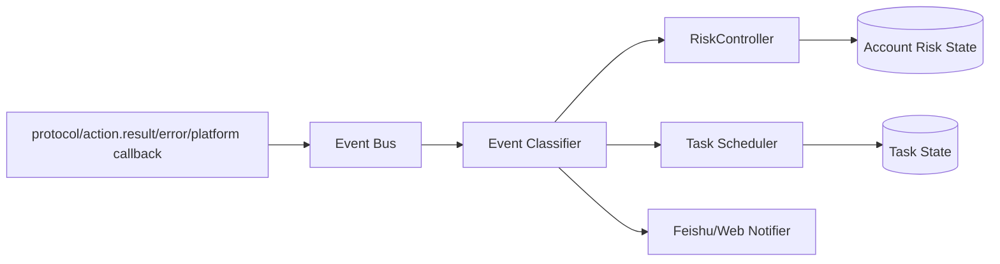
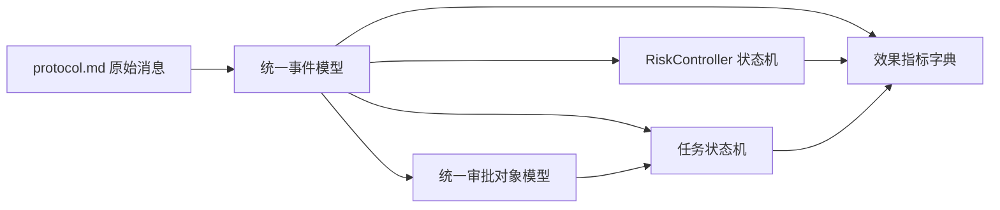

# AIDCP 设计收口：缺口清单与统一模型

> 本文目的：基于 `docs/` 现有产品/架构文档，对已识别的设计缺口做统一收口，并补齐后续实现可直接落地的统一模型定义。本文**不替代**原文档，而是作为跨文档口径统一层。
>
> 主要依据：
> - `docs/product-overview.md`
> - `docs/anti-detection.md`
> - `docs/product-dashboard.md`
> - `docs/product-feishu.md`
> - `docs/product-task.md`
> - `docs/product-exception.md`
> - `docs/risk-control.md`
> - `docs/architecture.md`
> - `docs/protocol.md`

---

## 第一部分：待澄清 + 待补齐清单

### 缺口 1：阶段口径不同步

> **状态：已基本收口（2026-06）**。下表为历史问题记录——当前 `docs/product-overview.md` 已采用「实现状态 + 文档成熟度」双维标注，且风控控制器/状态机（`aidcp-cloud/src/risk/`）已实装，本缺口核心诉求已落实。

| 项 | 内容 |
| --- | --- |
| 现状描述 | `docs/product-overview.md` 在“各模块当前完成状态”与“重要校正”中明确写到：**行为拟人化层与风控控制器/状态机（`aidcp-cloud/src/risk/`）均已落地**；但 `docs/anti-detection.md` 仍保留较多路线图/待办式表述，容易让读者把“拟人化能力”误判为整体反检测仍未落地。 |
| 问题 | 当前文档把“已实现”“设计完成”“规划中”混写在同一层级，尤其在“反检测”主题下，技术实现层（stealth、humanize）与策略层（代理、持久化、WebRTC/DNS、防泄露）没有统一状态标签，导致 overview 与 anti-detection 的阶段判断不一致。 |
| 建议补齐方向 | 建议在所有设计文档顶部统一增加**状态标注口径**：`implemented`（已有代码/运行痕迹）、`designed`（设计完成未实现）、`planned`（仅方向/待设计）。同时要求每个章节或能力表按“能力项”而非“文档整体”标状态，避免“反检测整体未完成”的误读。对于 `anti-detection`，应拆成“已实现：stealth 注入、行为拟人化；设计完成未实现：住宅代理、Cookie/Session 持久化、WebRTC/DNS 防泄露、指纹画像表”。 |
| 优先级 | P0 |
| 依赖关系 | 依赖 `docs/product-overview.md` 作为总索引定义统一图例；依赖 `docs/anti-detection.md`、`docs/risk-control.md`、`docs/product-dashboard.md` 等子文档采用同一状态枚举。 |
| 影响模块 | 产品总览、反检测与登录态、风控模型、路线图管理、对外沟通口径。 |

**来源依据**
- `docs/product-overview.md`：第 3.3 节 #9 与“重要校正（2026-06 更新）”已说明拟人化执行层与风控控制器/状态机（`aidcp-cloud/src/risk/` 的 `RiskController` + 状态机 + 配额 + 冷启动）均已实装。
- `docs/anti-detection.md`：整体仍以方案/路线图方式描述反检测能力，未按能力项显式区分实现状态。

---

### 缺口 2：文档成熟度与状态标注张力

> **状态：已收口（2026-06）**。`product-overview.md` §3.2 已改用双维标注（实现状态 + 文档成熟度），dashboard/feishu/task/exception 四份文档均标 `complete`；下表为历史记录。

| 项 | 内容 |
| --- | --- |
| 现状描述 | `docs/product-dashboard.md`、`docs/product-feishu.md`、`docs/product-task.md`、`docs/product-exception.md` 均已形成完整的信息架构、状态机、接口与渐进式实现设计；早期 `docs/product-overview.md` 第 3.2 节曾把这些模块标为“编写中”，易让读者误解为文档尚未成熟；该口径现已修正——overview §3.2 已改用本文建议的双维标注（实现状态 + 文档成熟度），四份文档均标为 `complete`。 |
| 问题 | “产品能力未实现”与“设计文档未完成”被混为一谈。overview 当前状态表中的“编写中”更像文档成熟度标签，但表头又是“各模块当前完成状态”，读者会自然理解为产品实现状态。 |
| 建议补齐方向 | 建议把 overview 中的状态拆成两个维度：`实现状态` 与 `设计成熟度`。例如：面板/飞书/任务/异常可标为“实现状态=planned 或 designed；设计成熟度=complete”。若不想双列展示，至少在 overview 图例中明确：状态只描述**产品实现状态**，文档成熟度另在“文档索引”中标注 `draft / complete / authoritative`。 |
| 优先级 | P1 |
| 依赖关系 | 依赖 `docs/product-overview.md` 调整总览表头与图例；依赖各子文档在文首声明“本文状态：设计完成/待实现”。 |
| 影响模块 | 产品总览、路线图沟通、项目管理、跨团队认知同步。 |

**来源依据**
- （历史依据）`docs/product-overview.md` 早期 §3.2 曾写各产品子文档“编写中”；当前版本已移除该写法（见 overview §3.2 的口径说明）。
- `docs/product-dashboard.md`、`docs/product-feishu.md`、`docs/product-task.md`、`docs/product-exception.md`：均已具备完整结构化设计，不再符合“编写中”的阅读感知。

---

### 缺口 3：风控与异常边界未制度化

| 项 | 内容 |
| --- | --- |
| 现状描述 | `docs/risk-control.md` 已定义账号状态机 `normal → warned → restricted → frozen`；`docs/product-exception.md` 已定义异常分级 `P0–P3`，并说明异常事件统一汇聚到云端事件总线，再驱动风控、通知、任务状态变更。`docs/product-dashboard.md` 与 `docs/product-feishu.md` 也都引用这两套枚举。 |
| 问题 | 虽然多份文档都提到“事件总线”“联动”“统一枚举”，但尚未定义**统一事件模型**：哪些信号是“事件”，哪些事件只告警不迁移状态，哪些事件会触发 `warned/restricted/frozen`，谁是权威状态源，异常分级与风控状态迁移如何映射，仍停留在叙述层。 |
| 建议补齐方向 | 建议新增统一事件模型，明确：1）事件类型枚举；2）事件 payload 标准结构；3）事件来源（edge/cloud/platform/manual）；4）事件严重度与风控状态迁移映射；5）权威状态源为云端 `RiskController`，异常系统只产出事件，不直接写最终状态；6）任务状态 `paused/deferred` 与风控状态迁移的联动规则。 |
| 优先级 | P0 |
| 依赖关系 | 依赖 `docs/risk-control.md` 的状态机定义、`docs/product-exception.md` 的 P0–P3 分级、`docs/product-task.md` 的任务状态机、`docs/protocol.md` 的 `action.result` / `anchor.report` / `error` 等消息作为底层信号源。 |
| 影响模块 | 风控控制器、异常事件总线、任务调度器、Web 告警、飞书通知、恢复续做机制。 |

**来源依据**
- `docs/product-exception.md`：第 1 节给出异常事件结构，但未定义统一事件类型全集与状态迁移规则。
- `docs/risk-control.md`：第 7 节定义状态机，但未规定事件输入模型。
- `docs/product-task.md`：要求 `paused/deferred` 与风控状态、异常分级协同，但缺统一事件契约。

---

### 缺口 4：效果度量体系缺失

| 项 | 内容 |
| --- | --- |
| 现状描述 | `docs/product-overview.md` 将“效果度量体系”列为运营策略模块 #10，并明确“过程/效果/健康三类指标的采集、聚合、看板全未做”；`docs/product-dashboard.md` 已提出 Dashboard、Analytics 所需指标；`docs/risk-control.md` 已给出点赞率、收藏率、关注率、质量指数等关键口径。 |
| 问题 | 当前缺少统一指标字典，导致不同文档中的指标虽然被提及，但没有统一的指标名、计算口径、采集频率、归因规则、数据来源定义。后续若直接实现面板、告警、止损，很容易出现“同名不同义”或“同义不同名”。 |
| 建议补齐方向 | 建议建立统一 `Metrics Dictionary`，按**过程指标 / 效果指标 / 健康指标**三类定义：指标编码、中文名、公式、粒度（账号/分组/全局/内容）、采集频率（实时/小时/日）、归因规则（按任务、按内容、按账号、按自然日）、数据来源（`action.result`、发布日志、平台采样、风控状态机）。同时明确哪些指标用于运营看板，哪些用于风控判定，哪些用于止损。 |
| 优先级 | P1 |
| 依赖关系 | 依赖 `docs/product-dashboard.md` 的页面需求、`docs/risk-control.md` 的阈值口径、`docs/product-task.md` 的任务维度、`docs/protocol.md` 的事件上报、`docs/architecture.md` 的云端聚合与 PG 落库位置。 |
| 影响模块 | Dashboard、Analytics、风控预警、止损策略、运营复盘、后续 A/B 与协同策略。 |

**来源依据**
- `docs/product-overview.md`：第 3.3 节 #10 明确效果度量体系未做。
- `docs/product-dashboard.md`：第 2.1、2.5 节已消费多类指标，但未定义统一字典。
- `docs/risk-control.md`：第 1、6 节给出关键阈值与质量指数口径。

---

### 缺口 5：审批流接口未闭合

> **状态：部分已落地（2026-06）**。**发布**审批的端到端闭环已实装：edge 在发布前发 `publish.approval_request`（以 `requestId` 标识，见 `aidcp-cloud/src/comm/protocol.ts` 的 `PublishApprovalRequestPayload`）→ cloud 发飞书审批卡片并按回调写信号文件（`aidcp-cloud/src/comm/handler.ts` 的 `onPublishApprovalRequest` + `aidcp-cloud/src/feishu/`）→ edge 据此决定是否发布。本缺口仍开放的部分是**跨类型统一审批对象模型**（发布 / 降级 / 批量 / 升档 / 恢复共用一套对象、状态机、超时与回写接口），即下方模型 2 仍为设计待实现。下表为历史问题记录。

| 项 | 内容 |
| --- | --- |
| 现状描述 | `docs/product-dashboard.md`、`docs/product-feishu.md`、`docs/product-task.md` 都提到审批：发布内容审核、风控降级确认、批量任务确认、高风险指令确认；并强调 Web 与飞书共享同一审批状态。 |
| 问题 | 目前缺少统一审批对象模型，导致审批对象的通用字段、审批粒度、超时策略、默认动作、回写接口、幂等规则都散落在叙述中。尤其飞书卡片回调与 Web 操作都可能修改同一审批状态，如果没有统一对象模型与幂等键，容易出现重复审批、状态竞争、回写不一致。 |
| 建议补齐方向 | 建议定义统一审批对象模型：审批对象类型（publish / risk_downgrade / batch_task / tier_upgrade 等）、业务对象引用、审批状态机、审批人/候选人、超时策略、默认动作、渠道回写（Web/Feishu/API）、幂等键（approvalId + decisionToken / externalEventId）、状态变更事件。并规定：审批最终权威状态存于云端审批服务，Web 与飞书都只调用同一回写接口。 |
| 优先级 | P0 |
| 依赖关系 | 依赖 `docs/product-feishu.md` 的卡片回调与幂等要求、`docs/product-dashboard.md` 的待审核入口、`docs/product-task.md` 的审批粒度与任务状态机、`docs/product-exception.md` 的降级确认场景。 |
| 影响模块 | 发布队列、飞书 Bot、Web 控制台、任务调度器、风控降级、审计日志。 |

**来源依据**
- `docs/product-feishu.md`：第 2.3、3、6 节已定义审批卡片与回调，但未抽象统一审批对象。
- `docs/product-dashboard.md`：第 2.4 节要求 Web 与飞书共享审批状态。
- `docs/product-task.md`：审批粒度与高风险任务确认依赖统一审批模型。

---

## 建议统一的状态标注口径

为解决缺口 1 与缺口 2，建议在后续所有设计文档中统一采用以下双维口径：

### A. 实现状态（Implementation Status）

| 枚举 | 含义 | 判定标准 |
| --- | --- | --- |
| `implemented` | 已实现 | 已有代码或运行痕迹，且 overview 可引用具体路径/模块 |
| `designed` | 设计完成 | 文档已形成可落地结构、状态机、接口或数据模型，但尚未实现 |
| `planned` | 仅规划 | 只有方向、目标或路线图，尚未形成完整设计 |

### B. 文档成熟度（Document Maturity）

| 枚举 | 含义 |
| --- | --- |
| `draft` | 草稿，结构可能继续调整 |
| `complete` | 设计完整，可作为实现依据 |
| `authoritative` | 当前主题的权威口径来源 |

**建议规则**
1. overview 只汇总“实现状态”，避免把“编写中”混入实现状态列。
2. 每份子文档文首单独标注“文档成熟度”。
3. 同一能力项允许出现组合，例如：`implemented + complete`、`designed + complete`、`planned + draft`。

---

## 第二部分：定义 3 个统一模型

### 模型 1：统一事件模型（Event Model）

> 目标：把 `docs/product-exception.md` 的异常分级、`docs/risk-control.md` 的风控状态机、`docs/product-task.md` 的任务状态流转、`docs/protocol.md` 的底层信号上报统一到一个可实现的事件契约中。

#### 1.1 模型定位与权威边界

| 主题 | 权威来源 | 本文收口定义 |
| --- | --- | --- |
| 底层信号格式 | `docs/protocol.md` | `action.result`、`anchor.report`、`error`、`hello/welcome` 等是原始信号输入 |
| 异常分级 | `docs/product-exception.md` | P0–P3 作为事件严重度枚举 |
| 风控状态机 | `docs/risk-control.md` | `normal/warned/restricted/frozen` 作为账号权威状态 |
| 任务状态机 | `docs/product-task.md` | `paused/deferred/running/...` 由事件驱动联动 |
| 权威状态源 | 云端 `RiskController` + 事件总线 | **最终账号风控状态只由云端 `RiskController` 写入**；异常系统、飞书、Web 都不能直接改账号最终状态 |

#### 1.2 统一事件对象结构

```jsonc
{
  "eventId": "evt_20260601_0001",
  "eventType": "captcha_detected",
  "severity": "P1",
  "category": "platform_challenge",
  "source": {
    "layer": "edge",
    "component": "guard",
    "protocolType": "action.result",
    "messageId": "req-42"
  },
  "subject": {
    "accountId": "acc-02",
    "groupId": "g-beauty",
    "edgeId": "edge-04",
    "taskId": "task-1001",
    "sessionId": "sess-1",
    "contentId": null
  },
  "signal": {
    "actionId": "note.like_button",
    "outcome": "guard_blocked",
    "reason": "captcha_popup",
    "attempts": 1,
    "escalation": null
  },
  "payload": {
    "detail": {},
    "snapshotRef": "snap/evt_20260601_0001.html",
    "metrics": {
      "minuteFailures": 3,
      "hourlyFailureRate": 0.42
    }
  },
  "decision": {
    "riskImpact": "state_transition",
    "targetRiskState": "warned",
    "taskImpact": "pause_current_task",
    "notifyChannels": ["feishu", "web"]
  },
  "status": "accepted",
  "occurredAt": 1717113601000,
  "ingestedAt": 1717113601200,
  "dedupeKey": "acc-02:captcha_detected:task-1001"
}
```

#### 1.3 事件类型枚举

按现有文档术语，建议统一为以下事件类型：

| eventType | category | 典型来源 | 默认 severity | 是否可能触发风控状态迁移 |
| --- | --- | --- | --- | --- |
| `captcha_detected` | `platform_challenge` | guard 层、页面识别 | P1 | 是，通常 `normal → warned` |
| `slider_challenge_detected` | `platform_challenge` | guard 层 | P1 | 是 |
| `login_expired` | `auth` | 登录态检查、平台回执 | P1 | 否，默认只暂停任务；连续发生可升 `warned` |
| `login_failed_hard` | `auth` | 重登失败、封禁提示 | P0 | 是，通常 `→ frozen` |
| `cdp_disconnected` | `runtime` | CDP 客户端 | P2 | 否，先自动恢复 |
| `edge_offline` | `runtime` | WS 心跳/hello 缺失 | P2 | 否 |
| `systemic_revision_detected` | `ui_revision` | `action.result.escalation=systemic_revision` | P2 | 否，默认暂停相关任务，不直接改账号状态 |
| `guard_blocked` | `runtime` | `action.result.outcome=guard_blocked` | P2/P3 | 否，视频率升级 |
| `action_no_target` | `runtime` | `action.result.outcome=no_target` | P3 | 否 |
| `publish_rejected_sensitive` | `content_publish` | 平台发布回执 | P1 | 否，内容退回；连续发生可升 `warned` |
| `publish_rejected_marketing` | `content_publish` | 平台发布回执 | P1 | 是，连续发生可 `→ warned` |
| `publish_shadow_limited` | `content_publish` | 发布后效果异常 + 平台信号 | P0/P1 | 是，通常 `→ warned/restricted` |
| `risk_ratio_out_of_range` | `risk_signal` | 点赞率/关注率/收藏率实时计算 | P2 | 是，通常 `normal → warned` |
| `cold_start_violation` | `risk_signal` | 冷启动规则校验 | P2 | 是，通常 `→ warned` |
| `duplicate_interaction_detected` | `risk_signal` | 去重集合命中异常 | P2 | 否，默认阻断动作并记告警 |
| `manual_freeze_requested` | `manual_control` | Web/飞书人工操作 | P1 | 是，直接 `→ frozen` |
| `manual_resume_requested` | `manual_control` | Web/飞书人工恢复 | P2 | 否，需经 `RiskController` 校验后回迁 |
| `approval_timeout` | `workflow` | 审批服务 | P2 | 否，影响审批对象与任务，不直接改账号状态 |

#### 1.4 事件严重度与风控状态映射

| 事件类别 | 事件示例 | 默认动作 | 风控状态影响 |
| --- | --- | --- | --- |
| 仅告警类 | `cdp_disconnected`、`edge_offline`、`action_no_target` | 自动重试/重连/记录日志 | 不直接迁移 |
| 告警 + 任务暂停类 | `captcha_detected`、`slider_challenge_detected`、`login_expired`、`systemic_revision_detected` | `task → paused`，通知飞书/Web | 可触发 `normal → warned`，但由 `RiskController` 判定 |
| 风控预警类 | `risk_ratio_out_of_range`、`cold_start_violation`、`publish_rejected_marketing`（连续） | 降档、停发、延后任务 | 通常 `normal → warned` |
| 风控确认类 | `publish_shadow_limited`、`login_failed_hard`、平台明确限流/封禁 | 立即停手、停发、人工介入 | `warned → restricted` 或 `→ frozen` |
| 人工控制类 | `manual_freeze_requested` | 立即冻结 | 直接 `→ frozen` |

#### 1.5 权威状态源与处理链路



**关键规则**
1. `Event Bus` 接收原始信号并归一化为统一事件对象。
2. `Event Classifier` 负责补齐 `severity/category/dedupeKey/default action`。
3. **只有 `RiskController` 能写账号风控状态**；通知系统与任务系统只能消费状态变更事件。
4. `Scheduler` 根据事件决定任务 `pause/defer/resume/cancel`，但不得绕过风控状态机。
5. 所有状态变更都要再产出二级事件：`risk_state_changed`、`task_state_changed`，供 Web/飞书/审计消费。

#### 1.6 与现有协议消息的映射

| 协议/来源 | 原字段 | 归一化事件 |
| --- | --- | --- |
| `action.result` | `outcome=guard_blocked` + `reason=captcha_popup` | `captcha_detected` |
| `action.result` | `outcome=escalated` + `escalation=systemic_revision` | `systemic_revision_detected` |
| `action.result` | `outcome=no_target` | `action_no_target` |
| `error` | `code=handler_error` / `bad_envelope` | `runtime_protocol_error`（内部事件，可不外显） |
| 平台发布回执 | 拒绝原因=敏感词 | `publish_rejected_sensitive` |
| 风控计算器 | 点赞率超阈值 | `risk_ratio_out_of_range` |
| 人工操作 | Web/飞书点击冻结 | `manual_freeze_requested` |

#### 1.7 幂等与去重规则

| 规则 | 定义 |
| --- | --- |
| 事件主键 | `eventId` 全局唯一 |
| 去重键 | `dedupeKey = accountId + eventType + taskId/contentId + time_bucket` |
| 飞书/平台回调幂等 | 使用外部 `event_id` / `callback token` 映射到 `source.externalId` |
| 状态迁移幂等 | 同一 `dedupeKey` 在窗口内只允许一次有效迁移 |
| 通知幂等 | 同一事件只生成一次主通知，后续重试只更新状态 |

---

### 模型 2：统一审批对象模型（Approval Model）

> 目标：把 `docs/product-dashboard.md`、`docs/product-feishu.md`、`docs/product-task.md`、`docs/product-exception.md` 中分散的审批场景统一为一个可复用对象，保证 Web 与飞书双端一致、超时策略明确、回写接口闭合、幂等可控。

#### 2.1 审批对象适用范围

建议首批统一纳入以下审批类型：

| approvalType | 来源文档 | 说明 |
| --- | --- | --- |
| `publish_review` | `docs/product-dashboard.md`、`docs/product-feishu.md`、`docs/product-task.md` | 发布内容审核 |
| `risk_downgrade_confirm` | `docs/product-feishu.md`、`docs/product-exception.md` | 模糊场景下的风控降级确认 |
| `tier_upgrade_review` | `docs/product-feishu.md`、`docs/risk-control.md` | 升档申请（保守→正常→激进） |
| `batch_task_confirm` | `docs/product-task.md` | 批量任务/高风险任务确认 |
| `manual_resume_review` | `docs/product-exception.md` | 人工恢复任务/账号前的确认 |

#### 2.2 审批对象通用结构

```jsonc
{
  "approvalId": "apr_20260601_001",
  "approvalType": "publish_review",
  "status": "pending",
  "subject": {
    "accountId": "acc-01",
    "groupId": "g-beauty",
    "taskId": "task-publish-101",
    "contentId": "c-101",
    "riskState": "normal"
  },
  "objectRef": {
    "objectType": "content",
    "objectId": "c-101",
    "objectVersion": 3
  },
  "policy": {
    "timeoutSeconds": 1800,
    "defaultDecision": "reject",
    "expireAction": "mark_expired_and_pause_task",
    "requiredApprovals": 1,
    "approvalMode": "any_of"
  },
  "decisionOptions": [
    { "code": "approve", "label": "通过并发布" },
    { "code": "reject", "label": "驳回" },
    { "code": "redirect_web", "label": "去 Web 编辑" }
  ],
  "assignees": {
    "primaryApprovers": ["ou_user_a"],
    "candidateApprovers": ["ou_user_a", "ou_user_b"],
    "escalateTo": ["ou_leader"]
  },
  "channels": {
    "web": {
      "detailUrl": "/content/c-101",
      "lastRenderedAt": 1717113601000
    },
    "feishu": {
      "chatId": "oc_xxx",
      "messageId": "om_xxx",
      "cardToken": "ct_xxx"
    }
  },
  "snapshot": {
    "title": "待审核发布 · 小张测评",
    "summary": "标题/摘要/相似度自检结果",
    "attachments": ["img_v2_xxx"]
  },
  "result": {
    "decision": null,
    "decidedBy": null,
    "decidedAt": null,
    "decisionChannel": null,
    "reason": null
  },
  "audit": {
    "createdBy": "system",
    "createdAt": 1717113600000,
    "updatedAt": 1717113600000,
    "idempotencyKey": "publish_review:c-101:v3"
  }
}
```

#### 2.3 审批状态机

| 状态 | 含义 | 可迁移到 |
| --- | --- | --- |
| `pending` | 待审批 | `approved` / `rejected` / `expired` / `cancelled` |
| `approved` | 已通过 | 终态 |
| `rejected` | 已驳回 | 终态 |
| `expired` | 超时未处理 | 终态 |
| `cancelled` | 业务对象已失效或被撤销 | 终态 |

**关键规则**
1. 审批对象一旦进入终态，不可再次决策；如业务对象更新，必须新建新版本审批对象。
2. `objectVersion` 变化必须导致新的 `approvalId` 或新的 `idempotencyKey`。
3. Web 与飞书都只展示同一审批对象的当前状态，不维护各自独立状态。

#### 2.4 审批粒度定义

| 场景 | 粒度 | 说明 |
| --- | --- | --- |
| 发布审核 | `contentId` 级 | 一条待发布内容一个审批对象 |
| 风控降级确认 | `accountId + riskProposalId` 级 | 一次降级建议一个审批对象 |
| 批量任务确认 | `campaignId / batchTaskId` 级 | 一次批量操作一个审批对象 |
| 升档申请 | `accountId + targetTier` 级 | 一次升档申请一个审批对象 |

#### 2.5 超时与默认策略

| approvalType | timeoutSeconds | defaultDecision | expireAction |
| --- | --- | --- | --- |
| `publish_review` | 1800 | `reject` | 内容保持未发布，任务 `paused` |
| `risk_downgrade_confirm` | 600 | `approve` | 默认按安全侧执行降级 |
| `tier_upgrade_review` | 3600 | `reject` | 保持原档位 |
| `batch_task_confirm` | 900 | `reject` | 不执行批量任务 |
| `manual_resume_review` | 900 | `reject` | 保持暂停/冻结 |

**统一原则**
1. **安全优先**：凡涉及发布、升档、恢复执行，超时默认拒绝。
2. **止损优先**：凡涉及降级、冻结，超时默认执行更保守动作。

#### 2.6 Web 与飞书双端一致性规则

| 规则 | 定义 |
| --- | --- |
| 权威状态源 | 云端审批服务表（Approval Store） |
| Web 展示 | 读取审批服务当前状态 |
| 飞书卡片 | 首次发送后保存 `messageId/cardToken`，状态变化时更新原卡片 |
| 双端回写 | Web 按钮与飞书回调都调用同一 `POST /api/approvals/{approvalId}/decision` |
| 冲突处理 | 先到先得；后到请求若审批已终态，返回 `409 already_decided` 并回显最终状态 |

#### 2.7 回写接口定义

**创建审批对象**

```jsonc
POST /api/approvals
{
  "approvalType": "publish_review",
  "objectRef": { "objectType": "content", "objectId": "c-101", "objectVersion": 3 },
  "subject": { "accountId": "acc-01", "groupId": "g-beauty", "taskId": "task-publish-101" },
  "policy": { "timeoutSeconds": 1800, "defaultDecision": "reject" }
}
```

**审批决策回写**

```jsonc
POST /api/approvals/apr_20260601_001/decision
{
  "decision": "approve",
  "decisionChannel": "feishu",
  "operatorId": "ou_user_a",
  "operatorType": "user",
  "reason": "内容通过",
  "idempotencyKey": "feishu:card_action:evt-9001",
  "expectedStatus": "pending"
}
```

**查询审批对象**

```jsonc
GET /api/approvals/apr_20260601_001
```

#### 2.8 幂等规则

| 场景 | 幂等键 |
| --- | --- |
| 创建审批对象 | `approvalType + objectId + objectVersion` |
| 飞书按钮回调 | `feishu event_id` 或 `card action token` |
| Web 重复点击 | 前端生成 `requestId`，服务端结合 `approvalId + operatorId + requestId` |
| 超时任务扫描 | `approvalId + timeout_at` |

**关键规则**
1. 同一业务对象同一版本只能存在一个 `pending` 审批对象。
2. 飞书回调重试不得重复执行决策，只允许重复返回同一结果。
3. 审批决策成功后必须同步产出 `approval_decided` 事件，供任务调度器、发布队列、通知系统消费。

#### 2.9 审批结果与业务对象联动

| approvalType | `approved` 后动作 | `rejected/expired` 后动作 |
| --- | --- | --- |
| `publish_review` | 内容 `reviewing → approved/publishing` | 内容 `reviewing → rejected` 或保持待编辑 |
| `risk_downgrade_confirm` | 执行降级动作并通知 | 保持观察，但记录人工拒绝 |
| `tier_upgrade_review` | 调整档位并记录生效时间 | 保持原档位 |
| `batch_task_confirm` | 创建/启动批量任务 | 不创建任务 |
| `manual_resume_review` | 任务/账号恢复到允许状态 | 保持暂停/冻结 |

---

### 模型 3：效果指标字典（Metrics Dictionary）

> 目标：把 `docs/product-overview.md` 的“过程/效果/健康三类指标”、`docs/product-dashboard.md` 的 Dashboard/Analytics 需求、`docs/risk-control.md` 的阈值口径统一成可实现的指标字典。

#### 3.1 指标字典总原则

| 原则 | 定义 |
| --- | --- |
| 统一命名 | 每个指标同时有 `metricCode` 与中文名，避免同义不同名 |
| 统一粒度 | 明确指标适用于 `account / group / global / content / task / day` 哪些维度 |
| 统一频率 | 明确实时、小时、日采集，不混用 |
| 统一归因 | 明确按账号、任务、内容、自然日还是事件窗口归因 |
| 统一来源 | 每个指标必须绑定数据来源：协议事件、发布日志、平台采样、风控状态 |

#### 3.2 指标结构定义

```jsonc
{
  "metricCode": "process.view_count",
  "metricName": "浏览次数",
  "category": "process",
  "definition": "账号在统计窗口内打开笔记详情页的成功次数",
  "formula": "count(action.result where actionId in browse/open_detail and ok=true)",
  "grain": ["account", "group", "global", "day"],
  "collectionFrequency": "realtime",
  "aggregationWindow": ["minute", "hour", "day"],
  "attributionRule": "按触发动作所属 accountId 与自然日归因；跨任务不去重",
  "dataSource": ["protocol.action.result"],
  "owner": "cloud analytics",
  "usedBy": ["dashboard", "risk-control", "analytics"]
}
```

#### 3.3 过程指标（Process Metrics）

| metricCode | 中文名 | 口径定义 | 采集频率 | 归因规则 | 数据来源 |
| --- | --- | --- | --- | --- | --- |
| `process.session_count` | 会话数 | 统计窗口内启动并进入运行态的会话次数 | 实时/日汇总 | 按 `accountId + sessionId` 去重，归因到自然日 | 调度器会话日志、WS 会话 |
| `process.view_count` | 浏览次数 | 成功打开笔记详情页次数 | 实时 | 按账号、自然日累计 | `action.result` |
| `process.like_count` | 点赞次数 | 成功点赞次数 | 实时 | 按账号、自然日累计 | `action.result` |
| `process.collect_count` | 收藏次数 | 成功收藏次数 | 实时 | 按账号、自然日累计 | `action.result` |
| `process.comment_count` | 评论次数 | 成功评论次数 | 实时 | 按账号、自然日累计 | `action.result` |
| `process.follow_count` | 关注次数 | 成功关注次数 | 实时 | 按账号、自然日累计 | `action.result` |
| `process.publish_attempt_count` | 发布尝试次数 | 进入发布执行阶段的次数 | 实时 | 按内容、账号、自然日 | 发布任务日志 |
| `process.publish_success_count` | 发布成功次数 | 平台确认发布成功次数 | 实时/日汇总 | 按内容、账号、自然日 | 发布回执、发布日志 |
| `process.approval_pending_count` | 待审批数 | 当前处于 `pending` 的审批对象数 | 实时 | 按账号/分组 | 审批服务 |
| `process.task_pause_count` | 任务暂停次数 | 任务进入 `paused` 的次数 | 实时 | 按任务、账号、自然日 | 任务状态事件 |

#### 3.4 效果指标（Outcome Metrics）

| metricCode | 中文名 | 口径定义 | 采集频率 | 归因规则 | 数据来源 |
| --- | --- | --- | --- | --- | --- |
| `outcome.follower_total` | 粉丝总数 | 账号当前粉丝数 | 日采样 | 按账号日终值 | 平台采样 |
| `outcome.follower_delta` | 涨粉数 | 当日粉丝总数 - 前一日粉丝总数 | 日 | 按账号自然日 | 平台采样 |
| `outcome.note_like_total` | 内容累计点赞 | 单篇内容累计点赞数 | 日/小时 | 按 `contentId` 归因 | 平台采样 |
| `outcome.note_collect_total` | 内容累计收藏 | 单篇内容累计收藏数 | 日/小时 | 按 `contentId` 归因 | 平台采样 |
| `outcome.note_comment_total` | 内容累计评论 | 单篇内容累计评论数 | 日/小时 | 按 `contentId` 归因 | 平台采样 |
| `outcome.note_view_total` | 内容累计阅读 | 单篇内容累计阅读/曝光 | 日/小时 | 按 `contentId` 归因 | 平台采样 |
| `outcome.publish_conversion_rate` | 发布转化率 | `publish_success_count / publish_attempt_count` | 日 | 按账号、自然日 | 发布日志 |
| `outcome.content_engagement_rate` | 内容互动率 | `(点赞+收藏+评论) / 阅读` | 日/小时 | 按内容归因 | 平台采样 |

#### 3.5 健康指标（Health Metrics）

| metricCode | 中文名 | 口径定义 | 采集频率 | 归因规则 | 数据来源 |
| --- | --- | --- | --- | --- | --- |
| `health.like_rate` | 点赞率 | `like_count / view_count` | 实时/小时/日 | 按账号、自然日；与 `risk-control.md` 阈值对齐 | `action.result` |
| `health.collect_rate` | 收藏率 | `collect_count / view_count` | 实时/小时/日 | 按账号、自然日 | `action.result` |
| `health.follow_rate` | 关注率 | `follow_count / view_count` | 实时/小时/日 | 按账号、自然日 | `action.result` |
| `health.quality_index` | 质量指数 | `浏览时长 ÷ 近期发布数量` | 日 | 按账号、滚动 7 日窗口 | 平台采样 + 发布日志 |
| `health.risk_state` | 风控状态 | 当前账号状态 `normal/warned/restricted/frozen` | 实时 | 按账号当前值 | `RiskController` |
| `health.tier` | 当前档位 | `conservative/normal/aggressive` 或保守/正常/激进 | 实时 | 按账号当前值 | `RiskController` |
| `health.cold_start_day` | 冷启动进度 | 新账号处于 Day n/7 的阶段值 | 日 | 按账号自然日 | 账号资料 + 风控规则 |
| `health.exception_count_p0_p3` | 异常次数 | 各严重度异常事件数 | 实时/日 | 按账号、分组、自然日 | 事件总线 |
| `health.login_validity` | 登录态有效性 | 当前登录态是否有效 | 实时 | 按账号当前值 | 登录态检查 |
| `health.edge_online` | 边缘在线状态 | 绑定 edge 是否在线 | 实时 | 按账号当前值 | `hello/welcome`、心跳 |

#### 3.6 指标阈值与风控联动

| 指标 | 阈值依据 | 联动动作 |
| --- | --- | --- |
| `health.like_rate` | `docs/risk-control.md`：健康区间 15%–35% | 超阈值触发 `risk_ratio_out_of_range` |
| `health.collect_rate` | `docs/risk-control.md`：收藏率 < 点赞率 | 超阈值触发预警 |
| `health.follow_rate` | `docs/risk-control.md`：关注率 < 5% | 超阈值触发预警 |
| `health.quality_index` | `docs/risk-control.md`：浏览时长 ÷ 近期发布数量 | 过低触发停发/降档建议 |
| `health.exception_count_p0_p3` | `docs/product-exception.md`：异常分级 | 高频 P2/P3 可升级为 P1/P2 风险事件 |

#### 3.7 采集频率建议

| 数据源 | 采集方式 | 频率 |
| --- | --- | --- |
| `protocol.action.result` | 事件流实时消费 | 实时 |
| 审批对象状态 | 审批服务状态表 | 实时 |
| 任务状态 | 调度器事件流 | 实时 |
| 平台粉丝/内容表现 | 定时采样 | 小时/日 |
| 风控状态与档位 | `RiskController` 状态表 | 实时 |
| 发布日志 | 发布任务完成时写入 | 实时 |

#### 3.8 归因规则统一约束

| 场景 | 归因规则 |
| --- | --- |
| 过程动作 | 默认归因到触发动作时的 `accountId + natural_day + sessionId/taskId` |
| 内容效果 | 默认归因到 `contentId`，再向上汇总到账号/分组 |
| 风控健康 | 默认归因到账号当前状态，不回溯改写历史 |
| 批量任务 | 既保留批量任务维度，也拆分到账号维度 |
| 跨日会话 | 动作按发生时间归入对应自然日，不按会话开始日整体归因 |

---

## 落地建议：三模型之间的关系



### 统一落地原则

1. **事件先行**：所有异常、风控、审批、任务联动都先归一化为事件，再驱动状态变化。
2. **状态单写**：账号风控状态只由 `RiskController` 写；审批状态只由审批服务写；任务状态只由调度器写。
3. **指标后算**：指标字典消费事件流、状态表与平台采样，不允许各页面各算一套。
4. **双端一致**：Web 与飞书都只读统一模型，不维护各自私有状态。

---

## 建议后续补文档顺序

| 顺序 | 建议动作 | 原因 |
| --- | --- | --- |
| 1 | 在 overview 增加统一状态口径说明 | 先解决总览口径冲突 |
| 2 | 在 risk-control / product-exception / product-task 中引用统一事件模型 | 先闭合风控-异常-任务边界 |
| 3 | 在 product-feishu / product-dashboard / product-task 中引用统一审批对象模型 | 闭合双端审批一致性 |
| 4 | 在 product-dashboard / overview 中引用指标字典 | 为 Analytics 与止损提供统一口径 |

> 本文为收口文档；后续若进入实现阶段，建议把三模型进一步拆成接口契约文档或数据库 schema 文档。