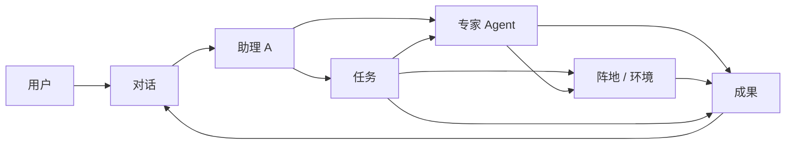
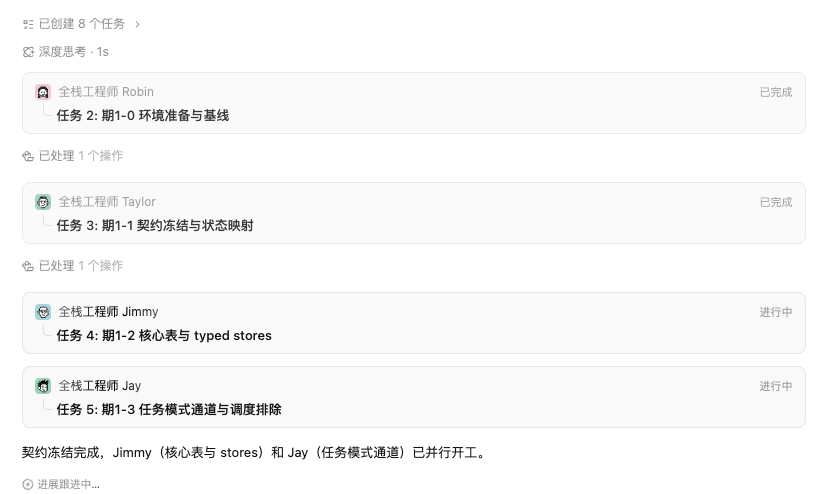
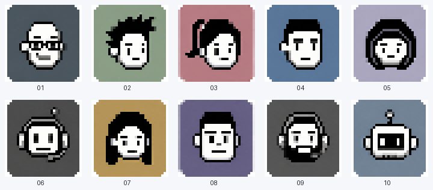

# 对话驱动的多 Agent 客户端：阶段设计记录

> 状态：Working Draft（用于继续讨论，不是当前实现或行为契约）
> 记录日期：2026-07-24
> 适用范围：AIDCP 新一代对话驱动客户端的产品模型、信息架构、交互方向和视觉基准
> 当前交互快照：[conversation-driven-agent-client-demo.html](./conversation-driven-agent-client-demo.html)
> 当前头像基准：[conversation-driven-agent-client-avatars.png](./conversation-driven-agent-client-avatars.png)

## 1. 文档定位

本文记录本轮讨论已经形成的共识、当前高保真 Demo 所表达的交互，以及尚未解决的问题，便于
后续继续设计时保持上下文一致。

本文有三条明确边界：

1. 它是产品设计记录，不代表 Edge、Cloud 或 Console 已经实现。
2. 它不是 OpenSpec 行为契约；需要进入实现时，应另建 OpenSpec change，并把最终行为同步到
   对应规格。
3. Demo 中的任务、状态、数量和内容都是用于说明交互的样例，不能作为真实运行数据。

## 2. 核心判断

现有客户端定义为“传统客户端”。新客户端的核心不是在传统导航中增加一个聊天窗口，而是把
系统能力重新组织成一个**对话驱动的多 Agent 协作系统**。

用户面对的不是一组抽象工具或后台菜单，而是一支具有人类社会角色感的专家团队：

- 每个 Agent 有清晰职业、名字、能力边界和工作记录；
- 助理 A 是用户的默认入口，负责理解目标、编排专家、排期、额度和统一汇总；
- 用户可以停留在 A 的汇总视角，也可以进入某位专家的工作视角；
- Agent 和环境是两个独立维度，一个 Agent 可以在多个环境工作，一个环境也可以由多个
  Agent 协作；
- 任务、团队、阵地和成果都属于某一场对话，而不是与对话并列的全局一级模块。

真正要建立的用户心智是：

> 我在与助理 A 共同管理一支专家团队；A 负责协调，专家在被授权的阵地中工作，所有过程和
> 成果都归属于当前对话。

## 3. 领域模型

### 3.1 五个核心对象

| 对象 | 作用 | 作用域 |
| --- | --- | --- |
| 对话 Conversation | 用户发起目标和持续追问的主容器 | 全局可切换 |
| 角色 Agent | 具有名字、职业、能力和工作记录的专家 | 可跨对话、跨环境复用 |
| 任务 Task | A 或专家承接的可追踪工作单 | 属于一场对话 |
| 阵地 Environment | 平台账号、浏览器环境或其他执行目标 | 可被多个 Agent 使用 |
| 成果 Result | 研究、候选、草稿、评论建议或执行证据 | 属于对话，并可追溯到任务、角色和阵地 |

### 3.2 对象关系



关键约束：

- 对话是产品主入口，不是普通消息容器。
- A 是默认协调者，但不是所有能力的集合体。
- 角色与阵地是多对多关系，不能把某个角色永久绑定到某个平台账号。
- 成果必须能回到产生它的对话、任务、角色和阵地。
- “加入团队”在当前设计中表示加入当前对话的协作团队，不代表全局安装或永久启用。

## 4. 信息架构

当前采用 Codex 式三层布局，但复制的是其“对话优先、中心聚焦、工具按需展开”的布局逻辑，
不是照搬具体产品。

```text
┌──────────────────────────────────────────────────────────────────────┐
│ 工作区 / 账号数量 / 整体健康 / 设置                                 │
├──────────────┬──────────────────────────────────┬────────────────────┤
│              │                                  │ 当前对话工作台     │
│ 全局对话列表 │ A 的汇总 / 某位专家的工作视角    │ 任务               │
│              │                                  │ 团队               │
│ 对话 1       │ 对话内容                         │ 阵地               │
│ 对话 2       │ 专家切换条                       │ 成果               │
│ 对话 3       │ 输入框与权限                     │                    │
│              │                                  │                    │
└──────────────┴──────────────────────────────────┴────────────────────┘
```

### 4.1 左侧：全局对话

左侧只回答“我正在处理哪场对话”：

- 新建对话；
- 最近对话列表；
- 对话标题、最近进展、时间和关键状态；
- 收起后保留紧凑的对话序号入口。

任务、团队、阵地和成果不得放到左侧作为全局一级导航，因为它们都是某一场对话中的元素。

### 4.2 中间：唯一工作焦点

中间区域始终只表达一个工作视角：

- 默认是助理 A 的对话与统一汇总；
- 选择专家后，原位切换成该专家的工作记录和阶段产物；
- 不打开另一个页面，不在 A 的汇总中同时铺开所有专家过程；
- 输入框上方保留当前对话已调用角色的切换条；
- 切到专家时，输入内容表示给该专家追加要求；切回 A 后继续进行整体协调。

### 4.3 右侧：当前对话工作台

右侧只回答“这场对话有哪些工作对象”：

- 工作台：目标、任务完成度和入口摘要；
- 任务：工作单、负责人、状态和边界；
- 团队：当前已调用角色与其他可调用角色；
- 阵地：账号、平台环境和角色绑定；
- 成果：可回读的研究、草稿、候选和证据。

右侧不是永久占据阅读空间的信息墙：

- 宽屏：常驻工作台，当前 Demo 为约 `320px`；
- 中等宽度：收成约 `56px` 工具轨，点击后以约 `300px` 浮层向左展开，不改变主对话宽度；
- 手机：左侧对话列表变为选择器，工具轨和工作台排到主对话下方；
- 当前 Demo 已按 `1248px`、`736px` 和 `358px` 内容宽度检查过无横向溢出。

## 5. A 与专家的交互规则

### 5.1 助理 A 是默认入口

用户不需要先理解完整 Agent 系统。默认只与 A 对话，由 A：

- 理解目标和限制；
- 拆分任务并选择专家；
- 安排先后顺序和协作关系；
- 绑定或确认执行阵地；
- 管理额度、时间和公开动作边界；
- 汇总阶段进展、需要用户决定的事项和最终成果。

### 5.2 A 的输出只呈现汇总

A 的主视图应该优先呈现：

- 当前目标；
- 已调用哪些专家；
- 每位专家的阶段结论；
- 当前阻塞、风险和等待用户事项；
- 公开动作是否发生；
- 下一步。

不应把所有专家的详细过程堆进 A 的消息流。

### 5.3 专家视角原位切换

用户点击某位专家后，中间区域切换为该专家的可审计工作视角，至少包含：

- 接收到的任务与边界；
- 当前阶段和可理解的工作进展；
- 使用了哪些阵地和来源；
- 阶段产物或待确认事项；
- 与其他专家的交接关系；
- 返回 A 汇总的入口。

这里应展示“工作记录和证据”，不等同于暴露模型的原始内部推理过程。

### 5.4 调用专家

团队面板中的“调用”会：

1. 把专家加入当前对话；
2. 由 A 创建或补充分工；
3. 在输入框上方出现该专家的切换入口；
4. 可以直接切到该专家的工作视角；
5. 专家完成后先把结果交回 A，再由 A 统一汇总。

### 5.5 “新专家加入中”过渡态参考

当 A 正在把新专家加入当前对话时，可以参考下面这类安静、内联的 Loading 表达：


当前只记录以下视觉与文案方向：

- 文案为“新专家加入中...”；
- 使用轻量旗帜图标，不用占满页面的 Spinner 或骨架屏；
- “专家”作为句子中的重点，其余文字和图标保持次级灰度；
- 该状态嵌入当前工作流，不打断用户阅读 A 的上下文。

这张图只作为后续设计参考。触发时机、最短展示时长、超时、失败、重试，以及专家何时算
“已加入”，仍需结合真实派发协议继续讨论。

### 5.6 专家派发反馈文案参考

可参考以下表达：

> 已派出研究员 Alex 调查 automation 拆分任务的范围、进度与新模板方案，等他的报告回来后
> 我们再讨论走增量拆分还是重写。

这类文案同时交代了四件事：

1. **派出了谁**：研究员 Alex；
2. **具体调查什么**：automation 拆分任务的范围、进度与新模板方案；
3. **下一次同步以什么为准**：等待 Alex 的报告；
4. **届时由用户决定什么**：走增量拆分还是重写。

可复用的句式骨架为：

> 已派出{专家角色} {名字}{任务动作与调查范围}，等{他/她}的{交付物}回来后，我们再讨论
> {待决策选项 A}还是{待决策选项 B}。

“已派出”必须以任务已经真实创建并被对应专家接收为前提。如果系统只有派发意图、仍在加入
专家，应该继续使用“新专家加入中...”或其他真实中间态，不能提前写成已派出。

### 5.7 编排任务与并行进展流参考

当 A 把一个复杂目标拆成多项任务并交给多位专家时，可以参考下面这种在当前对话内逐步展开
编排进展的交互：



截图所表达的信息层级为：

1. **计划摘要**：顶部显示“已创建 8 个任务”，让用户先知道编排规模，并保留进一步查看入口；
2. **处理状态**：以“深度思考 · 1s”这类轻量元信息说明当前处理阶段和耗时；
3. **操作里程碑**：用“已处理 1 个操作”分隔已经发生的系统操作；
4. **专家任务卡**：每张卡同时显示专家头像、角色、姓名、任务编号、阶段、任务标题和状态；
5. **并行关系**：多张“进行中”任务卡同时出现，直接表达不同专家已经并行开工；
6. **阶段汇总**：A 用自然语言说明哪个前置阶段已经完成、哪些专家正在继续工作；
7. **持续跟进**：末尾以“进展跟进中...”说明当前编排尚未结束。

该模式适合表达“一次 A 的编排正在怎样落地”，应出现在当前对话的 A 视角中，而不是另建一个
与对话并列的全局任务页面。它与右侧任务工作台的分工是：

- 对话进展流说明本轮发生了什么、现在推进到哪里；
- 右侧任务工作台保存可持续查看、筛选和操作的任务集合；
- 点击专家或任务卡后，可以进入对应专家工作视角或任务详情，但具体跳转方式尚未定稿。

状态诚实性要求：

- “已创建”“已处理”“已完成”“进行中”必须来自真实任务或操作状态；
- 计划生成完成不等于任务已被专家接收；
- “深度思考”只展示阶段和耗时，不展示模型原始内部推理；
- 并行开工必须以各任务已经分别进入可验证的执行态为前提；
- 某张任务卡失败、等待用户或结果未知时，应原位显示真实状态，不能继续保持“进行中”。

这张图当前只锁定交互模式与信息结构。折叠规则、更新动效、任务卡点击目标、历史事件压缩和
长任务列表的呈现仍需继续讨论。

## 6. 当前角色目录

| 角色 | 定位 | 当前表达的能力 |
| --- | --- | --- |
| 助理 A | 默认协调者 | 理解目标、拆分任务、协调专家、排期、额度和统一汇总 |
| 热门分析师 Max | 热点研究 | 规划搜索词、搜索、筛选热点内容、形成趋势判断 |
| 浏览者 小张 | 浏览与轻互动 | 浏览页面、验证目标，在授权边界内执行允许的轻互动 |
| 社群爱好者 J | 社群发现 | 找到符合条件的群组，形成加入或参与建议 |
| 作家 Dim | 内容创作 | 根据要求选择性组合灵感池内容，生成账号化内容 |
| 评论员 小李 | 评论候选 | 在 Feed 或搜索中发现相关热点，生成待确认评论 |
| Persona 策划师 Iris | 账号定位 | 校准账号定位、受众、人设和表达边界 |
| 自动化专员 Boton | 流程自动化 | 编排重复流程，并保留可审计的执行证据 |
| 数据核验员 Lin | 数据核对 | 核对来源、数量和交付物的一致性 |
| 合规巡检员 Kai | 边界检查 | 检查公开动作、额度、权限和平台风险边界 |

角色目录仍是讨论稿。进入实现前，需要进一步明确角色注册、可配置能力、版本、权限和
生命周期。

## 7. 像素人视觉基准

团队角色使用拟人的 Qoder 风格像素人，不使用猫头鹰吉祥物，也不使用写实人物头像。

WorkBuddy 截图只用于参考“输入框上方的专家切换条如何排版”，不得作为人物头像参考。
Qoder 截图和下方这组原始 10 个像素人才是人物视觉参考。



当前映射已经确认：

| 原始像素人 | 当前角色 |
| --- | --- |
| `qoder-01.png` | 浏览者 小张 |
| `qoder-02.png` | 评论员 小李 |
| `qoder-03.png` | 热门分析师 Max |
| `qoder-04.png` | 自动化专员 Boton |
| `qoder-05.png` | Persona 策划师 Iris |
| `qoder-06.png` | 助理 A |
| `qoder-07.png` | 社群爱好者 J |
| `qoder-08.png` | 作家 Dim |
| `qoder-09.png` | 数据核验员 Lin |
| `qoder-10.png` | 合规巡检员 Kai |

视觉锁定规则：

- 使用 `conversation-driven-agent-client-assets/` 中的原始 10 张 PNG；
- 不再重绘、锐化、模糊、移动像素、改变裁切或改变人物造型；
- 浏览器展示时使用硬边像素渲染，避免平滑插值；
- 角色变更只允许修改角色与原始编号的映射，不能私自修改原图；
- 社群角色名称为“社群爱好者 J”，不再使用“社群爱好者 G”。

## 8. 状态与行为诚实性

对话体验不能用“正在思考”掩盖真实状态。至少要区分：

- 未调用；
- 已调用但未开始；
- 进行中；
- 已形成阶段产物；
- 等待用户；
- 已交付给 A；
- 已完成；
- 失败或无法确认；
- 公开动作未发生；
- 公开动作已提交但平台结果未知；
- 平台已确认结果。

当前 Demo 中使用了“研究中”“创作中”“等待你”“待汇总”“已完成”等状态，并在示例任务中
明确表达：

- 评论需要逐条确认；
- 草稿禁止发布；
- A 汇总的是结论，不伪造平台动作成功；
- 阵地、额度和公开动作边界属于任务的一部分。

这些方向与 AIDCP 现有的状态诚实性原则一致，但最终字段和状态机仍需要 OpenSpec 定义。

## 9. 当前 Demo 所表达的场景

默认对话为“三账号热点研究与内容准备”：

1. 用户要求 Max 研究三个账号的本周热点；
2. Dim 为每个账号准备两篇草稿；
3. 小李准备评论候选；
4. 评论逐条确认，草稿禁止发布；
5. A 拆成工作单，冻结账号、搜索额度和公开动作边界；
6. 用户默认查看 A 的统一汇总；
7. 用户可以切换到 Max、Dim、小李查看各自工作记录；
8. 用户可以从右侧团队面板调用 J，并原位进入 J 的工作视角；
9. 切换到另一场对话后，中心默认回到该对话的 A 汇总，右侧回到该对话工作台。

Demo 还包含“北美社群候选”“夏日内容复盘”“评论策略”等对话，用于说明对话级状态隔离，
不代表真实业务记录。

## 10. 已确认的设计决策

1. 新客户端采用对话驱动，而不是传统菜单驱动。
2. 系统能力拆分为多个具有人类角色感的 Agent。
3. 角色和环境是独立维度，关系为多对多。
4. 助理 A 是默认交互入口和统一汇总者。
5. 切换专家时，中间同一窗口切换为该专家的工作记录。
6. 左侧只放全局对话。
7. 任务、团队、阵地、成果属于当前对话，放在右侧工作台。
8. 采用 Codex 式三层面板逻辑，并针对中等宽度和手机做重排。
9. 专家切换条的排版可参考 WorkBuddy，但头像不参考 WorkBuddy。
10. 团队头像使用当前锁定的 10 个 Qoder 风格原始像素人。
11. 不使用猫头鹰吉祥物作为专家角色。
12. 社群角色最终名称为“社群爱好者 J”。

## 11. 后续需要继续讨论的问题

以下内容尚未定稿：

1. **对话与任务的边界**：一场对话能否包含多个 Mission，任务如何拆分、暂停、复制和归档。
2. **A 的编排可见度**：用户看到多少排期、依赖、预算和专家选择依据。
3. **专家工作记录格式**：哪些过程信息必须显示，哪些只保留为系统证据。
4. **阵地模型**：账号、浏览器环境、平台身份和执行目标如何统一命名与绑定。
5. **权限与审批**：默认权限、公开动作确认、额度和角色级授权如何表达。
6. **冲突处理**：多个专家或多场对话争用同一阵地时如何排队和提醒。
7. **成果管理**：成果如何预览、比较、批准、退回、复用和追溯。
8. **通知机制**：等待用户、专家完成、风险阻塞如何通知，避免制造噪声。
9. **角色配置**：是否允许客户创建角色、修改名字、能力、头像和默认团队。
10. **传统客户端关系**：新旧客户端是并行、迁移还是同一客户端的模式切换。
11. **首次使用引导**：如何让用户在不了解 Agent 概念时自然理解 A、专家和阵地。
12. **真实数据验证**：Demo 尚未连接真实账号、任务、权限、额度或平台结果。
13. **专家加入状态机**：“加入中”、已派出、已接收、失败和超时分别由什么事实触发。
14. **编排进展流行为**：计划摘要如何展开、任务卡点击到哪里、历史事件如何压缩和回放。

## 12. 设计材料与验证边界

本次记录随附：

- `conversation-driven-agent-client-demo.html`：当前交互快照；
- `conversation-driven-agent-client-avatars.png`：锁定头像总览；
- `conversation-driven-agent-client-assets/qoder-01.png` 至 `qoder-10.png`：原始头像；
- `conversation-driven-agent-client-assets/manifest.json`：头像与角色映射。
- `conversation-driven-agent-client-ui/loading-expert-joining.png`：“新专家加入中”过渡态参考。
- `conversation-driven-agent-client-ui/orchestration-task-progress-stream.png`：编排任务与并行进展流参考。

当前 Demo 已验证的仅是本地界面交互和响应式表现，包括：

- A 与专家视角切换；
- 从团队面板调用专家；
- 对话级状态切换；
- 左侧对话栏收起；
- 宽屏、中等宽度和手机布局；
- 无浏览器运行错误。

未验证：

- Edge 产品代码集成；
- Cloud 编排或持久化；
- 真实环境和账号绑定；
- 权限、额度和审批链路；
- 真实平台写入及结果确认；
- 打包、签名、安装或发布。

## 13. 后续更新规则

- 后续讨论先更新本文的“已确认决策”和“待讨论问题”。
- 若改变核心对象、作用域、角色职责、权限或用户可见行为，应建立 OpenSpec change。
- 若只调整探索性 Demo，应保留版本说明，不能把 Demo 直接描述为已实现。
- 当前 10 个像素人是视觉基准；除非用户明确重新开启头像设计，否则不修改原图。
