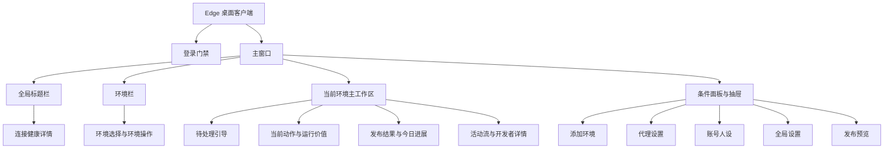
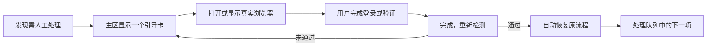
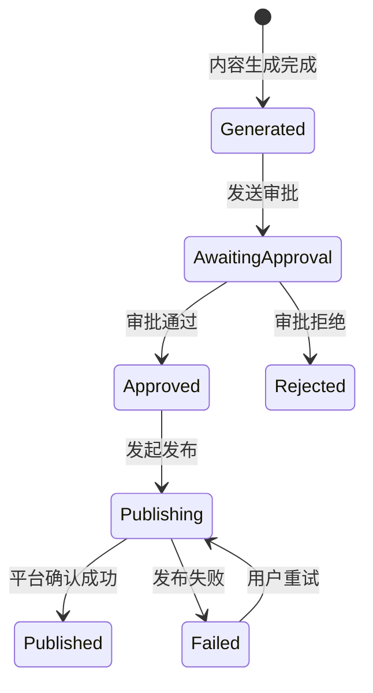
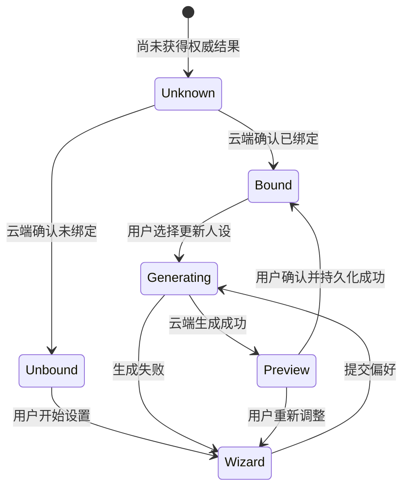
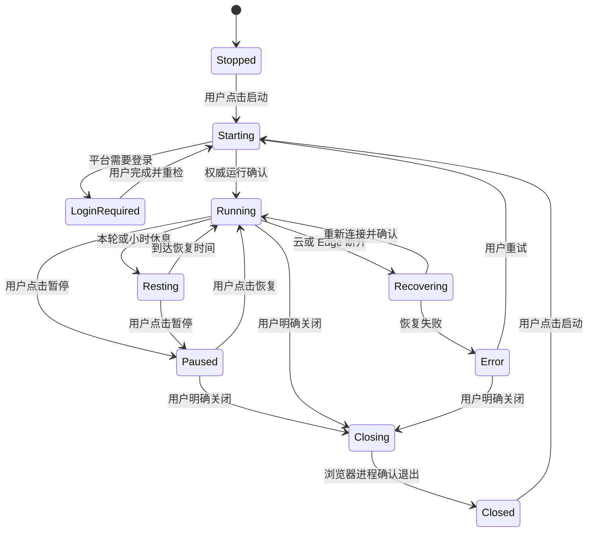

# AIDCP Edge 界面说明 v1.0

> 状态：Baseline<br>
> 生效日期：2026-07-15<br>
> 适用范围：`aidcp-edge` Electron 客户端登录门禁、主窗口及其面板、抽屉、条件态界面。<br>
> 视觉与组件规范：[Edge UI Design System v1.0](./edge-ui-design-system-v1.md)<br>
> 当前实现入口：`aidcp-edge/src/electron/renderer/`

## 1. 文档定位

本说明是一份**界面级产品契约**，用于回答以下问题：

- Edge 由哪些界面组成，各自解决什么问题；
- 一个界面在什么条件下出现、消失或切换状态；
- 用户可以执行什么动作，动作完成后应该得到什么反馈；
- 哪些信息和操作必须跟随当前环境，哪些属于全局设置；
- 设计、开发和验收如何判断界面是否落地正确。

它不替代 Design System。两份文档的分工如下：

| 文档 | 主要回答 | 评审重点 |
|---|---|---|
| Design System | 长什么样、组件如何复用 | 色彩、字体、间距、组件、动效、文案语气、无障碍 |
| 界面说明 | 有哪些界面、何时出现、如何流转 | 信息架构、显示条件、环境作用域、状态、动作结果、异常恢复 |

后续设计稿必须同时符合两份文档。视觉一致但状态错误，或流程正确但违反视觉语义，都不算完成。

文中的“必须 / 应该 / 可以”分别对应 MUST / SHOULD / MAY。

## 2. 产品与使用场景

Edge 是一个长期驻留的桌面运营伴侣。用户通常同时管理多个平台账号，需要持续知道：

1. 当前正在看哪个账号；
2. 该账号现在是否可工作；
3. 系统正在做什么、产生了什么价值；
4. 是否有需要本人处理的登录、验证码、发布确认或异常；
5. 如何暂停、恢复或明确关闭当前账号环境。

因此主窗口不是传统后台的“菜单 + 多页面”，而是一个以**当前环境**为作用域的持续状态工作台。复杂配置和低频任务通过面板或抽屉完成，不挤占长期可见区域。

## 3. 信息架构



### 3.1 主窗口空间结构

```text
┌──────────────────────────────────────────────────────────────┐
│ 当前账号 / 云环境 / 连接健康                         设置 │ 标题栏
├──────────┬───────────────────────────────────────────────────┤
│          │ 条件引导：登录、验证码、同账号占用、异常恢复      │
│ 环境栏   ├───────────────────────────────────────────────────┤
│          │ 当前动作 / 运行价值 / 阶段进展                    │
│ 账号 A   ├───────────────────────────────────────────────────┤
│ 账号 B   │ 发布结果 / 今日进展                               │ 主工作区
│ 账号 C   ├───────────────────────────────────────────────────┤
│          │ 活动流                                            │
│ + 添加   │ 开发者详情（默认收起且可配置隐藏）                │
└──────────┴───────────────────────────────────────────────────┘
                         ↑
        添加环境 / 代理 / 人设 / 设置 / 发布预览按需覆盖
```

基准窗口为约 `820 × 720`，最小可用窗口为 `640 × 520`。窗口缩小时，内容区内部滚动，核心生命周期动作和当前状态不得被裁掉。

## 4. 全局界面规则

### 4.1 当前环境是主作用域

环境栏中选中的环境决定主工作区的全部账号数据。切换环境后，以下内容必须原子地切换到同一个 `envId`：

- 账号名、平台身份和登录信息；
- 连接、运行、风险和浏览器状态；
- 当前动作、运行价值和阶段进展；
- 发布卡片与发布预览；
- 今日计数、配额窗口和活动流；
- 启动、暂停、恢复、关闭、显示浏览器、代理、人设等动作。

不得出现“标题显示账号 B，但按钮仍操作账号 A”的中间态。新环境尚未加载完整数据时，主区显示该环境的骨架、未知或等待状态，不得短暂复用上一个环境的数据。

### 4.2 全局与环境级内容边界

| 范围 | 内容 | 切换环境时 |
|---|---|---|
| 全局 | 客户端登录会话、云环境选择、开发者详情开关、浏览器停放策略 | 保持不变 |
| 环境级 | 浏览器、代理、账号人设、运行、风险、发布、进展、活动 | 随当前环境切换 |
| 临时草稿 | 未确认的人设选择、未提交的发布预览编辑 | 切换环境时清除或绑定原环境，禁止串用 |

### 4.3 信息优先级

主工作区按以下顺序分配注意力：

1. **必须由用户处理**：登录、验证码、同账号占用、严重失败；
2. **当前发生什么**：连接、动作、暂停、等待、恢复；
3. **为什么有价值**：本轮发现、互动、产出和阶段结果；
4. **今日累计**：真实指标与配额；
5. **诊断细节**：事件流、内部阶段和开发者信息。

同一时刻只允许一个主告警焦点。多个环境都有待处理事件时，环境栏显示紧急标记，主区只呈现当前环境的问题。

### 4.4 真实状态优先

- 未收到权威结果时使用“正在确认”“状态未知”，不得提前显示成功。
- 失联、停止、失败、`no_target`、未获取配额等必须如实展示。
- 数字分母必须来自真实账号目标；缺少目标时显示纯计数或“目标未设置”，不得补造 `/20`。
- 平台色只表示平台身份；蓝色表示当前选择；绿、橙、红、灰表示运行状态。
- 动效只能加强已确认状态，不得用持续动效伪装仍在运行。

## 5. 界面目录

| 编号 | 界面 / 区域 | 类型 | 范围 | 主要目的 |
|---|---|---|---|---|
| UI-00 | 客户端登录门禁 | 整页状态 | 全局 | 建立客户端会话后进入工作台 |
| UI-01 | 主窗口框架 | 常驻容器 | 全局 | 承载标题栏、环境栏和当前环境主区 |
| UI-02 | 标题栏与连接健康 | 常驻 + 浮层 | 混合 | 识别当前账号、云环境和整体可用性 |
| UI-03 | 环境栏 | 常驻导航 | 全局入口 / 环境级选择 | 管理、选择和定位多个账号环境 |
| UI-04 | 待处理引导 | 条件卡片 | 环境级 | 引导用户完成登录、验证码或异常恢复 |
| UI-05 | 当前动作 | 常驻状态区 | 环境级 | 说明系统此刻在做什么 |
| UI-06 | 运行价值与阶段进展 | 条件状态区 | 环境级 | 解释本轮价值和阶段结果 |
| UI-07 | 准备与失败 | 条件状态区 | 环境级 | 表达启动准备、连接失败和可恢复动作 |
| UI-08 | 发布结果卡片 | 条件卡片 | 环境级 | 展示生成、审批、发布和失败结果 |
| UI-09 | 今日进展 | 常驻摘要 | 环境级 | 展示真实日累计、配额和生命周期动作 |
| UI-10 | 活动流与开发者详情 | 常驻 + 折叠 | 环境级 | 提供可读历史与按需诊断信息 |
| UI-11 | 添加环境 | 模态面板 | 全局入口 | 加入现有 AdsPower 环境或新建环境 |
| UI-12 | 代理设置 | 浮层面板 | 环境级 | 为当前环境配置代理 |
| UI-13 | 账号人设 | 浮层面板 | 环境级 | 查看、生成和确认当前账号人设 |
| UI-14 | 设置 | 侧边抽屉 | 全局 | 管理客户端级配置与会话 |
| UI-15 | 发布预览 | 侧边抽屉 | 环境级 | 在真正发布前完成最终确认 |

## 6. UI-00 客户端登录门禁

### 6.1 目的

确认客户端操作者身份并获得可用的云端会话。它不是平台账号登录页；小红书、Facebook 等平台登录在对应的真实浏览器环境中完成。

### 6.2 状态

| 状态 | 页面反馈 | 可用动作 |
|---|---|---|
| 未登录 | 登录说明和登录入口 | 登录 |
| 登录中 | 按钮 loading，防止重复提交 | 等待 |
| 登录失败 | 保留输入并说明可恢复原因 | 重试 |
| 会话失效 | 明确说明需要重新登录客户端 | 重新登录 |
| 登录成功 | 进入主窗口，加载允许访问的环境 | 无需额外确认 |

不得把客户端登录成功表述为平台账号已经登录。

## 7. UI-01 主窗口框架

主窗口始终保持“标题栏 + 环境栏 + 当前环境主区”的结构。它负责布局和作用域，不自行创造业务状态。

### 7.1 无环境空态

当用户没有可访问环境时：

- 环境栏保留“添加环境”入口；
- 主区说明需要先加入或创建环境；
- 不显示伪造的运行卡片、今日数据或示例账号；
- 主动作进入 UI-11 添加环境面板。

### 7.2 首次加载

- 环境列表与当前环境详情可以独立加载，但不得跨环境复用缓存画面。
- 若有上次选中且仍有权限的环境，应恢复该选择。
- 若上次环境已无权限，选择第一个可访问环境并说明变化，不得继续展示不可访问账号。

## 8. UI-02 标题栏与连接健康

### 8.1 常驻信息

标题栏至少包含：

- 当前环境的可读账号名和平台标识；
- 当前云环境标签；
- 一条面向用户的整体健康结论；
- 设置入口和原生窗口控制。

可读账号名优先级为：平台昵称 → 环境名称 → 环境 ID 后四位。不得把完整内部 ID 当作默认标题。

### 8.2 健康结论

整体健康由客户端认证、云连接、环境会话、风险状态和 Edge 核心状态共同得出，但标题栏只显示一个结论，例如：

- 正常运行；
- 正在连接；
- 等待登录；
- 已暂停；
- 需要处理；
- 当前离线。

点击健康状态打开详情浮层，分项展示真实状态和最后更新时间。详情用于解释结论，不得出现与标题结论矛盾的成功色或动作。

## 9. UI-03 环境栏

### 9.1 环境项内容

每个环境项至少呈现：

- 平台头像或平台标记；
- 可读账号名；
- 一个独立状态点；
- 选中态；
- 需要人工处理时的紧急标记；
- 人设、代理或环境操作入口（按当前布局出现）。

平台身份、当前选中和运行状态三种语义必须独立：平台角标使用平台色，选中使用单一蓝色背景或描边，状态点使用状态色。不得叠加多圈高饱和描边。

### 9.2 排序与滚动

- 待人工处理环境优先，但排序变化不得造成用户正在操作的当前项突然离开视野。
- 环境栏高度固定，列表在内部滚动。
- 切换环境时保留合理滚动位置；主动选中屏外环境时将其滚入视野。
- 默认折叠态显示平台头像、状态点和选中态；展开态补充名称和操作。

### 9.3 主要动作

| 用户动作 | 结果 |
|---|---|
| 单击环境项 | 切换当前环境并刷新全部环境级内容 |
| 再次触发当前环境的显示动作 | 尝试将真实浏览器带到前台或从停放位置恢复 |
| 点击人设 | 打开绑定当前 `envId` 的 UI-13 |
| 点击代理 | 打开绑定当前 `envId` 的 UI-12 |
| 点击添加 | 打开 UI-11 |

“显示浏览器”是尽力而为。系统无法保证窗口置前时，应说明浏览器实际位置或用户如何找到它，不得显示已经置前的假成功。

## 10. UI-04 待处理引导

### 10.1 进入条件

当前环境出现以下任一情况时显示：

- 平台需要登录；
- 检测到验证码或风险校验；
- 同一平台账号已被另一个环境占用；
- 环境异常且需要用户在真实浏览器中完成处理。

### 10.2 处理流程



同一时间只处理一个引导任务。卡片必须说明：哪个账号、发生了什么、需要用户去哪里做什么，以及系统将在何时重新检测。

远程消息、截图或辅助通知只能帮助定位问题；只有原浏览器会话中的权威检测才能确认验证码已经解除。

## 11. UI-05 当前动作

当前动作区使用可读语言描述 Edge 此刻的行为，例如“正在浏览与你账号定位相关的内容”“正在等待下一轮开始”。不得直接把内部事件名或命令名作为主文案。

### 11.1 新鲜度规则

| 事件新鲜度 | 展示方式 |
|---|---|
| 最近约 1 分钟内有真实动作 | 显示当前动作，可使用克制动效 |
| 约 1–5 分钟没有新动作但会话仍在线 | 保留最近动作，停止动作动效，并说明正在等待 |
| 云或 Edge 已断开 | 断开状态覆盖旧动作，不继续表现为正在运行 |
| 收到明确完成事件 | 切换为对应阶段或今日完成反馈 |

超时阈值是表达新鲜度的 UI 边界，不得替代云端真实运行状态。

## 12. UI-06 运行价值与阶段进展

### 12.1 展示条件

价值卡只在以下权威状态出现：

- 新鲜运行事件；
- 一轮完成；
- 小时间隔；
- 当日完成。

单项配额饱和、旧日志或本地推测不得单独触发“今天完成”。

### 12.2 信息结构

价值卡依次表达：

1. 现在或刚刚发生了什么；
2. 这对账号有什么价值；
3. 已完成到哪一阶段；
4. 下一步会发生什么或何时恢复。

默认仅展示紧凑阶段流和摘要。七步内部循环只能通过“查看详细过程”主动展开，不得同时常驻第三套重复进度。

### 12.3 模式

| 模式 | 主信息 | 次信息 |
|---|---|---|
| Running | 当前动作及其价值 | 当前阶段、最近产出 |
| Session interval | 本轮已完成，正在休息 | 恢复时间、下一轮目标 |
| Hour interval | 本小时阶段结果 | 下一小时开始时间 |
| Day complete | 今日目标已达到 | 今日成果和明日继续 |

## 13. UI-07 准备与失败

### 13.1 启动准备

环境从停止进入运行前，准备区可以展示浏览器启动、平台身份确认、云连接和策略加载等真实阶段。每个阶段只能在收到对应进展后更新，不得定时轮播伪进度。

### 13.2 Edge 失败

失败区必须包含：

- 面向用户的失败结论；
- 受影响的当前环境；
- 可以采取的下一步；
- 最近一次真实失败原因的按需详情；
- 重试后仍失败时保留历史，不把卡片直接清空。

异常退出后，诊断详情应可再次查看。恢复连接时显示“正在恢复”，只有重新获得权威在线状态后才切回正常。

## 14. UI-08 发布结果卡片

发布卡片属于当前环境，必须随环境切换，不得显示其他账号的稿件或结果。

### 14.1 发布状态



| 状态 | 必须展示 |
|---|---|
| Generated | 内容摘要、目标平台、预览入口 |
| Awaiting approval | 等待谁确认、确认渠道、提交时间 |
| Approved | 已确认但尚未发布的明确区分 |
| Publishing | 正在提交，禁止重复操作 |
| Published | 平台返回的真实成功结果和时间 |
| Rejected / Failed | 原因、保留稿件、可恢复动作 |

生成成功、审批成功和平台发布成功是三个不同事实，文案和颜色不得混用。

## 15. UI-09 今日进展

### 15.1 内容

今日进展以一个分段摘要面板展示六类真实指标及必要的配额窗口。具体指标名称跟随当前产品契约，布局保持可扫描，不做后台式大图表。

### 15.2 展开与收起

- 面板标题直接使用“展开今日进展 / 收起今日进展”等能表达当前动作的文案；
- 同时使用几何箭头表达方向，不依赖单一图标；
- 收起时保留最重要的总体结论和生命周期动作；
- 展开时展示真实分项、目标、时间窗口和来源说明。

### 15.3 生命周期动作

| 当前状态 | 主动作 | 次动作 | 结果要求 |
|---|---|---|---|
| Stopped / Closed | 启动 | 设置或显示浏览器 | 只启动当前环境，不代表已开始自动运行 |
| Starting | 正在启动 | 取消（若支持） | 防止重复启动 |
| Running / Resting | 暂停 | 显示浏览器、关闭 | 暂停保留真实浏览器 |
| Paused | 恢复 | 显示浏览器、关闭 | 从暂停状态继续 |
| Closing | 正在关闭 | 无 | 等待真实浏览器退出确认 |
| Error | 重试 | 查看详情、关闭 | 不把重试点击当作恢复成功 |

客户端启动本身不得自动开始账号任务。显式“关闭”与“暂停”含义不同：暂停保留浏览器和登录会话；关闭结束当前环境的浏览器进程，并在真实确认进程已退出后才显示已关闭。

## 16. UI-10 活动流与开发者详情

### 16.1 活动流

活动流面向普通用户，按时间倒序或稳定时序说明：系统做了什么、结果如何、是否需要处理。优先展示结构化事件翻译后的叙事文案，避免日志拼接。

每条活动应包含：时间、动作或事件、结果。失败项可按需展开技术原因，但列表主行不得只显示代码或内部 ID。

### 16.2 开发者详情

- 默认收起，并可由全局设置完全隐藏；
- 用于展示连接分项、事件载荷摘要、版本和诊断信息；
- 不承担正常用户必须理解的核心状态；
- 隐藏后不能导致问题无解，必要恢复动作仍应出现在普通界面。

开发者详情中的“引擎命令”按当前环境展示 Cloud 主动命令的本地诊断，至少包含接收时间、命令类型、安全摘要、短关联标识和当前可证明阶段。阶段语义必须严格分开：

- “已收到”只表示 Edge 收到了命令；
- “已拒绝”表示命令未通过登记、能力、载荷或本地处理器门禁；
- “已交给执行器”只表示完成本地路由，不表示浏览器已经操作；
- “步骤已完成 / 步骤失败”只可用于 Edge 在同一边界直接观察到的步骤结果，不得扩写成业务完成或平台确认。

命令摘要使用逐类型字段白名单。正文、标题、评论、私信、搜索词、群聊码、Cookie、Token、二维码、截图内容、完整 URL、浏览器调试地址、账号身份字段、任务永久键和原始 payload 不得进入 renderer；文本只显示字符数，URL 只显示是否存在。未知字段默认不展示。诊断仅保存在 Edge 本机内存中，按环境隔离，最多 50 条且最长 30 分钟；不得进入普通活动流或 Cloud 数据库。

## 17. UI-11 添加环境

添加环境使用遮罩面板，包含两个明确任务页签。

### 17.1 加入现有环境

适用于已经在 AdsPower 中存在的浏览器环境：

1. 加载可加入列表；
2. 支持刷新、搜索或必要筛选；
3. 允许多选后一次加入；
4. 高级区域可手动输入环境 ID；
5. 加入成功后立即持久化，并以离线或待检查状态出现在环境栏。

### 17.2 新建环境

适用于从 Edge 创建新环境：

- 选择平台，目前包括小红书和 Facebook；
- 选择本机模板或创建参数；
- 以“创建环境”为唯一主动作；
- Facebook 凭据、代理等低频字段按需展开；
- 创建成功后立即进入环境栏，再由后续真实检查更新登录和在线状态。

创建动作成功只代表环境已建立，不代表平台登录完成，也不代表任务已经启动。

### 17.3 关闭与错误

- 未提交时可安全关闭；
- 提交中防止重复创建；
- 部分成功时逐项说明，已加入项不得因其他项失败而消失；
- 错误后保留用户输入，敏感字段除外。

## 18. UI-12 代理设置

代理面板始终绑定一个明确环境，并在标题中显示可读账号名。

| 字段 | 规则 |
|---|---|
| 类型 | 无代理、HTTP、HTTPS、SOCKS5 |
| 地址 / 端口 | 选择代理类型后必填并校验 |
| 用户名 / 密码 | 仅认证代理需要；已保存密码不得回显明文 |
| 风险提示 | 说明切换 IP 可能触发平台校验 |

保存后应显示“配置已保存”与“连接已验证”之间的区别。若只完成持久化但尚未验证连通性，不得使用连接成功文案。

## 19. UI-13 账号人设

### 19.1 作用域与入口

人设属于平台账号环境。面板标题必须显示当前账号和平台；生成、确认、更新均携带同一个 `envId`。切换环境后，未确认草稿不得带到新账号。

### 19.2 权威绑定三态



- `Unknown` 不等于未设置，只显示加载、重试或不可用说明，不自动打开向导。
- 只有权威 `Unbound` 可以自动引导首次设置。
- `Bound` 展示当前人设摘要和“更新人设”。

### 19.3 设置流程

1. **设置偏好**：语气单选，内容偏好多选，可补充自定义偏好；
2. **云端生成**：显示真实生成中状态，失败后保留选择；
3. **预览确认**：展示人设摘要，允许确认、重新生成或返回调整；
4. **持久化**：只有服务端确认成功后进入 `Bound`。

本地预览不能代替云端持久化成功。吉祥物可强化智能能力和亲和感，但不能用品牌色掩盖生成失败。

## 20. UI-14 设置

设置使用侧边抽屉，承载全局低频配置。至少包括：

- 云环境与连接信息；
- 浏览器窗口停放策略；
- 是否显示开发者详情；
- 客户端会话和重新登录入口；
- 版本与必要诊断信息。

重新登录只重建客户端会话，不应默认清除 AdsPower 环境、平台账号登录态、人设或代理。任何会清除本地配置的动作必须单独命名并二次确认。

## 21. UI-15 发布预览

发布预览是当前环境稿件的最终确认抽屉。

### 21.1 内容

- 当前账号和目标平台；
- 标题、正文、图片及可删除图片状态；
- 生成来源或必要风险提示；
- 取消和“确认发布”动作。

### 21.2 提交流程

点击确认发布后：

1. 立即关闭抽屉，避免用户重复提交；
2. 保留完整提交载荷，包括正文、图片、审批与环境字段；
3. 主界面进入真实“正在发布”状态；
4. 若提交失败，恢复可操作的预览或失败卡，并保留稿件；
5. 只有平台返回成功后显示已发布。

取消只关闭预览，不删除已生成稿件，除非用户执行了单独的删除动作。

## 22. 环境生命周期



状态机用于约束界面表达，不替代运行时的权威状态机。出现未列出的风险态时，风险状态可以覆盖主提示和动作，但不得直接篡改云端最终风险结论。

## 23. 关键状态矩阵

| 当前环境状态 | 主区焦点 | 价值 / 进展 | 生命周期动作 | 禁止表现 |
|---|---|---|---|---|
| 无环境 | 添加环境 | 不显示 | 添加环境 | 示例账号或假数据 |
| Stopped / Closed | 尚未启动 | 历史摘要可保留 | 启动 | 自动运行动效 |
| Starting | 真实准备阶段 | 可显示准备价值 | 禁用重复启动 | 定时伪进度 |
| Login required | 登录引导 | 暂停普通进展强调 | 显示浏览器、重检 | 把客户端登录当平台登录 |
| Captcha / risk | 人工处理引导 | 保留历史但不覆盖风险 | 显示浏览器、重检 | 远程辅助后自动宣称解除 |
| Running recent | 当前动作 | Running 模式 | 暂停、显示、关闭 | 旧动作长期保持动效 |
| Running idle | 正在等待 | 最近价值和下次动作 | 暂停、显示、关闭 | 假装仍在点击或滚动 |
| Paused | 已暂停及影响 | 保留今日累计 | 恢复、显示、关闭 | 等同于浏览器已关闭 |
| Session / hour interval | 休息原因和恢复时间 | 阶段结果 | 暂停、显示、关闭 | 表述为任务停止 |
| Day complete | 今日完成 | 今日成果 | 显示、关闭 | 由单项配额推断完成 |
| Disconnected / recovering | 连接恢复 | 冻结旧动作动效 | 重试或等待 | 继续显示正常运行 |
| Error | 可读失败与恢复 | 保留已完成成果 | 重试、详情、关闭 | 点击重试即显示成功 |
| Same-account occupied | 冲突说明 | 隐藏无关动作 | 定位占用环境 | 允许两个环境继续运行 |

## 24. 跨界面交互规则

| 交互 | 必须发生 | 不得发生 |
|---|---|---|
| 切换环境 | 所有环境级区域切换到新 `envId` | 短暂显示旧环境操作态 |
| 暂停 | 云端确认后显示暂停，浏览器保留 | 关闭浏览器或清除登录态 |
| 恢复 | 从暂停继续并等待权威运行状态 | 点击后立即伪装 Running |
| 关闭 | 等待浏览器进程真实退出 | 只隐藏窗口就显示已关闭 |
| 显示浏览器 | 尝试置前并给出可定位反馈 | 无法置前仍显示成功 |
| 保存代理 | 说明保存与验证的不同结果 | 回显已保存密码 |
| 生成人设 | 云端生成并绑定当前环境 | 本地假生成或跨环境复用 |
| 确认发布 | 防重复提交并保留载荷 | 生成完成即写成发布成功 |
| 展开详情 | 在原上下文中增量展示 | 跳走后丢失当前操作状态 |

## 25. 面板、抽屉与焦点

- 同一时间最多打开一个主模态面板或侧边抽屉。
- 打开后焦点进入面板；关闭后焦点回到触发按钮。
- `Esc` 可以关闭无破坏性的面板；提交中或存在不可逆动作时需明确说明是否可取消。
- 遮罩点击只关闭不会造成输入损失的面板；有未提交内容时应阻止误关或给出确认。
- 环境切换会改变面板作用域时，优先关闭该环境级面板；不得静默把面板内容改绑到新环境。
- 错误提示放在对应字段或动作附近，顶部只保留一个总结，不堆叠多个 toast。

## 26. 响应式与窗口适配

| 窗口条件 | 环境栏 | 主工作区 | 面板 / 抽屉 |
|---|---|---|---|
| 基准 `820 × 720` 及以上 | 可展开，内部滚动 | 双列或紧凑分段按现有布局 | 保持推荐宽度 |
| 宽度 640–819 | 默认折叠或缩窄 | 卡片转单列，主动作保持可见 | 不超过可视宽度 |
| 高度 520–719 | 固定标题与关键动作 | 内容区内部纵向滚动 | 头尾固定，中部滚动 |
| 接近最小 `640 × 520` | 仅头像、状态和选中态 | 信息按优先级折叠 | 不出现横向页面滚动 |

任何尺寸下都必须保留：当前账号、整体状态、需人工处理任务、生命周期主动作和可访问的设置入口。

## 27. 平台差异

平台差异只影响身份标记、平台能力和必要字段，不改变基础布局和状态语义。

| 内容 | 小红书 | Facebook | 共同规则 |
|---|---|---|---|
| 身份色 | `--platform-xhs` | `--platform-facebook` | 只用于小面积身份标记 |
| 昵称来源 | 平台探测结果 | 平台探测结果 | 失败时回退环境名 / ID 后四位 |
| 新建字段 | 平台所需参数 | 可选登录凭据等 | 敏感信息不回显、不写日志 |
| 发布能力 | 由当前运行能力决定 | 由当前运行能力决定 | 不提供尚未接通的假按钮 |
| 人设 | 同一向导骨架 | 同一向导骨架 | 文案和偏好可按平台调整 |

## 28. 文案与数据规则

### 28.1 主文案公式

优先使用“状态 / 动作 + 用户价值 + 下一步”的结构：

- “正在浏览与你定位相关的内容，积累后续互动素材。”
- “本轮已完成，约 12 分钟后继续。”
- “需要你在 Facebook 浏览器中完成验证，完成后点‘重新检测’。”

避免：

- 只显示 `RUNNING`、`ws_disconnected` 等内部状态；
- 空泛的“系统运行中”“操作成功”；
- 把技术过程写成用户成果；
- 在不确定时使用肯定完成语气。

### 28.2 时间与数字

- 使用用户所在时区或明确标注时区；
- 相对时间适合当前动作，绝对时间适合审批、发布和故障记录；
- 无数据使用“暂无记录”，未知使用“正在确认 / 未获取”，二者不能混用；
- 计数、目标和剩余时间必须注明当前账号上下文。

## 29. 无障碍与输入方式

- 所有图标按钮必须有可访问名称和可见 tooltip。
- 状态不能只靠颜色表达，必须配合文字、形状或图标。
- 键盘可以依次访问标题栏、环境栏、主动作、内容区和面板。
- 焦点样式使用交互蓝，与平台色和状态色分离。
- 面板使用焦点锁定，并在关闭后恢复焦点。
- 支持 `prefers-reduced-motion`：停止循环位移、脉冲和非必要过渡。
- 错误信息与字段建立语义关联，屏幕阅读器能读出。
- 正文与背景对比度至少满足 WCAG AA；禁用态仍需可辨认。

## 30. 设计稿交付要求

每次新增或改版界面，设计稿至少包含：

1. 所属界面编号和目标环境作用域；
2. 默认、加载、空、成功、等待、失败、离线和禁用态中适用的状态；
3. 主动作、次动作及操作后的结果；
4. 基准窗口和最小窗口两种尺寸；
5. 面板打开、关闭和焦点返回规则；
6. 数据缺失、权限丢失和切换环境时的处理；
7. 使用的 Design System 组件和 token；
8. 如改变用户可见行为，对应 OpenSpec change 或基线契约。

只提供理想成功态的静态效果图，不足以进入开发。

## 31. 界面验收清单

### 31.1 作用域

- [ ] 切换环境后，标题、状态、动作、发布、人设、进展和活动均属于同一 `envId`。
- [ ] 未确认草稿不会跨环境带入。
- [ ] 权限移除后不再展示旧账号数据。
- [ ] 可读昵称优先于内部 ID。

### 31.2 状态诚实性

- [ ] 加载、未知、空和失败具有不同表达。
- [ ] 断开连接后旧动作停止动效并被恢复状态覆盖。
- [ ] 单项配额饱和不会触发今日完成。
- [ ] 生成、审批、提交和平台发布成功分别展示。
- [ ] 关闭只有在浏览器真实退出后完成。

### 31.3 交互

- [ ] 生命周期按钮随状态正确显示为启动、暂停或恢复。
- [ ] 暂停保留浏览器，关闭是独立动作。
- [ ] 重复点击不会创建重复环境、生成任务或发布任务。
- [ ] 面板焦点进入和返回正确，键盘可完成主要流程。
- [ ] 失败后用户输入和可恢复上下文得到保留。

### 31.4 窗口与视觉

- [ ] `820 × 720` 基准窗口不依赖页面级横向滚动。
- [ ] `640 × 520` 仍能看到当前账号、状态、待处理事项和主动作。
- [ ] 平台、选中和运行状态颜色没有混用。
- [ ] 详细过程默认按需展开，主界面没有重复进度系统。
- [ ] reduced-motion 下信息完整且可理解。

## 32. 实现与契约映射

| 关注点 | 当前实现 / 契约入口 |
|---|---|
| 客户端登录门禁 | `aidcp-edge/src/electron/renderer/login.html` |
| 主窗口 DOM 与面板 | `aidcp-edge/src/electron/renderer/index.html` |
| 主窗口交互与状态翻译 | `aidcp-edge/src/electron/renderer/renderer.js`、`ui-logic.js` 及相邻模块 |
| 视觉样式 | `aidcp-edge/src/electron/renderer/styles.css` 及拆分样式 |
| 主界面行为契约 | `openspec/specs/edge-companion-ui/spec.md` |
| 多环境导航契约 | `openspec/specs/edge-fleet-console/spec.md` |
| 运行价值契约 | `openspec/specs/runtime-value-guidance/spec.md` |
| 人设生成契约 | `openspec/specs/persona-keyword-generation/spec.md` |
| 视觉组件规范 | [Edge UI Design System v1.0](./edge-ui-design-system-v1.md) |

实现文件是当前事实，OpenSpec 是行为契约，本文是界面组织基线。三者发生冲突时，不得静默选择其一：先确认真实行为和产品意图，再通过 OpenSpec change 同步契约、实现和本文。

## 33. 维护规则

- 本文版本采用 `major.minor`：改变界面作用域、主流程或状态含义时升 major；新增兼容界面或补充状态时升 minor。
- 新增长期可见区域或新抽屉时，先分配新的 UI 编号并补齐进入条件、动作结果和验收项。
- 只改变颜色、间距或组件形态时更新 Design System；改变信息层级、状态或交互结果时必须同步本文。
- 用户可见行为变化默认通过 OpenSpec change 管理；文档必须注明“仅规范”还是“已实现”。
- 本版本记录 2026-07-15 的当前实现与已生效 UI 契约，后续效果图不得被视为覆盖本文的隐式新规范。
