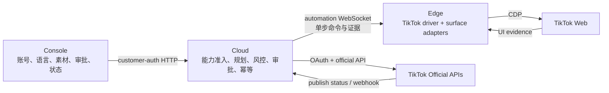

<!--
文档性质：TikTok 正式接入前的系统设计输入，不是实现方案、协议契约或上线承诺。
形成时间：2026-07-23。
事实来源：
1. docs/research/tiktok-web-and-douyin-comparison-2026-07-23.md
2. openspec/changes/tiktok-cdp-interaction-probes/
3. aidcp-edge TikTok 独立探针与 k1eu5amn 受控真机结果
4. 当前 AIDCP Facebook / XHS 平台 registry、浏览、发布、语言和风控实现
使用方式：后续正式接入必须另立跨 aidcp / aidcp-edge / aidcp-cloud / aidcp-console 的 OpenSpec change。
-->

# TikTok 系统设计输入（2026-07-23）

## 0. 一句话结论

TikTok 应作为独立平台接入，复用 AIDCP 已有的“边轻云重、能力显式声明、动作前后绑定、审批与风控、诚实状态”机制；网页选择器、surface、成功语义和官方授权必须保持 TikTok 专属。

首个生产切片建议只做：

1. TikTok 账号与运行时注册；
2. For You 浏览和结构化只读上报；
3. 默认 shadow 的互动评估；
4. Console 能看到账号、能力和真实运行状态。

评论、关注、收藏和官方发布分别后置，不把探针一次性扩成全平台执行器。私信、通知回复和直播暂不进入正式设计。

## 1. 文档定位

本文用于后续系统设计时快速回答：

- 哪些结论已经被 TikTok 真机或官方资料证明；
- 哪些机制可以从 Facebook / XHS 复用；
- 哪些部分必须做 TikTok 专属适配；
- 第一版最少需要哪些跨仓改动；
- 哪些未知项会阻断真实写入或发布；
- 后续应如何拆 OpenSpec，避免一次性设计过大。

本文不做：

- 不直接修改 `PlatformId`、协议、数据库或生产运行时；
- 不把研究探针视为生产 executor；
- 不预先定义完整消息中心、直播、私信或全量发布模型；
- 不承诺当前网页 selector 长期稳定；
- 不把 UI 变化描述为服务端成功。

## 2. 已证明事实与设计含义

| 事实 | 当前证据级别 | 对系统设计的含义 |
| --- | --- | --- |
| Chromium CDP 可控制 TikTok Web | 真机已验证 | Edge 可以继续承担网页观测与原子动作 |
| AdsPower profile 可精确绑定动态 CDP 端点 | 真机已验证 | 运行时必须绑定明确环境，不能按“存在 TikTok 标签页”猜 profile |
| For You 是虚拟列表，节点会复用 | 真机 + fixture | 动作前后重读稳定 video id；不能缓存 DOM node 或按序号操作 |
| 浏览可通过有界输入证明视频变化 | 真机已验证 | “事件已派发”不等于浏览成功；必须回传前后目标证据 |
| 一次点赞得到同视频 UI 状态变化 | UI 确认 | 可作为后续互动适配输入，不能宣称服务端持久化 |
| 评论可定位唯一编辑器并回读草稿 | 已填写未提交 | 只证明编辑器能力；生产评论仍需审批、语言、提交和回查设计 |
| TikTok Studio 可接收视频并进入编排器 | 已填写未提交 | 网页编排器可做研究/兜底观测，但不应成为官方发布权限缺失时的提交 fallback |
| For You、Following、个人主页结构不同 | 只读真机 | Edge 内部需要 surface-specific adapter，不能用一个全能 selector |
| 搜索、消息、通知、直播和音乐入口可见 | 只读真机 | 只证明入口存在，不证明页面可读、更不证明可写 |
| 关注、收藏、分享控件可唯一识别 | shadow；状态 unknown | 暂不能开放真实动作；先补正负状态 fixture 和后置验证 |
| 页面 UI locale 为越南语 | 只读真机 | UI 语言只用于定位；不得推导账号对外写作语言 |
| TikTok 有官方登录、资料和内容发布能力 | 官方资料清单 | 正式发布优先 Cloud 侧官方 API；实施前重新核对审核、scope 和账号权限 |

### 2.1 虚拟列表的设计约束

这里的“虚拟列表”不是普通长列表。页面会回收并复用少量 DOM 节点展示新视频，因此同一个按钮节点稍后可能已经属于另一条视频。

生产动作必须遵循：

```text
读取当前稳定 video id
        ↓
确认唯一目标和当前动作状态
        ↓
执行最多一次原子动作
        ↓
重新读取 video id 和动作状态
        ↓
同一目标且后置状态明确？
  ├─ 是：记录对应级别的证据
  └─ 否：ambiguous / no_change / blocked
```

这条约束同时适用于浏览、点赞、关注、收藏、评论和分享面板。

## 3. 从 Facebook / XHS 复用什么

### 3.1 直接复用的基础机制

| 现有机制 | TikTok 用法 |
| --- | --- |
| Edge `PlatformDriver` / registry | 增加独立 `tiktok` driver，并显式声明 runtime kind、host、能力和构建 capability |
| Cloud 平台 registry 全覆盖表态 | 每个逐帖动作、编排能力和委托动作明确 supported / unsupported + reason |
| `RoleDispatcher + EventBus` 浏览闭环 | Cloud 逐条决策，Edge 只执行一个 TikTok 原子动作并回传结构化证据 |
| `LocatingEngine` 的守卫、定位和后置校验 | 复用执行框架；TikTok 提供自己的页面结构、锚点和 validator |
| `EdgeTaskCoordinator` 单写租约 | 浏览、评论和发布不能同时写同一个 CDP 页面 |
| `RiskController` 单写 | TikTok 动作是否允许、预算和最终风险状态仍由 Cloud 决定 |
| 发布审批、幂等和状态链 | 沿用审核前不可提交、受理不等于公开、未知不盲重试 |
| Facebook `writing_language` 机制 | 复用“Cloud 配置与校验、Edge 原样执行”的边界，但 TikTok 支持哪些语言需另立契约 |
| 客户端 customer-auth HTTP 数据面 | 账号、配置、草稿、审批和状态由客户端按请求读取，不依赖浏览器或 WS 在线 |

### 3.2 只复用原则，不复用实现细节

- 不复用 XHS/Facebook selector、DOM path、按钮文本或 URL。
- 不把 TikTok `For You / Following / profile / video detail` 塞进 Cloud 的
  `Surface = feed | detail` 枚举；网页形态属于 TikTok Edge adapter 内部。
- 不把 XHS 的动作额度数字直接当 TikTok 默认值；沿用按动作分账和保守起步机制，数值需单独验证。
- 不把 Facebook 的帖子 ID、Reel、个人时间线或语言规则当 TikTok 成功证据。
- 不把 Douyin 的作品 ID、modal、直播或私信 selector 用于 TikTok。
- 不复用任何平台的“输入框清空即发送成功”判断。

### 3.3 Facebook / XHS 给出的具体教训

Facebook 的价值在于：

- 平台 driver 与执行器物理隔离；
- 能力声明必须与真实实现同时落地；
- 不支持能力显式返回 reason；
- 对外写作语言由 Cloud 权威配置，Edge 不临时翻译；
- UI 证据和平台确认分层。

XHS 的价值在于：

- 浏览策略、节奏、预算、审批和风险状态在 Cloud；
- 页面动作、拟人化和后置校验在 Edge；
- 发布采用原子命令序列，不把一整段网页流程作为黑盒；
- 提交已派发但结果未知时保持 `submitted/ambiguous`，不能自动重试。

## 4. 推荐的最小目标架构



边界保持简单：

- Cloud 决定“为什么做、做什么、能不能做、何时做、是否批准”。
- Edge 决定“当前页面是什么、目标是否唯一、如何执行一次、动作后发生了什么”。
- Console 展示和修改 AIDCP 自有数据，不依赖某个 TikTok 浏览器在线。
- 官方 token、发布状态和 webhook 留在 Cloud，不经 Edge 或 renderer 暴露。
- CDP 不作为官方 API 未获批时的最终发布回退。

## 5. 最小模块拆分

以下是职责边界，不是要求一次性创建全部文件。

### 5.1 Edge

第一版只需要：

1. `tiktok` browser driver：
   - 默认入口和允许域名；
   - 登录、挑战、访问限制和身份真态；
   - 构建级 capability 声明。
2. For You adapter：
   - 当前稳定 video id；
   - 可见内容摘要；
   - 有界浏览和变化证明；
   - 点赞等控件只做 shadow 观测。
3. TikTok post-validator：
   - 目标是否仍为同一视频；
   - 后置状态是明确、未知还是页面移动；
   - 不把事件派发当成功。

Following、profile、search 和 video detail 可以共享小型工具函数，但各自保留结构入口；只有出现第二个真实消费者时再抽公共接口。

第一版不需要：

- 通用 TikTok 页面 DSL；
- 跨平台统一 selector 描述语言；
- TikTok 私信/通知/直播 sidecar；
- 生产评论、关注、收藏、分享和网页发布 executor。

### 5.2 Cloud

第一版只需要：

1. registry 增加 TikTok，并对所有现有能力显式表态；
2. 只在 Edge 声明匹配 capability 时启动 TikTok 浏览角色；
3. 复用现有会话预算、节奏、去重和 `RiskController`；
4. 只向 TikTok Edge 下发已实现且已协商的动作；
5. 把 Edge 回传的 UI 证据映射为诚实活动记录。

暂不需要：

- TikTok 专属多 Agent 角色树；
- 新的通用社交平台编排器；
- TikTok 私信 durable inbox；
- 为每个网页 surface 新增协议消息类型。

### 5.3 Console

第一版只增加用户能理解且有真消费者的字段：

- 平台为 TikTok 的账号/环境；
- 登录、浏览器和 capability 真态；
- 浏览是否启用；
- 对外写作语言是否已配置；
- 暂未支持能力的明确原因。

没有生产评论或发布能力时，不提前展示可点击控件。

## 6. 能力切片与准入门

### Slice A：平台注册 + For You 只读浏览

范围：

- `PlatformId = tiktok`；
- Edge driver、For You adapter、登录/挑战识别；
- Cloud registry 和浏览闭环；
- Console 环境与状态；
- 只记录已验证浏览，不执行写动作。

进入实现前必须确认：

- canonical video id 在目标网页版本可稳定读取；
- background `readyState` 不被当作 hydration；
- Edge 构建 capability 与 Cloud registry 同步；
- 非 TikTok 页面和账号身份不明确时 fail closed。

### Slice B：单次互动

按动作独立立项，顺序建议：

1. 点赞；
2. 关注；
3. 收藏；
4. 评论。

每个动作都必须单独具备：

- Cloud 能力准入和独立预算；
- Edge 精确目标绑定；
- 正负状态 fixture；
- 单向且最多一次执行；
- 同一 video id 后置校验；
- `ui_confirmed / ambiguous / blocked` 的诚实映射；
- 真机逐项授权。

评论额外要求：

- 账号 `writing_language` 已配置且属于 TikTok 支持枚举；
- Cloud 从生成开始使用该语言并在审核前检查；
- 人工批准的正文原样下发；
- Edge 不翻译、不改写；
- 目标视频和编辑器唯一；
- 未证明服务端结果时不得自动重发。

### Slice C：官方发布

正式发布单独立项，优先使用 TikTok 官方能力：

- Login Kit / OAuth；
- creator info 与当前可用发布设置；
- Upload draft 或 Direct Post；
- 用户本次批准；
- `publish_id` 状态轮询或 webhook；
- 最终公开 `post_id` 回查。

复用现有发布编排、审批、幂等、`execution_target` 和状态展示；不要直接把 XHS
`PublishCommandKind` 网页步骤扩展成 TikTok 官方 API 步骤。API 调用是 Cloud 执行通道，
网页编排器只保留研究或人工辅助用途。

### 暂不设计：消息、通知回复和直播

当前只证明入口存在。进入设计前至少要先只读证明：

- 私聊与群聊可区分；
- 最近消息方向明确；
- 会话、消息、评论和直播间有稳定外部标识；
- 普通聊天与定向回复是不同能力；
- 查看页面是否会改变未读状态；
- 回复语言、精确文本和单次授权齐备。

这些条件未满足前，不创建发送协议、任务表或 Console 开关。

## 7. 最小数据与状态边界

优先复用现有数据面，不预先创建平行系统：

| 数据 | 建议归属 | 说明 |
| --- | --- | --- |
| TikTok 账号与平台 | 现有 account/environment | 增加平台枚举后走已有租户和环境边界 |
| 对外写作语言 | 现有 persona/soul | TikTok 是否支持现有枚举需另立 OpenSpec |
| 浏览与互动计数 | 现有 RiskController / interaction ledger | 按动作分账，Cloud 单写最终风险状态 |
| 浏览活动展示 | 现有活动/概览数据面 | 只展示已确认事实，不展示假 0 或假成功 |
| 发布草稿与审批 | 现有 publish lifecycle | 官方 API 通道也要复用版本、审批和幂等 |
| OAuth/token | Cloud 加密凭据边界 | 不进入 WS、Edge、日志或 Console renderer |
| `publish_id` / `post_id` | 现有发布记录能容纳则复用 | 只有真实缺口出现时才新增字段或表 |

状态原则：

- `accepted`、`dispatched`、`ui_confirmed`、`published` 不能互相替代；
- HTTP 受理或文件上传不等于公开；
- UI 状态变化不等于服务端持久化；
- 写动作派发后结果未知时保持 ambiguous，不自动重试；
- 所有 durable 异步任务固定 `execution_target=dev|ol`，本地 worker 只处理自己的 target。

本文不新增统一 TikTok 状态枚举。正式 change 应先映射到已有浏览、互动和发布状态；
只有已有模型无法诚实表达时才增加新状态。

## 8. 协议设计原则

第一版尽量复用现有 v2 语义：

- 浏览上报继续使用结构化卡片/详情和动作结果；
- 点赞、关注、收藏、评论沿用已有逐帖动作词，但由 registry 与 capability 控制；
- payload 里的目标标识必须由 Edge 当前页面重新派生，不能抄 Cloud 命令假装命中；
- 新 capability 必须在 Edge 类型、Cloud 类型、命令映射、active routing 和
  `docs/protocol.md` 同步；
- 未协商 capability 时保持关闭；
- 不为 Following、profile、search 等 Edge 内部网页形态增加消息类型，除非 Cloud
  出现真实的独立编排需求。

官方发布不应伪装成浏览器 `publish.command`。后续设计可以复用发布任务与审批状态，
但 API executor、token 和 webhook 都属于 Cloud。

## 9. 语言与内容安全

必须区分三个概念：

| 概念 | 作用 | 不允许的推断 |
| --- | --- | --- |
| `uiLocale` | 选择器词表和页面诊断 | 不能决定对外回复语言 |
| `writing_language` | 账号公开写作语言 | 不能由单条入站消息自动覆盖 |
| 入站内容语言 | 理解用户语义 | 不能要求 Edge 临时翻译批准后的文本 |

建议沿用 Facebook 的边界：

1. Cloud 权威保存账号写作语言；
2. 生成、重写和审核检查使用同一语言；
3. 缺配置、非法或检查不通过时拒绝写入；
4. 已批准正文原样下发；
5. Edge 只验证目标和执行，不改正文；
6. 不内置“好的”“ok”等默认回复。

## 10. 失败语义与安全红线

必须显式保留：

- `not_tiktok`
- `login_required`
- `challenge`
- `access_restricted`
- `target_missing`
- `ambiguous`
- `no_change`
- `ui_confirmed`
- `submitted_unknown` 或现有等价状态
- `published` 仅来自平台可回查证据

安全红线：

- 不绕过验证码、实名、地区或账号限制；
- 不缓存虚拟列表 DOM node；
- 不选择“第一个看起来像”的目标；
- 不把按钮颜色、计数或编辑器清空作为唯一成功证据；
- 不把官方 API 权限失败回退成网页最终提交；
- 不批量点赞、关注、收藏、评论或私信；
- 不记录 cookie、token、联系人、消息正文或完整测试文案；
- `unknown` 不得改写成 `success`。

## 11. 正式设计前的决策清单

建议只要求产品和工程回答以下问题：

1. 第一版是否只做 For You 浏览，还是同时允许一次点赞？
2. TikTok 账号允许哪些 `writing_language` 枚举？
3. TikTok 风控额度从哪组保守值开始，何时允许放量？
4. 官方开发者应用、scope、审核和 OAuth redirect 当前是否具备？
5. 发布第一版选择 Upload draft 还是 Direct Post？
6. Console 第一版需要展示哪些能力，哪些明确显示“暂不支持”？

暂时不要要求决策：

- 私信/通知/直播完整产品形态；
- 通用跨平台 surface DSL；
- 通用社交动作协议重构；
- 所有 TikTok 网页发布设置；
- 尚未出现真实消费者的数据表。

## 12. 建议的 OpenSpec 拆分

保持三条独立 change，避免互相绑死：

1. `tiktok-platform-browse-v1`
   - 平台注册、For You 浏览、Cloud registry、风控、Console 状态。
2. `tiktok-write-interactions-v1`
   - 逐项加入点赞、关注、收藏、评论；每项可单独删减。
3. `tiktok-official-publishing-v1`
   - OAuth、官方 API、审批、幂等、状态回查和发布展示。

消息、通知回复和直播只有在只读研究完成后再决定是否立项，不预占上述三个 change。

## 13. 验收阶梯

每个生产切片至少按以下顺序：

1. fixture：页面正负样本、歧义和阻断；
2. Edge 聚焦测试与 typecheck；
3. Cloud registry / protocol acceptance；
4. 默认 shadow 的指定环境真机；
5. 明确单次授权的受控写入；
6. 同目标后置证据；
7. 客户端真实状态展示；
8. dev 部署与运行日志验证；
9. OL 另行明确授权。

任一级失败都停在当前层，不用下一层“补证明”上一层。

## 14. 关联资料

- 调研与 Douyin 对照：
  [`docs/research/tiktok-web-and-douyin-comparison-2026-07-23.md`](../research/tiktok-web-and-douyin-comparison-2026-07-23.md)
- 探针 OpenSpec：
  [`openspec/changes/tiktok-cdp-interaction-probes/`](../../openspec/changes/tiktok-cdp-interaction-probes/)
- AIDCP 架构：
  [`docs/architecture.md`](../architecture.md)
- 边云协议：
  [`docs/protocol.md`](../protocol.md)
- 风控模型：
  [`docs/risk-control.md`](../risk-control.md)
- TikTok Edge 研究模块：
  `aidcp-edge/src/tiktok/probes/`

进入正式 OpenSpec 前，应重新核对 TikTok 官方资料和默认分支代码；本文的页面证据只代表
2026-07-23 指定环境和当时网页版本。
