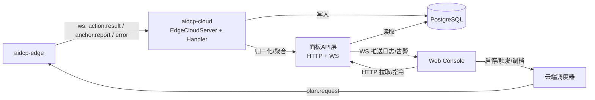

# AIDCP 多账号管理面板与状态监控

> 适用范围：运营团队（1–5 人）管理 3–10 个小红书账号的**统一 Web 控制台**。
> 面板是人对系统的主入口；轻量交互与告警走飞书（见
> [飞书交互设计](product-feishu.md)），重操作与全量数据看板留在 Web。
>
> 配套文档：[架构](architecture.md)、[边-云协议](protocol.md)、
> [风控模型](risk-control.md)、[任务编排体验](product-task.md)、
> [异常处理体验](product-exception.md)。
>
> 设计基线：与现有"边轻云重"一致——**面板只读云端聚合状态、下发指令到云端调度器**，
> 绝不直接与边缘（aidcp-edge）通信；所有边缘数据经云端 WebSocket（见 protocol.md）
> 汇聚后由云端 HTTP/WS API 暴露给面板。

---

## 1. 信息架构

```
AIDCP Console
├── Dashboard 首页            # 全局总览：今日数据 + 账号状态 + 告警
├── 账号管理 Accounts
│   ├── 账号列表（分组视图）
│   ├── 账号详情
│   │   ├── 基本信息 / 登录态
│   │   ├── 设备绑定（edgeId ↔ account）
│   │   ├── 人设配置（Soul Persona）
│   │   └── 风控状态与档位（联动 risk-control.md §7）
│   └── 分组管理
├── 运行监控 Monitor
│   ├── 实时日志流（按账号 / 全局）
│   ├── 操作时间线（action.result 流）
│   └── 互动记录（点赞/收藏/评论/关注/浏览）
├── 内容管理 Content
│   ├── 发布队列（pending → 审核 → 已发布）
│   ├── 已发布历史
│   └── 待审核内容（审批入口，联动 product-task.md §6）
├── 数据分析 Analytics
│   ├── 涨粉趋势
│   ├── 互动率 / 点赞率区间监控
│   └── 内容表现对比
└── 设置 Settings
    ├── 用户与权限
    ├── 飞书集成（群绑定 / Bot）
    └── 全局策略默认值（三档：保守/正常/激进）
```

层级关系：`Dashboard` 是聚合视图，下钻到具体账号即进入 `账号详情`；账号详情中的
"运行/内容/数据"区块分别是 `Monitor / Content / Analytics` 在单账号维度的切片。
顶层导航始终保留**全局账号筛选器**（全部 / 分组 / 单账号），所有页面共享该筛选状态。

---

## 2. 核心页面定义

### 2.1 Dashboard 首页

目标：5 秒内回答"今天系统健康吗、哪个账号需要我立刻处理"。

三个区块：

1. **今日数据汇总卡**（全账号聚合）
   - 在线账号数 / 总账号数；今日总浏览、点赞、收藏、评论、关注、发布数；
   - 今日运行会话数、活跃边缘节点数（edgeId 在线数）；
   - 聚合点赞率（点赞/浏览，对照 risk-control.md §1.1 的 15%–35% 健康区间，超区间标黄）。

2. **账号状态一览**（每账号一行的紧凑表）
   - 状态徽标：`normal`/`warned`/`restricted`/`frozen`（对应 risk-control.md §7）；
   - 当前档位（保守/正常/激进）、账号年龄（冷启动进度 Day n/7）、今日配额用量进度条。

3. **告警列表**（按严重度倒序）
   - 来源于异常处理体系（product-exception.md §1 的 P0–P3）；
   - 每条含：严重度、账号、类型、触发时间、状态（待处理/处理中/已恢复）、跳转按钮。

核心数据结构（面板从云端 `GET /api/dashboard/summary` 拉取）：

```jsonc
{
  "asOf": 1717113600000,
  "totals": { "accountsOnline": 6, "accountsTotal": 8,
              "view": 920, "like": 240, "collect": 88, "comment": 22,
              "follow": 31, "publish": 3, "sessions": 19, "edgesOnline": 4 },
  "ratios": { "likeRate": 0.26, "healthy": true },          // 对照 risk-control §1.1
  "accounts": [
    { "accountId": "acc-01", "nickname": "小张测评", "groupId": "g-beauty",
      "edgeId": "edge-03", "riskState": "normal", "tier": "normal",
      "ageDays": 12, "coldStartDay": null,
      "todayQuota": { "like": {"used": 38, "limit": 50} } }
  ],
  "alerts": [
    { "alertId": "al-9", "severity": "P1", "accountId": "acc-02",
      "type": "captcha_popup", "ts": 1717112000000, "status": "pending" }
  ]
}
```

### 2.2 账号管理 Accounts

支持添加/编辑账号、绑定设备、配置人设、分组。

**添加/编辑账号字段**：

```jsonc
{
  "accountId": "acc-01",
  "nickname": "小张测评",
  "xhsUserId": "5f...e2",            // 小红书用户 id（首次登录后回填）
  "groupId": "g-beauty",
  "vertical": "美妆个护",             // 人设垂类，约束浏览/搜索主题（risk-control §4.3/§5.2）
  "edgeId": "edge-03",              // 绑定的边缘节点（一机一号，见 anti-detection §2.2）
  "tier": "normal",                // 默认档位
  "createdAt": 1716000000000,      // 用于计算账号年龄 → 冷启动档位映射（risk-control §5）
  "personaRef": "persona-zhang"    // Soul 人设编排引用（云端）
}
```

**绑定设备（edgeId ↔ account）**：列出当前在线边缘节点（来自 protocol.md `hello`
握手声明的 `edgeId`/`capabilities`），一个账号绑定唯一边缘节点，呼应反检测
"一机一号"原则。未绑定的账号不可启动任务。

**人设配置（Soul Persona）**：编辑昵称口吻、兴趣垂类、评论风格、发布文案风格；
该配置由云端 Soul 编排消费，影响 `plan.request` 的目标语义与发布内容生成。

**风控状态与档位**：只读展示 `RiskController`（risk-control.md §8 建议落点）维护的
当前状态机状态、档位、最近降级原因；提供"申请提档/手动降级"入口（提档需满足
risk-control.md §5.3 的判据，由后端校验）。

**分组**：按垂类或负责人分组，分组是飞书消息归属（product-feishu.md §5）与批量任务
（product-task.md §5）的基本单位。

### 2.3 运行监控 Monitor

**实时日志流**：通过 WebSocket 订阅云端转发的边缘事件。云端把 protocol.md 中
`action.result`、`anchor.report`、`error` 等消息归一化为面板事件流：

```jsonc
{ "ts": 1717113601000, "accountId": "acc-01", "edgeId": "edge-03",
  "kind": "action.result",
  "actionId": "note.like_button", "op": "click",
  "outcome": "success",                 // success | escalated | no_target | guard_blocked
  "attempts": 1, "reason": "cache_hit_validated" }
```

**操作时间线**：把 `action.result` 流按账号、按会话渲染成时间线，标注定位流水线各阶段与三道闸结果
（定位阶段：缓存命中/LLM 选择；三道闸：后置校验/重试上限升级/反污染回写），便于定位"为什么这步失败"。

**互动记录**：结构化展示去重后的互动（note_id 维度，对照 risk-control.md §4.1），
字段：`accountId / noteId / action(like|collect|comment|follow|view) / ts / sessionId`。

### 2.4 内容管理 Content

> 统一审批对象模型引用：本节中的待审核内容、发布审批与高风险确认统一复用 `./design-gaps-and-models.md` 定义的审批对象模型，Dashboard 与飞书共享同一审批对象与回写接口。

- Dashboard 只展示审批对象当前状态、超时状态与处理结果，不单独定义另一套审批状态机。
- Web 审批与飞书审批调用同一回写接口，统一遵循审批对象的超时策略、默认动作与幂等规则。
- 审批对象的权威状态存于云端审批服务，面板读取聚合结果并触发后续任务联动。

**发布队列**：状态流转 `draft → reviewing → approved → publishing → published / rejected`
（与 product-task.md §3 发布任务、§6 审批粒度对齐）。

```jsonc
{
  "contentId": "c-101", "accountId": "acc-01",
  "title": "...", "body": "...", "images": ["..."],
  "topics": ["#测评"], "status": "reviewing",
  "similarity": { "maxJaccard": 0.42, "passed": true },   // risk-control §4.2 相似度自检
  "scheduledAt": 1717200000000,
  "approval": { "required": true, "approverChannel": "feishu",
                "approvedBy": null, "approvedAt": null }    // 审批可走飞书（product-feishu §4）
}
```

**已发布历史**：`published` 列表 + 平台回执（笔记 URL、发布时间），并回流数据分析。

**待审核内容**：审批入口；审批可在 Web 直接操作，也可由飞书审批卡片回写
（product-feishu.md §3）。两端共享同一审批状态。

### 2.5 数据分析 Analytics

> 效果指标字典引用：本节指标统一引用 `./design-gaps-and-models.md` 中的效果指标字典，按**过程指标 / 效果指标 / 健康指标**三类归口；Dashboard 负责展示与筛选，不在此重复定义指标字典。

- 过程指标用于观察执行量、会话量、发布量与任务推进情况。
- 效果指标用于观察涨粉、互动、内容表现与转化结果。
- 健康指标用于观察点赞率、收藏率、关注率、质量指数及风控相关阈值。
- 指标公式、归因粒度、采集频率与冲突解释以 `./design-gaps-and-models.md` 为准。

- **涨粉趋势**：按账号/分组的粉丝数时间序列（每日采样）。
- **互动率 / 点赞率监控**：把 risk-control.md §1.1 的健康区间（点赞率 15%–35%、
  收藏率 < 点赞率、关注率 < 5%）画成带阈值带的折线，越界高亮——这同时是风控
  预警的可视化。
- **内容表现对比**：每篇笔记的阅读量/点赞/收藏/评论；并计算 risk-control.md §0.1
  的"质量指数"= 浏览时长 ÷ 近期发布数量，辅助判断营销号风险。

数据结构（时间序列点）：

```jsonc
{ "accountId": "acc-01", "date": "2026-05-30",
  "followers": 1240, "deltaFollowers": 18,
  "view": 150, "like": 39, "collect": 8, "comment": 4, "follow": 5,
  "likeRate": 0.26, "qualityIndex": 0.83 }
```

---

## 3. 技术选型建议

| 维度 | 建议 | 理由 |
| --- | --- | --- |
| 前端框架 | React + Vite + TypeScript | 与现有 TS 技术栈一致，生态成熟 |
| UI 组件 | Ant Design（表格/表单密集型后台） | 多账号表格、审批流、状态徽标开箱即用 |
| 图表 | ECharts / Recharts | 阈值带、时间序列、对比图 |
| 实时通道 | 浏览器 ↔ 云端 **WebSocket**（复用云端 ws 基建） | 日志流/告警推送；与边-云 ws 物理隔离，逻辑复用 |
| 状态管理 | TanStack Query（服务端状态）+ 轻量 store | 拉取型数据为主 |
| 部署 | 与 aidcp-cloud 同机/同网，Nginx 反代静态资源 + `/api` 代理 | 内网工具，无需公网 CDN |
| 鉴权 | 云端签发 JWT，按用户/分组做数据权限 | 1–5 人小团队，RBAC 可后置 |

> 部署形态：面板是 aidcp-cloud 的一个前端子项目，**不引入新后端**——所有数据来自
> 云端新增的 HTTP/WS 聚合 API（见 §4）。

---

## 4. 与现有 cloud API 的集成点

面板**不直接**接触边-云 WebSocket 协议（protocol.md）；云端在现有
`EdgeCloudServer` / `DefaultMessageHandler` 之上新增**面板 API 层**，做"边缘事件 →
聚合视图"的转换。

| 面板能力 | 云端落点（建议） | 数据来源 |
| --- | --- | --- |
| Dashboard 汇总 / 账号状态 | 新增 `RiskController` 状态查询 + 计数器读取 | risk-control.md §8（频率计数器/状态机在云端） |
| 实时日志流 / 操作时间线 | 复用 `DefaultMessageHandler` 收到的 `action.result`/`anchor.report`，广播到面板 ws | protocol.md §3.5 / §3.4 |
| 设备绑定 | 读取 `hello` 握手登记的 edgeId 在线表 | protocol.md §3.1 |
| 任务下发（启停/触发/调档） | 调用云端调度器（product-task.md），由其下发 `plan.request` 给边缘 | protocol.md §3.2 |
| 发布审核 | 写发布队列状态；审批联动飞书 | product-feishu.md §3 |
| 数据分析 | 云端定时采集粉丝/互动指标入 PG（复用 PgAnchorCache 同库） | architecture.md §2.2 |
| 告警 | 订阅异常事件总线（P0–P3） | product-exception.md §1 |

数据流（面板视角）：



---

## 5. 渐进式实现（MVP → 完整版）

| 阶段 | 范围 |
| --- | --- |
| **MVP** | Dashboard 汇总卡 + 账号状态一览（只读）；账号管理（增删改 + 设备绑定）；实时日志流（单一全局流） |
| **V1** | 运行监控时间线/互动记录；风控状态可视化与手动调档；发布队列（含相似度自检展示） |
| **V2** | 数据分析（涨粉/互动率阈值带/内容对比）；待审核审批与飞书联动；分组化批量入口 |
| **V3** | 权限/RBAC、操作审计、告警规则自定义、回放分析入口（product-exception.md §6） |

> 一致性约束：面板的状态徽标、档位、告警分级**必须**与 risk-control.md §7、
> product-exception.md §1 使用同一套枚举值，避免三处文档/实现各说各话。
