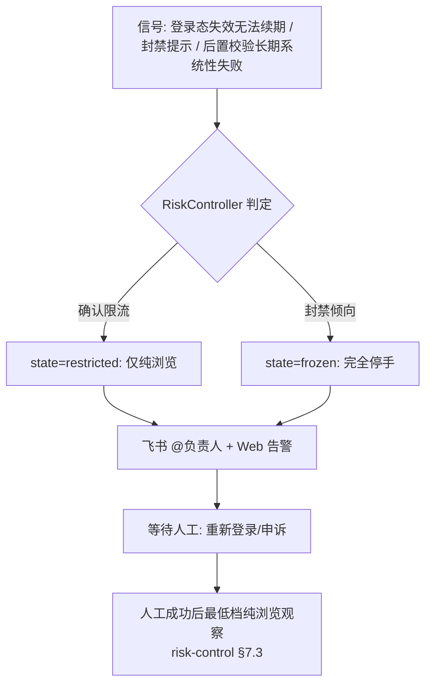
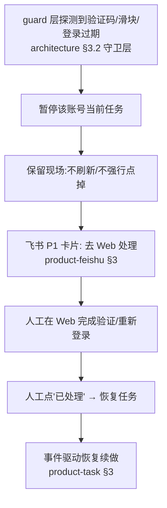
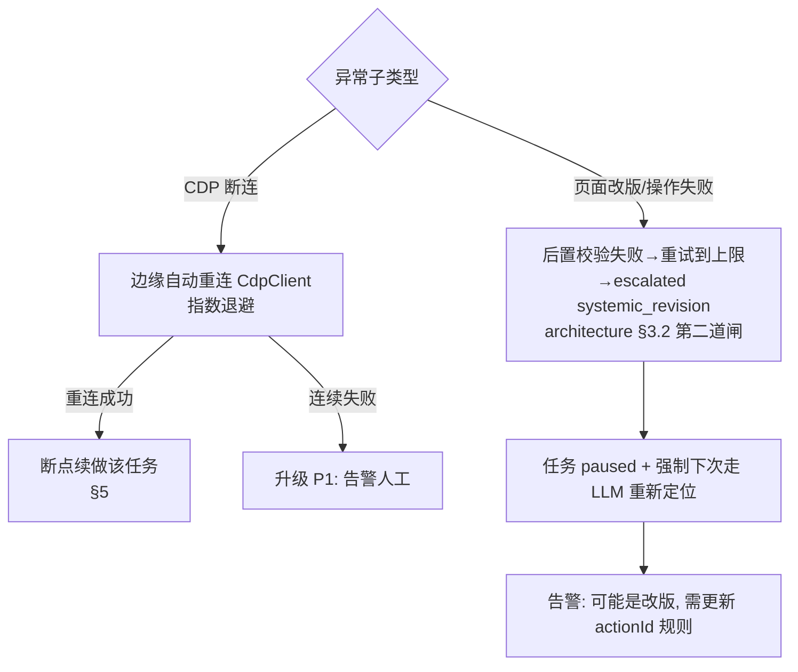
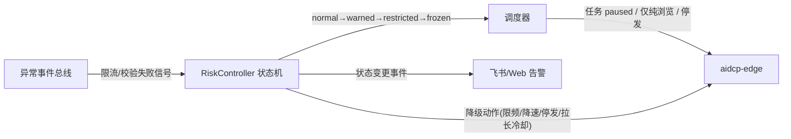
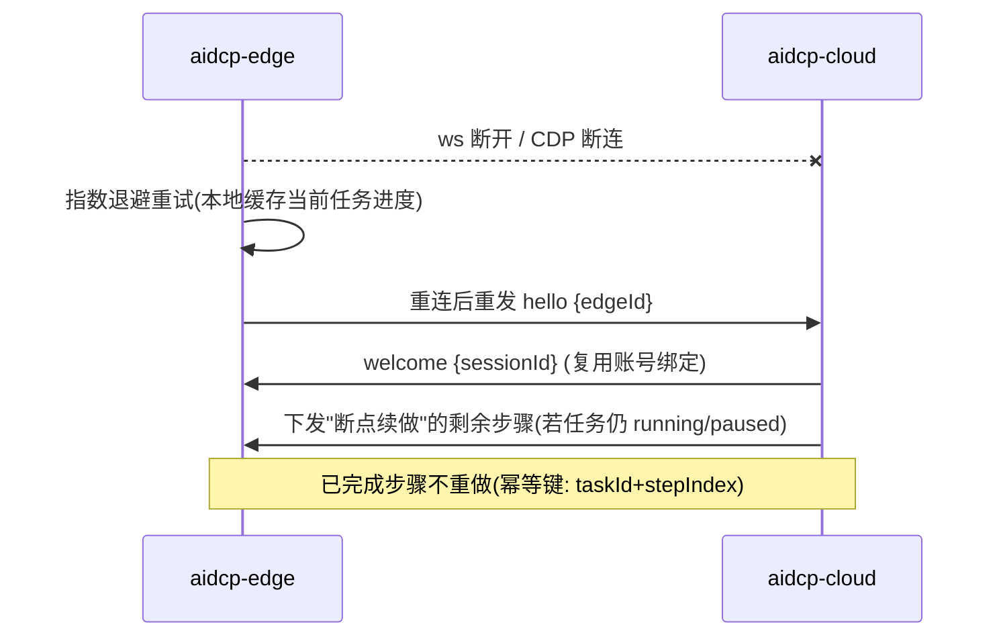
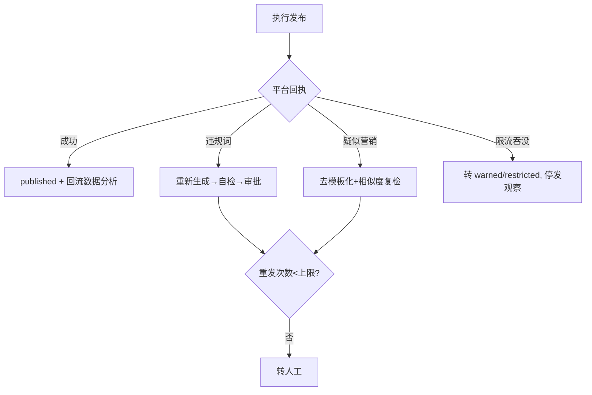
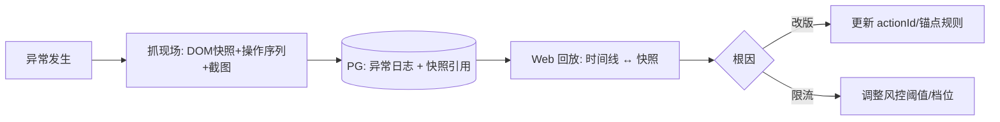

# AIDCP 异常处理体验

> **文档性质：产品设计参考。** 本文描述异常分级和人工处置目标，不证明所有分支已经接线；
> 当前错误语义、风控迁移和用户可见状态以 OpenSpec、代码及真实运行证据为准。
>
> 适用范围：AIDCP 在运行中遇到各类异常时，**系统如何自动恢复、何时拉人介入、
> 怎么通知、怎么确认恢复、怎么复盘**。异常处理是自动化能"长期无人值守存活"的底座。
>
> 配套文档：[架构](architecture.md)、[边-云协议](protocol.md)、
> [风控模型](risk-control.md)、[多账号管理面板](product-dashboard.md)、
> [飞书交互设计](product-feishu.md)、[任务编排体验](product-task.md)。
>
> 设计基线：异常事件**统一汇聚到云端事件总线**，由它驱动三件事——自动恢复（调度器/
> 风控）、通知（飞书/Web）、状态变更（任务 paused、风控降级）。异常的"信号源"复用
> 现有 LocatingEngine 的后置校验/重试升级（architecture.md §3.2 三道闸），**不另起一套
> 检测**，只做归类、分级与编排。

---

## 1. 异常分类（严重度 P0–P3）

> 统一事件模型引用：本文异常对象统一映射到 `./design-gaps-and-models.md` 定义的事件模型；异常系统负责产出事件、分级与处置建议，不直接写账号最终风控状态。

> **⚠️ 已知缺口（2026-08-04 复核）：这套 P0–P3 阶梯今天只服务「基础设施告警」，没有下探到「动作结果」这一层。**
> 浏览 / 评论 / 加群 / 发布那条链上的失败回执是一串**平铺的原因名**，不带严重度、不带「瞬态还是结构性」，
> 云端只把它翻成人话卡片——**没有任何一层在用它决定「这一趟该不该继续」**。于是本表里
> 「P3 瞬时抖动，自动重试即可」这一档，在动作层实际上是**不存在**的：一次水合竞态与一次真正做不到，
> 走同一个出口、得到同一个终局。修这一层的判据（三分「动手 / 回报 / 继续」+ 结构性判据）见
> [`stop-or-continue.md`](stop-or-continue.md)；**MUST NOT 把本节读成「动作失败已经按 P0–P3 分级处置」。**

- 异常分级与统一事件 `severity` 使用同一套枚举：`P0 / P1 / P2 / P3`。
- 涉及账号风控的异常，最终状态迁移仍由云端 `RiskController` 单写；异常系统只提交事件并触发通知、暂停、审批等联动。
- 事件记录应保留统一事件的主体、来源、时间、幂等键与处置结果，便于后续复盘与去重。

| 级别 | 含义 | 典型异常 | 默认动作 | 主要通知 |
| --- | --- | --- | --- | --- |
| **P0** | 账号级不可逆/高损失 | 账号被封、确认限流（`restricted/frozen`） | 立即停手该账号、风控降级、告警人工 | 飞书 @负责人 + 短信兜底 |
| **P1** | 需尽快人工介入才能继续 | 验证码/滑块弹出、登录态过期 | 暂停相关任务、保留现场、等人处理 | 飞书 P1 卡片（product-feishu.md §2.4） |
| **P2** | 系统性失败，可自动重连/重试但需关注 | CDP 断连、页面改版导致操作失败（`systemic_revision`） | 自动重连/升级、必要时暂停任务 | 飞书 P2 通知 + Web 告警 |
| **P3** | 瞬时抖动，自动重试即可 | 网络抖动、临时超时、偶发弹窗 | 自动重试/守卫清除，静默恢复 | 仅 Web 日志（不打扰） |

> 分级与 risk-control.md §7 状态机对齐：`warned` 多为 P1/P2 触发的预警，`restricted`/
> `frozen` 即 P0；与 product-dashboard.md §2.1 告警列表、product-feishu.md §2.4 实时通知
> 使用同一套 P0–P3 枚举。

异常分级与统一事件 `severity` 的映射关系如下：本文中的 P0–P3 即统一事件模型中的 `severity` 值；若后续在任务、风控、飞书或 Dashboard 中消费异常事件，应直接复用该枚举，不再派生“高/中/低”或其他平行等级。

异常事件结构（事件总线统一格式）：

```jsonc
{
  "eventId": "ev-501", "ts": 1717113601000,
  "severity": "P1", "type": "captcha_popup",
  "accountId": "acc-02", "edgeId": "edge-04", "taskId": "task-1001",
  "source": "post_validate",          // post_validate | retry_escalated | cdp | ws | platform
  "detail": { "actionId": "note.like_button", "attempts": 3,
              "escalation": "systemic_revision" },   // 来自 protocol.md action.result
  "snapshotRef": "snap/ev-501.html"   // 现场快照引用(§6)
}
```

---

## 2. 各类异常的处理流程

### 2.1 P0：账号被封 / 确认限流



- 自动策略：**立即停**该账号的互动/发布任务（product-task.md 任务转 `paused`），
  按 risk-control.md §7.4 执行降级（限频/降速/停发/拉长冷却）。
- 人工介入：P0 **必须**人工（重新登录/申诉），系统不自行解冻。
- 恢复确认：人工处理后，先以最低档纯浏览观察，满足 §7.3 回迁条件才逐步升档。

### 2.2 P1：验证码 / 滑块 / 登录态过期



- 验证码/滑块**不可由系统自动绕过**（绕过本身是强机器信号，违背 anti-detection 原则），
  系统只负责"识别 + 暂停 + 通知 + 等人"。
- 登录态过期优先尝试静默续期（anti-detection 登录态维持方案）；续期失败才升级 P1。

### 2.3 P2：CDP 断连 / 页面改版



- 页面改版表现为"后置校验连续失败 → `escalated(systemic_revision)`"
  （protocol.md `action.result`）。系统区分"改版"与"限流"靠跨账号相关性：
  **单账号失败**偏改版，**多账号同 actionId 同时失败**偏全局改版，**伴随阅读量
  断崖下跌**则偏限流（交给 risk-control.md §7.2 联合判断）。

### 2.4 P3：网络抖动 / 临时超时

- 由边缘守卫层（清除偶现弹窗/遮罩）+ 重试机制（architecture.md §3.2 第二道闸内）
  静默处理；不打扰人，仅落 Web 日志。
- 仅当 P3 在短窗口内**高频重复**（如 5 分钟内 > N 次）才升级为 P2，防止抖动掩盖
  真实系统性故障。

---

## 3. 自动恢复 / 人工介入 / 通知 / 恢复确认（横向对照）

| 级别 | 自动恢复策略 | 人工介入触发 | 通知方式 | 恢复确认机制 |
| --- | --- | --- | --- | --- |
| P0 | 仅降级保护（不自愈） | 强制（封禁/限流确认即触发） | 飞书 @负责人 + 短信 | 人工申诉/重登 → 最低档观察 → §7.3 回迁 |
| P1 | 登录态先试续期 | 续期失败/验证码出现即触发 | 飞书 P1 卡片 + Web | 人工"已处理"按钮 → 事件驱动续做 |
| P2 | 重连(指数退避)/重试升级/换 LLM 定位 | 重连连续失败或改版确认 | 飞书 P2 + Web 告警 | 重连成功自动续做；改版需更新规则后恢复 |
| P3 | 守卫清除 + 重试 | 仅高频聚集时升级 | Web 日志 | 自动，无需确认 |

通知路由细节见 product-feishu.md §4（多账号消息归属）；P0 的短信/电话兜底通道在
`groupId.p0Channels` 配置。

---

## 4. 风控告警与自动降级（联动 risk-control.md）

补充约束：本节中的告警升级、自动降级与恢复确认，统一由 `./design-gaps-and-models.md` 的事件模型驱动。异常系统可以建议 `warned / restricted / frozen` 的目标状态，但账号最终状态仍由云端 `RiskController` 判定并写入。

异常体系与风控状态机是**同一信号的两个视角**：异常体系看"单次/单类故障"，风控
状态机看"账号长期健康趋势"。两者通过事件总线打通：



- **自动降级是即时的、不依赖人工发现**（risk-control.md §7.4）——这是异常体系对风控
  最重要的贡献：把"故障信号"实时喂给状态机。
- 降级动作的具体数值（×0.7 限频、`μ`×1.3 降速、停发、冷却翻倍）以 risk-control.md
  §7.4 为权威，本文不重复定义，只负责"在异常发生时触发它"。
- 降级确认：P0/P1 级降级**先自动执行、事后飞书告知**；P2/P3 模糊场景推确认卡片
  （product-feishu.md §2.3、product-task.md §6）。

---

## 5. 掉线恢复机制（边缘重连 + 会话断点续做）

边缘（aidcp-edge）与云端是长连接 WebSocket（protocol.md），任一环节断开都需可恢复。

**边缘重连**：



**会话断点续做**：

- 任务进度（已完成到第几个 PlanStep、已浏览/互动计数）由**云端持久化**（PG），不依赖
  边缘内存——边缘可随时重启。
- 恢复时，调度器结合当前风控预算（risk-control.md §1.4 滑动窗口计数器不丢）决定
  续做还是延后（任务 `deferred`，product-task.md §5）。
- 已互动去重集合（risk-control.md §4.1，持久化）保证**重启后不会把昨天赞过的再赞一遍**。
- 幂等：每个 PlanStep 以 `taskId + stepIndex` 为幂等键，重连续做不会重复执行同一步。

---

## 6. 审核失败处理（发布被小红书拒绝）

发布任务（product-task.md §2.2）执行后，平台可能拒绝（违规词/限流/疑似营销）：

| 拒绝原因 | 处理策略 |
| --- | --- |
| 含违规/敏感词 | 标记内容 `rejected`，回流 Soul/Qwen **重新生成**并再次相似度自检（risk-control.md §4.2），重新进审批 |
| 疑似营销/模板化 | 触发相似度复检 + 文案结构去模板化；连续被拒 → 升级风控信号（→ `warned`） |
| 限流期发布被吞 | 视为风控信号，账号转 `warned/restricted`，**停发**并观察（risk-control.md §7） |
| 配图/格式问题 | 退回 Web 人工修正（product-dashboard.md §2.4 待审核） |

策略要点：发布失败**不无脑重发**——连续重发是营销号强信号。重发前必须先判定原因，
违规则改内容，限流则停发观察。重发次数设上限，超限转人工。



---

## 7. 异常日志与复盘（保留现场 + 回放分析）

目标：每个 P0/P1/P2 异常都能"事后还原现场、定位根因、沉淀规则"。

**保留现场**：异常触发时，边缘抓取并上报：
- 当前页面 DOM 快照（`outerHTML`，复用 `CdpDomProvider` 取快照能力，architecture.md §4）；
- 触发该异常的 `actionId`、操作序列、最近 N 条 `action.result`；
- 截图（可选，P0/P1 才存，控制存储）；
- 引用存入事件结构的 `snapshotRef`（§1）。

**异常日志**：结构化落 PG，字段含 severity/type/account/edge/task/source/detail/snapshotRef，
保留期 P0/P1 ≥ 90 天，P2/P3 ≥ 14 天。

**回放分析**：
- Web 端"回放"入口（product-dashboard.md §5 V3），按 taskId/eventId 重放操作时间线 +
  对应 DOM 快照，定位"哪一步、为什么失败"；
- 改版类（P2）复盘后可沉淀为新的 `actionId` 规则或锚点，回流锚点缓存
  （anchor 反污染晋升，architecture.md §3.3），让同类故障自愈率提升；
- 限流类（P0/P1）复盘回流到风控阈值调整（risk-control.md §6 数值建议）。



---

## 8. 渐进式实现（MVP → 完整版）

| 阶段 | 范围 |
| --- | --- |
| **MVP** | P0–P3 分级 + 事件总线；P3 自动重试、P2 CDP 自动重连；P0/P1 飞书告警；任务自动 paused |
| **V1** | 风控自动降级联动（异常信号 → 状态机）；登录态续期；会话断点续做（幂等续做） |
| **V2** | 验证码/登录过期 P1 全流程（暂停-通知-人工-恢复确认）；发布拒绝分原因处理；短信兜底 |
| **V3** | 现场快照 + Web 回放分析；改版自愈（回流锚点）；异常聚合统计与阈值自调 |

> 一致性约束：本文的 P0–P3 分级、`paused`/恢复语义、降级动作，必须与
> risk-control.md §7（状态机/降级数值，权威）、product-task.md §5（任务状态机）、
> product-feishu.md §2.4/§4（通知与归属）、product-dashboard.md §2.1（告警列表）
> 保持同一套枚举与语义。本文负责"异常如何被发现、恢复、复盘"，
> 不重复定义风控数值与任务流转细节。
