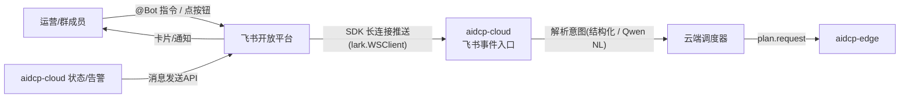

# AIDCP 飞书交互设计

> **文档性质：产品设计参考。** 本文保留目标交互与部分历史实现说明，不能作为当前命令、
> 卡片或审批状态的权威清单；当前行为以 OpenSpec、`aidcp-cloud/src/feishu/` 和目标环境
> 实际回执为准。
>
> 适用范围：运营团队（1–5 人）通过**飞书**完成 AIDCP 的日常巡检、轻量操作与审批。
> 飞书是"随身遥控器 + 告警入口"，Web 控制台（[多账号管理面板](product-dashboard.md)）
> 是"作战指挥中心"。两者共享同一份云端状态，**任何一端的操作都即时反映到另一端**。
>
> 配套文档：[架构](architecture.md)、[边-云协议](protocol.md)、
> [风控模型](risk-control.md)、[任务编排体验](product-task.md)、
> [异常处理体验](product-exception.md)。
>
> 设计基线：飞书 Bot **只与 aidcp-cloud 对话**，绝不直连边缘；所有指令最终由云端
> 转成对边缘的协议指令（`plan.request` 或角色驱动指令，见 protocol.md），与面板走同一条指令通路。
>
> **实现状态（2026-06）**：飞书 Bot 已从设计走向**部分实装**——`aidcp-cloud/src/feishu/`：
> 官方 SDK 长连接收事件、`/status` `/pause` `/resume` `/publish-test` `/bind` 命令路由、机器人进退群自动入库
> （`bot_chats` 表，`migrations/0002_bot_chats.sql`）、`/bind` 设默认群、发布审批卡片构建 +
> 卡片回调写信号文件 `/tmp/aidcp-publish-approve-<requestId>.json`。**仍待实装**：完整审批状态机、
> 多账号消息归属、通知聚合。下文能力表中标"规划中"的条目若与上述重叠，以本框为准。

---

## 1. 飞书 Bot 能力边界（飞书 vs Web）

原则：**高频/低风险/碎片化** 的操作走飞书；**重配置/全量数据/复杂编排** 留在 Web。

| 操作 | 飞书 | Web | 说明 |
| --- | --- | --- | --- |
| 查看今日汇总 / 账号状态 | ✅ | ✅ | 飞书发卡片，Web 看大盘 |
| 接收告警（P0–P3） | ✅ 主入口 | ✅ | 异常通知第一时间到飞书（product-exception.md §1） |
| 启停某账号 / 某任务 | ✅ | ✅ | 高频遥控 |
| 手动触发一次发布 / 浏览任务 | ✅ | ✅ | 见 product-task.md §3.2 |
| 调整策略档位（保守/正常/激进） | ✅（受限：仅降档可即时，升档需 Web 复核） | ✅ | 升档涉及风控判据，需 Web 确认（risk-control.md §5.3） |
| 发布内容审批 | ✅ 卡片审批 | ✅ | 双端共享审批状态 |
| 风控降级确认 | ✅ | ✅ | product-exception.md §5 |
| 输入验证码 / 滑块 | ❌ 必须 Web | ✅ | 涉及页面交互，飞书只通知"去处理"（P1，见 §3.4） |
| 账号添加 / 设备绑定 / 人设配置 | ❌ | ✅ | 重配置（product-dashboard.md §2.2） |
| 编辑发布文案正文 | ❌（仅审批通过/驳回） | ✅ | 长文本编辑不适合 IM |
| 数据分析 / 趋势图 | ❌（仅摘要数字） | ✅ | 图表在 Web |
| 任务编排 / Campaign 配置 | ❌ | ✅ | 复杂依赖（product-task.md §7） |

> 一句话边界：**飞书能"看 + 一键决策"，但凡需要"打字编辑/页面操作"的都引导到 Web。**

---

## 2. 消息类型设计

四大类消息，覆盖"系统→人"的通知与"人→系统"的指令。

### 2.1 状态报告卡片（系统 → 人）

- **每日汇总**：每天活跃时段结束后（如次日 09:00）推送昨日全账号汇总：浏览/点赞/
  收藏/评论/关注/发布总数、点赞率是否健康（risk-control.md §1.1）、各账号状态徽标、
  涨粉数。对应 product-dashboard.md §2.1 的数据结构。
- **异常告警**：见 §2.4 实时通知。

### 2.2 操作指令（人 → 系统）

启停账号、手动触发发布/浏览、调整策略档位。两种触发方式：点卡片按钮，或发指令文本
（§6 指令语法）。指令由 Bot 解析后调云端调度器，结果以"指令回执卡片"回复。

### 2.3 审批流（人 → 系统，带状态机）

> 统一审批对象模型引用：飞书审批卡片统一复用 `./design-gaps-and-models.md` 中定义的审批对象模型；飞书是审批入口之一，不是独立审批系统。

- Web 与飞书展示和处理的是同一个审批对象，审批最终状态统一回写到云端审批服务。
- 飞书卡片回调与 Web 操作调用同一回写接口，保持审批状态、超时状态与审计记录一致。
- 超时策略、默认动作与升级规则由统一审批对象定义，飞书侧只负责展示剩余时效与处理结果。
- 幂等规则统一按审批对象标识与决策幂等键去重，避免重复点击、重复回调造成多次审批。

- **发布内容审核**：发布任务进入 `reviewing` 时，把待发内容（标题/正文摘要/配图/
  相似度自检结果）推成审批卡片，审批人点【通过】/【驳回】，回写发布队列
  （product-dashboard.md §2.4、product-task.md §6）。
- **风控降级确认**：当系统建议对某账号降级（如 `warned`，risk-control.md §7.4）时，
  推确认卡片：【确认降级】/【保持并人工观察】。P0/P1 级降级可设为"先自动执行、
  事后告知"，仅 P2/P3 模糊场景才走人工确认（与 product-exception.md §1/§5 对齐）。

审批卡片状态：当前实装仅 `pending → approved | cancelled`（`cards.ts` 的 `PublishApprovalTerminalState = 'approved' | 'cancelled'`，【驳回】按钮 action 暂落到 `cancelled`）。⚠️ 这是相对统一审批对象模型的**已知实装缺口**，并非稳态设计：按 `./design-gaps-and-models.md` §2.3，驳回的稳态终态应为 `rejected`（`cancelled` 仅表"业务对象已失效/被撤销"，语义不同），`rejected`/`expired` 状态机待补齐后与统一模型对齐（见本文头部实现状态框"完整审批状态机 仍待实装"）。超时未审默认按安全侧处理：发布默认不发、降级默认执行。

### 2.4 实时通知（系统 → 人，需尽快响应）

| 通知 | 严重度 | 文案要点 | 引导动作 |
| --- | --- | --- | --- |
| 验证码 / 滑块弹出 | P1 | 哪个账号、出现时间 | 【去 Web 处理】跳转链接 |
| 账号异常（被限流/封禁倾向） | P0/P1 | 账号、风控状态变化、最近信号 | 【确认降级】/【查看详情】 |
| 登录态过期 | P1 | 账号、需重新登录 | 【去 Web 处理】 |
| 任务完成 / 失败 | P2/P3 | 任务名、账号、结果 | 【查看时间线】 |
| 边缘掉线 / 重连 | P2 | edgeId、影响账号 | 【查看监控】 |

> 通知来源即 product-exception.md §1 的异常分级；飞书是 P0/P1 的**首选触达通道**，
> P0 可叠加电话/短信兜底（§7）。

---

## 3. 消息卡片模板（飞书 Interactive Card JSON 示意）

以下为飞书 `interactive` 消息卡片结构示意，按飞书开放平台 `card` 规范裁剪。

**每日汇总卡片**：

```jsonc
{
  "config": { "wide_screen_mode": true },
  "header": { "template": "blue",
    "title": { "tag": "plain_text", "content": "AIDCP 昨日汇总 · 2026-05-30" } },
  "elements": [
    { "tag": "div", "fields": [
      { "is_short": true, "text": { "tag": "lark_md", "content": "**在线账号**\n6 / 8" } },
      { "is_short": true, "text": { "tag": "lark_md", "content": "**总浏览**\n920" } },
      { "is_short": true, "text": { "tag": "lark_md", "content": "**点赞率**\n26% ✅" } },
      { "is_short": true, "text": { "tag": "lark_md", "content": "**今日发布**\n3" } }
    ]},
    { "tag": "hr" },
    { "tag": "div", "text": { "tag": "lark_md",
      "content": "🟢 normal × 6　🟡 warned × 1　🔴 restricted × 1" } },
    { "tag": "action", "actions": [
      { "tag": "button", "text": { "tag": "plain_text", "content": "查看大盘" },
        "type": "primary", "url": "https://console.aidcp.local/dashboard" }
    ]}
  ]
}
```

**发布审批卡片**（带按钮回调，实装回调 `behaviors[].value` 携带 `action`+`requestId`+内容 payload）：

```jsonc
{
  "header": { "template": "orange",
    "title": { "tag": "plain_text", "content": "待审核发布 · 小张测评(acc-01)" } },
  "elements": [
    { "tag": "div", "text": { "tag": "lark_md",
      "content": "**标题**：xxx\n**摘要**：xxxxxx…\n**相似度自检**：0.42 ✅（阈值 0.7）" } },
    { "tag": "img", "img_key": "img_v2_xxx", "alt": { "tag": "plain_text", "content": "配图" } },
    { "tag": "action", "actions": [
      { "tag": "button", "text": { "tag": "plain_text", "content": "通过并发布" },
        "type": "primary",
        "behaviors": [ { "type": "callback", "value": { "action": "approve", "requestId": "req-xxx", "payload": { "title": "…", "content": "…", "tags": ["…"] } } } ] }, // 实装回调形状
      { "tag": "button", "text": { "tag": "plain_text", "content": "驳回" },
        "type": "danger",
        "behaviors": [ { "type": "callback", "value": { "action": "cancel", "requestId": "req-xxx", "payload": { "title": "…", "content": "…", "tags": ["…"] } } } ] }, // 驳回走 cancel（同样携带 payload）
      { "tag": "button", "text": { "tag": "plain_text", "content": "去 Web 编辑" },
        "url": "https://console.aidcp.local/content/c-101" }
    ]}
  ]
}
```

**P1 验证码通知卡片**：

```jsonc
{
  "header": { "template": "red",
    "title": { "tag": "plain_text", "content": "⚠️ P1 验证码弹出 · acc-02" } },
  "elements": [
    { "tag": "div", "text": { "tag": "lark_md",
      "content": "账号 **小李美食(acc-02)** 在 14:12 触发验证码，任务已自动暂停。\n请尽快在 Web 端完成验证后恢复。" } },
    { "tag": "action", "actions": [
      { "tag": "button", "text": { "tag": "plain_text", "content": "去处理" },
        "type": "primary", "url": "https://console.aidcp.local/accounts/acc-02" }
    ]}
  ]
}
```

> 按钮 `value` 是云端识别意图的载体；按钮 `url` 是引导回 Web 的逃生口。所有携带
> `value` 的回调统一进入 §7 的事件回调入口。

---

## 4. 多账号消息归属

问题：8 个账号的消息不能全堆在一个群里刷屏，也不能让无关的人收到不该看的账号。

归属模型（以 product-dashboard.md §2.2 的"分组"为基本单位）：

| 维度 | 路由策略 |
| --- | --- |
| 群 ↔ 分组 | 每个**账号分组**绑定一个飞书群（如"美妆组"群）；该组账号的汇总/告警发到对应群 |
| 私聊 ↔ 负责人 | 每个账号可配"负责人"；P0/P1 告警同时**私聊**负责人 @提醒 |
| 全局播报 | 跨账号系统级事件（云端宕机、边缘批量掉线）发到"运维总群" |
| 审批指派 | 发布审批卡片发到分组群，并 @该账号审批人；超时升级 @组长 |

绑定配置（Web 端 Settings → 飞书集成，product-dashboard.md §1 信息架构）：

```jsonc
{
  "groupId": "g-beauty",
  "feishuChatId": "oc_xxx",            // 飞书群 chat_id
  "approvers": ["ou_user_a"],          // open_id 列表
  "owners": { "acc-01": "ou_user_a", "acc-02": "ou_user_b" },
  "escalateTo": "ou_leader",           // 超时/未响应升级对象
  "p0Channels": ["feishu", "sms"]      // P0 叠加触达（product-exception.md §7）
}
```

每条外发消息携带 `accountId` 与 `groupId`，Bot 据此查路由表决定发往哪个 chat、@谁。

---

## 5. 指令语法设计（自然语言 vs 结构化命令）

**双轨**：结构化命令保证确定性，自然语言降低门槛；自然语言先归一到结构化命令再执行。

**结构化命令**（直接使用短命令，确定性高，适合脚本化/熟练用户）：

```
/pause acc-01                  # 暂停账号
/resume acc-01
/status acc-01                 # 查单账号状态卡片
/status group:g-beauty         # 查分组
/tier acc-01 conservative      # 调档：conservative|normal|aggressive（升档需 Web 复核）
/run acc-01 task:browse        # 手动触发浏览任务（product-task.md §3.1）
/publish 工程师大白             # 按昵称手动触发该账号发帖（进审批）
/pause group:g-beauty          # 批量：对一组账号同一指令（product-task.md §5）
```

**自然语言**（@Bot 后口语化，Bot 用云端 Qwen（architecture.md §2.2 QwenClient）做意图解析）：

```
"把美妆组都先停一下"        → /pause group:g-beauty
"acc-02 降到保守档"          → /tier acc-02 conservative
"小张那个账号现在怎么样"      → /status acc-01
```

安全约束：
- 自然语言解析出的指令，**回显一张确认卡片**（"将执行：暂停 美妆组(5 个账号)，确认？"），
  点确认才执行——防止口语歧义造成误操作；
- 高风险指令（升档、批量发布、解除冻结）**强制**走确认卡片，不接受一句话直执行；
- 无法确定意图时，Bot 返回候选命令让用户选，而不是猜。

---

## 6. 与飞书开放平台的集成方案

补充约束：飞书集成层只负责消息投递、卡片交互与身份映射；审批对象结构、状态机、回写语义与超时策略统一引用 `./design-gaps-and-models.md`，避免在飞书侧复制一套审批定义。



| 集成点 | 飞书能力 | aidcp-cloud 落点 |
| --- | --- | --- |
| 接收指令/按钮回调 | **事件订阅**（消息事件 `im.message.receive_v1`、卡片回调 `card.action.trigger`、机器人进退群 `im.chat.member.bot.added_v1`/`deleted_v1`） | 飞书事件入口走官方 SDK 长连接（`lark.WSClient`，无公网 IP / 无 webhook），SDK 内部处理握手与幂等后转调度器 |
| 主动发消息/卡片 | **消息发送 API**（`im/v1/messages`，`receive_id_type=chat_id/open_id`） | 告警/汇总/审批由云端事件总线驱动发送 |
| 富文本卡片 | Interactive Card（§3） | 卡片模板集中维护，填充业务数据 |
| 鉴权 | tenant_access_token（自建应用） | 云端缓存并自动续期 token |
| 身份映射 | open_id ↔ AIDCP 用户 | 在 Settings 绑定（§4） |

实现要点：
- **幂等**：飞书回调可能重试——长连接事件去重由 SDK 按 `event_id` 内置保证（无需自维护 SeenSet）；发布审批回调按 `requestId` first-writer-wins 去重（信号文件以 `O_EXCL` 写入，见头部实现状态与 §3），避免重复点击/重试造成多次发布；
- **异步回执**：指令受理后先回"已收到"，执行完再更新卡片状态（飞书支持卡片更新）；
- **最小权限**：应用仅申请 IM 收发与群信息读取权限。

---

## 7. 渐进式实现（MVP → 完整版）

| 阶段 | 范围 |
| --- | --- |
| **MVP** | 单向告警：P0/P1 异常 + 每日汇总卡片推送到一个群；结构化命令 `pause/resume/status` |
| **V1** | 发布审批卡片（通过/驳回回写）；指令回执卡片；多群按分组路由 + 负责人私聊 |
| **V2** | 自然语言意图解析（接 Qwen）+ 确认卡片；风控降级确认流；批量指令 |
| **V3** | P0 短信/电话兜底；审批超时升级；卡片内更多遥控（手动触发各类任务） |

> 一致性约束：飞书侧使用的账号状态、档位、异常严重度枚举，与
> risk-control.md §7、product-dashboard.md §2.1、product-exception.md §1 **完全一致**；
> 飞书与 Web 的审批/降级状态读写同一份云端数据，杜绝两端不一致。
