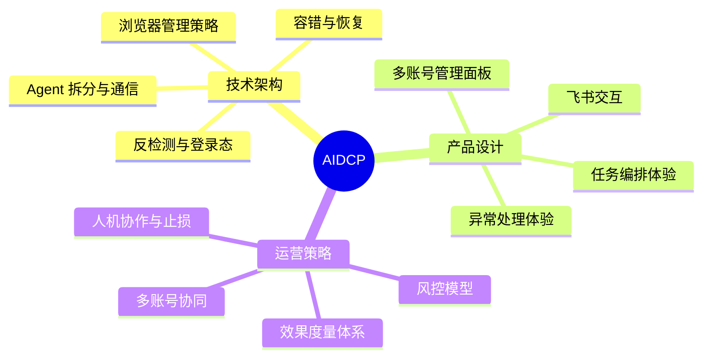
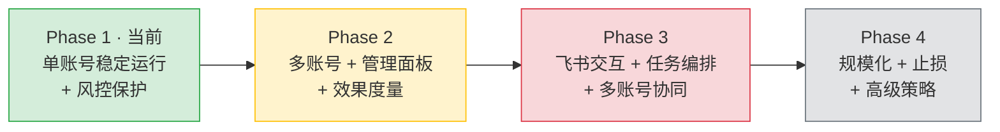
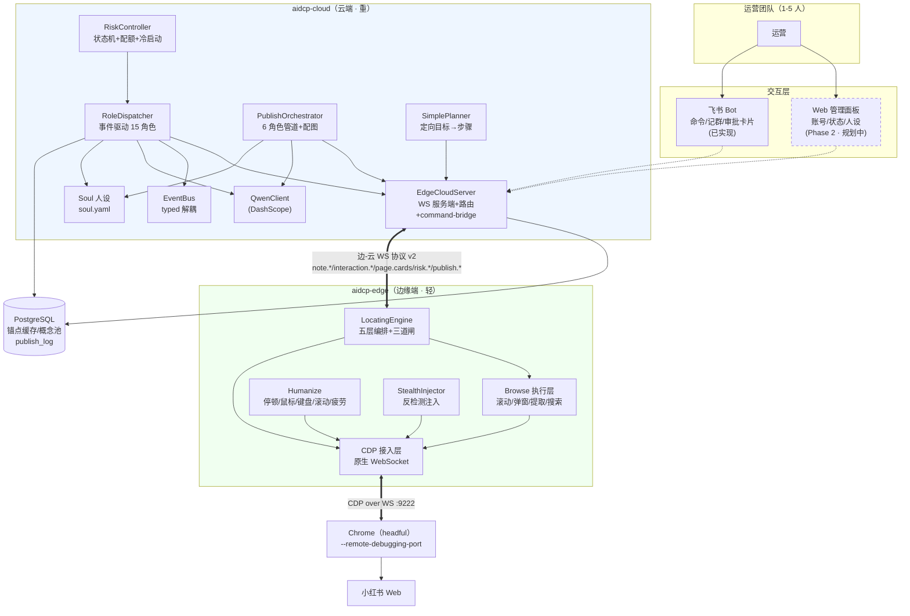

# AIDCP 产品功能全景

> **本文定位**：AIDCP 的**顶层产品全景图**，是所有子设计文档的入口与索引。
> 读完本文你应能一句话回答：**产品做什么、有哪些模块、各模块现在什么状态、未来怎么演进**。
> 细节下钻请走第 6 节[文档索引](#6-文档索引)。

---

## 1. 产品定位与目标

### 一句话描述

**AIDCP 是一套面向小红书的 AI 自动化运营工具**：让 1–5 人的小运营团队，像管理一个真人
矩阵一样，安全、可控地运营 3–10 个小红书账号——AI 负责"刷、看、判断、互动、发布"，
人只负责"定策略、审关键动作、看效果"。

### 目标用户画像

| 维度 | 画像 |
| --- | --- |
| 团队规模 | 1–5 人的运营小组（非大型 MCN，无专职反爬团队） |
| 账号规模 | 3–10 个小红书账号（矩阵号 / 不同人设 / 不同梯队） |
| 痛点 | 人工刷号养号枯燥耗时；纯脚本太机械易封号；多账号难统一管理 |
| 诉求 | 账号**长期存活**优先于短期效率；少量人盯多个号；关键动作可控可审 |

### 核心价值主张：为什么用 AI 而非纯脚本

| 能力 | 纯脚本 | AIDCP（AI 驱动） |
| --- | --- | --- |
| **页面适配** | 选择器写死，改版即崩 | DOM-first 语义锚点 + LLM 兜底选元素，自愈不自残 |
| **内容判断** | 无法判断"这条值不值得互动" | Qwen 按人设（Soul）做互动决策、概念抽取 |
| **内容生产** | 模板填空，一眼营销号 | LLM 按人设生成 + 相似度去重，规避模板化 |
| **拟人化** | 固定 sleep，行为分布规整 | 对数正态停顿 + 贝塞尔鼠标 + 疲劳曲线，统计上像真人 |
| **决策闭环** | 写死流程 | 状态机 + 概念池驱动"自然刷"，越刷越懂账号兴趣 |

> **一句话**：纯脚本解决"能点"，AIDCP 解决"像人在点、且点得对"。

### 与竞品差异

| 对比项 | 传统群控 | Playwright 方案 | **AIDCP** |
| --- | --- | --- | --- |
| 操作粒度 | 坐标/截图点击 | 选择器点击 | **DOM 语义锚点 + 后置校验** |
| 改版抗性 | 极差（坐标飘） | 差（选择器失效） | **强（语义锚点 + LLM 自愈）** |
| 反检测 | 改机/真机，成本高 | 自带自动化特征，易被识别 | **CDP 原生 + stealth 注入 + 拟人化** |
| 防自残 | 无（静默点错） | 弱 | **三道闸：后置校验 / 重试升级 / 反污染** |
| 智能程度 | 纯执行 | 纯执行 | **AI 决策 + 人设驱动 + 概念演化** |
| 适用规模 | 几十上百号 | 单/少账号 | **3–10 号精细化矩阵** |

---

## 2. 功能模块全景（3 大类 12 项）

### 技术架构（4 项）

1. **浏览器管理策略** — 单机多实例 vs 分布式浏览器池；多账号的 profile / 端口 / 指纹隔离。
2. **反检测与登录态维持** — stealth 注入、指纹一致性、住宅代理、Cookie/Session 持久化。
3. **容错与恢复机制** — CDP 断连重连、验证码/滑块、页面改版自愈、会话崩溃恢复。
4. **Agent 拆分与通信方式** — 边/云各 Agent 职责边界、WebSocket 协议、命令调度。

### 产品设计（4 项）

5. **多账号管理面板与状态监控** — 账号分组、状态一览、人设（Soul）配置与下发。
6. **飞书交互设计** — 消息卡片、审批流、多账号消息归属与通知聚合。
7. **任务编排体验** — 指令下达、批量操作、审批粒度（哪些动作需人工确认）。
8. **异常处理体验** — 掉线恢复提示、风控告警、内容审核失败的人工接管。

### 运营策略（4 项）

9. **风控模型** — 频率限制、作息时间窗、内容去重、冷启动养号、风控状态机。
10. **效果度量体系** — 过程指标（操作量）、效果指标（涨粉/互动）、健康指标（存活/限流）。
11. **多账号协同与差异化定位** — 矩阵号互动策略、账号梯队、差异化人设。
12. **人机协作比例与止损机制** — 自动化程度分级、冻结规则、效果归因。

---

## 3. 各模块当前完成状态

### 统一状态口径

本节统一引用 `./design-gaps-and-models.md` 中定义的双维状态标注法，避免把产品实现状态与文档成熟度混写在同一列。

- 实现状态仅使用 `implemented / designed / planned`，用于描述能力是否已落地。
- 文档成熟度仅使用 `draft / complete / authoritative`，用于描述文档是否可作为实现依据。
- 原表中的“编写中”统一视为文档成熟度，不再作为实现状态使用。
- 若某能力同时包含已实现与未实现子项，则在实现状态中按能力项拆分说明，不再用单一“部分完成”覆盖全部语义。

> 图例：实现状态=`implemented / designed / planned`；文档成熟度=`draft / complete / authoritative`。
> 路径说明：边缘端代码在 `aidcp-edge/`，云端代码在 `aidcp-cloud/`，文档在本仓 `docs/`。

### 3.1 技术架构

| # | 模块 | 实现状态 | 文档成熟度 | 已实现 / 文档与代码位置 | 缺口 |
| --- | --- | --- | --- | --- | --- |
| 1 | 浏览器管理策略 | `implemented` | `complete` | 单机多实例已跑（多份 `edge*.log` / `cloud*.log` 为多实例运行痕迹）；`aidcp-edge/src/cdp/chrome-launcher.ts` 负责按参数拉起 Chrome | 分布式浏览器池、profile×指纹×IP 三元绑定的编排未做 |
| 2 | 反检测与登录态 | `implemented`（stealth/拟人化）+ `designed`（代理/持久化/防泄露） | `complete` | **stealth 注入已实现**：`aidcp-edge/src/cdp/stealth-injector.ts`（webdriver 抹除 / toString 伪装 / plugins / 权限对齐 / console.debug）；设计见 `docs/anti-detection.md` | Cookie/Session 持久化、住宅代理接入、WebRTC/DNS 防泄露、指纹画像表 未做 |
| 3 | 容错与恢复机制 | `implemented`（三道闸）+ `designed`（恢复闭环） | `complete` | LocatingEngine **三道闸**已实现（`aidcp-edge/src/locating/engine.ts`）：后置校验 / 重试升级 / 反污染；守卫层清干扰（`guard.ts`） | CDP 断连自动重连、验证码/滑块识别、会话级 crash recovery 未做 |
| 4 | Agent 拆分与通信 | `implemented` | `authoritative` | edge/cloud 双层 WS 架构已实现；协议 v2（41 消息类型）`aidcp-cloud/src/comm/protocol.ts` + `docs/protocol.md`；云端已重构为**事件驱动多 Agent**（`RoleDispatcher` + 15 角色 + `EventBus` + `command-bridge`），边缘 `LocatingEngine`/`BrowseSession` 与之协作 | — |

### 3.2 产品设计

| # | 模块 | 实现状态 | 文档成熟度 | 已实现 / 文档与代码位置 | 缺口 |
| --- | --- | --- | --- | --- | --- |
| 5 | 多账号管理面板 | `planned` | `complete` | 人设配置基础已有（`aidcp-cloud/src/soul/`，`soul.yaml` 可装载） | Web 管理面板、账号分组、状态一览、可视化全未做（设计见 `docs/product-dashboard.md`） |
| 6 | 飞书交互设计 | `implemented`（命令/记群/审批卡片）+ `designed`（完整审批闭环/归属） | `complete` | **已实现**：官方 SDK 长连接、`/status //pause //resume //bind` 命令路由、进退群自动入库、发布审批卡片 + 回调写信号文件（`aidcp-cloud/src/feishu/`） | 多账号消息归属、完整审批状态机、通知聚合待续（设计见 `docs/product-feishu.md`） |
| 7 | 任务编排体验 | `implemented`（编排内核）+ `designed`（运营交互层） | `complete` | 后端编排内核已有：`aidcp-cloud/src/orchestrator/role-dispatcher.ts`（事件驱动 15 角色）+ `src/agents/`；CLI 触发 `src/cli/trigger-like.ts`、`src/cli/trigger-publish-temp.ts` | 面向运营的指令下达 UI、批量操作、审批粒度未做（设计见 `docs/product-task.md`） |
| 8 | 异常处理体验 | `designed` | `complete` | 底层信号已有（后置校验失败 / 升级 `systemic_revision`） | 面向人的掉线恢复/告警/接管体验未做（设计见 `docs/product-exception.md`） |

### 3.3 运营策略

| # | 模块 | 实现状态 | 文档成熟度 | 已实现 / 文档与代码位置 | 缺口 |
| --- | --- | --- | --- | --- | --- |
| 9 | 风控模型 | `implemented`（拟人化执行层 + 控制器/状态机） | `complete` | **设计完整**：`docs/risk-control.md`。**拟人化执行层已实现**：`aidcp-edge/src/humanize/`。**风控控制器已实现**：`aidcp-cloud/src/risk/`——`RiskController` + 状态机 `normal→warned→restricted→frozen`（恢复窗口 warned 7d/restricted 3d）+ 滑窗计数（分/时/日）+ 三档配额 + 冷启动 + 时间窗调度 + 会话预算 + 互动去重 + PG 持久化 | 状态迁移目前主要由配额触发；接入真实平台封号/限流信号（confirmed/fatal）驱动待补 |
| 10 | 效果度量体系 | `planned` | `designed` | `action.result` 上报通道已有（可作为过程指标数据源）；发布落库 `migrations/0001_publish_log.sql` | 过程/效果/健康三类指标的采集、聚合、看板全未做；统一口径引用 `./design-gaps-and-models.md` 的效果指标字典 |
| 11 | 多账号协同与差异化 | `implemented`（单账号人设）+ `planned`（跨号协同） | `draft` | 单账号人设（Soul）已实现，多套 soul 可并存；概念池存储类已具备（`cache/concept-store.ts` 含 PG schema/持久化代码），但当前尚未接入运行链路（`ConceptStore` 未实例化，`concept.discovered` 仅在 `event-bus/types.ts` 声明、暂无角色发射），事件驱动产出待接通 | 矩阵号互动策略、账号梯队、跨号协同调度未做 |
| 12 | 人机协作与止损 | `planned` | `draft` | — | 自动化分级、冻结规则、效果归因全未做（依赖风控状态机 #9 与面板 #5） |

补充口径：运营侧指标统一引用 `./design-gaps-and-models.md` 中的效果指标字典，按**过程指标 / 效果指标 / 健康指标**三类归口。本文只保留路线图层面的能力判断，不在此重复定义指标公式、归因规则与采集频率。

### 3.4 已交付的核心执行能力（横切多模块）

以下为已经**端到端跑通**的能力，构成 Phase 1 的实质内容：

- ✅ **浏览执行层**：feed 滚动 + 弹窗控制 + 内容提取 + 搜索 + 卡片过滤 + 自动浏览循环
  （`aidcp-edge/src/browse/`：`feed-scroller` / `modal-controller` / `note-extractor` / `search-handler` / `card-filter` / `browse-session`）。
- ✅ **事件驱动互动决策 + Qwen**：`RoleDispatcher` 调度 15 角色，`ContentCuratorRole` 质量关卡 +
  `InteractionAppraiserRole` 点赞/收藏决策（`aidcp-cloud/src/agents/`），点赞执行 `aidcp-edge/src/client/like-runner.ts`。
- ✅ **风控控制器**：`RiskController` 状态机 + 滑窗配额 + 冷启动 + 会话预算（`aidcp-cloud/src/risk/`）。
- ✅ **Publish Agent（6 角色管道）**：scout→creator→director→assembler→gatekeeper→executor + 万象配图 + 落库
  （`aidcp-cloud/src/publish-agent/`），边缘发布六步 `aidcp-edge/src/flows/publish-post.ts` + 审批信号 `src/publish/approval-gate.ts`。
- ✅ **飞书 Bot**：长连接 + 命令路由 + 自动记群 + 审批卡片信号（`aidcp-cloud/src/feishu/`）。
- ✅ **Soul 人设**：`soul.yaml` + 强类型装载（`soul/loader.ts`），驱动各角色人格化决策。
- ✅ **Electron 桌面打包**：系统托盘 + Chrome 网关 + 控制面板 UI（`aidcp-edge/src/electron/`）。

> **重要校正（2026-06 更新）**：早期此处写"风控状态机仍只有设计文档"——该判断已过时。
> 当前**行为拟人化层（`humanize/`）与风控控制器（`risk/` 的 `RiskController` + 状态机 + 配额 + 冷启动）均已实装**。
> 即"怎么做才像人"与"做多少、什么时候停"在代码层都已落地；剩余缺口是让风控状态迁移由**真实平台信号**
> （封号/限流/限流回执）驱动，而不仅是配额阈值触发。

---

## 4. 实现路线图

### Phase 1（当前）：单账号稳定运行 + 风控保护

**目标**：一个账号能长期、安全、自然地刷/赞/收/发，不被风控标记。

- ✅ 边/云 WS 架构（协议 v2）、DOM-first 定位三道闸、浏览执行层、事件驱动 15 角色编排、Qwen 决策、Publish Agent、Soul。
- ✅ stealth 注入 + 拟人化执行层（humanize）。
- ✅ **风控控制器已实装**：`RiskController` 频率计数器 + 档位 + 状态机（`risk/`，对应 `risk-control.md §1/§6/§7`）。
- ✅ 飞书 Bot（命令/记群/审批卡片）、Electron 桌面打包。
- ⚠️ **本阶段关键缺口（最高优先级）**：
  - **P0** 端到端真机发布联调收尾（云端管道 + 边缘 flow 已具备，待真机验证，见 `handoff-2026-06-05.md` 待办 A）。
  - **P0** WS 重连状态机修复（sessionId/补发/初连重试，见 handoff 待办 C）。
  - **P0** Cookie/Session 持久化 + 住宅代理（`anti-detection.md §2/§3`）——决定登录态能否长期维持。
  - **P1** 风控状态迁移接入真实平台信号；CDP 断连重连、验证码/滑块处理。

> **依赖**：风控状态机依赖"信号采集"（复用后置校验/重试升级，已有）；
> 时间窗口调度依赖云端调度器（待建）。

### Phase 2：多账号 + 管理面板 + 效果度量

**目标**：从 1 个号扩到 3–10 个号，运营能在一个面板上看清所有号。

- 多账号进程/端口/profile 隔离编排（依赖 Phase 1 的代理 + profile 绑定）。
- Web 管理面板（#5）：账号分组、状态一览、Soul 配置下发。
- 效果度量体系（#10）：基于 `action.result` 与 publish_log 做过程/效果/健康指标。

> **依赖**：面板依赖效果度量的数据源；多账号依赖反检测的 profile×指纹×IP 三元绑定。

### Phase 3：飞书交互 + 任务编排 + 多账号协同

**目标**：人不用盯屏幕，关键动作走飞书审批；多个号能协同。

- 飞书交互（#6）：消息卡片 + 审批流 + 多账号归属。
- 任务编排体验（#7）：面向运营的指令下达 UI + 批量操作 + 审批粒度。
- 多账号协同（#11）：矩阵号互动策略、账号梯队、差异化定位。

> **依赖**：飞书审批依赖任务编排的"审批粒度"定义；协同依赖 Phase 2 的多账号基础。

### Phase 4：规模化 + 止损 + 高级策略

**目标**：账号数继续扩张，引入自动止损与高级运营策略。

- 规模化反检测（指纹浏览器方案 B、住宅代理池，`anti-detection.md §6`）。
- 人机协作与止损（#12）：自动化分级、冻结规则、效果归因。
- 高级运营策略：跨号内容编排、热点跟进、A/B 人设实验。

> **依赖**：止损依赖效果度量（#10）+ 风控状态机（#9）+ 协同（#11）三者齐备。

---

## 5. 技术架构总览图

**读图要点**：

- **边轻云重**：边缘只做定位/执行/拟人化/反检测注入；规划、模型推理、状态、持久化在云端。
- **接口不变、实现可换**：`DomProvider` / `ActionExecutor` 接口固定，CDP 层是其真实实现；
  未来切指纹浏览器时只换 CDP 连接目标，定位/执行逻辑零改动。
- **虚线节点 = 规划中**：仅 Web 管理面板（Phase 2）尚未实现；`RiskController` 与飞书 Bot 均已落地。
- **云端已是事件驱动多 Agent**：`RoleDispatcher` 注册 15 角色经 `EventBus` 协作，角色事件经 `command-bridge` 翻译为 v2 协议指令下发——不再是单体 `Planner→PlanStep[]`。

---

## 6. 文档索引

### 已有设计文档

| 文档 | 内容 | 对应模块 |
| --- | --- | --- |
| [`docs/architecture.md`](architecture.md) | 组件划分、组件图、端到端数据流 | #4 Agent 拆分 |
| [`docs/protocol.md`](protocol.md) | 边-云 WebSocket 协议（信封 / 消息类型 / 时序） | #4 通信方式 |
| [`docs/risk-control.md`](risk-control.md) | 风控模型（频率/作息/速度/去重/冷启动/状态机） | #9 风控、#12 止损 |
| [`docs/anti-detection.md`](anti-detection.md) | 反检测与登录态维持（指纹/网络/Cookie/行为指纹） | #2 反检测、#1 浏览器管理 |
| [`docs/design-gaps-and-models.md`](design-gaps-and-models.md) | 统一状态口径、统一事件模型、统一审批对象模型、效果指标字典 | 跨文档统一口径 |
| [`docs/product-overview.md`](product-overview.md) | **本文**——产品全景与文档索引 | 全部 |

### 产品设计文档（设计完成，作为实现依据）

| 文档 | 内容 | 对应模块 | 文档成熟度 |
| --- | --- | --- | --- |
| `docs/product-dashboard.md` | 多账号管理面板与状态监控 | #5 | `complete` |
| `docs/product-feishu.md` | 飞书交互设计（卡片/审批/归属） | #6 | `complete` |
| `docs/product-task.md` | 任务编排体验（指令/批量/审批粒度） | #7 | `complete` |
| `docs/product-exception.md` | 异常处理体验（掉线/告警/接管） | #8 | `complete` |

### 规划中的文档（建议补齐）

| 建议文档 | 内容 | 对应模块 |
| --- | --- | --- |
| `docs/product-metrics.md` | 效果度量体系（过程/效果/健康指标） | #10 |
| `docs/product-matrix.md` | 多账号协同与差异化定位 | #11 |

### 代码仓库

| 仓库 | 角色 | 路径 |
| --- | --- | --- |
| **aidcp**（本仓） | 总览 / 文档 | 当前仓库 |
| **aidcp-edge** | 边缘端：定位 / CDP / 浏览执行 / 拟人化 / 反检测 / 发布 / Electron | `/Users/bears/codes/aidcp-edge` |
| **aidcp-cloud** | 云端：事件驱动编排 / 风控 / 发布 / LLM / 缓存 / WS 服务 / 飞书 | `/Users/bears/codes/aidcp-cloud` |

---

> **下一步行动建议（按优先级，2026-06 更新）**：
> 1. **P0** 端到端真机发布联调收尾 + WS 重连状态机修复——见 `handoff-2026-06-05.md` 待办 A/C。
> 2. **P0** Cookie/Session 持久化 + 住宅代理——决定登录态维持（风控 `RiskController` 已落地）。
> 3. **P1** 风控状态迁移接入真实平台信号；CDP 断连重连 + 验证码处理。
> 4. **P2** Web 管理面板 + 效果度量——进入多账号阶段的前置。
