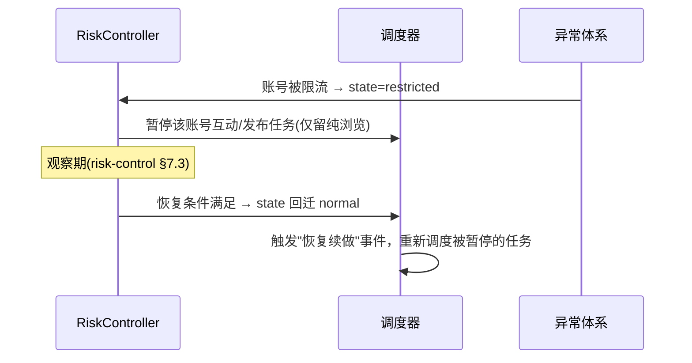
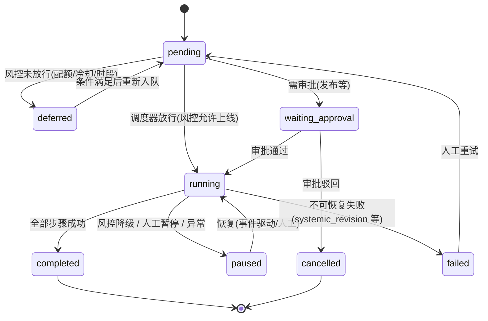
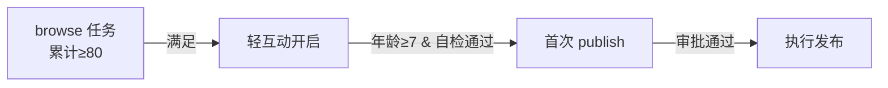

# AIDCP 任务编排体验

> 适用范围：运营团队如何把"养号 / 浏览 / 搜索 / 发布"这些动作，组织成**可调度、
> 可批量、可审批、可恢复**的任务，并交给 AIDCP 自动执行。
>
> 配套文档：[架构](architecture.md)、[边-云协议](protocol.md)、
> [风控模型](risk-control.md)、[多账号管理面板](product-dashboard.md)、
> [飞书交互设计](product-feishu.md)、[异常处理体验](product-exception.md)。
>
> 设计基线：任务编排是**云端调度器**的职责（与 risk-control.md §8 的"策略/状态/预算
> 在云端"一致）。调度器把任务拆成边缘可执行的步骤，通过 `plan.request`（protocol.md）
> 下发；边缘只负责执行单步，**绝不自己决定何时跑、跑多少**——那是调度器结合风控
> 预算决定的。

---

## 1. 任务模型（Task / Schedule / Campaign 三层）

```mermaid
flowchart TD
  Campaign[Campaign 活动<br/>一组账号 + 一个运营目标 + 周期] --> S1[Schedule 调度<br/>何时触发：cron / 手动 / 事件]
  Campaign --> S2[Schedule ...]
  S1 --> T1[Task 任务<br/>对某账号执行一种动作]
  S1 --> T2[Task ...]
  T1 --> Step[PlanStep[]<br/>边缘可执行步骤<br/>见 protocol.md plan.response]
```

| 层级 | 定义 | 粒度 | 类比 |
| --- | --- | --- | --- |
| **Campaign** | 一个运营目标下，对一组账号、在一段周期内反复执行的任务集合 | 多账号 × 多任务 | "美妆组 6 月养号 + 日常互动计划" |
| **Schedule** | 触发规则：把任务在什么时机派生出来 | cron / 手动 / 事件 | "每天 20:00 触发一次浏览" |
| **Task** | 对**单个账号**执行**一种动作**的最小可调度单元 | 单账号 × 单类型 | "acc-01 浏览 30 篇并按比例互动" |
| PlanStep | 任务被调度器/Planner 拆成的边缘原子步骤 | 单步操作 | `click` 点赞按钮 |

数据结构：

```jsonc
// Campaign
{ "campaignId": "camp-1", "name": "美妆组6月计划",
  "accountIds": ["acc-01","acc-02"], "groupId": "g-beauty",
  "objective": "日常养号+互动", "window": { "start": "2026-06-01", "end": "2026-06-30" },
  "scheduleIds": ["sch-1","sch-2"], "status": "running" }

// Schedule
{ "scheduleId": "sch-1", "campaignId": "camp-1",
  "trigger": { "kind": "cron", "expr": "0 20 * * *", "jitterMin": 30 },  // ±30min 抖动(risk-control §2.3)
  "taskTemplate": { "type": "browse", "params": { "count": 30 } },
  "appliesTo": ["acc-01","acc-02"] }                                     // 派生为每账号一个 Task

// Task
{ "taskId": "task-1001", "scheduleId": "sch-1", "accountId": "acc-01",
  "type": "browse", "params": { "count": 30, "interact": true },
  "status": "pending", "dependsOn": [],
  "budget": null,                       // 运行时由风控下发(单次会话预算)，见 §3 + risk-control §8
  "approval": { "required": false } }
```

> 关键：**调度器只决定"派生哪些 Task"，是否真正上线、用什么档位/会话预算，由
> `RiskController` 在执行前裁决**（risk-control.md §7/§8）。任务被风控拒绝 ≠ 失败，
> 而是延后或降级。

---

## 2. 任务类型

| 类型 | 目的 | 主要参数 | 风控约束（risk-control.md） |
| --- | --- | --- | --- |
| **browse 浏览** | feed 浏览 + 按比例互动 | `count`、`interact`、`vertical` | 浏览是"质量指数"分母；点赞率落 15–35%（§1.1） |
| **search 搜索** | 关键词搜索 + 互动 | `keyword`、`count`、`interact` | 单关键词每会话≤1、每日≤3（§4.3） |
| **publish 发布** | 内容生成 + 审核 + 发布 | `contentRef`/`prompt`、`scheduledAt` | 每日≤1–2，发前相似度自检（§4.2），需账号年龄≥7天（§5.3） |
| **nurture 养号** | 冷启动 7 天计划（高层 Campaign 模板） | `startDate`、`tierPlan` | 直接映射 risk-control.md §5.1 的 Day1–7 行为表 |

### 2.1 browse / search 任务

调度器下发高层目标，边缘 LocatingEngine 逐步执行（architecture.md §3.2）：浏览 N 篇、
每篇按 §3.2 阅读时间停留、按点赞率区间决定是否互动；去重集合（§4.1）保证不重复
互动同一 note_id。搜索任务额外约束搜索词主题聚类（围绕账号 `vertical`，§4.3）。

### 2.2 publish 任务（多阶段）

```
内容生成(Soul+Qwen) → 相似度自检(risk-control §4.2) → 人工审批(可选) → 调度发布窗口 → 边缘执行发布 → 平台回执
```

发布是最高风险动作，**默认需要审批**（§6），且只在风控状态 `normal` 且账号年龄达标时
才会被调度器放行。

### 2.3 nurture 养号任务

养号本质是一个"为期 7 天、每天档位/配额递增"的 Campaign 模板，直接实例化
risk-control.md §5.1 的行为表：

```jsonc
{ "type": "nurture", "params": {
  "plan": [
    { "day": "1-2", "browse": "30-50", "like": "0-3", "publish": 0 },
    { "day": "3-4", "browse": "50-80", "like": "5-10", "publish": 0 },
    { "day": "5-7", "browse": "80-120", "like": "10-20", "publish": "0-1" }
  ],
  "promoteOn": "age>=7 && state==normal" }}   // 达标后转入日常 Campaign（risk-control §5.3）
```

---

## 3. 调度方式

| 方式 | 触发 | 适用 |
| --- | --- | --- |
| **定时调度（cron）** | `Schedule.trigger.kind = cron`，cron 表达式 + ±30min 抖动 | 日常养号/浏览/搜索；避免"每天准点"机器特征（risk-control.md §2.3） |
| **手动触发** | Web 按钮 / 飞书指令（product-feishu.md §2.2、§5） | 临时跑一次、补单、调试 |
| **事件驱动** | 系统事件触发派生任务 | 风控恢复后自动继续（见下） |

**事件驱动的关键场景**——风控恢复后自动继续：



事件驱动还覆盖：边缘重连后续做被中断的任务（断点续做，product-exception.md §5）、
审批通过后自动进入发布窗口、上游任务完成后触发下游（§7 依赖）。

调度器在每个候选启动时刻，**先问 RiskController 能否上线**（活跃时段概率、会话冷却、
配额，risk-control.md §1/§2），命中才真正下发——这把"作息/频率"与"任务编排"解耦。

---

## 4. 批量操作

对**一组账号**下达相同指令，是多账号运营的核心效率点。

- 入口：Web 按分组多选 / 飞书 `/aidcp <cmd> group:<id>`（product-feishu.md §5）。
- 语义：批量指令 = 对组内每个账号**各派生一个独立 Task**，而非一个共享任务；
  每个 Task 仍各自受其账号的风控预算约束（不同账号档位/状态不同，互不影响）。
- 批量结果：聚合回执（"美妆组 6 个：成功 4 / 延后 1(风控) / 失败 1"），可在
  product-dashboard.md §2.3 时间线下钻。
- 安全：批量发布、批量解除冻结等高风险批量操作**强制确认卡片**（product-feishu.md §5）。

```jsonc
{ "batchId": "b-77", "command": "run", "taskType": "browse",
  "scope": { "groupId": "g-beauty" },
  "results": [
    { "accountId": "acc-01", "taskId": "task-2001", "status": "running" },
    { "accountId": "acc-02", "taskId": null, "status": "deferred", "reason": "session_cooldown" }
  ] }
```

---

## 5. 任务状态流转

> 统一事件模型引用：任务状态联动统一受 `./design-gaps-and-models.md` 的事件模型约束，任务系统消费事件推进、暂停、延后或终止任务，不单独维护另一套异常输入语义。

- `running / paused / deferred / failed / completed` 等状态变化应由统一事件触发，而不是由各模块直接写死联动逻辑。
- 涉及验证码、登录失效、限流、封禁等风险信号时，任务系统只根据事件执行暂停/延后/终止；账号最终风控状态仍由云端 `RiskController` 单写。
- 任务侧应保留事件关联键（如账号、任务、会话、审批对象）以支持恢复续做与去重。



状态说明：

| 状态 | 含义 | 触发来源 |
| --- | --- | --- |
| `pending` | 已创建待调度 | 调度派生 |
| `deferred` | 被风控预算延后（非失败） | RiskController（risk-control.md §1.4） |
| `waiting_approval` | 等待人工审批 | 审批策略（§6） |
| `running` | 边缘执行中 | 调度器下发 plan.request |
| `paused` | 暂停（风控降级/人工/异常） | RiskController / 人 / 异常体系 |
| `completed` | 完成 | 全步骤成功 |
| `failed` | 不可恢复失败 | 重试升级 `escalated`（protocol.md `action.result`） |
| `cancelled` | 取消 | 审批驳回 / 人工取消 |

> `paused` 与异常处理强绑定：CDP 断连、验证码、限流都会把 running 任务转 `paused`，
> 恢复路径见 product-exception.md §4/§5。任务**绝不静默成功**——边缘重试到上限会
> 上报 `escalated`（architecture.md §3.2 第二道闸），调度器据此置 `failed`。

---

## 6. 审批粒度

> 统一审批对象模型引用：本文中的发布审核、高风险确认、批量任务确认统一复用 `./design-gaps-and-models.md` 定义的审批对象模型，Web 与飞书共享同一审批对象与回写接口。

- 审批对象的权威状态存于云端审批服务；任务系统只读取审批结果并据此推进状态流转。
- 超时策略、默认动作与升级规则以统一审批对象模型为准，任务域只声明哪些节点需要审批。
- 幂等规则统一使用审批对象标识与决策幂等键，避免 Web 操作与飞书回调重复生效。

按"风险 × 可逆性"决定哪些操作需要人工确认：

| 操作 | 是否需审批 | 审批方式 | 依据 |
| --- | --- | --- | --- |
| 浏览 / 搜索任务 | 否 | — | 低风险、可逆 |
| 互动（点赞/收藏/关注） | 否（受风控比例自动约束） | — | risk-control.md §1.1 |
| 评论 | 可配置（默认否，敏感账号开） | Web/飞书 | 评论带引流风险（§1.1） |
| **发布** | **是（默认）** | 飞书审批卡片 / Web（product-feishu.md §3） | 最高风险（§1.1、§4.2） |
| 升档（保守→正常→激进） | 是 | Web 复核 | 需满足提档判据（§5.3） |
| 解除冻结 `frozen` | 是（人工） | Web | risk-control.md §7.3 |
| 风控降级确认 | P2/P3 模糊场景需确认；P0/P1 先自动后告知 | 飞书 | product-exception.md §5 |

审批超时策略：发布审批超时默认**不发**；降级确认超时默认**执行降级**（安全侧优先）。
审批状态在 Web 与飞书之间共享（product-feishu.md §7 一致性约束）。

---

## 7. 任务间依赖

依赖让"先养够再发布""先浏览 N 篇再互动"这类业务规则可表达。

- 表达方式：`Task.dependsOn = [taskId...]` + 条件谓词（如 `browse>=N`、`age>=7`、
  `state==normal`）。
- 典型依赖：

| 下游任务 | 依赖条件 | 依据 |
| --- | --- | --- |
| 开始互动 | 当日/累计浏览 ≥ 阈值 | risk-control.md §5.3（浏览→轻互动） |
| 首次发布 | 账号年龄 ≥ 7 天 且 浏览历史稳定 且 相似度自检通过 | risk-control.md §5.3 |
| 提档 | 当前档连续运行 ≥ 7 天 且 全程 normal | risk-control.md §5.3 |
| 发布执行 | 审批通过（`waiting_approval → running`） | §6 |

依赖判定由调度器在派生/放行时检查；条件不满足则下游保持 `pending`/`deferred`，
直到上游事件（任务完成、风控状态变化、审批通过）触发重新评估（呼应 §3 事件驱动）。



---

## 8. 与现有组件的集成点

| 编排能力 | 落点 | 协议/组件 |
| --- | --- | --- |
| Campaign/Schedule/Task 模型与持久化 | 云端，新增"调度器"+ 任务表（复用 PG） | architecture.md §2.1 |
| 任务 → 步骤拆解 | 复用 `SimplePlanner`（规则优先 + Qwen 兜底） | architecture.md §3.2 |
| 步骤下发 / 执行 | `plan.request` / `plan.response` / `action.result` | protocol.md §3.2/§3.5 |
| 上线裁决 / 会话预算 / 档位 | `RiskController` + 时间窗口调度 | risk-control.md §8 |
| 手动触发 / 批量 / 审批入口 | Web + 飞书 | product-dashboard.md、product-feishu.md |
| 异常导致的 paused/恢复 | 异常事件总线 ↔ 调度器 | product-exception.md §4/§5 |

---

## 9. 渐进式实现（MVP → 完整版）

| 阶段 | 范围 |
| --- | --- |
| **MVP** | 单账号 browse 任务 + 手动触发 + cron 定时（含抖动）；pending/running/completed/failed 基础状态；风控放行裁决 |
| **V1** | search 任务；deferred/paused 状态与风控联动；批量对分组下发；Web 任务列表 |
| **V2** | publish 任务全链路（生成→自检→审批→发布）；审批粒度；事件驱动恢复续做 |
| **V3** | nurture 冷启动 Campaign 模板；任务依赖谓词；自然语言下发（飞书 NL，product-feishu.md §5） |

> 一致性约束：任务状态机中的 `paused/deferred` 与风控状态 `warned/restricted/frozen`、
> 异常分级 P0–P3 必须协同——本文负责"任务怎么编排与流转"，
> "为什么暂停、怎么恢复"以 risk-control.md §7 与 product-exception.md §4 为准。
