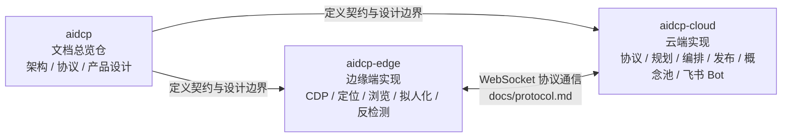

# 续作交接：[`docs/handoff-2026-06-05.md`](./handoff-2026-06-05.md)

# aidcp / aidcp-edge / aidcp-cloud：项目关系与真实实现进度

本文档用于盘点三个仓库之间的职责关系，以及基于已核验代码结果的真实实现进度。内容仅记录当前确认事实，不对未证实能力做扩展性表述。

## 1. 三项目关系

### 1.1 职责划分

- `aidcp`：文档总览仓，位于 `/Users/bears/aidcp`，用于沉淀架构、协议、产品设计等文档，定义系统契约，不承载业务代码实现。
- `aidcp-edge`：边缘端代码仓，位于 `/Users/bears/aidcp-edge`，负责连接 Chrome/CDP，执行定位、浏览、拟人化与反检测等端侧能力。
- `aidcp-cloud`：云端代码仓，位于 `/Users/bears/aidcp-cloud`，负责协议、规划、编排、发布、概念池与飞书 Bot 等云侧能力。

整体关系是：`aidcp` 中的文档先定义契约与设计边界，`aidcp-edge` 与 `aidcp-cloud` 按文档分别实现边缘端与云端能力；边缘端与云端之间通过 `docs/protocol.md` 所定义的 WebSocket 协议通信。

### 1.2 本地路径与 GitHub 地址

| 项目 | 本地路径 | GitHub |
| --- | --- | --- |
| aidcp | `/Users/bears/aidcp` | `git@github.com:tommax-bai/aidcp.git` |
| aidcp-edge | `/Users/bears/aidcp-edge` | `git@github.com:tommax-bai/aidcp-edge.git` |
| aidcp-cloud | `/Users/bears/aidcp-cloud` | `git@github.com:tommax-bai/aidcp-cloud.git` |

### 1.3 关系图

## 2. 实现进度盘点（基于真实代码盘点结果，已核验）

| 模块 | 所在仓 | 文档声称状态 | 代码实际状态 | 代码路径或缺口 |
| --- | --- | --- | --- | --- |
| 文档总览与契约定义 | aidcp | 已存在并作为总览仓使用 | 已实现；仓内主要为 `docs/` 文档，不含业务代码 | `/Users/bears/aidcp/docs/` |
| CDP 接入 | aidcp-edge | 已设计 | 已实现 | `/Users/bears/aidcp-edge/src/cdp/` |
| 定位引擎 `LocatingEngine` 三道闸（后置校验 / 重试升级 / 反污染） | aidcp-edge | 已设计 | 已实现；`guard.ts` 已覆盖 `modal_dialog`、`overlay_mask`、`login_expired` | `/Users/bears/aidcp-edge/src/locating/engine.ts`、`/Users/bears/aidcp-edge/src/locating/guard.ts` |
| 浏览执行层 `browse`（滚动 / 开卡 / 提取 / 搜索 / 云端决策闭环） | aidcp-edge | 已设计 | 已实现，但搜索链路稳定性存疑 | 代码位于 `/Users/bears/aidcp-edge/src/browse/`；`npm test` 共 153 个用例，仅 `browse-session` 的 `search.execute` 路径失败，断言缺少 `Input.insertText` |
| stealth 注入 | aidcp-edge | 已设计 | 已实现，且有对应测试 | `/Users/bears/aidcp-edge/src/cdp/stealth-injector.ts` |
| `humanize` 拟人化 | aidcp-edge | 已设计 | 已实现，且有模块与测试覆盖 | `/Users/bears/aidcp-edge/src/humanize/` |
| 协议层 `protocol` | aidcp-cloud | 文档已定义协议 | 已实现，且代码能力已超出当前文档描述 | `/Users/bears/aidcp-cloud/src/comm/protocol.ts`；已包含 `note.content`、`browse.next`、`search.execute`、`session.end`、`publish.request`、`publish.result`，但 `/Users/bears/aidcp/docs/protocol.md` 仍停留在 `hello` / `plan` / `select` / `anchor` / `action` / `ping` / `pong` |
| Planner（规则优先 + LLM 兜底，支持点赞 / 关注 / 收藏 / 搜索） | aidcp-cloud | 已设计 | 已实现 | `/Users/bears/aidcp-cloud/src/planner/simple-planner.ts` |
| Orchestrator + 状态机 + 互动决策 + 概念抽取 | aidcp-cloud | 已设计 | 已实现 | `/Users/bears/aidcp-cloud/src/orchestrator/session-orchestrator.ts`、`/Users/bears/aidcp-cloud/src/orchestrator/state-machine.ts`、`/Users/bears/aidcp-cloud/src/orchestrator/engagement-decider.ts`、`/Users/bears/aidcp-cloud/src/orchestrator/concept-extractor.ts` |
| 概念池 `concept-store` + PG anchor cache | aidcp-cloud | 已设计 | 已实现 | `/Users/bears/aidcp-cloud/src/cache/concept-store.ts`、`/Users/bears/aidcp-cloud/src/cache/pg-anchor-cache.ts` |
| Publish Agent | aidcp-cloud | 文档倾向于已打通发布能力 | 云端生成 / 后处理 / 落库 / 下发链路已实现，但端到端发布未完全证实 | `/Users/bears/aidcp-cloud/src/publish/publisher.ts`、`/Users/bears/aidcp-cloud/migrations/0001_publish_log.sql`；缺口是尚未看到 edge 侧对应 publish flow，且 `publisher.ts` 已注明 edge 侧 publish flow 不在当前任务范围 |
| 飞书 Bot | aidcp-cloud | 文档标记为 planned | 部分实现，且文档低估了当前进度；已具备 MVP 链路 | `/Users/bears/aidcp-cloud/src/feishu/ws-receiver.ts`、`/Users/bears/aidcp-cloud/src/feishu/commands.ts`、`/Users/bears/aidcp-cloud/src/feishu/cards.ts`、`/Users/bears/aidcp-cloud/src/feishu/messenger.ts`、`/Users/bears/aidcp-cloud/src/feishu/token.ts`；但 `/Users/bears/aidcp-cloud/src/server.ts` 中 `status` / `pause` / `resume` 仍是 MVP 打桩，审批流与多账号归属未落地 |
| 边缘端测试与类型检查基线 | aidcp-edge | 文档未必体现测试细节 | 已核验：`npm test` 为 152 通过 / 1 失败，`typecheck` 通过 | 唯一失败点为 `browse search.execute` 路径 |
| 云端测试与类型检查基线 | aidcp-cloud | 文档未必体现测试细节 | 已核验：`npm test` 为 4 通过 / 0 失败，真实 Qwen 集成测试因未设置 `DASHSCOPE_API_KEY` 跳过，`typecheck` 通过；`npm install` 提示 2 个 high severity 漏洞 | 漏洞提示存在，但不影响当前已核验功能结论 |

## 3. 文档与代码不一致清单

1. `docs/protocol.md` 已落后于代码实现。  
   当前代码中的协议层已经包含 `note.content`、`browse.next`、`search.execute`、`session.end`、`publish.request`、`publish.result` 六个消息类型，但文档消息表仍停留在 `hello`、`plan`、`select`、`anchor`、`action`、`ping`、`pong`。

2. 飞书模块被文档低估。  
   文档仍将其标记为 planned，但 `aidcp-cloud` 代码中已经实现了命令路由、卡片模板、token 管理、消息发送、WebSocket 长连接接收等 MVP 链路；尚未完成的是审批流、多账号归属，以及 `status` / `pause` / `resume` 的正式能力。

3. `product-overview` 对 Publish Agent 的表述偏乐观。  
   云端侧的生成、后处理、落库、下发链路已经存在，但端到端发布尚未完全证实，因为尚未看到 edge 侧对应的 publish flow 代码，因此不能将发布能力表述为已完整打通。

4. edge 侧 `browse search.execute` 测试失败，说明搜索链路未完全稳定。  
   当前边缘端测试集中唯一失败用例就是 `browse-session` 的 `search.execute` 路径，断言缺少 `Input.insertText`，因此该链路应视为“已实现但稳定性待修复”，而不是“完全可用”。

## 4. 下一步可实现功能候选（按优先级）

| 优先级 | 候选项 | 价值 | 依赖关系 | 说明 |
| --- | --- | --- | --- | --- |
| P0 | 补齐 edge 侧 publish flow，打通端到端发布 | 高 | 依赖现有 cloud `publisher.ts` 与协议能力 | 当前云端发布链路已具备主体能力，但 edge 侧 publish flow 尚未看到实现，这是“发布能力是否真正闭环”的关键缺口 |
| P1 | 修复 edge `browse search.execute` 失败用例 | 高 | 依赖现有 `browse` 与输入链路 | 这是当前边缘端测试唯一失败点，直接影响搜索链路稳定性，应优先修复并恢复测试全绿 |
| P2 | 更新 `docs/protocol.md`，补齐已实现消息类型 | 高 | 依赖现有 cloud 协议代码 | 文档已明显落后于代码，继续滞后会影响 edge / cloud 协作与后续扩展 |
| P3 | 将飞书 Bot 从 MVP 推进到审批流 / 多账号归属 | 中高 | 依赖现有飞书命令、消息、WS 接收能力 | 当前已有 MVP 基础，继续补审批流与账号归属后，才能支撑更完整的运营闭环 |
| P4 | 实现风控状态机 `normal → warned → restricted → frozen` | 中 | 依赖现有设计文档与编排状态机 | 目前仍停留在设计层，若要提升系统可运营性与安全性，这是后续重要能力 |
| P5 | 处理 cloud 依赖中的 2 个 high severity 漏洞 | 中 | 依赖依赖升级与回归验证 | 不影响当前盘点结论，但属于质量与安全基线问题，建议纳入后续维护计划 |

## 5. 结论

当前三个仓库的分工已经比较清晰：`aidcp` 负责定义契约，`aidcp-edge` 与 `aidcp-cloud` 已分别实现大量核心能力，且云边之间已经存在实际协议实现基础。  
但从“文档与真实代码一致性”以及“端到端闭环成熟度”来看，仍有四个关键事实需要保持谨慎表述：协议文档落后、飞书进度被低估、发布链路未完全证实、edge 搜索链路仍有稳定性问题。