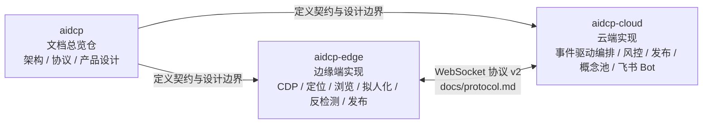

# 续作交接：[`docs/handoff-2026-06-05.md`](./handoff-2026-06-05.md)

# aidcp / aidcp-edge / aidcp-cloud：项目关系与真实实现进度

本文档用于盘点三个仓库之间的职责关系，以及基于已核验代码结果的真实实现进度。内容仅记录当前确认事实，不对未证实能力做扩展性表述。

> **本次盘点更新（2026-06-11）**：关联代码仓经过数次重构，本文已据**当前代码结构**重新核验。
> 重点变化：①云端从"单线 Planner→PlanStep[]"重构为**事件驱动多 Agent**（`RoleDispatcher` + 约 32 角色 + `EventBus`），
> 旧文件 `session-orchestrator.ts`/`state-machine.ts`/`engagement-decider.ts`/`concept-extractor.ts`/`src/blackboard/`/`src/publish/` **已不存在**；
> ②`RiskController` 风控状态机已**完整实装**（不再是"仅设计"）；③飞书 Bot 已推进到 `/bind` + 自动记群 + 审批卡片信号；
> ④边缘端 publish flow（`flows/publish-post.ts`）已实现，发布审批链路打通；⑤协议已升级到 **v2（56 个消息类型）**，
> `docs/protocol.md` 已同步。本次核验基于代码结构与源码阅读，**未重新执行 `npm test`**，测试数字以各仓 CI 为准。

## 1. 三项目关系

### 1.1 职责划分

- `aidcp`：文档总览仓，位于 `.`，用于沉淀架构、协议、产品设计等文档，定义系统契约，不承载业务代码实现。
- `aidcp-edge`：边缘端代码仓，位于 `../aidcp-edge`，负责连接 Chrome/CDP，执行定位、浏览、拟人化、反检测、发布流程等端侧能力。
- `aidcp-cloud`：云端代码仓，位于 `../aidcp-cloud`，负责协议、规划、事件驱动编排、风控、发布、概念池与飞书 Bot 等云侧能力。

整体关系是：`aidcp` 中的文档先定义契约与设计边界，`aidcp-edge` 与 `aidcp-cloud` 按文档分别实现边缘端与云端能力；边缘端与云端之间通过 `docs/protocol.md` 所定义的 WebSocket 协议（v2）通信。

### 1.2 本地路径与 GitHub 地址

| 项目 | 本地路径 | GitHub |
| --- | --- | --- |
| aidcp | `.` | `git@github.com:tommax-bai/aidcp.git` |
| aidcp-edge | `../aidcp-edge` | `git@github.com:tommax-bai/aidcp-edge.git` |
| aidcp-cloud | `../aidcp-cloud` | `git@github.com:tommax-bai/aidcp-cloud.git` |

> 当前部署口径：cloud 只部署在命名 ECS target（见 `deployment-environments.md`），本地只跑 edge 连 ECS。`dev=121.89.85.150` 是开发完成后的默认自动部署目标；`ol=123.56.253.183` 仅在用户明确要求线上部署时，从 release 分支按分支部署。

### 1.3 关系图

## 2. 实现进度盘点（基于当前代码结构核验，2026-06-11）

| 模块 | 所在仓 | 代码实际状态 | 代码路径或缺口 |
| --- | --- | --- | --- |
| 文档总览与契约定义 | aidcp | 已实现；仓内主要为 `docs/` 文档，不含业务代码 | `./docs/` |
| CDP 接入 | aidcp-edge | 已实现 | `aidcp-edge/src/cdp/`（client/targets/dom-provider/action-executor/session/chrome-launcher/stealth-injector） |
| 定位引擎三道闸（后置校验 / 重试升级 / 反污染） | aidcp-edge | 已实现；`guard.ts` 覆盖 `modal_dialog`/`overlay_mask`/`login_expired` | `aidcp-edge/src/locating/engine.ts`、`guard.ts` |
| 浏览执行层 `browse` | aidcp-edge | 已实现；命令分发 + 结构化上报（开/跳决策已上移至 Cloud `ContentEvaluator`，`card-filter.ts` 已 `@deprecated` 未被调用） | `aidcp-edge/src/browse/`（browse-session/feed-scroller/modal-controller/note-extractor/search-handler；card-filter 为遗留模块） |
| 拟人化 `humanize` | aidcp-edge | 已实现，含模块与测试 | `aidcp-edge/src/humanize/`（timing/mouse-path/keyboard-rhythm/scroll-physics/reading-time/session-rhythm） |
| stealth 注入 | aidcp-edge | 已实现，有测试 | `aidcp-edge/src/cdp/stealth-injector.ts` |
| **边缘 publish flow** | aidcp-edge | **已实现**（推翻旧盘点"尚未看到"）；发布六步 + 审批信号等待 | `aidcp-edge/src/flows/publish-post.ts`、`src/publish/approval-gate.ts` |
| Electron 打包 | aidcp-edge | 已实现；系统托盘 + Chrome 网关 + 控制面板 UI | `aidcp-edge/src/electron/`（main/preload/chrome-launcher.cjs + renderer/） |
| 协议层 `protocol` | aidcp-cloud | 已实现 **v2（56 个消息类型，以 `MessageType` 穷举为准）**；`docs/protocol.md` 已同步 | `aidcp-cloud/src/comm/protocol.ts`（边侧 `aidcp-edge/src/comm/protocol.ts` 为投影） |
| **事件驱动编排** | aidcp-cloud | **已实现（重构）**；`RoleDispatcher` 注册约 32 角色（另有评论点赞 2 角色 / 概念抽取 1 角色按开关条件注册；角色名以 `src/event-bus/types.ts` 的 `RoleName` 穷举为准），`EventBus` 解耦，`SessionContext` 存态 | `aidcp-cloud/src/orchestrator/role-dispatcher.ts`、`src/agents/*.ts`、`src/event-bus/`、`src/comm/command-bridge.ts` |
| Planner（规则 + LLM 兜底） | aidcp-cloud | 已实现；服务定向"一句话目标"场景（浏览闭环改走角色驱动） | `aidcp-cloud/src/planner/simple-planner.ts` |
| **风控 RiskController + 状态机** | aidcp-cloud | **已实现**（旧盘点标"仅设计"，已过时）；状态机 `normal→warned→restricted→frozen` + 分钟/小时滑窗 + 自然日配额 + 冷启动 + 时间窗 + 会话预算 + 去重 + PG 持久化 | `aidcp-cloud/src/risk/`（risk-controller/risk-state-machine/sliding-window-counter/quotas/cold-start-planner/time-scheduler/session-budget/interaction-dedup/pg-risk-store） |
| 概念池 + PG anchor cache + Bot 群存储 | aidcp-cloud | 已实现 | `aidcp-cloud/src/cache/`（concept-store/pg-anchor-cache/bot-chat-store） |
| **Publish Agent（多阶段角色图）** | aidcp-cloud | 云端生成 / 配图 / 组装 / 审批 / 落库 / 下发链路已实现（重构为多阶段角色图，约 22 个角色继承 `BasePublishRole`，配图拆为 `ImagePlanner` + `ImageGenerator`）；端到端真机发布仍待最终验证 | `aidcp-cloud/src/publish-agent/`（publish-orchestrator + roles/ 约 22 角色 + wanxiang-client + publish-log-store + pipeline-context）；`migrations/0001_publish_log.sql`、`0004_publish_agent.sql` |
| **飞书 Bot** | aidcp-cloud | 已推进到 `/bind` + 自动记群 + 审批卡片信号（旧盘点标 planned，已过时）；`/status /pause /resume` 命令路由已具备 | `aidcp-cloud/src/feishu/`（ws-receiver/messenger/commands/cards/bot-chat-events/handler/token）；`migrations/0002_bot_chats.sql` |
| 账号状态管理 | aidcp-cloud | 已实现（内存 active/paused） | `aidcp-cloud/src/account-state.ts` |

## 3. 文档与代码一致性现状

> 旧盘点列出的四项不一致，本次更新已逐条处理：

1. **协议文档落后** → **已修复**。`docs/protocol.md` 已从 v1 重写为 v2，补齐浏览编排、角色驱动指令、结构化上报、风控预算、发布审批、通知巡视等共 56 个消息类型（以 `protocol.ts` 的 `MessageType` 穷举为准）。
2. **飞书被低估** → **已修正**。本文与 `product-overview.md` 已将飞书从 planned 改为"部分实现"（`/bind`/记群/审批卡片已落地；多账号归属、完整审批闭环待续）。
3. **架构文档停留在单体 Planner** → **已修复**。`docs/architecture.md` 已重画为事件驱动多 Agent，并补齐边缘端 `browse`/`humanize`/`flows`/`electron`。
4. **风控仅设计** → **已修正**。`RiskController` 全套已实装，相关文档状态从 `designed` 改为 `implemented`。

仍需留意的谨慎表述：
- **端到端真机发布**尚未最终证实（云端管道与边缘 flow 都已具备，真机联调收尾见 `handoff-2026-06-05.md` 待办 A）。
- **WS 重连状态机**仍有 3 个已知 bug（见 handoff 待办 C），换机后 stash 若未迁移可能已丢失。

## 4. 下一步可实现功能候选（按优先级）

| 优先级 | 候选项 | 说明 |
| --- | --- | --- |
| P0 | 工作流 A 真机联调收尾：edge 连 ECS、飞书授权、`AIDCP_REAL_PUBLISH=true` 真发一条 | 验证端到端发布闭环（见 handoff 待办 A） |
| P0 | WS 重连状态机修复（sessionId 未更新 / 断连补发只发 1 条 / 初连重试超时） | 见 handoff 待办 C；影响长跑稳定性 |
| P1 | 飞书从"部分实现"推进到完整审批闭环 + 多账号归属 | 已有 `/bind`、记群、卡片信号；补审批状态机与账号归属 |
| P1 | 三仓 `ARCHITECTURE.md` / `DECISIONS.md` 防健忘文档 | 见 handoff 待办 B（尚未开始） |
| P2 | 风控状态机接入真实平台信号（当前已实装逻辑，待接入封号/限流回执驱动 confirmed/fatal） | 让状态迁移由真实信号而非仅配额触发 |
| P2 | 多账号编排（进程/端口/profile 隔离 + 账号梯队） | 进入 Phase 2 的前置 |

## 5. 结论

三仓分工清晰：`aidcp` 定义契约，`aidcp-edge` 与 `aidcp-cloud` 已分别实现大量核心能力，云边协议（v2）已落地。
相较上一版盘点，云端已完成"单体规划→事件驱动多 Agent"的重构，风控与飞书均已从设计走向实装，
边缘端补齐了浏览执行层、拟人化、发布流程与桌面打包。当前主要的成熟度风险集中在**端到端真机发布的最终验证**
与 **WS 重连稳定性**两条线上。
