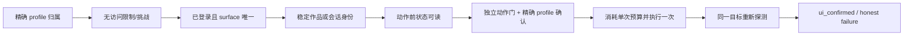

<!--
调研对象：本地 AdsPower profile k1evgky5 上的抖音网页端。
调研时间：2026-07-22 至 2026-07-23。
证据来源：真实页面只读观察、经明确授权的单次动作、脱敏 fixture、Edge 聚焦测试、OpenSpec。
边界：本文是研究结论与功能设计汇总，不代表生产接入、服务端持久化证明或平台长期兼容承诺。
-->

# 抖音网页端 CDP 调研与功能设计

## 1. 结论摘要

抖音网页端可以在一个精确绑定的 AdsPower profile 内通过 CDP 做受控调研和窄范围交互，但不能直接复用 TikTok 的页面选择器或成功语义。当前已经形成独立手动探针，完成了详情页、点赞、关注、收藏、私信会话类型、直播普通发言和已知交互提示的核心验证；尚未形成完整的精选流浏览、普通作品评论输入、发布页只读探针和有效私聊真机验收。

当前最重要的结论如下：

1. **可以安全附着指定环境**：必须用 AdsPower start-page marker 精确证明 profile 归属；动态 CDP 端口不能靠扫描后猜测。
2. **作品身份可稳定绑定**：精选流使用 `data-aweme-id`，详情页要求 `modal_id` 与来源作品 ID 一致，并同时出现 ready 结构。
3. **互动必须是单向、单次、独立授权**：点赞、关注、收藏、私信、直播普通发言和直播定向回复分别使用独立动作门与单次预算。
4. **UI 回执不是平台持久化事实**：当前只能报告 `ui_confirmed`；不能据此宣称服务端已持久化、消息已送达或内容已公开。
5. **私信必须先判会话类型**：群聊优先识别并阻断；只有明确一对一私聊、最后一条真实消息来自对方时才允许回复。
6. **普通作品评论和网页发布仍保持禁用**：评论只设计 fill-only/no-submit；发布只做只读结构调研，正式发布优先走抖音开放平台。
7. **尚未接入生产**：没有注册生产 `PlatformId`，没有修改 Cloud 协议、调度、发布队列、数据库或 `RiskController`，也没有合并、部署或打包。

## 2. 证据口径

本文用四类状态避免把设计、代码和真机结果混在一起：

| 状态 | 含义 |
|---|---|
| 已观察 | 在本地真实页面看到过结构，但不代表已有通用实现 |
| 已实现 | 独立探针代码和测试已存在，不代表生产已启用 |
| 已真机验证 | 在 `k1evgky5` 上得到对应 UI 证据 |
| 未执行/未完成 | 没有发生外部动作，或相关探针、测试、回查仍未完成 |

所有真机证据仅覆盖 2026-07-22 至 2026-07-23 当时的抖音网页灰度和账号状态。DOM、语言、登录状态或平台策略变化后必须重新探测。

## 3. 环境与最初访问异常

### 3.1 环境归属

- AdsPower profile：`k1evgky5`。
- 首选连接：AdsPower API 返回目标 profile 的动态 `debug_port`。
- 现场补充路径：profile 已被桌面会话占用时，从该 profile cache 的 `DevToolsActivePort` 获取端口。
- 最终归属证据：CDP `/json/list` 中存在 `start.adspower.net/?id=k1evgky5` marker。
- 仅附着路径不拥有浏览器生命周期，探针结束后只能断开 CDP，不能关闭现存 AdsPower 浏览器。

### 3.2 `Unable to access the website` 的结论边界

初始阶段页面曾直接显示 `Unable to access the website`。完成实名认证后问题仍一度存在，因此**不能把未实名认定为已证明的单一根因**。后续同一环境恢复为可访问、可登录状态，但本轮没有保留恢复前后的完整 HTTP、代理、TLS 和账号风控对照证据，根因没有闭环。

当前实现将该类可见页面归为 `access_restricted`，遇到后停止动作，不会把页面恢复、实名认证完成或浏览器可连接单独解释成“问题已解决”。

若再次出现，应按以下顺序补证：

1. 精确确认连接的是目标 profile 和动态 CDP endpoint；
2. 记录最终 URL、可见错误结构、挑战 iframe/dialog 及页面 ready 状态；
3. 区分 `access_restricted`、`visible_challenge`、`page_unavailable` 和 `login_required`；
4. 再分别核对代理出口、DNS/TLS/HTTP 响应和账号侧限制；
5. 只有恢复前后存在单变量对照时，才归因到实名、代理、网络或账号风控。

## 4. 页面结构调研

### 4.1 精选流

- 入口：`https://www.douyin.com/jingxuan`。
- 作品身份：卡片上的 `data-aweme-id`。
- 一次现场快照观察到 52 个唯一作品 ID；该数字是当时快照，不是稳定容量。
- 内容由内部 `overflow:auto` 纵向容器承载，`window.scrollBy` 不会推进作品集合。
- 页面同时存在导航和横向 tab 滚动容器，不能用“第一个可滚动元素”作为目标。
- 完整的去重、内部滚动容器选择、有界推进和 `no_change` 代码路径仍未完成。

### 4.2 作品详情

- 卡片脚本 `.click()` 不可靠。
- 对唯一可见封面发送 trusted pointer event 后，可进入：
  `https://www.douyin.com/jingxuan?modal_id=<data-aweme-id>`。
- 详情成立需要同时满足：
  - `modal_id` 等于来源 `data-aweme-id`；
  - 唯一 `feed-active-video`；
  - modal/active-feed ready 结构；
  - 动作控件归属于同一详情 surface。
- `/video/<id>` 直链会间歇性只渲染导航骨架，URL 变化本身不能证明详情可操作；超时应返回 `page_not_hydrated`。

### 4.3 登录与阻断

- 未登录时可观察公开卡片，但点赞、评论和发布探针必须返回 `login_required`。
- 登录后，登录按钮和手机号表单消失，并出现已登录结构；探针不读取账号身份值。
- 隐藏验证码 iframe 或登录表单中的“验证码”文字不能单独判定为挑战。
- 只有可见、占据交互区域的验证结构才是 `visible_challenge`。
- 阻断优先级：访问限制 → 可见挑战 → 页面不可用 → 登录状态 → 页面能力。

### 4.4 首次交互提示

真实动作前曾出现全屏交互提示，导致点击落在遮罩而非目标控件。处理规则已经固化：

- 只匹配唯一、可见、文本精确为“我知道了”的 `button`；
- 最多点击一次；
- 必须确认提示消失；
- 再用 `elementFromPoint` 确认动作坐标命中目标控件；
- 提示歧义、未消失或目标仍被遮挡时停止。

## 5. 功能调研与实现状态

| 能力 | 结构/设计 | 实现状态 | 真机结果 | 当前边界 |
|---|---|---|---|---|
| profile 归属 | AdsPower API + exact marker | API 路径已实现；自动 `DevToolsActivePort` fallback 未完成 | exact marker 已确认 | 不扫描端口猜账号 |
| 登录/阻断 | 可见结构分级 | 已实现核心分类 | 登录前后均观察 | 未完成全部脱敏 fixture |
| 精选流浏览 | `data-aweme-id` + 内部纵向容器 | 未完成完整 browse adapter | 页面结构已观察 | 不能宣称有界浏览已交付 |
| 详情 modal | trusted pointer + 同 ID + ready | 已实现 | 已确认 | `/video/<id>` 不作为唯一路径 |
| 点赞 | 双重门、单向、单次、同作品回查 | 已实现 | 一次真实点赞已确认 active | 仅 UI 证据，不证明服务端持久化 |
| 关注 | 独立门、单向、单次 | 已实现 | 一次真实关注 UI 确认 | 已关注绝不反向取消 |
| 收藏 | 独立门、单向、单次 | 已实现 | 一次真实收藏 UI 确认 | 已收藏绝不反向取消 |
| 普通作品评论 | fill-only、源码无 submit | 尚未实现 | 未输入、未发送 | “发一条弹幕吧”明确排除 |
| 私信 | 私聊/群聊/未知分类 + 入站方向 | 已实现并有脱敏 fixture | 曾发生一次群聊误回；有效私聊未验收 | 群聊和未知类型禁止输入 |
| 直播普通发言 | 独立门，固定文本 `1111` | 已实现 | 已发送一次并读到同房间 UI 节点 | 不证明其他用户已收到 |
| 直播评论定向回复 | 独立门，固定文本 `666` | 已实现安全阻断 | 未找到唯一评论绑定入口，未发送 | 绝不退化成普通聊天 |
| 创作者上传页 | 只读结构探测 | 完整探针未实现 | 已观察上传入口和文件 input | 未选文件、未填文案、未发布 |
| 正式发布 | OAuth + 官方上传/创建/回查 | 仅完成设计 | 未调用官方 API | 不以网页最终提交兜底 |

## 6. 动作安全模型



共同规则：

- 每种动作拥有独立环境变量，不能用一个总开关扩大授权。
- 每种动作在单个 runner 中预算为 1。
- 写动作前要求精确 profile 确认。
- 已完成的单向状态不反向取消。
- 点击已发出但回查不明时返回 `postcondition_unknown`，不得重试。
- target、控件、状态或会话方向不唯一时停止。
- 报告不读取或输出 cookie、storage、token、手机号、联系人身份、消息/评论正文或完整内容文本。

当前动作门：

| 动作 | 独立开关 | 额外限制 |
|---|---|---|
| 点赞 | `AIDCP_DOUYIN_PROBE_LIKE=1` | 当前作品唯一、明确未赞 |
| 关注 | `AIDCP_DOUYIN_PROBE_FOLLOW=1` | 唯一未关注控件 |
| 收藏 | `AIDCP_DOUYIN_PROBE_COLLECT=1` | 唯一未收藏控件 |
| 私信 | `AIDCP_DOUYIN_PROBE_DM_REPLY=1` | 明确私聊、最后一条入站、文本仅 `好的`/`ok` |
| 直播普通发言 | `AIDCP_DOUYIN_PROBE_LIVE_CHAT=1` | 文本精确为 `1111` |
| 直播定向回复 | `AIDCP_DOUYIN_PROBE_LIVE_COMMENT_REPLY=1` | 唯一评论绑定回复入口、文本精确为 `666` |

所有真实动作还必须同时满足：

```text
AIDCP_DOUYIN_PROBE_CONFIRM_PROFILE=<exact profile id>
```

## 7. 重点状态判据

### 7.1 点赞

未点赞负样本：

- 唯一 `[data-e2e="video-player-digg"]`；
- 无 `aria-pressed=true`；
- 无 active `data-e2e-state`；
- 24×24 固定心形 path；
- 白色 `currentColor`。

白色本身不能独立判定未点赞，必须与固定心形结构和缺少 active state 组合使用。

已点赞正样本：

- 同一 `modal_id`；
- 同一点赞控件出现
  `data-e2e-state="video-player-is-digged"`；
- 页面显示 90×94 红色点赞动画。

真实点击后的第一次旧映射没有识别动画，返回 `postcondition_unknown`；探针没有重试。随后只读复查同一 modal 得到精确 digged state，修正后的映射稳定返回 `active/digged_state`。

### 7.2 私信会话类型

分类顺序必须是“先群聊，再私聊，最后未知”：

1. 出现群已读、群通知或成员发送者标题结构 → `group`；
2. 没有任何群结构，且存在真实消息盒 → `private`；
3. 证据不足 → `unknown`。

消息方向通过最后一个真实消息内容盒判断：

- 包含 `messageMessageBoxisFromMe` → `outbound`；
- 不包含且存在真实内容盒 → `inbound`；
- 没有足够消息结构 → `unknown`。

群聊即使最后一条是入站，也必须返回 `group_chat`；未知类型或方向不明分别返回 `conversation_type_unknown` / `inbound_unconfirmed`，且不聚焦、不输入、不提交。

为保护隐私，已知群聊和私聊样本的真实名称不写入源码、fixture、报告或本文。

## 8. 真机动作记录

| 动作 | 是否发生 | 结果 | 证据与偏差 |
|---|---|---|---|
| 关闭“我知道了” | 是，一次 | UI 确认消失 | 之后补充目标 hit-test |
| 关注 | 是，一次 | `ui_confirmed` | 同 modal 正状态 |
| 收藏 | 是，一次 | `ui_confirmed` | 同 modal 正状态 |
| 点赞 | 是，一次 | 延迟同 modal 确认 active | 首次旧映射 unknown；没有重试 |
| 私信允许文本 | 是，一次 | 编辑器清空 | 后来确认目标是群聊，属于偏差，不算私聊验收 |
| 有效私聊回复 | 否 | 未验收 | 已知私聊样本最后一条为出站，不满足入站门 |
| 直播普通发言 `1111` | 是，一次 | `ui_confirmed` | 编辑器清空并出现精确消息节点 |
| 直播定向回复 `666` | 否 | `reply_target_unavailable` | 无唯一评论绑定入口，没有用普通发言替代 |
| 普通作品评论 | 否 | 未执行 | 未输入、未发送 |
| 文件选择/上传 | 否 | 未执行 | 只观察文件 input |
| 草稿/最终发布 | 否 | 未执行 | 未创建、未提交 |

群聊误回复是本轮最重要的偏差。修正后已经加入：

- group/private/unknown 三态分类；
- 群结构优先；
- 最后一条消息方向校验；
- 群聊、未知类型、出站/未知方向零输入测试；
- 候选会话不唯一时停止。

## 9. 发布路径设计

### 9.1 网页端

已观察到：

- `https://creator.douyin.com/creator-micro/content/upload`；
- 一个启用、非 multiple 的视频文件 input；
- 未选择文件前没有文案编辑器。

本期边界：

- 不选择文件；
- 不填写文案；
- 不寻找或点击最终发布控件；
- 结果固定包含 `uploaded=false`、`submitted=false`；
- 选择文件后的编辑器、草稿持久化和上传完成证据需要另行授权调研。

### 9.2 正式生产发布

抖音官方文档当前说明：

- `video.create` scope 需要申请权限和用户授权；
- `/video/upload/` 上传后得到 `video_id`；
- `/video/create/` 创建后得到 `item_id`，并进入审核过程；
- 代用户创建视频时，除 OAuth 授权外，每次调用都必须让用户明确感知；
- `/video/list/` 和 `/video/data/` 可用于授权账号的视频列表与数据查询。

推荐未来数据流：

```text
用户本次批准
  → 抖音 OAuth
  → /video/upload/
  → /video/create/
  → item_id
  → /video/list/ 或 /video/data/ 回查
```

职责边界：

- Cloud：批准、调度、OAuth token 生命周期、幂等、发布状态和主节奏；
- Edge：只保留必须在本地浏览器发生的页面交互，不保管开放平台 client secret；
- Console：未来展示授权、批准、审核中、公开/失败等可解释状态；
- 缺少应用、scope、OAuth 或本次批准时返回
  `official_api_unavailable` / `approval_required`；
- 不自动降级到网页 CDP 最终发布。

## 10. 实现与验证

代码位置：

- `aidcp-edge/src/douyin/probes/interaction-probe.ts`
- `aidcp-edge/scripts/douyin-interaction-probe.ts`
- `aidcp-edge/test/douyin/interaction-probe.test.ts`

OpenSpec：

- `openspec/changes/douyin-cdp-research-and-probes/proposal.md`
- `openspec/changes/douyin-cdp-research-and-probes/design.md`
- `openspec/changes/douyin-cdp-research-and-probes/specs/douyin-cdp-research-probes/spec.md`
- `openspec/changes/douyin-cdp-research-and-probes/tasks.md`

提交：

- Edge `11022ec`：新增有界抖音互动探针；
- Edge `49aeb4e`：补充点赞与私信会话分类安全门；
- Control `0396606`：记录点赞和私信偏差/防护设计。

验证：

- Edge 聚焦测试：21/21 通过；
- Edge `npm run typecheck`：通过；
- `openspec validate douyin-cdp-research-and-probes --strict`：通过；
- 两个 worktree 均已推送隔离分支
  `codex/douyin-cdp-research-and-probes`；
- 未合并、未部署、未打安装包、未归档。

## 11. 未完成工作

截至 2026-07-23，OpenSpec 进度为 21/37，剩余 16 项，主要分为：

### P0：把已观察能力变成可重复探针

- 完成自动 `DevToolsActivePort` attach-only fallback 和生命周期测试；
- 补齐 logged-out、隐藏/可见挑战、访问限制、内部 scroller、目标歧义等脱敏 fixture；
- 完成精选流去重、纵向容器选择、有界推进、虚拟 DOM 重探测和 `no_change` 证据；
- 补足 gate、logged-out、target change、control ambiguity、no-repeat 等组合测试。

### P1：评论与发布只读边界

- 实现普通作品评论 fill-only API；
- 加入源码级 no-submit 静态测试；
- 实现创作者上传页只读 probe；
- 固化 `uploaded=false` / `submitted=false` 和官方能力缺失状态。

### P1：补齐真实验收

- 如需有效私聊验收，必须再次明确授权，并选择“明确私聊 + 最后一条入站”的会话；
- 直播定向回复只有出现唯一评论绑定入口时才能再次验证；
- 完成精选流有界推进的真实 before/after 证据。

## 12. 建议

短期建议继续把本 change 定位为“研究/验收探针”，不要提前注册生产抖音平台。

推荐推进顺序：

1. 先完成 ownership fallback、精选流 browse adapter 和 fixture；
2. 再完成评论 fill-only 与发布页只读 probe；
3. 对私信和直播回复只补安全验收，不扩大文本、次数或目标范围；
4. 若要进入正式发布，单独创建 Edge/Cloud/Console 跨仓 OpenSpec change；
5. 官方应用、scope、OAuth、每次发布批准和状态回查没有就绪前，不实现网页最终发布兜底。

## 13. 信息源

本地事实源：

- OpenSpec change：`douyin-cdp-research-and-probes`
- Edge commits：`11022ec`、`49aeb4e`
- Control commit：`0396606`
- 本地 `k1evgky5` 真实页面和脱敏 fixture

抖音开放平台官方资料（2026-07-23 核对）：

- [上传视频：`POST /video/upload/`](https://open.douyin.com/platform/resource/docs/openapi/video-management/douyin/create/upload/)
- [创建视频：`POST /video/create/`](https://open.douyin.com/platform/resource/docs/openapi/video-management/douyin/create/create-video)
- [查询授权账号视频列表：`GET /video/list/`](https://open.douyin.com/platform/resource/docs/openapi/video-management/douyin/search-video/account-video-list)
- [查询特定视频数据：`POST /video/data/`](https://open.douyin.com/platform/resource/docs/openapi/video-management/douyin/search-video/video-data/)

