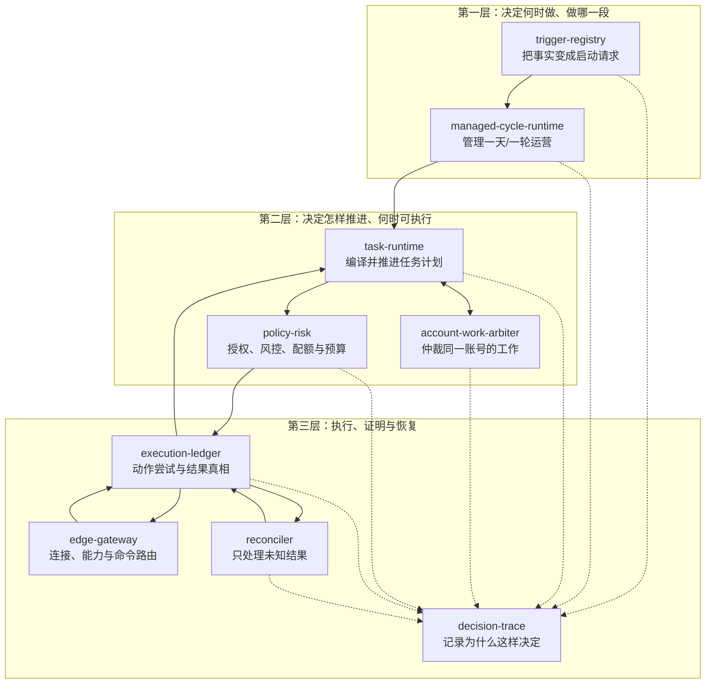
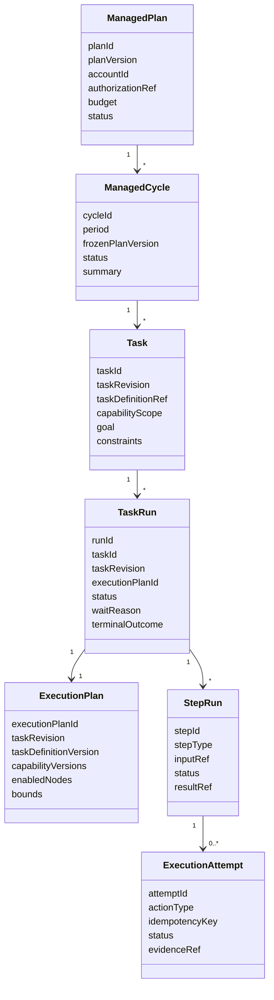
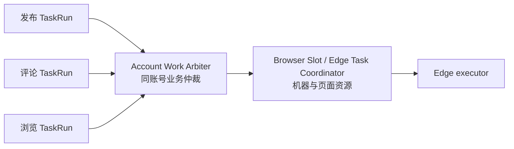
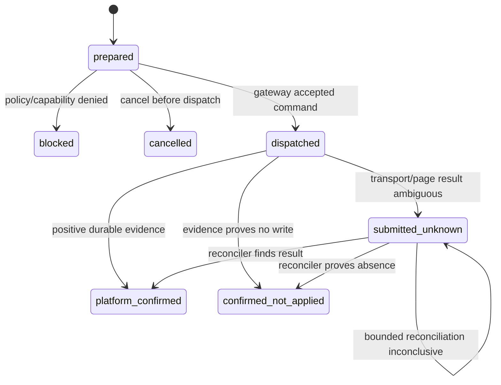
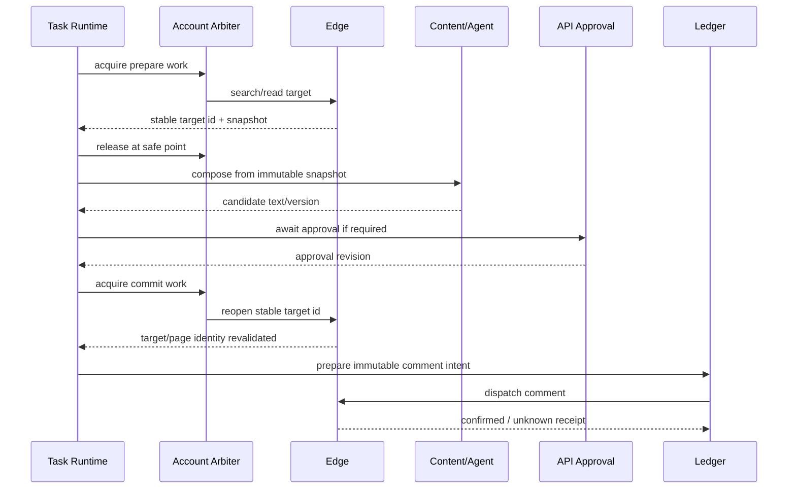
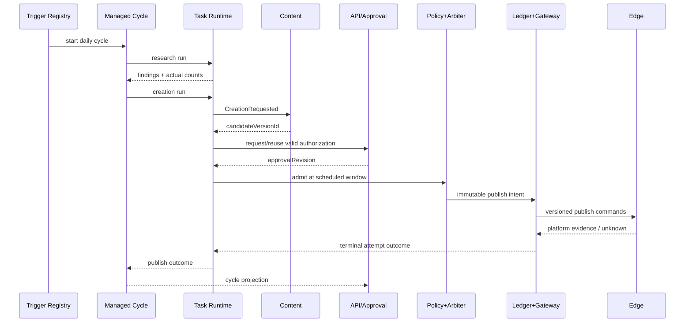

## Context

### 1. 当前系统已经有“动作”，但还没有统一的“自动化运行”

AIDCP 当前已经能够完成搜索、浏览、点赞、收藏、评论、关注、创作、审批、发布和回复。它们分布在不同运行模型中：

- `RoleDispatcher + EventBus` 负责一次在线浏览会话中的逐条决策；
- 内容排期器负责到点触发创作、评论或发布；
- `delegated_tasks` 负责单动作委托、认领、租约和恢复；
- 发布管线负责草稿、审批、Edge 租约、提交和发布结果；
- `RiskController` 负责账号最终风险状态和动作配额；
- Edge Gateway 与 Edge Core 负责真实页面/API 执行和回执；
- Content 负责评估、创作、候选版本和媒体资产；
- API 负责客户身份、环境、人设、配置、审批及客户可见投影。

这些能力各自合理，但还不能稳定表达下面这类运营意图：

> 人设更新后，重新计算搜索词；搜索并真实阅读 10 条内容；再次搜索，再真实阅读 20 条内容；根据发现请求创作；在授权范围内评论或发布；中途 Edge 离线时等待，账号被暂停时停止，恢复后从安全位置继续。

如果直接在 Agent 中写循环，Agent 会同时承担业务规划、持久状态、账号资源争用和平台副作用；如果直接在 Edge 中写流程，客户端会拥有本应在 Cloud 的策略与权限；如果新建一个通用流程服务，则会在 Automation 之外再造一套运行、租约、重试、审计和状态真相。

因此本设计把 `aidcp-automation` 定义为：

> **面向账号/阵地的自动化运营控制面：接收已授权的运营意图，把它变成有界、可恢复、可审计的运行，并通过 Edge 或平台连接器执行真实动作。**

它不是 Agent，不负责自由推理；不是 Content，不拥有稿件和媒体；不是 API，不拥有客户授权；也不是 Edge，不直接操作 DOM。

### 2. 与已确定仓库边界的关系

本设计延续 Cloud 拆分方案：

| 组件 | 权威职责 |
| --- | --- |
| `aidcp-api` | 客户入口、鉴权、账号/环境、人设、可见配置、审批事实、客户投影 |
| Agent Service | 对话理解、目标分解、提出类型化 Task/ManagedPlan 命令建议，不执行平台动作 |
| `aidcp-content` | 内容理解、评估、创作作业、候选版本、媒体资产 |
| `aidcp-automation` | 触发、周期、任务运行、账号仲裁、安全准入、执行账本、Edge Gateway、对账 |
| Edge Host / Edge Core | 本机生命周期、平台原子能力、页面身份复核、动作后验证、诚实回执 |
| Classic Client / future Agent Client | 产品交互；客户数据从 API 读取；本机仅通过 Edge Host 控制面启动/暂停执行引擎 |

用户或 Agent 发起的操作统一先进入 API。任何客户端和 Agent 都不能直接调用 Automation 内部接口或 Edge 的 `search()`、`comment()`、`publish()` 等动作。

### 3. 约束

- Cloud 的 API、Content、Automation 正在拆仓；本设计必须允许先在现有 `aidcp-cloud` 内按模块落地，再物理迁入 `aidcp-automation`。
- `RiskController` 仍是账号最终风险状态的唯一写入者。
- DEV/OL 长期共享 PostgreSQL；所有可认领、扫描、恢复的 durable work 必须使用服务端注入的 `execution_target=dev|ol`。
- Edge 保持轻量：浏览器/API 原子执行和验证留在 Edge，策略、跨步骤编排、持久化和主要节奏留在 Automation。
- 客户数据面与自动化 WebSocket 分离；客户端看到的业务结果来自 API 权威投影，不来自 Host 本地事件。
- 平台写入不可事务回滚；“已派发但未确认”不能被转译成失败后重试或成功。
- 不因设计通用运行时而恢复已删除的单体 planner/card-filter 路径。

## Goals / Non-Goals

**Goals:**

- 给搜索浏览、互动、创作、评论、发布、回复和全托管周期一套统一、可读的运行模型。
- 说明九个内部模块为什么存在、彼此如何调用、各自不拥有何种真相。
- 支持事件、排期、人工和 Agent 意图触发，同时阻止无限反馈环。
- 支持有界等待、断点恢复、版本冻结、安全替换和诚实终态。
- 把同一账号的多个工作进行可解释仲裁，又不混淆机器浏览器槽位。
- 让全托管建立在分动作可见授权和实时安全闸上，而不是一个“全部放行”布尔值。
- 让每次外部动作都有幂等意图、派发证据、平台结果和对账路径。
- 为现有单动作任务、排期、发布管线和浏览会话提供渐进迁移路线。

**Non-Goals:**

- 不新增独立的通用流程服务；流程关系只作为 `TaskDefinition.executionGraph` 的内部结构。
- 不把九个模块拆成九个仓库、九个数据库或九个部署进程。
- 不允许客户编写任意 DAG、脚本、表达式或无限循环。
- 不让 Agent 直接发 Edge 命令、决定最终授权或修改风险状态。
- 不让 Automation 接管内容候选、媒体资产、客户审批或账号主数据的所有权。
- 不让 Edge Host 向 Classic/Agent Client 暴露平台动作 API。
- 不在设计阶段确定所有平台的 DOM、API 和原子命令细节。
- 不以自动删除/撤回模拟平台写入的事务补偿；删除和撤回是新的显式授权动作。

## Decisions

### 1. 一个 Automation 仓库，九个逻辑模块，三层职责

九个模块不是为了“把代码分细”，而是为了隔离三种完全不同的问题：



各模块的“拥有”和“不拥有”如下：

| 模块 | 拥有 | 不拥有 |
| --- | --- | --- |
| `trigger-registry` | 已登记事件/排期/人工触发与 TaskDefinition 的绑定、去重、并发策略、因果深度 | 任务步骤、Edge 命令、业务授权 |
| `managed-cycle-runtime` | 一天或一轮活动的目标、预算、子运行引用、周期总结 | 稿件、审批、平台尝试细节 |
| `task-runtime` | TaskDefinition 校验、ExecutionPlan 编译、TaskRun/StepRun 状态、等待点和恢复位置 | 最终风险判断、平台结果证据 |
| `account-work-arbiter` | 账号工作队列、优先级、截止窗口、安全暂停/恢复 | 机器级 profile 锁、平台配额 |
| `policy-risk` | 标准化动作授权、实时运行控制、`RiskController`、配额/冷却/预算准入 | 排程、Edge 连接、结果终态 |
| `execution-ledger` | 不可变意图、幂等键、Attempt、派发、回执、证据、取消请求 | 任务选路、自由文本解释 |
| `edge-gateway` | 握手、心跳、连接路由、能力协商、协议校验、命令/回执传输 | 业务选择、授权、成功推断 |
| `reconciler` | `submitted_unknown` 的有界查询和最终归并 | 对已知失败盲目重试、生成新意图 |
| `decision-trace` | 决策输入引用、版本、候选、准入/跳过原因和因果链 | 运行状态真相、平台成功真相 |

初期允许按两个或三个进程部署：

- Gateway 进程承载 `edge-gateway`；
- Worker 进程承载 Trigger、Cycle、Task Runtime、Arbiter、Policy、Ledger 和 Trace；
- Reconciler 可作为独立 worker group 扩缩，但仍属于同仓、同合同和同执行账本。

只有出现独立伸缩、故障隔离或语言边界的实测需求时，才评估进一步进程拆分。

**未选择的方案：**

- 放在 Agent：无法保证持久恢复、账号排他、授权和外部结果真相。
- 放在 Edge：策略和长期状态随客户端离线消失，并扩大本地权限。
- 新建通用流程服务：会重复 Automation 已必须拥有的任务、租约、策略、账本和恢复机制。

### 2. 运行对象分层，长期目标不等于一个永不结束的 TaskRun



- `ManagedPlan`：客户可见的长期运营目标和授权边界。Agent 可以提出，但由 API 鉴权、持久化和激活。
- `ManagedCycle`：Automation 拥有的有界执行周期，例如一个自然日、一次活动或一次人设刷新后的研究周期。
- `Task`：一次具体、可完成、可取消的工作目标，包含能力范围、约束、预算和完成条件；一次性用户命令可以直接创建 Task，不要求存在 ManagedPlan 或 ManagedCycle。
- `ExecutionPlan`：由 TaskDefinition 与某个 TaskRevision 编译出的不可变执行图，冻结启用节点、Capability 版本、分支、边界和完成条件。
- `TaskRun`：执行某个 TaskRevision 与 ExecutionPlan 的一次实际运行，例如“研究 30 条内容”“发布候选 v8”“回复消息 m1”。
- `StepRun`：ExecutionPlan 中一个 Capability 节点的可恢复运行实例。
- `ExecutionAttempt`：一次真实平台动作尝试。

定义对象与运行对象分开：

```text
CapabilityDefinition
          │
          ├──────────────┐
          ▼              ▼
TaskDefinition.executionGraph + TaskRevision
          │
          ▼
    immutable ExecutionPlan
          │
          ▼
 TaskRun → StepRun → ExecutionAttempt
```

`TaskRun` 和 `StepRun` 不使用大量互斥顶层状态，而使用正交字段：

```text
status:
  queued | running | waiting | cancel_requested | terminal

waitReason:
  waiting_for_account | waiting_for_edge | waiting_for_content |
  waiting_for_approval | waiting_until | waiting_for_reconciliation | null

terminalOutcome:
  succeeded | partially_succeeded | skipped | failed |
  cancelled | submitted_unknown | null
```

这样“正在等待 Edge”和“最终因 Edge 超过窗口而跳过”不会混成一个模糊状态。

**未选择一个长期 TaskRun 的原因：** 长期运行会累积无限历史、无法定义重试边界和预算，也使版本更新、日总结、归档和故障恢复难以验收。

### 3. Task 和 ManagedPlan 由 API 授权，Automation 只拥有运行副本

对象所有权固定如下：

| 对象 | 权威产生/写入者 | 其他服务如何使用 |
| --- | --- | --- |
| `CreateTaskProposal` / `ReviseTaskProposal` / `CancelTaskProposal` | Agent Service | 提交给 API；仅为建议，不能直接执行 |
| `CreateManagedPlanProposal` / `ReviseManagedPlanProposal` / `CancelManagedPlanProposal` | Agent Service | 提交给 API；仅为建议 |
| `QueryTaskRequest` | Agent Service 或客户端 | 经 API 读取投影，不创建可执行工作 |
| `Task`、`TaskRevision`、`ManagedPlan`、客户可见动作授权 | API | 通过持久激活、修订、取消、暂停事件进入 Automation |
| `CapabilityDefinition`、`TaskDefinition`、Trigger Binding runtime | Automation | API 只引用已发布版本 |
| `ManagedCycle`、`ExecutionPlan`、`TaskRun`、`StepRun`、Attempt、DecisionTrace | Automation | 以结果事件回流 API 投影 |
| `CreationJob`、Candidate、Asset | Content | Automation 仅保存引用和结果摘要 |
| `ApprovalDecision` | API | Automation 通过持久事件消费 |
| Edge connection/capability/receipt | Automation | API 获取窄状态投影 |

Automation 的 runtime projection 只保存运行所需的 Task/Plan ID、冻结版本、授权 revision 和结构化约束，不复制客户可编辑全文成为第二事实源。

### 4. Capability、TaskDefinition 和 ExecutionPlan 各自只回答一个问题

#### 4.1 CapabilityDefinition 回答“系统会做什么”

Capability 是领域合同意义上的原子能力，不等于一次 DOM 操作。它可以内部完成定位、前置复核、动作和后置验证，但不能决定下一个无关 Capability。

首批能力示例：

- `search_terms.resolve`
- `content.search`
- `feed.observe`
- `feed.advance`
- `content.select`
- `content.open`
- `content.assess`
- `content.read`
- `interaction.like`
- `comment.compose`
- `interaction.comment.submit`
- `content.create.request`
- `publish.submit`
- `reply.submit`
- `navigation.return`

```ts
interface CapabilityDefinition {
  capabilityId: string;
  version: number;
  inputSchemaRef: string;
  outputSchemaRef: string;
  sideEffect: "none" | "reversible" | "external_write";
  requiredEvidenceRef: string;
  bounds: {
    maxWallClockMs: number;
    maxExecutionAttempts: number;
  };
}
```

例如 `content.assess` 只返回类型化评估：

```ts
{
  value: "high" | "low";
  confidence: number;
  reasons: string[];
}
```

它不能返回“下一步调用点赞”，下一步由 ExecutionPlan 的边和 Task 能力范围共同决定。

#### 4.2 TaskDefinition 回答“能力如何组成一种任务”

TaskDefinition 由代码和受审配置发布，内部使用 `executionGraph` 描述 Capability 之间的关系：

```ts
interface TaskDefinition {
  taskDefinitionId: string;
  version: number;
  inputSchemaRef: string;
  allowedTriggerTypes: string[];
  executionGraph: {
    nodes: TypedCapabilityNode[];
    edges: TypedConditionalEdge[];
  };
  bounds: {
    maxNodes: number;
    maxLoopIterations: number;
    maxDerivationDepth: number;
    maxExecutionAttempts: number;
    maxWallClockMs: number;
  };
}
```

`executionGraph` 可以表达：

- 顺序：搜索后浏览；
- 条件：低价值返回列表，高价值进入深读；
- 可选节点：Task 允许点赞时才启用点赞节点；
- 有界循环：完成 20 个唯一阅读事实或达到页数/时间上限；
- 命名等待点：等待 Content、审批、时间窗口或 Edge；
- 子任务引用：创作、长审批和发布等拥有独立生命周期的工作。

TaskDefinition 不允许：

- 任意代码；
- 动态导入；
- 无上限循环；
- 未登记事件订阅；
- 直接 SQL、HTTP URL 或 Edge 命令名；
- 把平台内容拼成工具调用。

因此不再建立一级 `Workflow` 对象：可复用任务类型叫 `TaskDefinition`，能力关系只是其中的 `executionGraph`；运行模块叫 `task-runtime`。

#### 4.3 Task CapabilityScope 回答“这次任务允许做什么”

Task 的能力范围是护栏，不是流程：

```yaml
capabilityScope:
  allow:
    - content.search
    - feed.observe
    - content.assess
    - content.read
    - interaction.like
  deny:
    - interaction.comment.submit
    - publish.submit
```

实际可执行能力是以下集合的交集：

```text
ExecutionPlan 节点
∩ Task CapabilityScope
∩ API 动作授权
∩ 当前平台/Edge Capability
∩ 实时 Policy、Risk、Quota、Budget
```

`CapabilityScope` 表达“可以或不可以”，Task 参数和 ExecutionPlan 条件表达“何时做”。“允许点赞”不等于“每篇点赞”；`likeStrategy=qualified_only | always_if_eligible` 才表达选择策略。

只影响当前目标的短分支可以保留为可选节点，例如深读后是否点赞。引入独立授权、长等待、独立资源占用或可单独交付结果的行为，应建成子 Task，而不是继续增加布尔开关。例如“生成评论草稿”和“提交评论”是两个任务边界。

#### 4.4 Agent 先解释命令类型，不直接调用 Capability

同一层命名统一采用“动词 + 对象”：

```ts
type AgentAutomationIntent =
  | CreateTaskProposal
  | ReviseTaskProposal
  | CancelTaskProposal
  | QueryTaskRequest
  | CreateManagedPlanProposal
  | ReviseManagedPlanProposal
  | CancelManagedPlanProposal;
```

自然语言的基本映射：

| 用户表达 | 类型化意图 |
| --- | --- |
| “现在、这次、帮我……” | `CreateTaskProposal` |
| “接下来改成……” | `ReviseTaskProposal` |
| “停掉、不要继续……” | `CancelTaskProposal` |
| “为什么、进度如何……” | `QueryTaskRequest` |
| “以后、每天、每当……” | 创建或修订 `ManagedPlan` |

`TaskPatch` 不作为一级领域对象。API 接受 `ReviseTaskProposal` 后记录不可变 `TaskRevision`；如果内部 HTTP 使用 JSON Patch/Merge Patch，它只是传输载荷，不进入领域语言。

一句话包含多个独立目标时创建多个 Task，并共享 `conversationMessageId` / `correlationId`；只有存在明确先后依赖和统一完成条件时，才放入同一个 TaskDefinition 图或使用父子 Task。当前不新增没有独立生命周期的 `TaskGroup`。

#### 4.5 Plan Compiler 冻结某次真正要执行的内容

```text
CapabilityDefinition versions
            +
TaskDefinition.executionGraph
            +
TaskRevision / CapabilityScope / constraints
            +
API authorization revision
            ↓
       Plan Compiler
            ↓
immutable ExecutionPlan
            ↓
TaskRun → StepRun → ExecutionAttempt
```

Plan Compiler 属于 `task-runtime`，不拆成独立服务。它必须校验：

- TaskDefinition 和 Capability 版本存在且兼容；
- 图的输入/输出类型可以连接；
- 所有分支可终止，所有循环有界；
- 启用节点没有越过 Task CapabilityScope；
- 外部写节点具有对应 API 授权；
- 完成条件、预算和错误/部分完成语义完整。

单动作任务只是一个节点的 ExecutionPlan，不需要单独的 `CapabilityRun` 类型。复杂任务使用多节点 ExecutionPlan，也统一由 `TaskRun` 执行。

`ExecutionPlan` 不原地修改。`ReviseTask` 产生新的 `TaskRevision` 和新的不可变 ExecutionPlan：

- 缩小范围可在安全点停止旧 TaskRun，用已确认进度启动新 TaskRun；
- 扩大能力范围必须重新经过 API 授权；
- 旧 TaskRun 已派发的 Attempt 始终独立回执/对账；
- 从“只生成草稿”改为“真实提交”通常创建新 Task，避免把新的外部副作用偷渡进旧任务。

#### 4.6 用户命令映射示例

| 用户命令 | TaskDefinition / 控制命令 | 关键边界 |
| --- | --- | --- |
| “给这篇笔记点个赞” | `xhs.like-content` | 单节点 Plan，只允许 `interaction.like` |
| “浏览 20 篇，喜欢的点赞，不评论” | `xhs.content-research` | 图负责评估分支；Scope 禁止评论 |
| “浏览 20 篇，每篇都点赞” | `xhs.content-research` | 同一图，`likeStrategy=always_if_eligible`；风险闸仍可跳过 |
| “搜索露营，挑 3 篇写评论，先别发” | `xhs.research-and-draft-comments` | 允许 `comment.compose`，禁止 `comment.submit` |
| “把刚才 3 条评论发出去” | 新建 `xhs.submit-comments` Task | 引用旧成果，重新授权外部写入 |
| “人设更新后搜一次看 10 篇，再搜一次看 20 篇” | `persona-refresh-research` | 一次触发为 Task；“以后每次”则为 ManagedPlan Binding |
| “以后每天 10 点研究，15 点发布” | `CreateManagedPlanProposal` | 每个周期创建有界 Task，不创建长期 TaskRun |
| “接下来不要点赞，只看” | `ReviseTaskProposal` | 缩小范围，安全点切换到新 TaskRevision |
| “为什么一篇都没点赞” | `QueryTaskRequest` | 查询 TaskRun、Trace 和 Ledger，不创建新任务 |

### 5. Trigger Registry 只决定“是否创建 Task”，不执行任务图

触发来源分四类：

| 类型 | 示例 |
| --- | --- |
| domain event | `PersonaUpdated`、`CreationCompleted`、`InboundMessageReceived` |
| schedule | 每日运营周期、发布窗口 |
| manual | 用户“现在研究 20 条”、批准后立即发布 |
| agent intent | 对话中形成并经 API 授权的计划 |

每个 Binding 明确：

- 允许的 `eventType` 与 schema version；
- `taskDefinitionId + taskDefinitionVersion`；
- 作用域键，例如 `planId + accountId`；
- `idempotencyKey` 推导规则；
- 并发策略：`ignore_if_running | queue | latest_wins`；
- 最大派生深度；
- 是否允许创建 ManagedCycle 或仅创建 Task。

所有持久消息携带 `messageId`、`correlationId`、`causationId`、`aggregateVersion` 和 `executionTarget`。Registry 不支持“订阅所有事件后让 Agent 自己决定”，避免形成：

```text
浏览结果 → Agent 更新计划 → 计划更新 → 再次触发浏览 → 无限循环
```

`latest_wins` 只可替换尚未进入外部 `dispatched` 的旧 TaskRun。旧 TaskRun 已派发写动作时，新版本必须另建 TaskRevision、ExecutionPlan 和 TaskRun，并等待旧结果归并。

### 6. 版本采用“意图冻结、安全实时”的双层模型

TaskRun 创建时通过 ExecutionPlan 冻结：

- `planId + planVersion`
- `taskDefinitionId + taskDefinitionVersion`
- `personaVersion` 或规范化内容哈希
- `accountId + envKey + platform + executionTarget`
- 账号绑定 revision
- `candidateVersionId` / `contentVersion` / `approvalRevision`
- 目标 ID、文本、媒体、可见性、计划时间
- required capability/protocol version
- idempotency key 和三类预算

不可逆动作派发前实时重读：

- 客户紧急停止、账号暂停和 runtime control；
- 当前 Edge 握手身份与页面身份；
- 当前平台能力；
- `RiskController`、配额、冷却和慢启动；
- 当前动作域可见授权是否仍有效；
- 目标是否仍存在、内容版本与审批 revision 是否匹配；
- 当前时间是否仍在 `latestStartAt` 内。

规则是：

> 业务意图不能在运行中悄悄漂移；安全控制必须能立刻停止旧意图。

人设或内容更新不会原地修改运行中的步骤输入，而是按 Binding 的 supersession policy 创建新 TaskRevision、ExecutionPlan 和 TaskRun。已经 `dispatched` 的动作永不被静默替换。

### 7. 账号工作仲裁与机器浏览器槽位是两层资源

`account-work-arbiter` 解决的是：

> 同一个账号此刻应该推进哪个业务工作？

Edge Host / browser slot coordinator 解决的是：

> 这台机器此刻哪个环境可以占用物理浏览器/profile？

两者不可合并：



账号 lane 使用 API 权威账号绑定形成的 `AccountExecutionKey`，并冻结 `envKey + executionTarget + bindingRevision`。每种 Work Kind 必须声明：

- priority class；
- 是否需要浏览器；
- `scheduledAt`；
- `latestStartAt`；
- `missPolicy`；
- 最大等待时间；
- 可抢占的安全点；
- 释放后是否允许恢复。

首版优先级原则：

1. 紧急停止/离场控制立即冻结 lane；
2. 已人工批准且临近截止的写动作；
3. 用户当前明确发起的动作；
4. 有 SLA 的入站回复；
5. 全托管互动/发布；
6. 可延后的搜索浏览。

优先级只在安全点生效。安全点位于 StepRun 边界或 Edge 已确认的原子命令边界；不得在填充一半、提交在途或平台结果未知时抢占。暂停浏览时，Task Runtime 保存当前位置和已验证内容 ID；恢复后重新验证页面身份，不能假设浏览器仍停在原页面。

Arbiter 不跨账号驱逐机器槽位。若机器槽位不可用，当前 work 进入 `waiting_for_edge` 或 `waiting_for_account`，由其截止窗口决定继续等待或诚实跳过。

### 8. 排期必须同时表达目标时间、最迟开始和错过策略

每个有时间语义的 work 必须包含：

```text
scheduledAt
latestStartAt
missPolicy = skip | require_reapproval | execute_when_available
```

- `skip`：窗口过期则终态 `skipped`，不得补做。
- `require_reapproval`：保留意图但撤销当前执行授权，回 API 重新确认。
- `execute_when_available`：允许资源恢复后继续，仅适合用户明确接受延迟的工作。

发布默认不应无限排队。已经批准的不可变内容，在 Edge 暂时离线且仍处于窗口内时可进入 `waiting_for_edge`，不必立即作废审批；内容版本、目标绑定、授权范围发生变化或超过 `latestStartAt` 时必须重新审批。

这同时化解“离线就永远作废审批”和“离线后任意时间突然发布”两个极端。

### 9. Policy-Risk 是两阶段准入，不负责排程

全托管不是一个总开关。API 以动作域保存可见授权，Automation 标准化为：

| 动作域 | 示例 |
| --- | --- |
| `research.read` | 搜索、浏览、深读 |
| `interaction.light` | 点赞、收藏、关注 |
| `interaction.proactive_comment` | 主动评论、联系评论 |
| `interaction.inbound_reply` | 回复入站消息/评论 |
| `content.create` | 请求创作、改稿 |
| `publish.submit` | 发帖、定时发帖 |
| `message.direct` | 私信、带联系方式动作 |

每个动作域使用 `disabled | require_approval | standing_authorized`。现有配置中的 `off | review | auto_approve` 由适配器映射到该标准模型，不改变用户当前可见配置。

准入分两次：

1. **计划准入**：编译 ExecutionPlan 和创建 TaskRun 时确认 Task 引用了有效动作域、预算和 TaskDefinition。
2. **提交准入**：每次不可逆动作前重新读取实时安全项。

即使是 `standing_authorized`，也不能绕过：

- Edge/页面真实身份；
- 平台能力；
- RiskController 最终状态；
- 动作配额、冷却和慢启动；
- 去重、目标复核和内容版本；
- 紧急停止、账号暂停；
- 平台确认。

通知只用于可观测性。免审通知发送失败不会改变授权事实、阻塞提交或回退成审批；需要审批的路径在缺失、超时、拒绝时仍 fail-closed。

### 10. 三类预算分别治理风险、执行资源和 AI 成本

每个 ManagedPlan/ManagedCycle/Task/TaskRun 可以分配三类独立预算：

1. **平台/风控预算**：每日动作数、会话动作数、冷却、重复目标限制。
2. **执行预算**：浏览器分钟数、唤醒次数、步骤数、等待上限、尝试次数。
3. **AI/内容预算**：模型 token、图片/视频生成次数、创作尝试和成本上限。

预算不能互相替代。例如“仍有 AI token”不能允许超过评论配额，“还有平台动作数”不能允许无限占用浏览器。ManagedCycle 给子 Task 分配预算，TaskRun 只消费对应 Task 的额度；实际平台动作只在平台确认或现有风控合同指定的保守事实点记账。

### 11. Execution Ledger 是平台动作真相，Task Runtime 只引用它

每次准备真实动作时，Task Runtime 先向 Ledger 建立不可变 `ExecutionIntent`：

```text
account / env / executionTarget / bindingRevision
actionType / targetStableId
contentVersion / approvalRevision
scheduledAt / latestStartAt
requiredCapability / protocolVersion
idempotencyKey
correlationId / runId / stepId
```

Attempt 的核心状态机：



`platform_confirmed` 至少需要平台稳定 ID/URL、平台 API receipt，或合同认可的页面后置证据。Edge 的“点击成功”、WebSocket ack、审批卡和 Host event 都不是平台成功。

重试规则：

- `prepared` 阶段尚未派发可按 TaskDefinition 的有界策略重试；
- `confirmed_not_applied` 可在仍满足截止窗口和授权时创建新 Attempt；
- `submitted_unknown` 禁止再次执行同一不可逆动作，只能交给 Reconciler；
- 所有重试必须有最大次数和同一业务幂等键，不添加隐式无限 fallback。

### 12. Reconciler 只解决不确定性，不是通用重试器

Reconciler 消费 `submitted_unknown`，按 action type 使用稳定目标、账号、时间窗和内容指纹查询平台：

- 找到唯一匹配结果 → `platform_confirmed`；
- 证明没有发生 → `confirmed_not_applied`；
- 无法区分 → 保持 `submitted_unknown` 并发出人工关注；
- 发现多个候选 → 记录冲突，不任选一个伪装成功。

对账次数、间隔和总窗口由具体平台合同定义；没有观测到失败或明确合同，不新增额外轮询层。

取消是前向语义：

- `prepared` 前可直接取消；
- `dispatched` 后只记录 `cancel_requested`，仍等待回执/对账；
- 若用户希望删除已发布内容，创建新的 `delete`/`withdraw` 意图并重新授权，不能把它当作原动作回滚。

### 13. Edge Gateway 只传输已准入的版本化能力

Gateway 负责：

- 握手和 `executionTarget`/账号绑定准入；
- 心跳、连接 generation 和路由；
- 协议版本与 capability snapshot；
- 命令 schema 校验；
- receipt 去重和写入 Ledger；
- 连接变化唤醒 `waiting_for_edge` 的 TaskRun。

Gateway 不选择内容、不判断点赞/评论、不解释“是否应该发”。未知能力、未知命令版本或 capability 不满足时返回 `unsupported`，不能改发近似命令。

Edge Host 仍只向客户端公开生命周期控制面。未来 Agent Client 的调用路径是：

```text
Agent Client → Agent/API → Automation → Gateway → Edge Core
                      ↑                          ↓
               API result projection ← Automation Ledger
```

不是：

```text
Agent Client → Edge Host → publish()
```

当 Core 未连接时，TaskRun 进入持久 `waiting_for_edge`。Classic 或未来 Agent Client 启动/恢复 Host，Core 完成权威握手后 Gateway 才唤醒 TaskRun；客户端不能自行把它标成已执行。

### 14. 评论采用 prepare/commit 两段占用，避免审批时长期锁浏览器

评论是最能暴露边界问题的场景，因为它同时需要找目标、读内容、生成正文、审批和平台提交。



普通浏览会话内的短评论审批可以在现有合同允许的有界时间内持有会话；排期、全托管和较长审批必须使用两段模型。Commit 阶段必须重新打开稳定 ID/permalink 并复核目标，不能依赖 prepare 阶段的 DOM。

没有强相关目标时结果可以是 0 条或 `skipped(no_qualified_target)`；不能为了完成数量硬评。

### 15. 创作是外部子作业，不把 Content 变成 Task Runtime 的内部实现

`request_creation` 做三件事：

1. 形成带 persona/content input version 和预算的 `CreationRequested`；
2. 保存 `creationJobId` 引用；
3. 进入 `waiting_for_content`。

Content 独立执行、重试和保存候选版本，完成后发送 `CreationCompleted(candidateVersionId, resultVersion)`。Automation 不复制稿件，不直接改候选，也不把 Content 失败当成空稿继续发布。

Content 不可用时：

- 仅依赖阅读的步骤可按 TaskDefinition 继续；
- 依赖新稿的发布步骤进入有界等待，超时后 `skipped` 或 `failed`；
- Cycle 可终态 `partially_succeeded`，并明确哪部分完成、哪部分未完成。

### 16. 典型场景一：人设更新后研究 10 + 20 条内容

TaskDefinition `persona-refresh-research@3`：

```text
resolve_search_terms
→ search(term A)
→ browse(unique_verified_content = 10)
→ search(term B)
→ browse(unique_verified_content = 20)
→ assess
→ return_home
```

走向：

1. API 更新人设并发布 `PersonaUpdated(personaVersion=7)`。
2. Trigger Registry 命中 Plan 的绑定，以 `accountId + personaVersion + taskDefinitionVersion` 去重。
3. 创建 TaskRun，冻结 persona v7、TaskDefinition v3、账号绑定、30 条阅读预算和截止时间。
4. `resolve_search_terms` 向 Agent/Content 决策接口请求结构化搜索词，不接受自由命令。
5. Arbiter 获取账号 read work；Policy 检查 `research.read`、暂停状态和预算。
6. Ledger/Gateway 让 Edge 执行第一次搜索。
7. `browse` 只统计“拿到稳定内容 ID 且完成规定阅读证据”的唯一内容；页面卡片出现、重复卡片或连接前已看内容不计数。进度持久写入 StepRun。
8. 满 10 条后执行第二次搜索，再累计 20 个新的唯一内容。
9. Edge 重连时从 Ledger/StepRun 已确认的 ID 集合恢复，不从 0 开始，也不把旧卡重复计数。
10. 在最大页面数、时间或内容供给耗尽后仍不足 30 条，TaskRun 以 `partially_succeeded` 结束并给出实际 `10 + 13`，不得报告 30。

这类规则沉淀在 TaskDefinition.executionGraph 和 ExecutionPlan，而不是 Agent prompt 或 Edge 的环境变量阈值。

### 17. 典型场景二：全托管周期中的创作与发布



一个 Cycle 可以包含研究、互动、创作、发布多个子 TaskRun，但只保存引用、预算和结果摘要。研究成功而创作失败时，Cycle 是部分完成；发布 `submitted_unknown` 时，Cycle 不能显示“已发布”，而是等待 Reconciler 或结束为需关注。

### 18. 典型场景三：入站回复和无需浏览器的执行

入站消息先由 Automation 拥有的 inbox/connector 形成 `InboundMessageReceived`。Trigger Registry 创建 reply TaskRun：

1. 读取 API 的回复配置、人设镜像和动作授权；
2. 请求 Agent/Content 形成结构化回复候选；
3. review 模式等待 API 审批，standing authorization 直接进入实时安全准入；
4. Arbiter 仍占用账号工作 lane，避免同账号同时发送多个冲突动作；
5. 若平台 connector 声明 `api_only`，不申请机器浏览器槽位；
6. Ledger 记录发送 attempt，只有平台确认后对外投影为 `sent`。

因此“账号仲裁”不等于“必须打开浏览器”，能力声明决定具体执行资源。

### 19. Decision Trace 解释原因，但不成为状态真相

每个重要决策追加一条 Trace：

```text
traceId / correlationId / causationId
planVersion / taskDefinitionVersion / personaVersion
runId / stepId / attemptId
decisionType
inputRefs
candidates or evaluated alternatives
outcome = selected | allowed | denied | delayed | skipped | superseded
reasonCode
policy/risk/budget snapshot references
createdAt
```

它用于回答：

- 为什么今天没有评论？
- 为什么先发布、后浏览？
- 为什么只读了 23 条？
- 为什么这条稿件需要重新审批？
- 为什么 Edge 在线仍没有执行？

Trace 不能反向覆盖 TaskRun/Ledger 状态；删除 Trace 也不能让平台结果消失。敏感原文尽量保存引用、哈希和必要摘要，避免把第三方内容、私信和完整 prompt 无限保留。

### 20. 客户端投影分清三种真相

API 对客户端聚合三个维度：

| 维度 | 例子 | 权威来源 |
| --- | --- | --- |
| 本机 Host 状态 | Core 是否运行、浏览器是否需要人工介入 | Edge Host event / snapshot |
| Automation durable 状态 | waiting_for_edge、waiting_for_approval、当前步骤 | Automation → API result projection |
| 平台确认结果 | 已发布 URL、已发送回复、评论未知 | Execution Ledger confirmed outcome |

Host event 只能触发 refetch 或推进，不能直接把业务卡片改成“已发布”。客户端在首次 API 成功前显示未知/加载失败，不编造 0 或成功。

### 21. 内部合同与事件

首批持久命令/事件：

| 来源 → 目标 | 合同 |
| --- | --- |
| API → Automation | `TaskActivated`、`TaskRevised`、`TaskCancelled`、`ManagedPlanActivated`、`ManagedPlanUpdated`、`ManagedPlanPaused` |
| API → Automation | `ApprovalRecorded`、`RuntimeControlChanged` |
| API → Automation | `PersonaUpdated`、`ManualAutomationRequested` |
| Automation → Content | `AssessmentRequested`、`CreationRequested` |
| Content → Automation | `AssessmentCompleted`、`CreationCompleted`、`CreationFailed` |
| Automation → API | `ManagedCycleChanged`、`TaskRunChanged`、`PlatformActionConfirmed`、`AutomationAttentionRequired` |
| Automation ↔ Edge | protocol v2 versioned commands、capabilities、receipts |

跨服务命令/事件使用 Outbox/Inbox；会话内逐卡浏览事件继续留在 Automation 进程内 EventBus，不把高频热路径全部写入消息总线。只有 TaskRun/StepRun checkpoint、实际动作和恢复所需事实持久化。

所有可认领/扫描记录带服务端注入的 `execution_target`。缺失或非法 `AIDCP_DEPLOY_ENV` 时相关 worker 禁用；客户端、Agent、自然语言和 `envKey` 都不能指定 target。

### 22. 安全、隐私和提示注入边界

- 平台内容是非可信输入；不得把帖子、评论、私信中的文本解释成 Agent tool call 或 TaskDefinition。
- Agent 返回值必须通过 schema、动作 allowlist、版本和授权校验。
- 内部 HTTP 使用服务身份；客户 token 不直接传给 Automation/Content。
- Edge command 使用短时、绑定 run/attempt/account/env/capability 的签名上下文，并具备防重放约束。
- 账号解绑、客户删除或离场会冻结新 work、撤销未派发意图，并按数据所有权触发保留/删除流程。
- 第三方内容快照、私信正文、决策证据和模型输入分别配置保留期；日志不记录凭据和完整敏感 payload。
- Decision Trace 的客户可见摘要与内部调试证据分层授权。

### 23. 失败语义矩阵

| 失败点 | TaskRun/StepRun 结果 | 禁止行为 |
| --- | --- | --- |
| Trigger 重复 | 不创建重复 Task/TaskRun，记 `duplicate_trigger` | 重复执行 |
| TaskDefinition/能力未知 | `skipped(unsupported)` 或 `failed(contract_invalid)` | 近似命令回退 |
| Agent 输出非法 | `failed(invalid_task_proposal)` | 把自然语言或非法提案当命令继续执行 |
| Content 超时 | 有界等待后 skip/fail | 用空稿发布 |
| 需要审批但缺失/拒绝 | `waiting_for_approval` 后 skip/cancel | 自动放行 |
| 免审通知失败 | Trace/告警，不改变授权 | 回退审批或阻塞 |
| Edge 离线 | 窗口内 `waiting_for_edge` | 标成失败后无界重试 |
| 账号/页面身份不符 | fail-closed，必要时 human assist | 在错误账号执行 |
| Risk/配额拒绝 | `skipped` 或延迟到合法窗口 | Edge 自行放行 |
| Edge ack 丢失 | `submitted_unknown` | 重发不可逆动作 |
| 对账无结论 | 保持 unknown + 人工关注 | 猜测成功/失败 |
| 取消发生在 dispatch 后 | `cancel_requested` 并继续归并 | 覆盖真实平台结果 |
| Task/ManagedPlan 新 revision 到达 | 未派发可 supersede；已派发独立归并 | 原地改写旧 ExecutionPlan 或旧意图 |

## Risks / Trade-offs

- **[状态对象变多，理解成本上升]** → API 对客户只投影“周期、当前工作、结果”三层；内部 TaskRun/StepRun/Attempt 主要用于恢复和审计，不全部暴露。
- **[TaskDefinition 图逐渐变成可编程平台]** → Capability、触发类型和 TaskDefinition 发布均走 allowlist 与代码评审；拒绝任意脚本和无限循环。
- **[账号仲裁与现有 EdgeTaskCoordinator 重复或死锁]** → 固定获取顺序为账号 work admission → 机器/profile/browser lease；Account Arbiter 不持有物理锁等待另一个账号，不跨层反向调用。
- **[全托管扩大平台风险]** → 按动作域授权、三类预算、提交时实时 RiskController、可见紧急停止和平台确认，任何一项不满足都不执行。
- **[版本冻结让新配置生效不够“即时”]** → 安全控制即时生效；普通业务更新通过显式 supersede 创建新 TaskRun，保留可解释性。
- **[Decision Trace 数据量和隐私压力]** → 保存结构化引用、reason code 和必要摘要，按用途分层保留；不默认保存完整第三方内容和 prompt。
- **[持久 checkpoint 影响高频浏览性能]** → 逐卡事件留在进程内；按唯一内容确认、步骤边界和外部动作批量 checkpoint，恢复精度与写放大通过压测确定。
- **[Reconciler 误匹配平台结果]** → 要求稳定 ID、账号、时间窗和内容指纹多条件唯一匹配；多候选时不自动裁决。
- **[已有排期/评论/发布语义不一致]** → 首轮通过 adapter 保持用户行为；将“授权、派发、平台确认、通知”拆开建模，在具体 cutover change 中逐条修改 delta spec 和验收。
- **[服务拆仓与运行时重构同时推进风险高]** → 先在现有 Cloud 内建立模块边界和 shadow ledger，再按所有权迁仓；不进行一次性 big-bang。

## Migration Plan

### Phase 0：合同和盘点

- 冻结 CapabilityDefinition、TaskDefinition、Task/TaskRevision、ExecutionPlan、TaskRun/StepRun/Attempt、事件信封和 reason code。
- 盘点现有 `RoleDispatcher`、排期器、`delegated_tasks`、发布/评论状态机、Edge leases、RiskController 和对账器。
- 为当前行为建立映射表，特别标出审批、通知、派发、平台确认和 unknown。
- 验证 DEV/OL target 注入、单一写入者和协议漂移门禁。

**回滚：** 仅文档/合同，无运行行为。

### Phase 1：Execution Ledger 与 Decision Trace shadow mode

- 先为现有委托、评论、发布生成 shadow intent/attempt/trace，不改变原调度。
- 比对现有终态和 Ledger 终态，修正 submitted/confirmed/unknown 映射。
- 建立保留、查询、指标和对账告警。

**回滚：** 停止 shadow 写入；原状态机仍为权威。

### Phase 2：Edge Gateway 与能力合同归一

- 统一握手 capability snapshot、命令版本、receipt 和 executionTarget 校验。
- 现有命令通过 adapter 写 Ledger，再走原 Edge 路由。
- 未新增命令时不修改 protocol v2；新增时同步两端类型、映射、路由、文档和 acceptance。

**回滚：** 逐 capability 恢复 legacy adapter；已派发 Attempt 继续对账。

### Phase 3：Account Work Arbiter

- 先接入搜索浏览与发布/评论的安全点，不改变优先级之外的业务语义。
- 与 EdgeTaskCoordinator、browser slot 调度建立固定锁顺序和冲突测试。
- 观察等待、错过窗口、公平性和资源占用，再固化首版 priority class。

**回滚：** 禁用新 admission，恢复各旧入口的既有互斥；不得丢弃已获准 work。

### Phase 4：Task Runtime 首个纵切

- 选择只读风险较低的 `persona-refresh-research`：
  `resolve_search_terms → search → browse 10 → search → browse 20 → assess`。
- 验证断线恢复、唯一内容计数、部分完成、版本 supersede 和 waiting_for_edge。
- 不同时迁移发布/评论。

**回滚：** 停用该 Trigger Binding；现有浏览循环继续工作。

### Phase 5：创作、发布、评论和回复适配

- Content 通过 durable job/event 接入 `request_creation/await_creation`。
- 发布迁入 schedule window、冻结意图、Ledger 和 Reconciler。
- 全托管/排期评论迁入 prepare/commit 两段模型。
- 回复按 browser/API capability 选择执行资源。
- 每个纵切单独增加对应现有 capability 的 delta spec、协议和安全验收。

**回滚：** 按 TaskDefinition version 关闭新入口并恢复 legacy trigger；已 dispatch 的动作只能继续归并，不能回滚数据库状态伪装未发生。

### Phase 6：Managed Cycle 与全托管

- API 提供分动作授权、预算和紧急停止。
- 启用每日/活动 Cycle，先 read-only，再逐个开放互动、创作和发布动作域。
- 客户端展示 Cycle/Task、TaskRun 进度、平台结果三层真相及 Decision Trace 摘要。

**回滚：** 暂停 ManagedPlan/Binding，阻止新 Cycle；当前未派发 Task/TaskRun 取消，已派发 Attempt 继续回执/对账。

### Phase 7：物理迁入 `aidcp-automation`

- 在单写者、内部合同和迁移门禁稳定后，从 `aidcp-cloud` 物理迁出 Automation 模块。
- API、Content、Automation 使用独立仓库和部署单元，共库阶段使用独立数据库角色和表归属门禁。
- 分 target 灰度，DEV 验证后再通过明确 release 流程进入 OL。

## Open Questions

以下问题不阻塞架构，但必须在对应实施阶段关闭：

1. 首版 CapabilityDefinition / TaskDefinition 是纯代码发布，还是允许受审 JSON 配置；无论哪种都不开放客户任意脚本。
2. `personaVersion` 采用单调版本列还是规范化内容哈希；不得使用 `updated_at` 冒充版本。
3. 各平台“唯一内容已完成阅读”的最小证据是什么，需要按平台 Capability 合同定义。
4. 首版账号优先级的具体数值和公平性窗口，需要用现有排期、回复和浏览运行数据校准。
5. Publish/Comment 各平台的 `latestStartAt` 默认值和 `missPolicy` 由产品配置还是 TaskDefinition 固定。
6. Decision Trace、第三方内容快照、私信和对账证据的默认保留期。
7. `submitted_unknown` 在各平台经过多久转人工关注，以及哪些平台具备可信查询能力。
8. Automation 仓库物理创建时间与当前 Cloud Data/Automation/Creation 拆分的最终 cutover 顺序。
